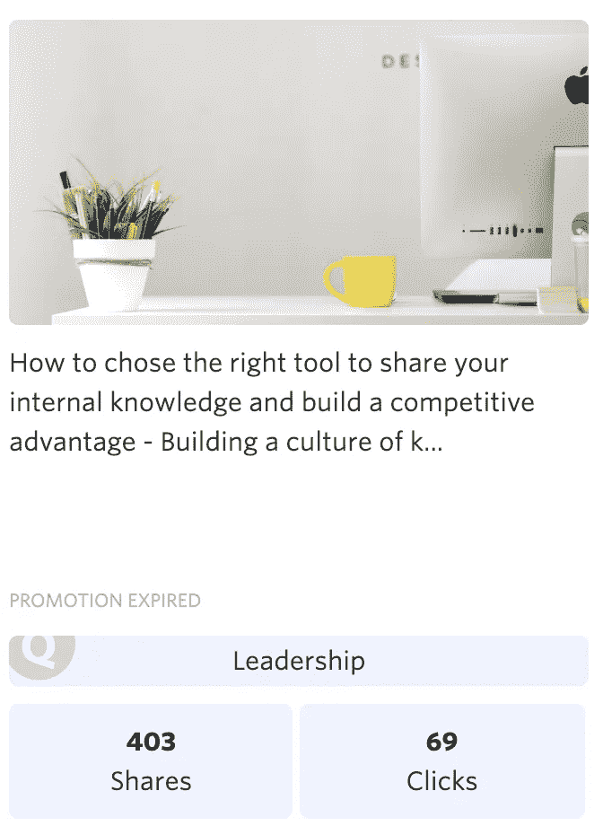
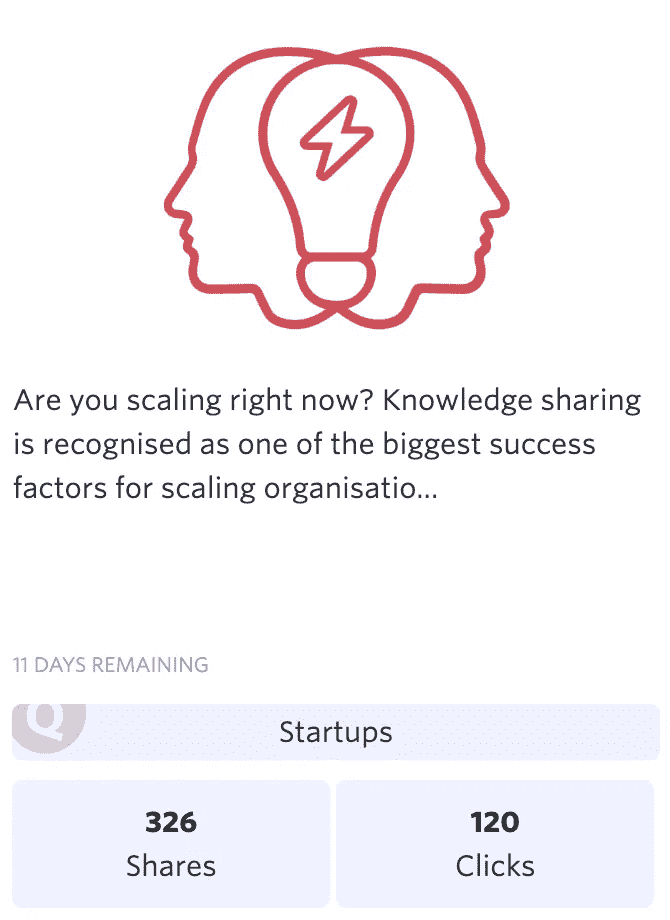

# 理想的创业工具扩大你的成长

> 原文：<https://medium.com/hackernoon/the-ideal-toolstack-to-sustain-your-growth-by-timote-geimer-bb7983e2b6d3>

Photo by [Nick Karvounis](https://unsplash.com/@nickkarvounis?utm_source=unsplash&utm_medium=referral&utm_content=creditCopyText) on [Unsplash](https://unsplash.com/?utm_source=unsplash&utm_medium=referral&utm_content=creditCopyText)

在测试了数百种支持年轻公司成长的工具后，我决定列出并与大家分享在我工作的地方迄今为止最有效的工具。

这个列表并不是市场上所有工具的清单，而是我在测试过这些工具或者收到了许多积极的证词后更喜欢的工具。为了给你带来最有价值的见解，你还会发现我们如何使用它们的解释。

剧透:我把我们自己的工具藏在那里了

# 交叉工具:沟通和生产力

## 松弛的

Slack 有点像我们工具套件的主干。它一直开着，每个人都在用。它用于团队成员之间以及不同团队之间的日常交流。像大多数使用它的公司一样，内部或多或少禁止互相发送电子邮件:一切都要经过 Slack 或 Elium。

我们连接了许多业务工具，为我们的团队呈现最重要的信息和相关通知:

*   **内部通话**:在我们的网站和应用程序上宣布新账户的创建，并与潜在客户和客户进行沟通
*   **收款人**:新付款通知
*   **HubSpot** :宣布交易胜负原因
*   Zendesk : bug 追踪
*   **产品板**:产品反馈
*   **Gitlab** :发布测试和生产环境的新部署
*   **Elium** :发布 Elium 中创建的新内容/知识(正在开发中)

每个团队/部门至少有一个自己独有的公共频道。这让你可以发布临时公告，并招揽其他团队。一些团队也有私人渠道来管理他们的日常互动。私下的一对一谈话不常使用(或者至少不是以正式的方式)。

## [Elium](https://pix.elium.com/vo75X59Y)

如果 Slack 是我们工具套件的主干，那么 Elium 就是它的心脏。Elium 是我们的知识库，在这里我们可以找到所有应该利用的内容:OKR 报告、会议记录、功能描述、应用程序发布记录、内部程序、内部产品信息记录、其他业务应用程序的集成、竞争战卡、我们的定价策略和服务信息、市场营销和销售材料等。

Elium 中有 4 组空间:

*   **横向间距**

在这里，您可以找到面向所有人的公告和跨职能文档。这包括，例如，我们的休假程序，我们对 okr 和 KPI 的监控，公司汽车的信息，每个人的工作描述，执行委员会会议的报告等。

*   **市场观察**

每个团队管理自己的商业智能，并将其提供给每个人。每个人都可以自由地做出贡献。

*   **团队专用空间**

每个团队都有一个或多个专用空间。它可以存储其最佳实践、内部程序、会议记录等。我们在 Elium 有很强的透明度政策，所以这些空间是公共的，但贡献是有限的，以保持质量。

*   **项目空间**

项目空间是为满足信息收集和处理的临时需求而创建的短暂空间。正是在这种类型的空间里，我们管理了最新的总部搬迁，还组织了重大的公司活动，如知识之旅。

在我们的 [#GrowthStories 采访](https://pix.elium.com/vFi8CAR5)中，我们意识到我们的观察和信念是相同的。利用信息、构建/正式化流程和分享知识是平稳增长的基本要素。正是因为这个原因，我们开始开发一整套的模板(OKR、会议笔记、工作描述创建、运维画布等。)并且我们将向所有客户提供。

## 🎁启动交易

为了支持您的发展，我们决定更进一步，不仅仅是共享我们的堆栈，而是向所有初创公司(根据您的请求进行小规模分析)提供为期 1 年的团队计划 50%的折扣。

享受它，没有比这更简单的了！

只需[开始你的免费试用](https://pix.elium.com/9766AKBn)并给 startupdeal@elium.com 发一封电子邮件，在邮件的主题行写上代码#GrowthStoriesDeal50。

## [缩放](https://pix.elium.com/25qpIUZj)

使用 [Zoom](https://pix.elium.com/25qpIUZj) ，客户/潜在客户通话和远程工作从未如此顺畅。这个工具已经成功地在短时间内成为视频会议的参考。我们已经停止统计在与我们一起体验 Zoom 后停止使用 Skype 和其他解决方案的人数。它简单、高效、稳定。我们所能期待的。然而，坚持住，因为专业版相当昂贵。

现在买不起 Zoom 的专业帐户，而 Skype 却让你长痘痘？别担心，我们有适合您的解决方案！ [Appear.in](https://pix.elium.com/atERmgBV) 是一个很棒的工具，无需安装也能工作(完全在你的浏览器中工作),免费的基础版应该能满足你。然而，要小心，当你分享你的屏幕时，这个工具是相当 CPU 密集的。

## 扎皮尔

扎皮尔可以比作网络的粘合剂。当一个工具不提供本机集成时，该工具允许您将信息从一个工具互连并传输到另一个工具。一般来说，多亏了扎皮尔，你从🤬到🤯最后去🥰.

根据我们的经验，这是一个必须小心使用的工具，有可能会弄乱您的数据。Zapier 有点像重型武器，非常强大，但并不精确。我们让你自己来判断。

在我们这边，我们使用这个工具在 Chargebee 和其他工具(如 Intercom 和 HubSpot)之间传递客户帐户信息。我们还使用 Zapier 从内部通信到内部通信…将属性从用户传递到公司，因为这两个概念在工具中是分开的。如果一个对讲机 PM 看到这篇文章:请做点什么！😱

## 谷歌套件

我们真的应该向你介绍谷歌套件吗？…价格合理且易于使用，Google 在其套件中为您提供了创业和发展所需的所有工具。这包括从管理您的域到访问权限和无数其他工具。

在 Elium，我们使用其套件中的各种工具:

*   SSO:对 Elium 和其他工具的认证
*   Gmail:外部沟通(客户、合作伙伴等)。)
*   Google Docs:我们在 Google Drive 上保存必须定期更新和对外共享的文档(合同、报价等)。).
*   Google Sheets:我们主要为 KPI 跟踪表创建工作表

我们的黄金法则之一是，在谷歌上创建的所有内容都必须在“团队驱动”中创建，任何内容都不能存储在个人空间中，所有关键内容都必须在 Elium 中引用和呈现。多亏了这个规则，每个人都超级容易找到公司的关键信息。

# 管理和金融

## 条纹+收费

Stripe 是我们值得信赖的第三方，负责收集我们的付费订阅。经过之前的大量研究和经验，我们决定通过 Chargebee 使用 Stripe 的服务。在我们选择的时候，Stripe 对欧洲税收体系的管理相当糟糕，根本没有管理多语种；对我们来说两个基本要素。经过分析，决定使用 Chargebee。

该中介使我们能够通过以下服务完善 Stripe 的服务:税务管理、发票和通信的多语言支持、直接发票管理(针对我们不使用在线支付的重要帐户订阅)。

## 🎁启动交易

你可以很容易地获得两个不同的非常有用的启动交易。

**Stripe Atlas:** 这项 Stripe 服务让你在几分钟内就可以创建一家公司并开始做生意。要访问它，只需遵循以下步骤:

*   在 ProductHunt 上创建帐户
*   跟着[埃利姆](https://pix.elium.com/mzCvY_kN)，[蒂莫蒂](https://www.producthunt.com/@timotegeimer)，[格雷戈里](https://www.producthunt.com/@gculpin)和[亚历山大](https://www.producthunt.com/@belgiantleman)(好吧，那没必要，^^)
*   转到 ProductHunt 的船舶部分
*   点击条纹折扣

[**Stripe**](https://pix.elium.com/9tzcxL-g)**:**有了这张优惠券，Stripe 在你的第一个 20k 美元上不会收取任何管理费。要获得资格，你只需要有一个 HubSpot 帐户(免费)和 [**关注这个链接**](https://pix.elium.com/9tzcxL-g) 。

## 沙特大亨

Chargebee 提供了许多使用统计数据，但我们并不是 100%满意。这就是我们选择 Chartmogul 的原因。只需一键连接，您就可以立即在漂亮的图表上看到您的关键数据。我们邀请你来测试这个工具，发现你的 MRR 累积图的精彩之处。

谈到 Chartmogul，我们就不能不谈到 Baremetrics。这个工具和 Chartmogul 一样好，甚至更好，但不幸的是不提供免费增值版本。另一方面，Chartmogul 提供高达 10k€的 MRR 免费版本。

你想做梦吗？来提升你的动力？我们邀请您来看看 Baremetrics 的开放启动计划。你将能够看到 Buffer 或 ConvertKit 等公司的财务表。

## [斯彭代斯克](https://pix.elium.com/0JISebA-)

在 Slack 和 Elium 之后，可能是 [Spendesk](https://pix.elium.com/0JISebA-) 对 Elium 用户的日常生活产生了最积极的影响。不再需要申请公司的信用卡来进行在线购买，不再需要在收到收据后跑来跑去并管理订阅的删除。不再需要花费时间管理个人购买索赔。Spendesk 解决了所有这些问题！

在 Elium，每个人都有一个账户。根据个人资料，每个人都有权进行网上购物(唯一的或经常性的)。根据此人的个人资料，定义了一个限额，低于该限额的购买将被自动授权，以减少摩擦。Spendesk 还自动收集收据和发票。每个部门经理也有一个实体的可充电信用卡来处理外出购物。多开心啊！🥰

## 🎁启动报价

你想测试 Spendesk 并获得一份小礼物吗？没有比这更简单的了！

点击此链接注册并获得价值 100€的亚马逊礼品卡！

# 营销

## HubSpot 营销

我们可以改写 HubSpot 的口号:“HubSpot，营销人员知道为什么”……更严重的是，HubSpot 是高端营销工具市场的主要参与者。他们的服务是完整的，如果配置得当，将对支持和管理您的发展产生至关重要的影响。但是，要正确的使用它，真正的利用它，是需要付出很多努力的。

为了了解 HubSpot 的威力，我们建议您使用他们的免费 CRM 和其他一些免费工具。

## 阿波罗

你的创业是如此之好，以至于你想向全世界大声喊出来？不是很有效是吗？嗯……你试过冷电子邮件吗？虽然成功率并不总是很高，但新专家倾向于说，只要做得好，这仍然是一个不可忽视的获得客户的渠道。阿波罗为此提供了理想的工具！

由于这一解决方案，您可以搜索和过滤他们的数据库，其中有数百万的联系，以找到您的前景。做出选择后，您可以配置一系列电子邮件，这些邮件将自动以您的名义发送。你所要做的就是等待线索下落！☔️

[Apollo](https://pix.elium.com/s1UuYZbf) 核心产品的商业模式非常简单。获得一个电子邮件地址将花费你一个信用点数。发送电子邮件是免费的。

但是，注意不要在大量发送潜在客户邮件时夸大其词。的确，谷歌和其他服务在这件事上不是很宽容。我们建议您每天发送不超过 100-200 封电子邮件，遵循 Apollo 的建议并密切监控您的电子邮件性能。

Hubsell 可以成为阿波罗的替代品。它提供类似的服务，但他们可以对目标联系人进行额外的研究，然后在通过电子邮件或 Linkedin 联系他们之前，你可以手动验证这些研究。他们的报价更完整一些，但也贵得多。看你自己怎么做才是对你最好的！

## 🎁启动交易

[通过此链接](https://pix.elium.com/s1UuYZbf)，用 1000 个积分开始你的销售自动化。(不允许使用 gmail 地址)

## Wisepop

你的网站⇔注册转化率让你疯狂，即使它符合市场“标准”？我也是。这就是为什么我们决定应用汤姆·贝纳塔尔、T2、马克西姆·贝特洛和 T4 他们团队提出的技术。不是简单地让访问者离开你的网站，而是要求他们提供电子邮件地址以换取一份小礼物。因为这不是我们的想法，我们更愿意让你参考他们的文章。他们详细解释了他们是如何做的以及他们学到了什么。结果令人印象深刻！

## [像素点](https://pix.elium.com/HlDF_x7u)

Pixelme 有点像所有营销人员的圣杯。有了这个工具，你可以跟踪所有活动的表现和你分享的所有链接。你也可以在链接上放置像素跟踪器和 cookies，以便能够识别你的行为表现，并在以后重新定位你的受众。

好吧，如果这听起来像胡言乱语，你不能完全理解，你绝对要去看看他们的博客。如果你看到我们在谈论什么，你现在可能已经在他们的网站上了。😜

不相信，这里有一个具体的例子…此博客帖子的所有链接都已通过 pixel.me 进行了转换。由于这一点(如果您接受我们的 cookie 政策)，我们将能够在社交网络上向您发送广告，并且我们将能够知道您通过此博客帖子发现了 Elium，如果您在点击此页面中的链接后 15 天内创建了一个帐户…🤯

## 🎁启动交易

我们与 PixelMe 协商了以下交易:他们的专业月订阅打八折。

要访问它，只需遵循以下步骤:

*   [点击此链接](https://pix.elium.com/HlDF_x7u)
*   创建您的帐户
*   在试用期结束时输入此代码**pixelmesurprise 20 _ monthly**

## 方形空间

Elium 的网站是用 Gatsby，一个 React 框架做的。选择这项技术是为了便于管理和与我们的应用程序集成。除了 Gatsby 提供的所有好处，它还允许我们以更加统一的方式管理用户体验(并在站点和应用程序之间共享一些组件)。结果是，从 SCRUM 的角度来看，我们的站点是产品不可分割的一部分，并且进入了我们的开发周期。

然而，等待两周再启动新计划并不总是可以接受的。这就是为什么我们决定用 Squarespace 来完善我们的工具堆栈。这使得我们可以在几分钟内完全自主地快速启动登录页面或微型网站。一旦一个模型被证明是有意义的，我们就将它集成到我们的核心堆栈中。多亏了这种技术，我们能够在一周内推出#GrowthStories，从想法的出现到我们前两次采访的发表。

## 登月舱

啊[登月舱](https://pix.elium.com/lF8kbBPQ) …这是我个人的最爱！这款工具由 3 位杰出的法国企业家(Guillaume Moubeche、Vianney&Fran ois le croat)直接从 F 站开发，它将让你的 LinkedIn 出版物大受欢迎。这个原理非常简单，却非常有效。

Lempod 用户创建 pod 并将其设为私有或公共。每个用户都可以创建自己的 POD 或加入现有的 POD。然后，用户可以每天一次将 Linkedin 帖子的链接放到他的 POD 中。他还可以定义希望其他用户在其内容上发布的标准消息。一旦活动启动，该出版物将受到 POD 所有成员的喜爱和评论。

我们已经可以听到你说:“没用，是假的！”嗯…是的，这些喜欢和评论是自动化的，但重要的是不存在。重要的是，这种技术允许您影响 LinkedIn 算法，使其向尽可能多的人显示您的出版物。你获得的喜欢和评论会自动提升你的出版物曝光率，让你接触到成百上千的真实人物，这就是我们喜欢的。

不服气？下面是结果！

## 🎁启动交易

[Lempod](https://pix.elium.com/lF8kbBPQ) 真的很实惠，所以他们没有理由再给你额外的折扣。然而，为了帮助你，我们可以推荐你最好的豆荚加入。

请填写这份简短的表格，我们会尽快回复您。

## [Quuu](https://pix.elium.com/oXyrwo6B)

[Quuu](https://pix.elium.com/oXyrwo6B) 旨在将您的策展和内容交付置于自动驾驶模式。他们信守承诺。他们从一个非常简单的观察开始。一方面，有人创造了伟大的内容，并寻求分发它。另一方面，有些人希望向他们的观众提供有针对性的高质量的内容。他们只是决定促成这笔交易。

Quuu 允许人们自动或半自动地向他们的社交网络发布他们事先人工验证的高质量内容。他们的免费服务应该让你开始。

对于内容出版商来说，Quuu 为你提供了向寻找文章的人推荐你的内容的能力，每月只需支付很少的费用。神奇就是这样发生的！🧙

## 🎁启动交易

Quuu 目前为他们的专业帐户提供终身交易。你可以花 39 美元获得终身使用权，而不是每月 19 美元。别想了，买了以后感谢我们:-p

这是优惠活动的链接。

此外，为了让你开始，[填写这张简短的表格](https://pix.elium.com/YkR_TWON)，我们将向你推荐最好的 POD 加入。

# 人力资源

## 可行且聪明的招聘人员

任何成长中的初创公司都会告诉你，招聘是最大的挑战之一。一夜之间，你发现自己不得不招募 5-10-15-20 人。很明显你想要最好的，很明显你昨天就想要了…不幸的是，招聘好的个人资料需要时间和预期。这就是为什么最好尽早发展你的雇主品牌，并立即用一个好的工具装备自己。

市场上有近 800 种招聘解决方案。每种口味和每种预算都有适合的东西。应该注意的是，我们在 Elium 的开发团队中有一半的人曾经开发过 800 种解决方案中的一种。因此，我们对什么是好的招聘软件有强烈的看法。因为我们不希望你认为这篇文章有偏见，我们不会谈论 Talentsquare，但我们会谈论市场上其他两个同样好的解决方案:可行的和聪明的招聘人员。

Workable 是一家希腊初创公司，由于其超级团队、易于使用的解决方案和民主的价格，近年来增长迅猛。这种解决方案在欧洲的创业公司中被广泛使用。然而，它们的价格在过去的 18 个月里急剧上涨，而它们的解决方案却停滞不前。我们认为他们的界面和功能目前是不够的，如果你计划平行招聘超过 5 个配置文件。Workable 还选择利用 GDPR 来增加其收入，并将向您收取不相称的价格，因为他们的工具中有一个自动化的 GDPR 管理…

Smartrecruiters 是由才华横溢的杰罗姆·特恩尼克创办的。他是法国人，很快就搬到了旧金山，开始了他的创业冒险。Smartrecruiters 是当代招聘解决方案的标志性企业。他是第一批为全球中小型公司提供强大工具的人之一，该工具集成了招聘流程管理和多个职位公告板的自动发布。他的解决方案从未停止开发，他总是设法用他开发的新功能的质量和独创性给我们带来惊喜。

在 Elium，我们从 Workable 开始，因为在我们做出决定时，Smartrecruiters 还没有重新推出免费服务，他们的入场券对我们的需求来说太高了。如果我们今天必须选择一个招聘软件，我们会毫不犹豫。

## 🎁启动交易

虽然 Smartrecruiters 倾向于将增长重点放在大客户上，但它也不会忘记较小的团队，并为并行招聘少于 10 份简历的公司提供免费的完整版本。

要访问它，只需遵循以下步骤:

*   [点击此链接](https://pix.elium.com/fgwz4D6E)
*   创建您的帐户
*   现在就开始招聘

## 竹子 HR

如果招聘是任何初创公司不可或缺的重要支柱，当你的公司达到 100 人时，你可能会寻找一个人力资源套件来完成你的招聘软件(通常称为申请人跟踪软件的 ATS)。

在 100 人以下，你应该能很好地使用 Elium 等知识共享软件。除此之外，您可以选择特定的工具，以更正式的方式管理每个人的人力资源信息，以符合法律要求等。在 Elium，我们目前只使用自己的解决方案。

# 销售和客户支持

## CRM HubSpot

啊！CRM…一个可能磨坏了很多键盘的话题！如果有 800 多个招聘解决方案，那么肯定会有两倍多的客户关系经理。几年前，我们决定给 HubSpot 刚刚推出的新的免费 CRM 一个机会。

老实说，HubSpot CRM 有优点和缺点，在这里描述起来太长了。在这一阶段，我们对它的总体情况感到满意，因为它与它的营销模块一起广泛地满足了我们的需求。在我们的创业朋友中，我们也听到和看到了很多关于 PipeDrive 的好消息，你一定可以看看。在一天结束时，CRM 的选择必须根据您的业务模式和您想要使用它的方式。

## 对讲机

对讲机可能是目前科技公司使用最多的工具之一。这款超级强大的工具允许您以最低限度的集成来:

*   在你的网站上与你的潜在客户进行对话
*   在你的应用中与你的用户交流
*   介绍您的应用程序及其新的“游览”功能
*   通过不同渠道向您的用户和潜在客户发送个性化信息
*   …还有许多其他的铃铛和哨子！

当然，这种工具不是免费的，你会很快发现自己支付数百欧元来使用他们的服务。然而，这就是我们所说的“花得值的钱”。

在 Elium，我们使用它来:

*   与我们网站的访问者进行对话，根据他们访问的页面和他们的语言向他们发送不同的信息
*   支持我们的用户通过他们的“游览”功能发现工具
*   收集关于用户关键需求和他们遇到的潜在困难的反馈
*   在用户使用工具的整个过程中为他们提供支持

## 🎁启动交易

Intercom 非常清楚他们的价格可能会阻碍财务资源有限的创业公司，因此提供了一个特殊的创业优惠。Intercom 为成立不到两年、融资不到 100 万€、员工不到 5 人的初创公司提供为期一年的优惠服务，每月收费 49 美元。在我们看来，这是显而易见的！

要享受这一优惠，请遵循以下程序:

*   [转到此页面](https://pix.elium.com/oQrWm5Zg)
*   填写表格
*   尽情享受吧！🙌

## 普兰哈特

对于任何以中型或大型公司为目标的创业公司来说，总有一天，你不再可能了解所有公司，也不再可能在谷歌电子表格或定制数据库中手动跟踪它们。这就是 Planhat 等工具发挥作用的地方。

计划是所有客户成功团队的梦想工具。该工具允许您跟踪您的所有帐户，将它们分配给特定的人，跟踪所有交互，并为每个帐户提供清晰的健康指标进行监控。

# 产品管理和设计

## 产品板

Productboard 是让整个 Elium 产品和工程团队一致信服的工具。超清晰，直观的界面，最小的错误。产品管理的很大一部分发生在这个工具中:

*   收集外部(客户和合作伙伴)和内部(电子消费者)反馈
*   功能开发和相关用户故事
*   管理开发冲刺和用户故事状态(就绪、开发、试运行、生产等)。)
*   公共路线图的管理

所有 eliumers 都拥有 Productboard 上所有内容的读取权限，并且都可以以自己或客户的名义创建反馈。只有产品经理可以在 ProductBoard 中写入。开发团队通过内部集成，可以改变用户故事的状态。客户、潜在客户和合作伙伴可以访问我们的公共路线图。他们可以发表评论，为功能投票，并向我们发送反馈。

所有反馈和请求都由产品经理和产品负责人处理。他们会留下评论，并根据具体情况，创建一个新的用户故事来丰富 backlog 或将其链接到现有的故事。链接到现有用户故事的每个反馈都增加了它的权重。在每次冲刺阶段，我们都会审查最重要的故事，并评估现在是否适合根据我们的季度优先事项来处理这些故事(OKR 方法)。

产品团队还花费大量时间记录所采取的行动和最有影响力的计划，以便每个精英都能意识到应用程序的发展及其对工作(销售、支持、营销等)的影响。).因此，我们将在 Elium 上找到季度优先事项(OKR)、应用发展的产品指南以及即将发生的宏观变化。

## 混合面板

开发一个没有使用数据的 web 应用程序就像带着眼罩和耳塞在公海上航行一样。Mixpanel 是一个工具，允许我们以不同的粒度级别(全球、账户或用户级别)密切监控我们平台的使用。这让我们可以看到哪些功能是最常用的，以及它们是如何使用的。所有收集的数据允许我们识别可能的问题，减少某个特性的使用，或者发现未被怀疑的用例。这里有两个具体的例子:

*   **简化我们的应用:**在分析了 Elium 通过 Mixpanel 的使用情况以及对主要客户的一系列采访后，我们意识到在平台中提供聊天功能已经没有意义了。事实上，它的使用率非常低，我们的大多数客户正在或倾向于用 Slack、微软团队和脸书 Workplace 来装备自己。为了避免不必要的聊天，我们决定专注于开发与这些相关和互补工具的集成。
*   **问题检测:**在设置我们的移动应用程序时，我们提供了两种连接到您平台的方式。我们很快意识到连接成功率非常低。这个警报使我们能够发现问题，并迅速采取改进措施。

## 🎁启动交易

Mixpanel 提供了一个特殊的启动交易来帮助你启动。Mixpanel 为成立不到三年、员工不到 10 人的初创公司提供产品 90%的一年折扣。走走走。

要享受这一优惠，请遵循以下程序:

*   [转到本页](https://pix.elium.com/RLb2tUFs)
*   填写表格
*   准备，预备，开始！🙌

## 奇迹

随着对用户问题或需求的解决方案变得更加有形，并产生更清晰的用户故事和接受标准，通常是时候设计初始模型并测试我们功能解决方案的有效性了。这就是漫威发挥作用的地方。

这个工具允许我们非常快速地创建交互式模型。在进入真正的设计之前，我们首先用这种方式测试我们的想法。交互式草图和最终设计附加到 ProductBoard 中的用户故事中，作为开发团队的参考文档。

## 素描

为了管理我们的应用程序的设计，我们选择使用 Sketch。Sketch 是一款矢量图形编辑器，获得了 2012 年的苹果设计奖。当时，这一选择似乎显而易见，因为他们的设计愿景和应用组织使设计师和必须处理这些设计的人的生活变得非常愉快。不幸的是，这个工具的主要缺陷是它不允许协作，并且没有版本管理功能。随着团队的成长，这使得设计管理变得非常复杂。

目前，一个我们非常欣赏的新挑战者开始从 Sketch 中脱颖而出:Figma。Figma 决定解决协同工作和访问权限管理的问题。这两种工具各有利弊，我们让你做最后的选择。:)

# 最后的话

我希望我们使用的工具列表和我们收集的特殊交易能帮助你为你的创业做出更好的决定。当然，这些选择是基于我们自己的经验和需要。因此，这些工具可能并不适合你们所有人，但我希望它至少能开启辩论，引导你们做出更好的选择。

我也建议你从小处着手，测试和学习。这些工具中的大多数都有免费试用版，让您可以联系他们的客户支持，感受他们的响应能力和价值。阅读相关的用例、应用目录的反馈——更好的是，与其他创业公司会面，了解他们如何在日常生活中与他们相处。这最后一步不仅是看穿你在旅途中遇到的营销失误的关键，也是评估让它们被你自己的团队采用并根植于你公司的仪式所需的努力的关键。

正确的人和正确的过程肯定可以弥补低劣的工具，但是让正确的人以正确的方式使用正确的工具肯定会提高您的性能。

# 喜欢你读的东西！？🤗

# 鼓掌👏按钮 Twitter 上的分享！

点击 [**Twitter**](https://pix.elium.com/U-yKGPl5) 或 [**LinkedIn**](https://pix.elium.com/EiC2PWkQ) 关注我，让我们一起成长