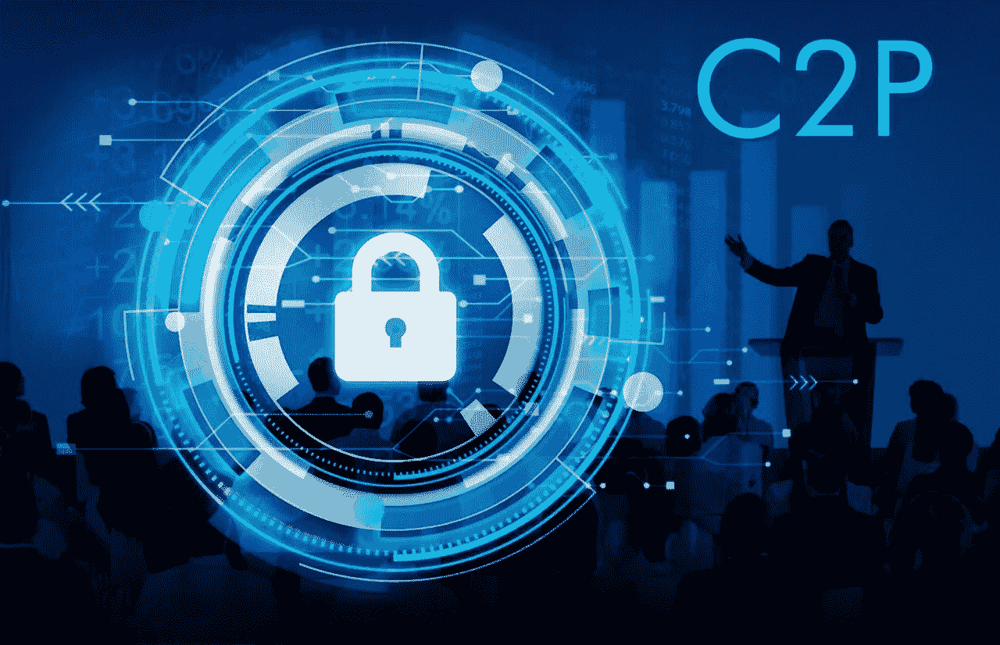

# ILCoin C2P:区块链急需的安全解决方案

> 原文：<https://medium.com/hackernoon/the-ilcoin-c2p-a-security-solution-that-blockchain-desperately-needs-89f0d5929d46>

自从这个行业存在以来，区块链和加密货币市场就一直充斥着黑客和安全漏洞的故事。

虽然各种数字资产不断要求传统金融和技术行业增加采用和认可，但主要障碍有两个方面:

1.  加密货币被视为与黑暗网络上的各种犯罪活动有关联
2.  加密货币交易所和数字资产本身似乎并不太安全。

虽然第一个问题不容易克服，但后者的问题更为重要。必须有一种方法来保护真正进行加密货币投资的人的资金和财产，到目前为止，这还没有做到。

根据加密货币情报公司 [CipherTrace](https://ciphertrace.com/news-oldpage/) 的一份报告，2018 年前九个月，加密货币诈骗造成的损失总计 9.27 亿美元。在另一份报告中，同一家公司透露，今年加密货币黑客和诈骗的总损失应该轻松超过 12 亿美元。

无论用什么标准来衡量，这都不是一份好报告。

当然，这并不是说公司没有努力确保客户安全。他们认为，在打击安全方面已经取得了很大进展。然而，事情似乎还不够。安全性是加密货币需要实现的一个重要特性，如果做不到这一点，整个行业接受的希望将会破灭。

然而，事情似乎正在好转。

本月早些时候， [ILCoin](https://ilcoincrypto.com/) 为他们的 C2P 共识获得了第一份帕洛阿尔托网络合作伙伴证书。自公司成立以来，其员工一直致力于阻止行业中可能发生的 quantum 51 攻击。

现在，随着其创新的 C2P(命令链协议)在网络安全审计中取得成功，该公司正在向前发展，并正在快速成为动态技术环境中的安全标准。

测试运行后，发现其技术已经消除了 51%的量子计算攻击问题。这是第一项实现这种能力的技术，尖端的区块链技术已经收到了潜在客户的大量评论和期待。

在谈到这一成就时，ILCoin 的执行经理诺伯特·戈法(Norbert Goffa)说:
*“在 PoW 算法中，很难克服 51%的攻击可能性。所以，我们必须从头开始改造一切。我们知道区块链本身需要显著改进，这样我们才能实现我们的目标。我们想创造一种前所未有的独特技术，但同时，不要过于复杂，但又非常实用。该解决方案简单、优雅且安全。”*

通往认证的道路绝对不容易。为了获得所需的认证，必须对 C2P 技术进行为期 4 周的漏洞测试。测试涵盖了 51%攻击、带有回滚攻击的分叉攻击、设计缺陷类型攻击等等，所有这些都会对智能合约的效率和功能产生显著影响。

欧洲数字公司(帕洛阿尔托网络公司的官方合作伙伴)的总经理彼得·波罗斯在谈到这次测试时说:

*“他们的想法是全新的。在第一轮，这是一种“设计审查”。我们必须在短时间内从头开始理解所有的关键概念，以便能够找到和探索我们会做的最有创意的想法/攻击。攻击者将有足够的时间来思考他们的新想法。我们的任务是掩护 C2P 遭受黑客攻击的每一种可能性。”*

然而，最终这一切都是值得的，因为测试显示，该协议能够消除与量子计算水平上 51%的攻击相关的所有风险。

C2P 有可能给整个区块链生态系统带来彻底的破坏。

目前，许多区块链在其安全基础设施中使用工作证明(PoW)、利益证明(PoS)或委托利益证明(dpo)。

**动力**

PoW 是验证比特币区块链交易的协议，它形成了矿工用来解决加密数学问题和验证其交易的算法。当对单笔交易进行验证及其后续验证时，加密货币被转移到矿工手中。

然而，电力是资源密集型，它需要大量电力和计算能力。此外，这些区块链也容易受到 51%攻击，这种攻击将区块链的控制权授予任何拥有网络计算能力重要部分的人。

**位置**

PoS 最初旨在帮助降低与加密货币开采相关的资源成本。在这里，交易通过“赌注”方法进行验证，参与者将加密资产押在交易的合法性上。本质上，你有机会获得更多的回报，因为你赌注更多。

**dpo**

DPoS 是一种更现代的一致性算法，它是安全的、分散的，并且还可以在一秒钟内处理更多的事务。它使用“见证”来验证交易。这些见证人是根据投票指定的，在投票阶段也可以添加或删除见证人。

给予证人的投票权取决于该证人持有多少代币。所以，一个有更多代币的证人比一个有较少代币的证人获得更多的投票权。虽然见证人从他们对交易的投票中获得经济利益，但许多人确实想成为见证人，而且不是每个人都能够通过投票过程。

**C2P**

这个独特的共识机制是由 ILCoin 的项目团队开发的。该算法通过三种不同类型的代码工作:

有正常的代码，这有助于生成钱包，并与整个网络同步

有验证器代码，它提供交易验证

有主代码，它跟踪交易验证并为每个交易提供数字签名。

主码生成的所有签名都是相互关联的，出于安全原因，它们将随时间保持动态。此外，请记住，在交易生效之前，主代码需要签署一个块。

由于部署了 C2P 技术，所有的硬币都完全不会被盗。由于实施了阻止机制，恶意攻击得以防止。

波罗斯还谈到了 C2P 的创新以及如何从区块链产业中获益，他补充道:

*“我认为区块链产业仍在发展，就像 90 年代的互联网一样。它需要许多新的发展和成就。C2P 解决了一个关于量子电阻的主要问题。我认为我们应该鼓励每个人与第三方一起测试他们的链条和产品。了解自己的优势和劣势至关重要。”*