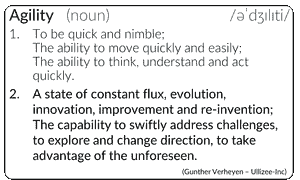
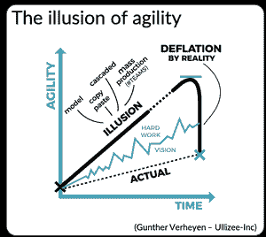

# 敏捷的幻觉(大多数敏捷转换最终交付了什么)

> 原文：<https://medium.com/hackernoon/the-illusion-of-agility-what-most-agile-transformations-end-up-delivering-40ba9764d4f1>

*由:* [*冈瑟*](https://www.scrum.org/gunther-verheyen) *，职业 Scrum 培训师，*

***敏捷性是一种独特的、不断发展的状态，它是特定组织的典型特征，取决于组织的人员、设置和历史。变得更加敏捷的传统(工业)方法通常只会产生一种敏捷的错觉。***

*敏捷性是一种特定的状态，因为它反映了一个组织及其成员曾经和正在经历的独特的经验和教训，克服特定烦恼和障碍的方式，过程中发生的许多检查和适应，以及需要不同响应的未知未来挑战。敏捷性是一个独特的签名，带有参与人员及其关系和交互的印记，带有使用和废弃的工具、流程、实践的印记，带有构成组织的许多生态系统内部和之间的构造的印记，甚至可能跨越组织的边界。*

> *没有一个模型能够预测、预期或勾勒出一个组织的敏捷状态的独特特征。*

**

*然而，我们的许多组织在过去的工业时代就已经有了根基和信仰。当他们感受到提高敏捷性的需要和压力时，他们自然会回归到熟悉的、但却是老派的工业配方。他们小心翼翼地尝试向敏捷范式转移(尽管他们需要跳跃)，将它们包装在单独的变更项目中。他们环顾四周，模仿其他组织的做法。他们复制粘贴别人声称给他们带来成功的东西，不管他们是否在同一个经济领域经营。他们以级联和大规模生产的方式实施流程和实践。他们依赖教科书模型，这些模型规定了通用的先发制人的蓝图和组织结构。获得适应组织特定环境的可持续敏捷性所需的学习和艰苦工作很容易被忽略。具有讽刺意味的是，这些正是阻碍他们成长的方法，他们需要放弃的工作方式，以便进入新的世界并在新的世界中生存，这些世界需要更高的敏捷性。*

**

*这种不匹配是根本性的。他们需要也希望冲洗他们的工业方式，同时加强它们。只不过创造了一种敏捷的幻觉，而这种幻觉往往在几年后现实的通货紧缩重创 T2 时才痛苦地显露出来。在紧急情况面前，敏捷性的增加可以忽略不计。实际结果令人失望。*

*希望实现的目标没有实现。创造公司产品和服务的人并没有变得更加投入或更有动力(相反，他们不断离开，无法吸引新的人才)。资助这项工作的人并没有更高兴(没有实现预期的收益和回报)。购买和消费组织的产品和服务的人并没有更满意(并且使用和满意度持续下降)。总的来说，过去占主导地位的脱节问题并没有解决。传统的自上而下的直线型组织具有典型的筒仓式结构以及技能和专业知识的分离，这种结构不会被团队合作、共同的目标和承诺所取代。指责总是优先于合作。*

*增加敏捷性是一条途径。在这条道路上前进需要远见、信念、坚持和……**努力工作**。敏捷，作为一种高度适应的状态，只能通过有规律的适应来实现。只有在检查实际工作和可观察到的结果时，调整才有意义。想想反馈循环(到处都是)。新的现实需要敏捷性，这意味着今天有效的明天可能就无效了。适用于一家公司的东西(由相互联系的人、过程、工具组成的复杂系统)可能不适用于另一家公司。适用于团队、技术和业务的组合可能不适用于另一种组合。*

*可能让你不陷入敏捷错觉的路标是:*

*   *如果它没有改变你的工作方式，它就不是一个转变。*
*   *如果它不能简化您的工作方式，那么它就不是一个敏捷的转变。*
*   *如果 Scrum 没有吸引和激励人们(客户、团队、利益相关者)，那么它就不是一个 Scrum 的采用。*

*新的现实告诉我们，现在比以往任何时候都更需要行动。拥抱不确定性和不可预测性也有很大的潜力。最大限度地利用可能性，取决于接受未来的未知状态和未来可能带来的一切。它提醒我们，我们在这方面并不孤独，每个人，无论其职能、级别、职位或筒仓，都可以做出贡献。面对不可预测的结果，活出可能的艺术，可以让人们参与进来，因为这塑造了他们的未来。加速度来自于远见、决心和奉献；从不再遵循计划或复制模式的勇气。*

*不管一个组织过去的尝试和选择如何，回到努力工作的道路上总是一条可行的出路。*

> *更多的敏捷团队并不能造就一个更敏捷的组织。*

*(谢谢你，[、更高视角](http://www.higherview.nl/)，感谢你在视频创作方面的专业知识，以及[杰利实验室](https://www.jellylab.nl/)的图形)*

**原载于 2019 年 1 月 7 日*[*guntherverheyen.com*](https://guntherverheyen.com/2019/01/07/the-illusion-of-agility-what-most-agile-transformations-end-up-delivering/)*。**