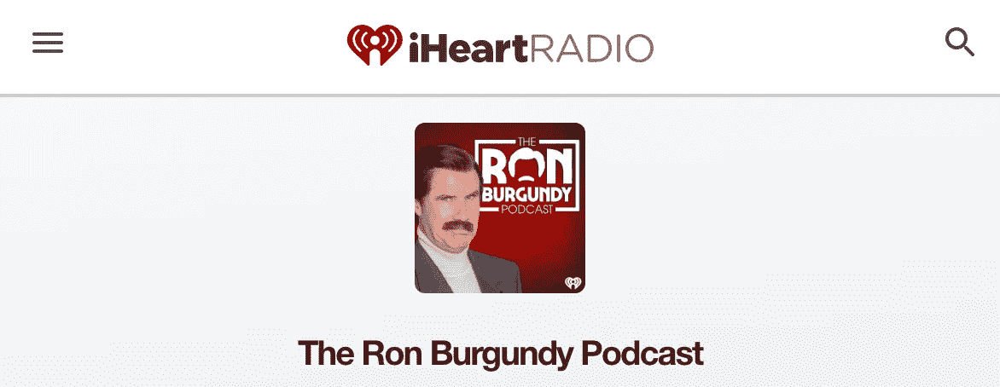
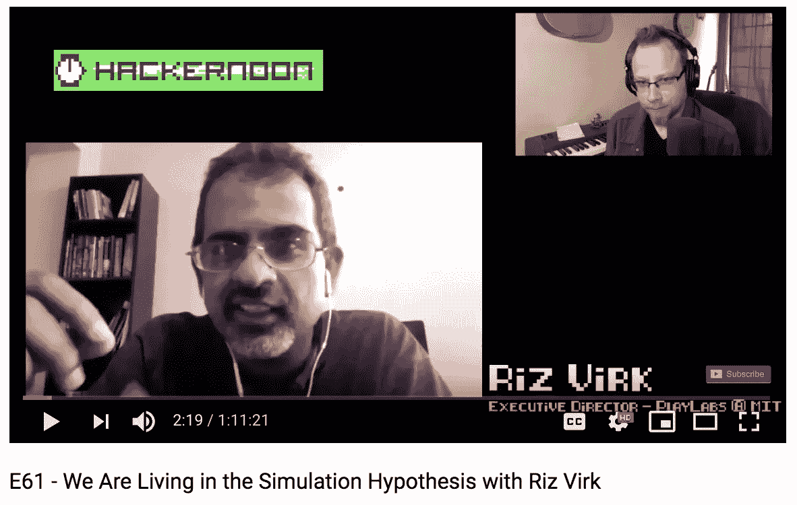
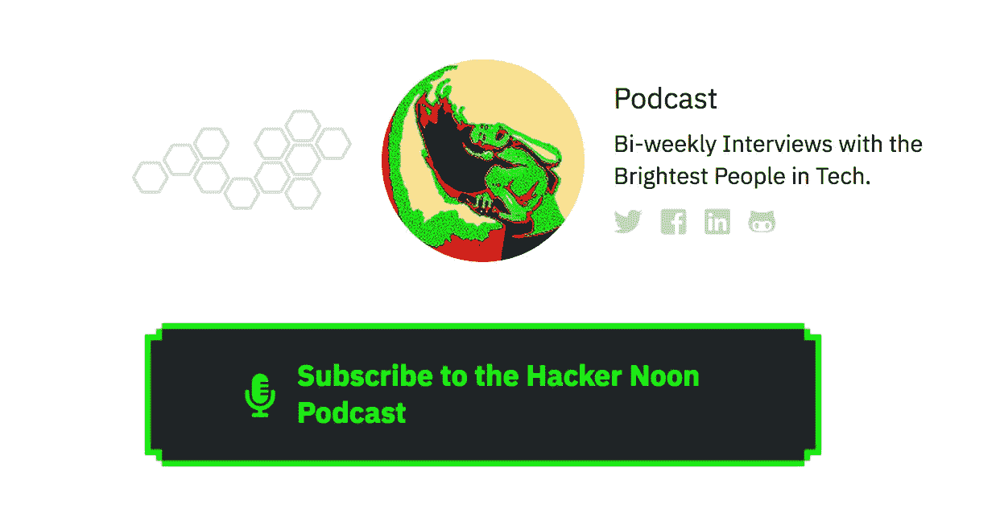

# 罗恩·博根狄说:“互联网已经存在了。”

> 原文：<https://medium.com/hackernoon/the-internet-is-here-to-stay-says-ron-burgundy-e6b040ea44ed>

## 请听罗恩·博根狄、信息安全专家理查德·格林伯格和卡洛琳(通过 iHeartRadio[)的](https://www.iheart.com/podcast/the-ron-burgundy-podcast-30270227/episode/cyber-security-47951911/)[网络安全插曲](https://www.iheart.com/podcast/the-ron-burgundy-podcast-30270227/episode/cyber-security-47951911/)。今天就来了解一下[暗网](https://hackernoon.com/understanding-the-deep-dark-web-8e4cad356587)。

## 同样，在[黑客正午播客](http://podcast.hackernoon.com)上:

## [**E61——我们和 Riz Virk**](https://podcast.hackernoon.com/e/e61-the-simulation-hypothesis-exploring-the-real-with/) **一起生活在模拟假设中。**

## **在** [**上听 iTunes**](https://podcasts.apple.com/us/podcast/e61-we-are-living-in-the-simulation-hypothesis-with-riz-virk/id1436233955?i=1000446824297) **，** [**谷歌**](https://play.google.com/music/m/Dohog5m7lnho6fnpybqn4nzsmiy?t=E61_-_We_Are_Living_in_the_Simulation_Hypothesis_with_Riz_Virk-The_Hacker_Noon_Podcast) **，无论你在哪里都能得到你的** [**播客**](https://hackernoon.com/@podcast) **，或者** [**在 Youtube 上看**](https://www.youtube.com/watch?v=1pH1jg-BohM) **:**

via [Derek Bernard](https://community.hackernoon.com/u/derek/summary) :在这个我们称之为现实的地方，我们存在的本质在维持现状的需要中常常被认为是理所当然的，Riz Virk(【zenentrepreneur.com】)探索了非常真实的可能性(在一些思想流派中，是非常真实的可能性)，即我们所经历的“真实”实际上是一种模拟，类似于视频游戏，通过我们的经历来寻求任务、成就和升级。

> “什么是科学，什么是宗教？两者都是试图发现我们的物质现实的真相，以及现实内外的事物和规则是什么。在模拟假说中，科学实际上发现的是我们在视频游戏世界中称之为物理引擎的东西。”***——***[*里兹维克*](https://hackernoon.com/@rizstanford)
> 
> “模拟假说是一种我们生活在基于信息的现实中的模型，这种模型正在为我们每个人呈现，最终可能会比其他许多模型更接近于解释这些事情。”***——***[*里兹·维克*](https://hackernoon.com/@rizstanford)

