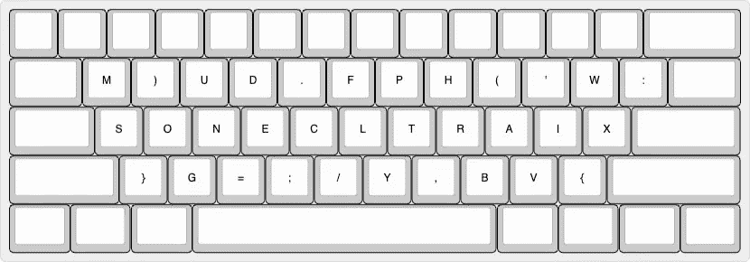
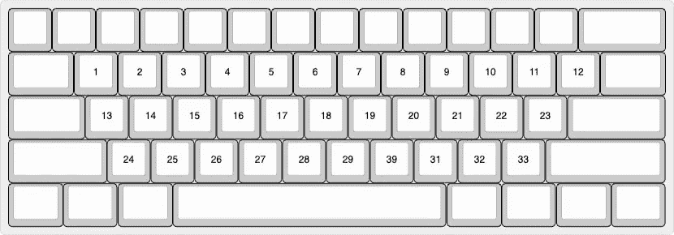
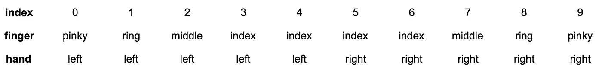
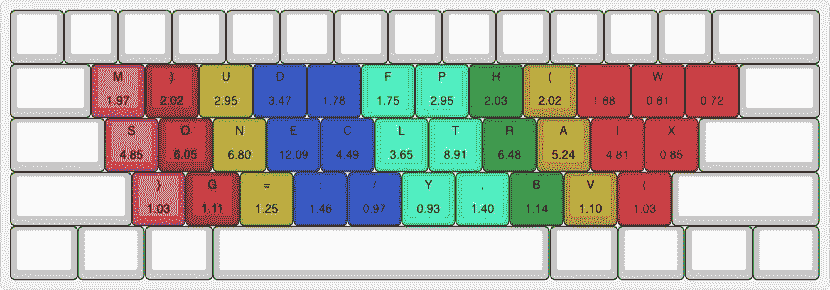
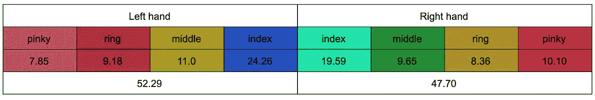

# JavaScript 键盘

> 原文：<https://medium.com/hackernoon/the-javascript-keyboard-31b88379eeb3>



## TL；DR I 试验了 React codebase 中的字符，设计了基于字符频率的键盘布局。结果就是上图。

# 动机

我们开发人员倾向于在笔记本电脑前花大部分时间按键盘按钮。我们中的一些人，如果不是大多数，打字非常快，并认为这提高了我们的生产力。

最流行的键盘布局是 QWERTY 布局，它在打字速度方面有一些缺点。它是专门为防止老式机械打字机的按键卡住而设计的，而且在速度方面也有限制。此外，它没有考虑到程序员(可能)使用一些符号比字母更频繁。

我决定基于非常简单的**三个** **原则**为通用编程语言(JavaScript)准备一个布局。

*   将最常用的键放在主行(QWERTY 中以 ASD 开头的行),将最不常用的键放在下一行
*   平衡左右手之间的负荷
*   按从高到低的顺序将负荷加到手指上，依次为食指、中指、无名指和小指。

# 分析

我首先在我的笔记本电脑上克隆了一个流行的 JavaScript 库 React。React 是一个用于构建用户界面的 JavaScript 库，截至目前，它在 GitHub 上拥有超过 128，000 颗星。我只锁定了扩展名为`.js`的文件。

```
import ospath = "/Users/halilcoban/Documents/projects/react"js_files = []for root, dirs, files in os.walk(path):
    for file in files:
        if file.endswith(".js"):
            js_files.append(os.path.join(root, file))print("Found " + str(len(js_files)) + " files")
```

上面的 python 脚本只是在 react 文件夹中进行遍历，并将文件附加到一个数组中供以后使用。执行后，它输出“找到 869 个文件”。然后我可以开始在这些文件中进行分析。

为了实现我上面提到的原则，我们只需要计算字符的频率。

```
frequencies = {}for test_file in js_files:
   with open(test_file, 'r') as file:
        for line in file:
            for char in line:
                lower_char = char.lower()
                if lower_char in frequencies:
                    frequencies[lower_char] += 1
                else:
                    frequencies[lower_char] = 1
```

`frequencies`是一个将字符映射到 React 代码库中出现次数的字典。似乎

```
{
  '\n': 197854,
  ' ': 1376531,
  '!': 2950,
  '"': 8298,
  '#': 361,
  '$': 1709,
  ...
}
```

我决定只关注最常用的 33 个字符，因为如果您忽略 F 行、数字行、空格键行以及 caps lock、return 等键所在的最右边和最左边的键，我的键盘上有 33 个键。你可以在下面看到我聚焦的键，从 1 到 33。



从最常见的字符中，我过滤掉了分别对应于回车键和空格键的`\n`和，因为它们通常不在常规键盘的 33 个键中。

根据我们的第三个原则，我们希望按照食指、中指、无名指和小指的顺序(从最高负荷到最低负荷)给手指施加负荷。由于手的位置，通常左手控制每排 5 个键，右手控制 5 个键，此外还有几个额外的键由小手指控制。忽略这些额外的键，我决定把注意力集中在每行的 10 个键上。对于一组 10 个键，每只手将负责 5 个键，其中 2 个将由食指按压，其余的将由其他手指(中指、无名指或小指)按压。

我解决这个问题的算法如下

*   在每一行中，根据频率按顺序分配密钥

1.  食指
2.  中指
3.  无名指
4.  小手指
5.  再次食指(因为食指应该带两个键)

*   为了在两只手之间均匀分配负荷(原则 2)，连续地给左手一把钥匙，给右手一把钥匙。

考虑从 0 到 9 的一行中键的位置(索引)。下表说明了哪个索引对应于哪个手指，例如左手中指将按下索引 2 处的键(例如 QWERTY 中的 E)。



应用我们上面的算法应该会产生如下结果

*   最常用的键应该用食指按，让我们从左手开始，所以应该是左手食指(3)。之后，我们应该交换手，使用右手食指(6)
*   然后是左手中指(2)和右手中指(7)
*   然后是左手无名指(1)和右手无名指(8)
*   然后是左手小指(0)和右手小指(9)
*   随后再次是左手食指(4)和右手食指(5)

使我们的频率顺序为 3，6，2，7，1，8，0，9，4，5。我们以后会用到它。

这种排序应该照顾到我们的第二和第三原则。为了实现第一个原则，我们可以简单地将最常用的键分配给 home 行，而将其余的键分配给上面和下面的行。

我们之前定义了一个字典`frequencies`,将每个字符映射到它出现的次数。Python 字典是哈希映射数据结构的一个实现，非常适合快速查找，但是它们是不可排序的。我们可以使用`frequencies`字典定义一个字符列表，并根据出现的次数进行排序。这个列表中的每个元素都可以是一个(字符，频率)元组，所以我们可以访问这两个值。

```
num_keyboard_keys = 33
ignored_chars = [" ", "\n"]# a custom sorter to sort by the second element of tuples
# gives a 0 value to ignored chars
def sort_by_occurrence(item):
    if item[0] in ignored_chars:
        return 0
    else:
        return item[1]# create a list of frequent chars ordered by frequencies
# will be a tuple of (character, frequency)
frequent_chars = sorted(frequencies.items(),
                        reverse=True,
                        key=sort_by_occurrence
                       )[:num_keyboard_keys]
```

现在我们有了`frequent_chars`，我们可以循环遍历它来准备一个`keyboard`字典。

```
frequency_order = [3, 6, 2, 7, 1, 8, 0, 9, 4, 5]# initialise a dictionary with 3 keys each corresponding 
# to a keyboard row
keyboard = { “upper”: {}, “middle”: {}, “lower”: {} }# loop through frequent characters
for i, frequent_char in enumerate(frequent_chars): 
    # apply the first principle 
    row = “middle” if i > 29:
        break
    elif i > 19:
        row = “lower"
    elif i > 9:
        row = “upper” # apply the second and third principles
    keyboard[row][frequency_order[i % 10]] = frequent_char
```

# 结果呢

如果我们打印我们的`keyboard`字典，它看起来像这样

```
{
    'lower': {
        0: ('}', 42020),
        1: ('g', 45226),
        2: ('=', 51082),
        ...
}
```

这意味着下一行，索引 0 处的键(用左手按下的键，见上表)将是`}`字符，在 React 代码库中的 JavaScript 文件中出现了 42020 次。紧挨着它的键应该是出现 45226 次的`g`键，依此类推。

由于上面的脚本处理了 30 个键(每行 10 个键)，但我们实际上有 33 个常用字符，我决定手动处理最不常用的 3 个键:`x`、`w`和`:`。他们只是被分配到由右手小指控制的额外按键。

现在让我们来看一下布局，并在字符下方包括使用百分比(该键的出现次数/所有 33 个最常用键的总出现次数)。



第一眼看到上面的布局，你会发现`j`、`k`、`q`、`z`、`[`和`]`不像普通键盘那样出现在最常见的 33 个字符中。它们被替换为`(`、`)`、`=`、`{`、`}`和`:`。

视觉上的每种颜色代表一个单独的手指，从左到右依次为:左小指、左戒指、左中指、左食指、右食指、右中指、右戒指、右小指。正如你所看到的，大部分的负荷都给了后排的食指。但是让我们更深入地看看。

分别有 64.22%、24.35%和 11.42%的字符出现是由主行、上行和下行中的键处理的。这很好，满足了我们的首要原则。

让我们也检查对应于每个键和手的频率百分比，以更好地理解我们是否实现了剩下的两个原则。



Character frequency percentages of keys assigned to different fingers

我们的第二个原则，平衡左手和右手的负载似乎已经实现，但肯定还可以做得更好。左手负荷(52.29%)略高于右手负荷(47.70)。这可能是因为我们开始先给左手分配按键，并且每次分配都交替进行。实际上，如果我们从右手开始会更好，因为 70-95%的人都是右撇子，所以右手的负重更大适合更多的人。此外，我们非常简单的算法只是将一个键连续地放入每只手，这应该通过例如考虑百分比而不仅仅是它们的顺序来改进。

我们的最后一个原则是食指承受最大的负荷，中指和无名指承受最小的负荷。我们可以看到，除了右手小指，这大部分都实现了。这是由于将额外的手指分配给右手小指造成的。在用 30 个键填充`keyboard`字典时，我们本可以考虑到这一点。

# 结论与展望

*   JavaScript 开发人员更多地使用一些字符，如圆括号和花括号，而不是一些字母，如`k`和`q`
*   一个简单的算法可以用来平衡双手的按键，并增加 home 行和食指的使用，但改进是必要的
*   分析哪个键在哪个键之后被频繁地按下(例如在`i`之后，也许`f`经常来做`if`)并且在设计键盘布局时考虑到这一点也是很棒的
*   每种编程语言都有不同的布局是不合理的，但是通过分析最常见的编程语言，可以使用类似的方法来设计通用编程键盘