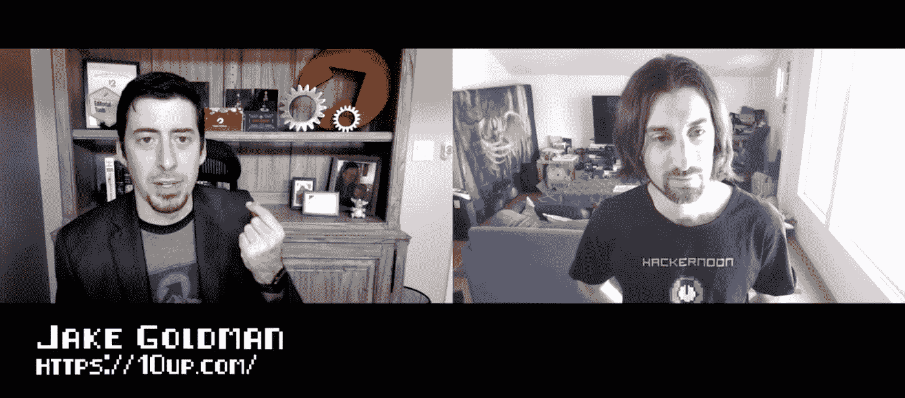

# 杰克·戈德曼的创业之旅

> 原文：<https://medium.com/hackernoon/the-journey-of-entrepreneurship-with-jake-goldman-40a263ab33f3>

黑客午间播客第 53 集:采访[杰克·高曼](http://jakegoldman.me/)， [10up](https://10up.com/) 的创始人和董事，这是一家以 WordPress 为中心的顶级数字机构。

《黑客正午》这一集由 DigitalOcean 赞助。了解为什么开发者喜欢数字海洋，并在[https://do.co/hackernoon](https://do.co/hackernoon)开始享受 50 美元的免费积分

## 在 [iTunes](https://podcasts.apple.com/us/podcast/hacker-noon-podcast/id1436233955) 上听采访或者在 [YouTube](https://youtu.be/Mst52EBQVtc) 上看。

在这一集里，特伦特·拉平斯基采访了顶级 WordPress 数字代理公司 [10up](https://10up.com/) 的创始人[杰克·戈德曼](http://jakegoldman.me/)。你会发现杰克的创业背景，他的职业道路和杰克今天正在做的项目。

*“我的创业之旅真的很像一个时间长休的故事。我认为，今天有很多人特别认为，企业家是你做出的职业选择，然后找到你想要打造的产品，这不是我认为的好企业家”。*

对我来说，创业是当你有了一个非常好的想法，并且对自己想从事的行业有了一些概念时，你会碰巧发现自己在做的事情。你决心让它成功。”—杰克·戈德曼

 [## E53 -杰克·戈德曼的创业之旅

### 黑客正午播客第 53 集:采访杰克·戈德曼，10up 的创始人和董事，一个顶级…

www.podbean.com](https://www.podbean.com/eu/pb-4vpub-b53ed6) 

制作和音乐德里克·伯纳德—[haberdasherband.com/production](http://haberdasherband.com/production?fbclid=IwAR2d8t0cNGHRm1ajmUNWKZ-TMUMawREhvIHSy54LKcOElf7v_TOvkAjZ78Y)

主持人:特伦特·拉平斯基—[https://trentlapinski.com](https://trentlapinski.com/)

[https://hackernoon.com/](https://hackernoon.com/)

[https://community.hackernoon.com/](https://community.hackernoon.com/)

[https://contribute.hackernoon.com/](https://contribute.hackernoon.com/)

[https://sponsor.hackernoon.com/](https://sponsor.hackernoon.com/)

https://podcast.hackernoon.com/

【https://twitter.com/hackernoon/ 

[https://facebook.com/hackernoon/](https://facebook.com/hackernoon/)

## 还可以查看六月份的[头条](https://hackernoon.com/archive/2019/06)、[最新报道](https://hackernoon.com/latest-tech-stories/home)和[今日首页](http://hackernoon.com/)。