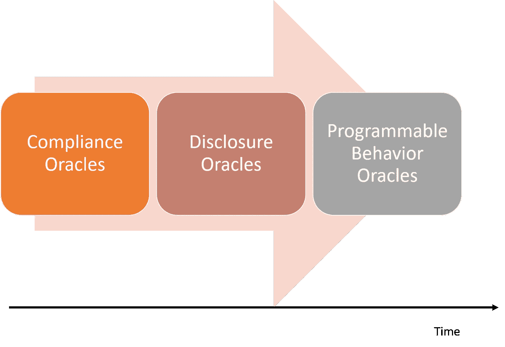
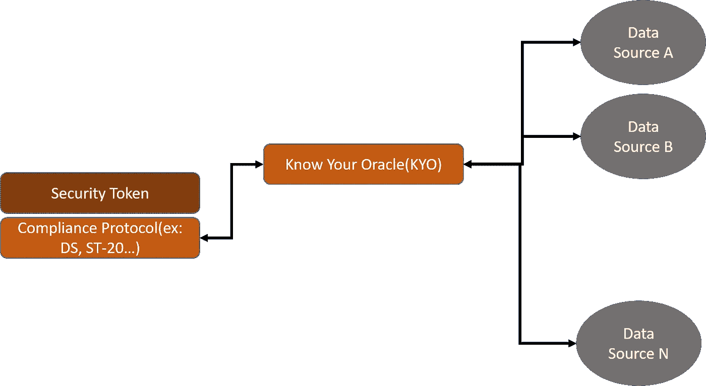

# 了解你的神谕:关于安全令牌中神谕的一些想法

> 原文：<https://medium.com/hackernoon/the-know-your-oracle-thesis-some-thoughts-about-oracles-in-security-tokens-e0be9932f04e>

访问链外数据源是区块链应用程序的一个长期挑战。Oracles 是区块链运行时的组件，负责在不违反区块链完整性的情况下与外部数据源进行交互。在我看来，在智能合同中加入对外链信息的访问，是简化区块链平台采用所需的关键能力之一。在安全令牌的环境中，oracle 的挑战被极大地放大了，因为外部信息在许多加密证券的生命周期中扮演着重要的角色。

在区块链应用程序的上下文中，术语 oracle 起源于以太坊白皮书，但它明显是指希腊神话。在古希腊，神谕是神圣的人，他们解释神的意志并将其传达给人们。古希腊最重要的神谕是皮媞亚，特尔斐阿波罗的女祭司。皮媞亚最著名的预言之一是吕底亚(今天的土耳其西南部)的国王克罗伊斯问神谕他是否应该对他的邻国开战。神谕回答说，如果他参战，一个伟大的王国将会覆灭。克罗伊斯认为这是他敌人的王国，但结果却是他自己的。提醒您正确解释来自神谕的信息与访问神谕本身一样重要😉。如果我们从希腊神话中借用一页到区块链世界，我们可能会得出这样的结论:神谕的作用是将来自外部神的信息传递到凡人的智能契约中。我知道…这不是一个很好的类比，但让我们回到安全令牌😉。

# 神谕和安全令牌

如前所述，与外部数据源的交互是下一代安全令牌平台需要解决的关键挑战之一。神谕在安全令牌中的作用无处不在。从信息披露到新形式的可编程证券，安全令牌需要外部数据源，就像它们需要区块链一样。虽然安全令牌中的 oracles 用例多种多样，但我认为有三个基本类别在不久的将来会非常有价值:

**遵从性预言:**安全令牌中最基本的预言形式与遵从性检查点有关。在几种情况下，证券的转让需要外部方的批准，而这在可编程智能合约中是无法实现的。法规遵从性 oracles 是负责与那些外部方或数据源进行交互，并在链上声明它们的批准或拒绝以完成传输操作的实体。

**披露神谕:**假设我们发行了一只令牌化债券，其评级由穆迪这样的外部机构给出。经过几个月的交易，穆迪重新评估其债券评级，给它一个较低的分数。新的评级是一种披露形式，应立即反映在债券智能合约中，以实现公平的价格。这个例子代表了一种形式的披露 oracle，Oracle 负责断言来自可靠来源的披露，这些来源可能与加密证券的价格或行为有关。

**可编程逻辑预言:**安全令牌最令人兴奋的方面是允许我们想象新形式的证券，而预言是其中不可或缺的一部分。想象一个场景，其中一个安全令牌代表一家连锁酒店的股份，智能合约将根据令牌持有者的具体职位自动授予他们一定数量的奖励积分。可编程逻辑 Oracle 是根据安全令牌的链上行为触发链外操作的 Oracle 类型。

# 了解你的神谕(KYO)

安全令牌基于将合规性引入加密资产的前提。最基本的合规形式是通过遵循了解客户(KYC)法规来了解令牌持有者的身份。如果我们可以对指导 crypt-security 智能契约行为的外部数据源做一些类似的事情，会怎么样呢？出于娱乐的目的，让我们称这个想法为了解你的先知(KYO)。

想象一个代表不同石油和天然气公司股票的加密证券(类似于 ETF)。智能合约将包括基于穆迪(Moody's)等不同“认可机构”的评级，价格信息将计入最新的石油输出国组织报告。《KYO 议定书》可以匹配这些经批准的来源，并将它们与特定的区块链地址相关联。来自这些来源的披露将反映在加密安全智能合同中，KYO 协议将根据已批准的 oracle 地址白名单对其进行协调。我知道这听起来有点超前，但实际上很容易实现。

# 一些可能有帮助的 Oracle 协议

甲骨文是区块链生态系统中远远超出安全令牌的巨大挑战。因此，我们看到了几个创新的 oracle 协议，其中包含了与安全令牌领域非常相关的思想。以下是我最喜欢的几个:

[ChainLink](https://www.smartcontract.com/link#chainlink) :称 ChainLink 为甲骨文协议可能有点轻描淡写。该平台充当一个分散的 Oracle 网络，其中任何参与者都可以提供一个数据馈送来交换链接令牌。ChainLink 平台包括认证、验证和信誉服务，这些服务加强了 Oracles 的完整性。

orac lize:orac lize 平台提供了一种协议，可以将 IPFS 或 URL 等不同类型的数据源与以太坊、R3 Corda 或 BlockApps 等区块链集成在一起。Oraclize 使用一种称为真实性证明的机制来充当某种不可信的中介。

[奥格](https://www.augur.net/):奥格通常被认为是一个分散的预测市场，它实现了区块链生态系统中最复杂的 Oracle 协议之一。Augur 允许区块链网络的参与者报告与特定预测相关的外部事件。该平台使用验证争议协议和信誉令牌(REP)来维护不同 Oracles 的行为记录。

[aete nity](https://aeternity.com/):[aete nity](https://aeternity.com/)是一个能够实现与外部数据源交互的智能合约的平台。该平台依靠国家渠道实现区块链和外部数据源的集成。[实体](https://aeternity.com/)还包括一个声誉系统，作为不同神谕的货币。

解决 oracle 挑战是简化安全令牌采用的重要一步。Oracles 是急需的安全令牌功能(如披露或新形式的法规遵从性)的基础。调整现有的 oracle 协议或设计新的协议应该是下一波安全令牌平台的重点领域之一