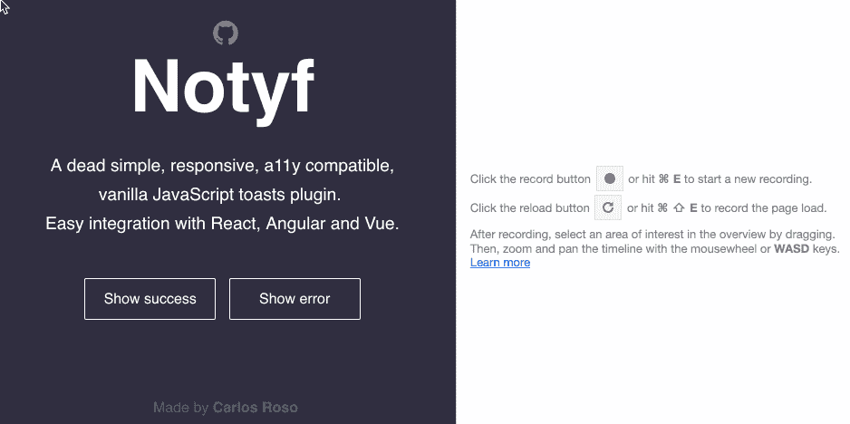

# 你需要的最后一个吐司库

> 原文：<https://medium.com/hackernoon/the-last-toast-library-youll-ever-need-8629e61b8e91>

介绍 [Notyf](https://github.com/caroso1222/notyf) 3.0

Notyf in action

在这篇文章中，我将介绍上一版本 [Notyf](https://github.com/caroso1222/notyf) 的新特性和亮点。

# 什么不是 yf？

Notyf 是 2019 年的一个无依赖、现代、优雅的吐司库。

众所周知，如果没有数百个 JavaScript toast 库，也有几十个。Notyf 又是一个。尽管如此，我认为这些库中的大部分都遗漏了一些在今天的前端开发中需要的要点。在这篇文章中，我将介绍 Notyf 3.0，并展示它如何脱颖而出，使其非常适合您今天的项目。

> Notyf 是 2019 年的一个无依赖、现代、优雅的吐司库

# 随处插电，随处播放

众所周知，前端框架在当今的前端开发中扮演着重要的角色。构建一个仍然依赖 jQuery 或在浏览器中注册全局变量的 UI 库几乎没有意义。

Notyf 通过公开 3 种类型的包来处理这个问题:ES6、CommonJS 和 vanilla IIFE。像 Webpack 这样的模块捆绑器将抓取 ES6 模块并使用它。此外，我们这些仍然维护服务器端渲染和`<scripts>`的遗留代码库的人，仍然能够通过使用 IIFE minified bundle 来使用 Notyf。

特定于框架的方法[可以在资源库](https://github.com/caroso1222/notyf/blob/master/recipes/README.md)中获得。Notyf 在 React、Vue、Angular 方面都经过了很好的测试。配方是在特定于每个框架的最佳实践之上编写的(React 的上下文 API，Vue 的提供/注入，Angular 的注入令牌)。

# 到处打字

3.0.0 版已经在 TypeScript 中从头开始重写。这意味着你可以免费打字，不需要安装`[@types/notyf](https://github.com/DefinitelyTyped/DefinitelyTyped/tree/master/types/notyf)`。就可伸缩性和可维护性而言，这也是项目的一大胜利。

# **完全通过 E2E 测试**

很少有最好的吐司库进行 e2e 或单元测试。这是 Notyf 的制胜点之一，因为它是用我认为迄今为止最好的端到端测试框架 [Cypress](https://www.cypress.io/) 测试的。这使得 Notyf 不仅可以在其公共 API 上进行测试，还可以在其实际的 UI 呈现性能上进行测试。

# 一切都很重要。喜欢，很多。

在分析了一些[策划的通知库](https://ourcodeworld.com/articles/read/52/top-10-best-notification-libraries-and-plugins-for-javascript-and-jquery)之后，我意识到它们中很少有人真正关心依赖屏幕阅读器浏览网页的视障用户。Notyf 通过提供完全的 a11y 支持来处理这个问题，使得屏幕阅读器可以立即阅读祝酒词。它依赖于[播音员技术](https://github.com/caroso1222/notyf/blob/master/src/notyf.view.ts#L140-L174)和一些 aria 属性的使用。

# 关于性能什么的

你在网上看到的所有祝酒词通常都使用了不错的淡入不透明动画。相反，Notyf 使用波纹状效果展示自己，这(个人观点)使它看起来现代而优雅。通过避免回流和仅动画`transform`道具，它在实现所有这些功能的同时仍然实现了最佳性能。您可以在下面的性能分析中看到动画如何以 60 fps 的速度运行。

Performance profiling

# 招聘广告

我个人认为这是一个开始开源的好项目，如果你还没有开始的话。代码库并不令人畏惧，而且相对容易理解。此外，还有一些功能需要添加，一些问题需要解决。我还需要帮助完善 React 和 Vue 的配方，因为我不是这些框架的专家。前往[投稿](https://github.com/caroso1222/notyf/blob/master/CONTRIBUTING.md)指南，帮我把这里变成最好的吐司图书馆！

 [## 卡罗索 1222/notyf

### 👻一个非常简单、响应迅速、普通的 JavaScript 插件来显示通知。-卡罗索 1222/notyf

github.com](https://github.com/caroso1222/notyf) 

# 无耻的自我推销

我通常写网页开发或者任何我想到的与软件相关的东西。你可能想了解一下[我作为一名远程工作者的经历](https://codeburst.io/how-i-got-accepted-into-the-best-remote-working-platforms-a9250041531f)或者[我如何以最过分的方式部署我的前端应用程序](https://hackernoon.com/deploying-frontend-applications-the-fun-way-bc3f69e15331)。如果你喜欢你所读的，那么我很感激你订阅我的内容或者去 twitter [@caroso1222](https://twitter.com/caroso1222) 打个招呼！