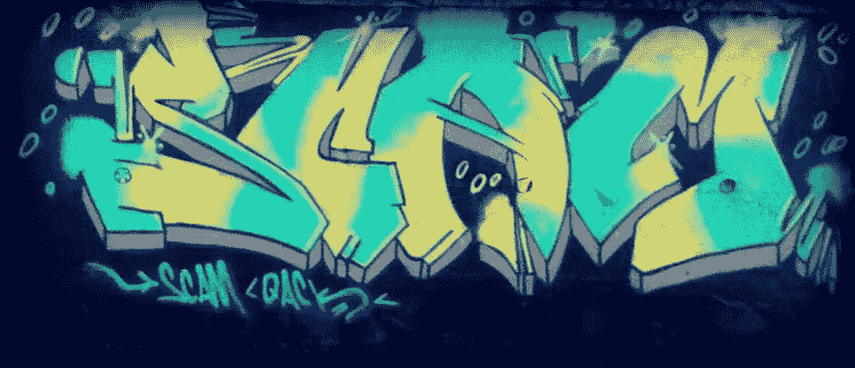
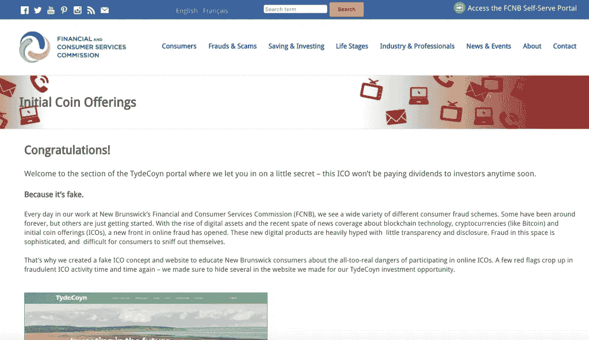

# 最新的 ICO 骗局…是假的？

> 原文：<https://medium.com/hackernoon/the-latest-ico-scam-is-fake-a106b149f099>

## 加拿大政府创建了一个虚假的 ICO 网站，向投资者宣传加密货币骗局的危险。找出避免自己被骗的技巧。

## TydeCoyn“骗局”

TydeCoyn 自称是加拿大区块链的一家初创公司，为个人提供投资“结合旅游推广和环境保护主义的加密货币令牌”的机会该网站声称，TydeCoyn 代币可以用来支付“新不伦瑞克的几十个旅游和旅行运营商。”它向投资者承诺“每个 ICO 前代币的回报率为 85%，这个数字将扩大到 115%。”它还声称，每次购买 Tydecoyn 代币“都会自动将销售额的一部分发送给几个参与的野生动物基金会或组织之一。”甚至有一个 YouTube 视频声称该项目“提出了一种使旅游业可持续发展的新方法。”

到目前为止，这听起来像是许多 ico 的营销活动，它们经常承诺将区块链用于某种类型的当地参与(旅游、当地导游)以及潜在的利润(“可交易的”令牌)和对社会公益的贡献(支持野生动物基金会)。

然而，TydeCoyn 是假的…但它不是一个骗局。

点击项目网站上的“立即投资”,你将进入 FCNB 网站，让你大吃一惊:

## 假 ICO 骗局凸显“红旗”教育投资者

新不伦瑞克金融和消费者服务委员会(FCNB)创建了 TydeCoyn.ca 来教育投资者“参与在线 ico 的真实危险”事实上，该网站充斥着在真正的欺诈性 ICO 活动中经常看到的危险信号——这是 FCNB 完全想要的。

## 危险信号 ICO 是一个骗局

在研究新的区块链项目时，投资者可以在 Tydecoyn 网站上关注几件事。

*   **承诺保证收益**

当心“没有风险，只有回报”的承诺简单地说，不可能保证一项投资会盈利。任何时候你看到这样的语言，它很可能是一个骗局。正如 Tydecoyn 网站所解释的那样，ICO 欺诈者“使用花哨的术语和模糊的技术语言来引诱消费者产生一种虚假的安全感，他们让这种感觉听起来好像不可能实际上是可能的。”

*   **创始团队及合作伙伴信息有限**

正版 ico 很清楚谁是项目的幕后黑手。缺乏这样的透明度是一个巨大的危险信号。潜在投资者必须警惕那些不会透露创始人和合伙人联系信息的 ico。正如 Tydecoyn 网站解释的那样:

> “严肃的公司需要的不仅仅是一个 IP 地址或一个数字钱包地址来与客户做生意。”

好的投资有透明的信息流。

*   **让投资者感到操之过急的噱头**

假的 Tydecoyn ICO 网站包括一个倒计时钟，显然是为了让潜在投资者感到有压力，以便迅速做出决定。FCNB 解释说，如果有人试图催你投资，“他们的‘机会’很可能在越来越多的审查下站不住脚”。

## 结论

新不伦瑞克政府希望人们从 TydeCoyn 的假 ICO 中吸取的要点是，投资者不应参与 ICO "[，除非他们在情感上和经济上能够承担失去全部投资的风险](https://www.wealthprofessional.ca/market-talk/provincial-regulator-has-been-running-an-ico-scam-251429.aspx)。FCNB 网站将所有被“骗局”愚弄的人都指向了它的[投资者教育材料](http://fcnb.ca/ico.html)。

*订阅我的频道* [*中*](/@minadown) *和* [*推特*](https://twitter.com/minad21) *如果你喜欢我的文章，想了解更多关于区块链和加密货币项目的信息，

如果您对本文有任何疑问，请在下面的版块发表评论。谢谢大家！*