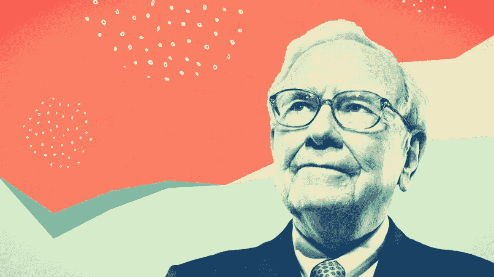
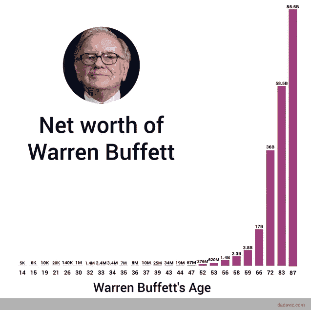
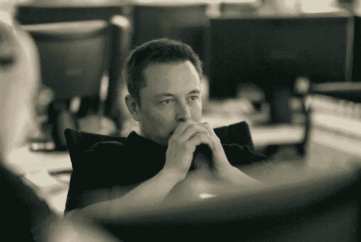
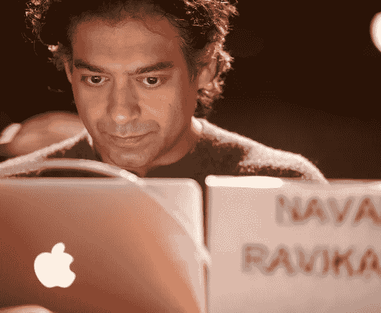
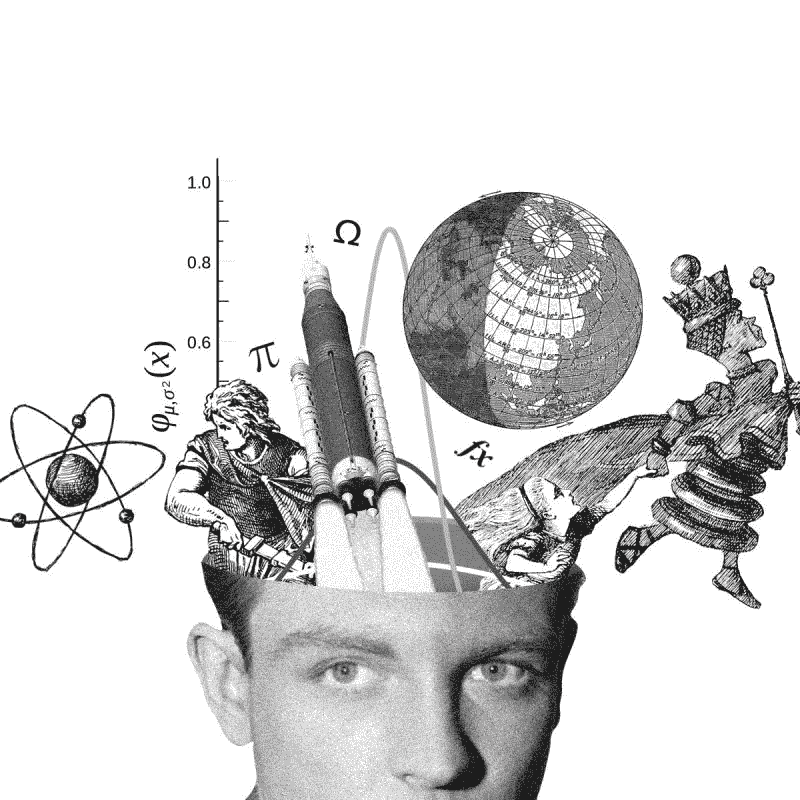

# 复合知识改变生活的魔力

> 原文：<https://medium.com/hackernoon/the-life-changing-magic-of-compounding-knowledge-c271ea39ac40>

Buffett: Net Worth $82 Billion, Image Credit: [investbound.com](http://investbound.com/)

> 宇宙中最强的力量是复利。——阿尔伯特·爱因斯坦

# 成为百万富翁的高概率途径

沃伦·巴菲特，这位所谓的奥马哈先知是一个无需介绍的人。

他被认为是世界上最成功的投资者之一，拥有 825 亿美元的净资产，是世界上第三富有的人。

他通过完善他以前的老师本杰明·格拉哈姆开创的价值投资哲学积累了这笔财富。其核心是深入研究公司年报，挑选看似被低估、但关键是具有真正潜力并能支付股息的股票。

巴菲特会将这些年度股息——尽管它们可能经常很少——重新投资于同一家公司的股票。这有助于他获得复利。

随着时间的推移，复利开始得到回报，这一点变得非常明显。当你坚持不懈地投资时，这种耐心会有回报——而且是很大的回报。

事实上，令人惊讶的是，沃伦·巴菲特 99%的钱都是在 50 岁以后赚的。

Credit: Dadaviz.com

克里斯·霍根(Chris Hogan)在他 2019 年的著作《每日百万富翁——普通人如何创造非凡财富——以及你如何也能创造非凡财富》中引用了乔治敦大学的研究，“在作者的研究中，88%的百万富翁拥有学士学位”。

虽然大学教育是有利的，但是，大多数百万富翁不会去常春藤盟校或有高薪工作。其实排名前三的职业是**工程师、会计**和**教师**。

事实证明，大多数百万富翁都不是对冲基金经理，而是拥有普通工作的普通人。让他们与众不同的是他们的行为，而不是他们的年薪。

他们的秘密是，他们使用了沃伦·巴菲特使用的基本原理，并通过投资股息支付和免税退休基金来利用复利的力量。

# 这些和知识有什么关系？

> “每天读 500 页。知识就是这样运作的。它就像复利一样累积起来。”
> 
> —沃伦·巴菲特

同样的秘密武器——**复利**——不仅可以用于金融工程，也可以用于知识获取和学习。

我们大多数人都把时间花在半衰期非常短的信息上。当你阅读或观看新闻时，大部分信息会很快消失，即使仅仅几天后也没有什么价值。

《沃伦·巴菲特授权传记[***【滚雪球】***](https://www.amazon.co.uk/dp/0553384619)**的作者爱丽丝·施罗德(Alice Schroeder)描述了他如何专注于了解那些变化非常缓慢的公司。**

**因为这些信息变化也很慢，他可以综合他的知识。随着时间的推移，这为他创造了一个积累的知识库。**

****过期信息不是知识**。一个月或一年后就没关系了。**

> **关键 1——专注于积累知识，这些知识在十年后会像今天一样有用。**

# **知识需要建立在坚实的基础上**

> ***“学习者不是等待被填满的空容器。他们带着对世界如何运转的先入之见来到教室；有些基本上是正确的，有些是错误的观念。***
> 
> **学习科学手册 *—* **剑桥大学出版社****

**有证据表明，学生学习新思想的方法是把它们与他们已经知道的东西联系起来，然后把它们转移到他们的长期记忆中。**

**解决问题和批判性思维是通过反馈培养的，而 ***在很大程度上依赖于背景知识*** ，为了让学生将他们的能力转移到新的情境中**，**他们需要深入理解问题的结构和背景。**

**这就是所谓的“**先验知识”** ( *先验*字面意思是“从之前开始”)。这种知识取决于一个人不需要经历世界就能从世界中获得什么。**

> **第一原则——“第一原则是一个基本的、基础性的、不证自明的命题或假设，不能从任何其他命题或假设中推导出来。”**

****

**Elon Musk: Net Worth: **$23 billion****

**埃隆·马斯克被广泛认为是世界上有史以来最好的支持者之一。**

> **“将知识视为一棵语义树很重要——在进入树叶/细节之前，确保你理解了基本原则，即主干和大树枝，否则就没有任何东西可以依靠。”**
> 
> **——埃隆·马斯克**

**正如迈克尔·西蒙斯之前在他的精彩文章中概述的那样:**

** [## 埃隆·马斯克如何比其他人学得更快更好

### 埃隆·马斯克怎么可能在 45 岁左右建立起四个价值数十亿美元的公司——在四个不同的领域……

medium.com](/accelerated-intelligence/learn-like-elon-musk-fe8f8da6137c) 

马斯克的超能力取决于他的学习转移过程 ，这涉及到他在一个领域学到的基本原理——例如人工智能、物理或工程——将这些知识解构为 ***基本原理*** ，然后在另一个完全独立的领域重建它们。

> 像埃隆·马斯克一样，如果你建立了一个“首要原则”库，并将这些原则应用到不同的领域，你就可以突然获得进入你从未学习过的新领域的超能力，并迅速做出独特的贡献。
> 
> 迈克尔·西蒙斯

> 关键 2——建立一个坚如磐石的首要原则清单** 

# **积木:心智模型和组块**

**现在我们已经有了基本原则的基础，我们可以通过利用密切相关的概念来积累我们的专业知识。**

**你的前额叶皮层的工作记忆非常有限——它在任何时候只能容纳大约 4 个概念。 ***你可以把这些概念中的每一个都想象成“组块”。*****

> **定义——组块是一个神经元网络，它们习惯于一起放电，因此你可以平稳有效地思考一个想法或执行一个动作。**

**你可以在之前的一篇文章中了解更多这方面的内容:**

** [## 如何破解你的大脑来加速学习

### 快速有效学习入门

medium.com](/swlh/how-to-hack-your-brain-for-accelerated-learning-b9eb84ea3a0a) 

如果你创建了心智模型，那么这些“子程序”中的每一个都可以成为记忆中的一个概念——因此，越复杂的这些就成为你在任何给定时间内可以完成的越复杂的心智任务

> 专家是由他们创造并储存在长期记忆中的心智模型的范围来定义的

一个例子是打高尔夫球、学习语言或演奏乐器。你可以将所有这些技能分解成基本原则，然后将它们结合在一起。

通过将信息分成 3-5 组，你的大脑更容易记住信息。

所有博学的人和专业的学习者都知道，知识是建立在创造复杂的**神经块**的基础上的，这些神经块可以随意访问和构建。

Polymath — Naval Ravikant. Net worth: $ 2.2 Billion. Credit: [Pando.com](https://pando.com/2013/09/20/listen-to-pandoweekly-with-naval-ravikant-of-angellist/)

**这是一个自下而上的组块过程**，练习和重复可以帮助你构建和强化每一个组块，这样你就可以在需要的时候轻松获取。

但是还有一个自上而下的大图过程，让你看到你正在学习什么，它适合什么。这两个过程对于掌握材料都至关重要。

语境是自下而上和自上而下学习的交汇点。

要成为一个真正有创造力的掌握你正在学习的材料的大师，你需要同时利用**自下而上的分块**和**自上而下的方法**，同时保持对背景的了解。

> 关键# 3——构建更复杂的模块来创造专业知识

Image Credit: [Capable Men](https://capablemen.com/guides/mental-models/)** 

# **老狗，新把戏**

> ****知识储备随着年龄的增长而不断增加。****

**在他 2007 年的书**“学习的艺术”**中，Josh Waitzkin 描述了练习如何将学到的技巧转化为直觉反应。**

**一旦某些模式对你来说变得直观，那才是乐趣真正开始的时候。熟练的棋手能够玩花样，做些小调整来迷惑对手并获得优势。**

*****功夫高手*** 简直训练到了凭直觉就能打起来的地步。**

**你也可以在任何技能上变得如此出色——但如何做到呢？俗话说，熟能生巧(更确切地说是 [**刻意练习**](https://www.amazon.com/Peak-Secrets-New-Science-Expertise/dp/1531864880) )。**

> **通过创建关于世界如何运转的准确心智模型，并基于坚实的第一性原理 T21 知识构建更复杂的模块，你可以通过日积月累地积累知识，成为你想成为的任何领域的专家。**

**心理学家区分了“流动智能”和“结晶智能”，前者是解决新问题的能力，后者大致相当于个人积累的知识存量。**

**人们在词汇和常识测试中的表现一直持续到 70 多岁。经验往往可以弥补认知能力的下降。**

**你还在等什么？从今天开始！**

# **加速学习的关键要点**

*   ****关键# 1**——专注于积累知识，这些知识在十年后会像今天一样有用。**
*   ****关键 2** —建立一个坚如磐石的首要原则清单**
*   ****关键 3**——随着时间的推移，通过组合你的知识来创造专业知识，从而构建更加复杂的组块和心智模型**

**学习包括对我们周围的世界建立有用的心智模型。深入了解我们的**心态**如何与明确使用的**认知**和**元认知策略**一起发挥作用，从而使我们能够**学得更快**和**更有效。****

**学习是当今快速发展的世界中的核心技能——而且在未来只会变得更加重要。**

****

**The OptmizMe Platform: [**www.optimizme.com**](http://optimizme.com/)**