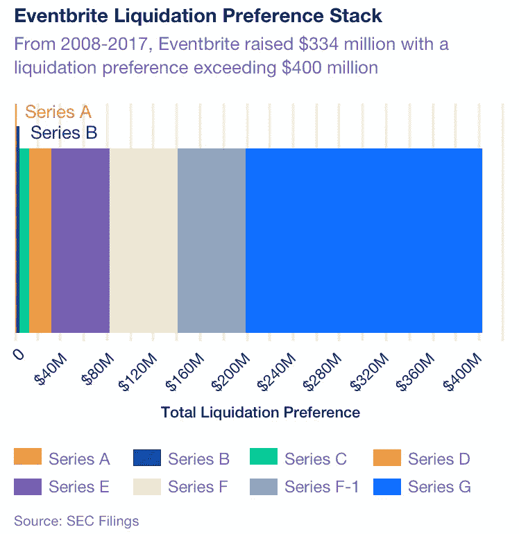

# 清算偏好效应

> 原文：<https://medium.com/hackernoon/the-liquidation-preference-effect-2d3829311ad7>

## 你的股权可能价值数百万，也可能分文不值

Illustration by [Meredith Miotke](https://www.mlmiotke.com/)

2014 年，移动安全初创公司 Good Technology 估值 11 亿美元。员工们认为他们的股票组合就像中了彩票。他们错了。

一年后，货物以 4.25 亿美元售出。员工股价从每股 4.32 美元暴跌至 0.44 美元。虽然[的高管赚了数百万](https://www.nytimes.com/2015/12/27/technology/when-a-unicorn-start-up-stumbles-its-employees-get-hurt.html)，但员工——其中一些人为他们的股权缴纳了超过 10 万美元的税——几乎什么都没赚到。

好技术的情况并不少见。像许多初创公司一样，它的投资者和董事会成员的股权受到高度优先清算权的保护，这是一种保证，他们首先获得报酬，并且在公司出售时至少获得一定的金额。当创业投资者在一次销售中赚了数百万，但钱在到达员工手中之前就用完了，一个糟糕的偏好堆栈通常是原因。

为了避免在你工作的公司被收购时感到惊讶，你需要了解什么是偏好，为什么它们很重要，以及你如何围绕它们进行谈判。

# 什么是偏好堆栈&为什么初创公司需要它们

如果你的股票组合达到了公司的 0.1%，你不应该有权获得收购的 0.1%吗？创业融资没那么简单。

当一家初创公司被出售时，它赚的钱会按照预先确定的顺序支付给股东，**称为“优先堆栈”**按照惯例，员工排在最后，而有清算优先权(LP)的股东排在最前面。

有三个因素会影响清算偏好，了解这些因素可以让你更好地了解谁在何时获得多少报酬:

*   **倍数:**这决定了投资者将获得多少报酬。1 倍的倍数——中期公司的标准——保证投资者可以收回 100%的资金。更高的倍数在后期公司中变得更加普遍。
*   **优先级别:**这是投资者在优先级别中的位置。大多数独角兽都有一个“同等权益”的结构，即所有有清算偏好的投资者都同时获得报酬。然而，在 2015 年至 2016 年间，给予后期投资者“优先”优先权的交易增加了 60% ,这意味着他们首先获得报酬。
*   **参与:**有两种。在标准的“非参与”偏好中，拥有 1 倍倍数和 10%所有权的投资者选择获得其投资的 1 倍或 10%的收购价格。在“参与”偏好中，投资者两者都得到*。*后一种安排很少见——截至 2014 年，只有 [31%](https://www.wsgr.com/publications/PDFSearch/entreport/1H2014/private-company-financing-trends.htm) 的交易包含参与优先权，而且它们通常包含支付上限。

一家公司筹集的融资越多，它的偏好就变得越复杂。Eventbrite 就是一个很好的例子。在 8 月份提交 IPO 申请时，该公司有八类优先股，平均为[股](https://www.gsb.stanford.edu/insights/silicon-valleys-unicorns-are-overvalued)股。虽然 Eventbrite 的 A 系列通过 F-1 以 1 倍的倍数增长，但其 G 系列以 1.5 倍的倍数增长，由此产生的清算偏好是巨大的:

虽然大规模的优先购买权最终可能意味着在一次出售中流向员工的钱会更少，但它们的存在是有充分理由的:清算优先给投资者提供了他们进行创业公司赖以发展的高风险投资所需的保护。

想象一下，一位投资者向一家只有八个人的年轻公司投资 300 万美元。作为回报，投资者获得公司 20%的股份。两位联合创始人持有公司 70%的股份，另外 10%在六名员工之间平均分配。

如果该公司在两个月后以 500 万美元的价格出售，则支出将如下所示:

*   投资者的 20%将价值 100 万美元
*   每位联合创始人的 35%股份价值 175 万美元
*   每个雇员的 1.66%价值 83，333 美元

创始人成了百万富翁，每个员工都获得了分红，但投资者*损失了*200 万美元。如果有 1x 清算优先权，投资者将保证获得 300 万美元的回报。

# 清算偏好如何控制员工权益

想象一下，你得到了你梦想中的工作。这家初创公司发展迅速，媒体一直称赞它是未来的独角兽。该公司提供给你一个相当于 0.15%的股权组合。太棒了，对吧？

好吧，这笔交易的好坏取决于公司的偏好。如果初创公司持有大量的优先选择权，那么你的 0.15%可能就没什么价值了。假设公司的资金历史如下表所示。这是一个非常简单的模型，但您可以看到偏好总量是如何逐轮累积的:

种子期 100 万美元 1 100 万美元 A 系列 600 万美元 1 700 万美元 B 系列 2500 万美元 1.25 3825 万美元

为了更好地理解偏好如何影响员工支出，请看下表。它根据初创公司的销售价格跟踪你的股权组合的最终价值:

0.15% $75,000,000 $5,000,000 $105,000 0.15% $75,000,000 $25,000,000 $75,000 0.15% $75,000,000 $50,000,000 $37,500 0.15% $75,000,000 $100,000,000 $0

基本的数学很简单:为了让你的股票有价值，你的公司的出售价格需要达到或超过其优先股的价值。创业公司筹集的资金越多，就越难获得足够高的收购价格。

正如斯坦福大学教授 Ilya Strebulaev 在一项研究中指出的那样，“一些独角兽公司对他们的优先股股东做出了如此慷慨的承诺，以至于他们的普通股(员工得到的股份)几乎一文不值。”

# 如何询问您的偏好堆栈

作为一名员工，你无法影响创业公司的偏好。然而，你可以理解你面对的是什么。当你在考虑一份工作时，甚至一旦你被录用了，有三个问题你应该问你的雇主:

*   "我们最近的估价是多少？"
*   "我们目前的年增长率是多少？"
*   "公司需要卖多少钱我的股票才有价值？"

如果你最近的估值接近或超过了需要的出售价格，你的股权要约就有价值。不过，如果所需的售价远高于该公司的最新估值，你就要考虑了:根据它目前的增长率，你需要坚持多少年才能让它的价值接近所需的售价？你愿意投资那么多时间吗？

股权本身不应该决定你是否加入一家初创公司。一份高薪，一个巨大的发展机会，或者一个你充满激情的使命都可以弥补一份适度的股权。重要的是对你的股票能变成多少钱有一个现实的预期。

*最初发表于*[T5【angel.co】](https://angel.co/blog/liquidation-preference-your-equity-could-be-worth-millions-or-nothing)*。*