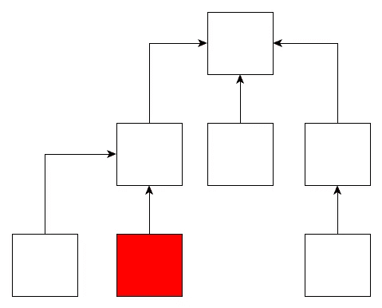

# 利斯科夫替代原理——以及为什么你可能想要实施它

> 原文：<https://medium.com/hackernoon/the-liskov-substitution-principle-and-why-you-might-want-to-enforce-it-6f5bbb05c06d>



这可能是 5 个坚实原则中最技术性的一个，我想也是最少有人考虑的一个。然而，它确实对设计面向对象软件有一些重要的影响。

这种非常正式的表达方式于事无补:

> 设φ(x)是关于 t 类型的对象 x 的一个可证明的性质，那么φ(y)对于 S 类型的对象 y 也应该成立，其中 S 是 t 的子类型。

芭芭拉·利斯科夫和珍妮特·温在 1994 年的一篇论文中写道。

这条规则帮助我们在编写抽象代码时避免微妙的错误。看一个例子会更容易理解这一点。

```
public abstract class ApiConnection
{
  public abstract T[] ReadData<T>(Filter filter);
}public class SimpleApiConnection : ApiConnection
{
  public virtual T[] ReadData<T>(Filter filter)
  {
    ... gets data from api ...
  }
}public class TokenAuthApiConnection : SimpleApiConnection
{
  private object authToken; public virtual void GetAuthToken(string tokenUrl)
  {
    ... gets auth token ...
    this.authToken = authTokenFromApi;
  } public override T[] ReadData<T>(Filter filter)
  {
    ... get data using this.authToken ...
  }
}
```

这里有三个类:抽象的`ApiConnection`类，因为它没有代码，除了类型签名之外没有其他属性。因此，关于这个类的“可证明的属性”只是关于它的类型的属性，编译器知道这些属性并对它的继承者实施。所以我们可以确定继承人也有这些属性。

然后我们上课。这是由`TokenAuthApiConnection`继承的。我们可以说`ReadData()`方法不需要在它之前调用任何其他方法来避免抛出异常。这是一个关于`SimpleApiConnection`的‘性质可证’。然而`TokenAuthApiConnection`类*不要求*在`ReadData()`之前调用`GetAuthToken()`方法，否则连接不会成功。因此，利斯科夫替代原理被破坏了。

这是什么意思？这意味着任何使用`SimpleApiConnection`并依赖于能够安全调用`ReadData()`的代码，如果在调用该代码时进行了编译器允许的对`TokenAuthApiConnection`的替换，将会中断。该代码不能调用`GetAuthToken`，因为它在`SimpleApiConnection`上不存在，所以`TokenAuthApiConnection`替换永远不会工作，因为调用永远不会被认证。

这是一个非常明显的违规，但是它们导致错误的方式可能更加微妙和阴险。

# LSP 允许我们可靠地使用多态性

如果我们可以依赖 LSP，它允许我们在代码中使用*多态性*。

维基百科有一篇关于多态性的好文章。我们正在讨论 LSP 上下文中的*参数*或*子类型*形式的多态性。多态是避免代码重复的一个重要方法，因为它允许你最大化你所写代码的通用性。在 LSP 定义的语言中，您希望编写代码，根据代码正在处理的对象的可证明属性提出最低要求。

当我们编写一个接受参数 T 的函数时，多态性允许我们使用 T 或 T 的任何子类型作为参数。这意味着，如果我们定义一个类型或接口 T，它表达了我们需要知道的关于我们的参数的最少信息，以便函数能够使用它，我们就可以编写一个尽可能广泛适用的函数。例如，您希望从人员列表中构建一个 HTML 选择列表:

```
public SelectList MakeSelectList(IEnumerable<Person> people)
{
  var selects = new SelectList();
  foreach (var person in people)
  {
    selects.Add(person.Id, person.Name);
  }
}
```

很明显，您可以使这个函数更通用，因为它不仅仅可以对人进行操作。所以现在我们创建一个接口来表达我们的参数的最小约束:

```
public interface INamedEntity
{
  int Id { get; set; }
  string Name { get; set; }
}public SelectList MakeSelectList(IEnumerable<INamedEntity> entities)
{
  var selects = new SelectList();
  foreach (var entity in entities)
  {
    selects.Add(entity.Id, entity.Name);
  }
}
```

这里的问题是我们期望从选择列表中得到某些东西，所以在关于`IEnumerable<INamedEntity>`的“可证明属性”上有隐含的约束，而这些约束在这段代码中并没有强制执行。你能看出它们是什么吗？如果你想试试，就暂时停止阅读吧！

选择列表要求列表中的每一项不仅 Id 是唯一的，名称也是唯一的。否则，用户会看到多个看起来相同的选择列表项，这显然是错误的。这就引出了如何执行 LSP 的问题。

# 强制执行 LSP

当我们到了依赖倒置的时候，我们会发现我们建议在核心代码中使用抽象来使客户端代码提供它应该使用的依赖。通常在大型面向对象语言中，这是通过接口或抽象类来完成的。然而，正如我们所看到的，我们的核心代码很可能会隐含地依赖于我们抽象的“可证明的属性”,而这些属性并没有在具体的实现中强制执行。

那是自找麻烦。客户端代码可能会引入一些会破坏我们核心代码的实现，处理那些可能会在没有经过深思熟虑的情况下产生的错误会非常棘手。

除了确保预期的字段、属性和方法存在之外，主流语言缺乏实施 LSP 的能力。在我的专业里。Net 中，有一个特性叫做[代码契约](https://docs.microsoft.com/en-us/dotnet/framework/debug-trace-profile/code-contracts)，它允许为方法指定前置条件和后置条件。这些在最坏的情况下会捕捉到运行时的一致性问题，静态代码分析可以突出违反这些条件的情况，这些情况可以在运行前检查出来。

我们的选择列表示例的修复如下所示:

```
public SelectList MakeSelectList(IEnumerable<INamedEntity> entities)
{
  **Contract.Requires(entities.GroupBy(e => e.Id).Count() == entities.Count() && entities.GroupBy(e => e.Name).Count() == entities.Count());**
  var selects = new SelectList();
  foreach (var entity in entities)
  {
    selects.Add(entity.Id, entity.Name);
  }
}
```

有些复杂的“Requires”表达式只是检查没有重复的“Id”或“Name”值。你可以在这里找到一篇关于实现这个[的好文章](https://colinmackay.scot/2014/04/20/using-contracts-to-discover-liskov-substitution-principle-violations-in-c/)。

处理这个问题的另一种方法是编写一组单元测试，它可以应用于在客户端代码中创建的任何类，以确保它不会破坏它所注入的核心代码。[这篇文章](https://blog.caplin.com/2010/09/30/a-junit-trick-for-ensuring-solid-design/)有一个很好的技巧，你可能会用到。

这是关于固体原理的系列文章之一。上一个开/关原理是 [*这里是*](https://hackernoon.com/why-the-open-closed-principle-is-the-one-you-need-to-know-but-dont-176f7e4416d) *。下一个界面上的隔离原则是* [*这里的*](/@jim_ej/the-interface-segregation-principle-its-confused-aa856de97d36) *。*