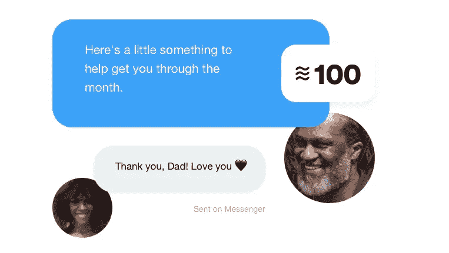
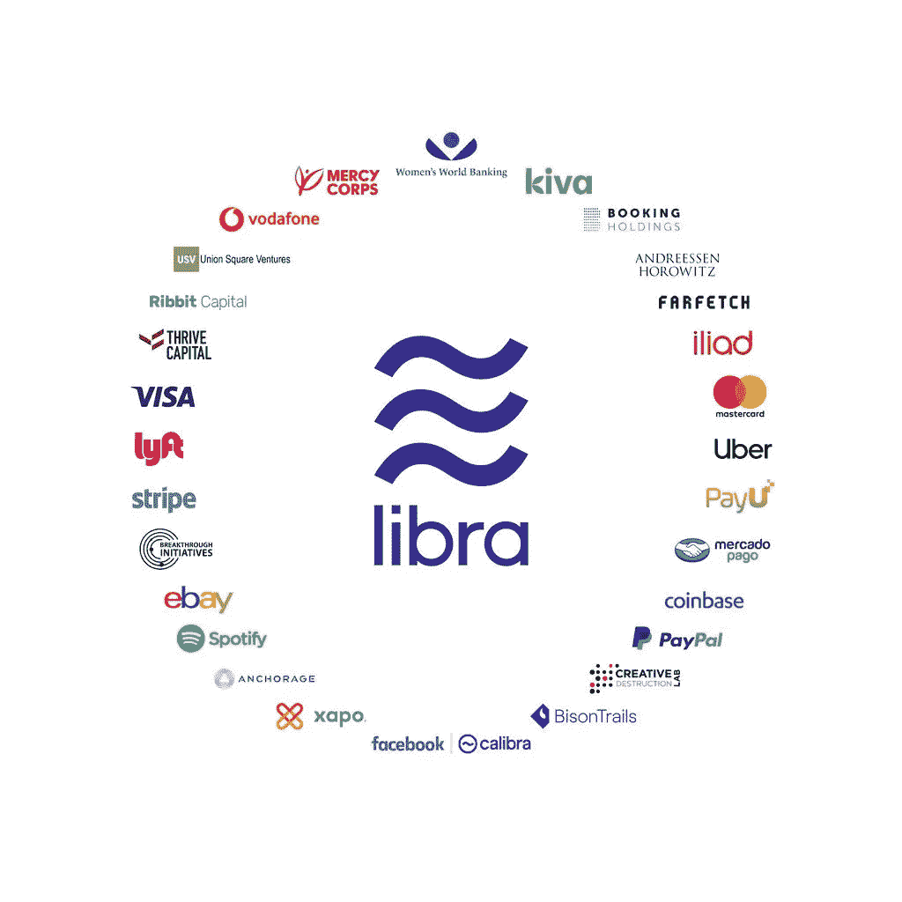
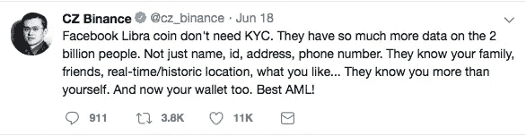

# 脸书天秤座的主要特征及其对密码产业的影响

> 原文：<https://medium.com/hackernoon/the-main-features-of-facebooks-libra-and-how-it-can-impact-the-crypto-industry-f80322a61023>

本周加密行业讨论最多的话题是脸书官方宣布发布自己的加密货币和生态系统，名为 **Libra** 。

有传言称，这家 IT 巨头正在准备一个区块链和加密货币解决方案，为其用户群*(目前超过 20 亿人)*提供服务。然而，今年迄今为止的大部分时间里，更大的故事是关于另一个通信巨头——在许多方面是脸书的竞争对手——区块链和电报信使的硬币 TON，预计也将于 2019 年公开推出。

但是在 2019 年 6 月 18 日，马克·扎克伯格亲自[发表了一篇帖子](https://www.facebook.com/zuck/posts/10107693323579671)，他在其中展示了一种名为 Libra 的加密货币，这不仅迫使加密社区，而且迫使整个世界都在谈论它。

当然，在接下来的几个月里，会有很多关于天秤座技术面的详细分析出来。在本文中，我打算考虑 Libra 的主要组成部分，然后讨论这个事件对于区块链和加密货币的普遍采用是如何有用和必要的。

Facebook’s Libra

那么，天秤座的主要特征是什么，目前已知的有哪些:

**1。加密货币和钱包**

脸书不仅宣布了 Libra 加密货币的诞生，还宣布了用于存储和使用的在线钱包。钱包开发计划在 2020 年进行。

一旦推出，将有可能通过特殊应用程序或直接从 Facebook Messenger 和 WhatsApp 使用 Calibra 钱包。

**2。主要目标**

该项目的主要目标是让那些尚未获得基本金融服务的人获得这些服务。这可以解决几个大问题:

*   地球上几乎一半的成年人没有活跃的银行账户。
*   世界各地的移民在国际汇款费用上花费大量金钱。
*   发展中经济体的小企业通常无法获得信贷。

**3。稳定的加密货币**

天秤座事实上是一个稳定的星座。它将由自己的储备支持，包括可靠的法定货币。据 Techcrunch 报道，预计它的起价约为 1 美元。

**4。工作原理**

当用户用他们的国家货币购买时，Libra 的每个单位都会被创建。在相反的情况下，当天秤座被换成菲亚特时，天秤座将被烧毁(即永久退出流通)。这意味着每一单位的货币都将真正得到储备中更多有形法定货币的支持。与此同时，Calibra 钱包将使任何人在出售 libra 后，通过将它发送到 PayPal 或银行账户，重新获得他们的法定货币的监护权。

**5。天秤座协会**

加密货币将由一个非营利组织 Libra Association 管理，该组织总部将设在瑞士日内瓦。脸书将只是该协会的参与者之一，预计不会对该协会做出的关于天秤座区块链和生态系统的未来的关键决定拥有多数控制权。

**Libra Association**

目前，该协会有 **27 个成员**(上图)，包括万事达卡、Visa、PayPal、易贝、优步、比特币基地、几家风险公司，以及非营利和科学组织。在启动时，假设协会中将有 100 个独立参与者。公司必须出资至少 1，000 万美元并满足特殊要求才能加入。拥有如此多的协会成员，保证了每个参与者不能控制超过 1%的投票。

**6。BFTсonsen sus**

该系统将有一个 **BFT(拜占庭容错)共识**机制，预计它将推出 100 个验证器——最终可以增加到 500-1000 个。

在 BFT 系统中，75%的验证者必须同意改变资产负债表的状态，以使改变发生。

**7。猜测**

没必要为了潜在的发财而买天秤。天秤座由稳定的资产储备支持，这意味着它不会有太多的投机价值。

**8。天秤座钱包怎么设置？**

脸书用户将有可能通过 KYC 程序建立一个 Libra 钱包——用官方文件在线验证他们的身份。

与 Libra 合作的其他公司将能够验证他们自己的客户。脸书说，这个过程将对世界上几乎任何地方的人开放。

*可以在天秤座官方白皮书了解更多详情:*[*https://libra.org/en-US/white-paper/*](https://libra.org/en-US/white-paper/)

# 这对密码产业意味着什么

区块链和金融界的主要影响者对天秤座有些模糊不清。

不足为奇的是，密码行业的许多德高望重的人显然已经注意到了脸书的想法。例如，币安的负责人 CZ 在推特上写道:

Binance’s CEO on Libra

然而，短语**“大规模采用”**(即个人、公司和机构对加密货币的全球使用)在加密世界中经常听到，在这一声明之前，这似乎是一个遥远的梦想。事实上，加密行业之外的大多数人仍然只在表面上知道什么是加密货币，并且经常对它有严重的误解。通过 Facebook Messenger 或 WhatsApp 获得使用 crypto 的实践经验可以很快改变这种情况。

与天秤座一起，许多人将很快开始学习使用加密货币及其促进经济增长的优势。最重要的是，这一概念甚至可能扰乱央行，因为这将是一种全球中央货币，数十亿人可以轻松购买并在智能手机上持有。

没错，天秤不是比特币，本质上属于人民。这是一种稳定的货币，事实上，是一种企业加密货币——显然不是去中心化的。然而，这可以为整个行业的增长提供巨大的推动力。

> *你可以在我的* [*电报频道:*](https://t.me/sellmetokens) [*卖给我这个令牌*](https://t.me/sellmetokens) *，以及我的* [*中博客*](/@baloyan) *上找到更多来自密码行业内部的消息、想法和见解。*

***评论你对天秤座的看法，以及这种脸书货币是否有助于普遍采用加密货币？***