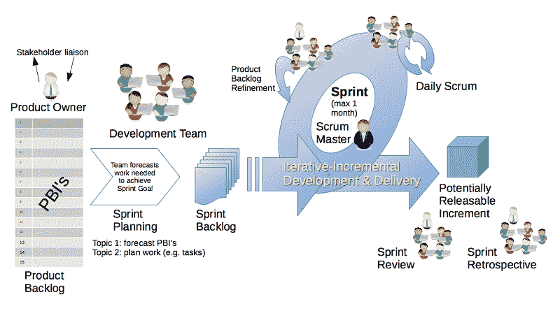
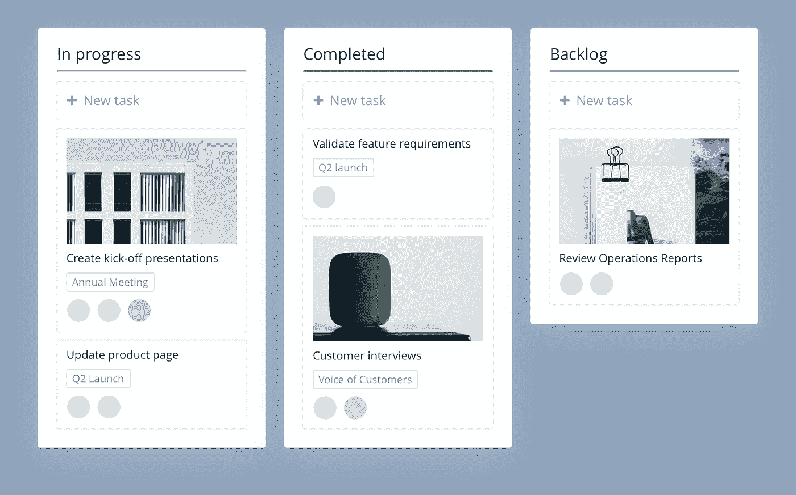

# 关于 SCRUM 方法论的主要误解[包括定义]

> 原文：<https://medium.com/hackernoon/the-main-misconceptions-about-scrum-methodology-b8f73a2fef04>

## 在我们在 [Relevant](https://relevant.software/) 软件开发公司工作期间，我们注意到一些误解和神话，这些误解和神话会吓跑那些决定在项目中实施 SCRUM 敏捷方法的高层管理者。

我决定收集和打破最大的。但在此之前，让我们提醒自己什么是 SCRUM 方法论。

Photo by [Geoff Scott](https://unsplash.com/@gscott16?utm_source=unsplash&utm_medium=referral&utm_content=creditCopyText) on [Unsplash](https://unsplash.com/search/photos/american-football?utm_source=unsplash&utm_medium=referral&utm_content=creditCopyText)

# SCRUM:这是什么？

SCRUM 描述的第一种方法是竹内广孝和野中郁次郎，他们注意到由多样化专家组成的小团队(5-9 人)能给出最好的结果。Jeff Sutherland 在《SCRUM》一书中首次对 SCRUM 进行了最完整的描述，他在书中定义了什么是 SCRUM 方法论。

> 从根本上说，Scrum 是基于一个简单的想法:无论何时你开始一个项目，为什么不定期检查，看看你正在做的事情是否朝着正确的方向发展，以及它是否真的是人们想要的？问一问是否有任何方法可以改进你正在做的事情，是否有任何方法可以做得更好更快，以及什么可能会阻止你这样做。
> - [杰夫·萨瑟兰](https://medium.com/u/1612936bed4e?source=post_page-----b8f73a2fef04--------------------------------)

杰夫开始了他的军事飞行员生涯。在越南战争期间，他出动了一百多架次。然后 Jeff 从事了科学，但是世界会记得他是 SCRUM 敏捷方法论的创始人之一。

这本书以一个真实的故事开始，这个故事来自于联邦调查局的生活，他们花费了数百万美元来开发一个自动系统来搜索和追踪罪犯。问题是，当项目即将到期时，承包商向 FBI 展示了一个完全不活跃的产品。这只意味着一件事——美国纳税人白白花费了数百万美元。在 FBI 领导层转向当时新兴的项目管理方法 SCRUM 之前，情况似乎毫无希望。这种方法在前面提到的书中用通俗易懂的语言进行了描述。

Image via [Wikimedia Commons](https://commons.wikimedia.org/wiki/File:Scrum_Framework.png)

# 关于 SCRUM 方法论的主要误解

## 1.扼杀创造力的完全控制

在 SCRUM 中，项目团队决定如何实现业务目标，而不是管理层。这种方法激发和刺激创造力，与传统管理相反，传统管理委派员工执行具体的低层次行动。在第二种情况下，员工通常甚至不理解他们为什么要做某项任务，以及它将如何影响整个项目。

因此，在 SCRUM 中，管理层并不控制项目团队的行动，在每个冲刺阶段(一个预先确定的时间段，例如，2 周)结束时会有结果报告。

SCRUM 的主要特点是团队的透明性。是如何实现的？首先，通过每日站立会议，所有团队成员讲述他们昨天做了什么，今天将做什么，他们当前面临什么问题(障碍)。我们在 *Relevant Software* 不会错过单口相声，因为它们帮助每个团队成员消除工作中的障碍，并让同事投入到他们的计划中，以便每个人都了解项目今天的进展，并意识到它在产品开发中的作用。出于同样的目的，我们在吉拉使用 SCRUM board，每个人都可以看到每个团队成员的任务。

也就是说，我们看到 SCRUM 是一种灵活的方法，而不是控制和激发创造力。

## 2.SCRUM 剥夺了最有经验的工程师的权利，因为他们服从团队的决定

SCRUM 创造了一个技能和经验比头衔和职位更重要的环境。相反情况的一个显著例子是军队的等级制度，权力基于职位和军衔。上尉可以比上校更有才华，更博学，但尽管如此，上尉必须严格服从。这种僵化的结构非常适合极端条件，例如战争，在这种情况下，必须迅速做出决定，他们的讨论导致延迟，从而导致人员死亡。

SCRUM 不会取消标题。每个员工都有符合其经验和能力的职位。然而，在讨论决策的过程中，主导因素是清晰合理的立场，以员工在所讨论领域的个人经验为依据，而不是他的头衔。因此，与神话相反，SCRUM 将权力赋予了那些能够提供伟大想法的团队成员，不管他们是不是最有经验的工程师。

## 3.SCRUM 关注短期的商业价值，而不是长期的项目开发

这确实是个问题。幸运的是,“怎么办”这个问题有答案。。我们应该从这样一个事实开始，即这个问题在持续时间不超过六个月的项目中很可能不会出现。

另一件事是当软件被开发了 2-3 年或更长时间。有大量的文章，作者倾诉了他们对此类项目的痛苦。经过 5-10 次冲刺后，添加新功能就成了问题，越往前，情况就越危急。SCRUM 很棒，但是你需要事先考虑策略和架构。幸运的是，您可以避免这种情况。怎么会？

首先，经验丰富的工程师应该在项目中工作，在代码审查期间通过他们自己将所有的提交传递给存储库(在我们公司团队领导就是这样做的)。其次，你应该教你的初级和中级工程师软件架构、设计模式以及如何在现有项目中使用它(每周至少 3 小时)。为了更好地学习，这样的课程应该伴有练习和一小部分家庭作业。实际任务甚至可以嵌入到项目冲刺的待办事项中。这不会对项目的盈利能力产生很大影响，但会加速员工的成长，防止软件架构的潜在问题。定期的会议将允许项目团队互相学习，这不会损害所生产的软件的质量。

## 4.SCRUM 不允许工程师成长

SCRUM 假设所有关于如何实现业务目标的决策都被委托给团队。产品负责人决定做什么，团队决定如何做。团队必须有足够的技能来做出有效的决策。因此，SCRUM 方法论的基石是学习。这就是为什么所有大银行和 IT 外包公司都非常重视员工的成长:培训、研讨会、课程。我们甚至在相关软件做内部讲座。员工的职业成长是 SCRUM 不可或缺的一部分。由于 SCRUM 团队相对较小的事实，团队成员必须掌握他们正在从事的项目中的全部技术。在项目结束时，工程师获得新技能，这增加了其在劳动力市场的价值。

# 奖励:最佳 SCRUM 团队管理工具

Screenshot from [Wrike.com](https://www.wrike.com)

1.  吉拉:我们在大多数情况下都会使用这个软件。它特别设计了 SCRUM 板、各种报告、时间跟踪、冲刺和积压管理、仪表板。
2.  [箭牌](https://www.wrike.com)没有吉拉那么受欢迎，但是，它几乎拥有的功能。此外，还有定制的自动化工作流和资源管理工具。
3.  [Asana](https://asana.com/) 有很棒的 SCRUM 特性，比如看板、项目时间表、待办事项管理、会议管理、依赖、里程碑跟踪、评论和文件附件。

# 结论

在这篇文章中，我试图打破人们对 SCRUM 的普遍误解。让我们再看一遍正确的陈述:

1.  SCRUM **不是**关于完全控制，也不会扼杀创造力。
2.  它不会像每个人一样剥夺最有经验的工程师的权利，即使是在集体讨论解决方案的时候。
3.  如果有策略和架构模式，SCRUM **可以**用于长期项目。
4.  这种敏捷方法**支持**工程师的成长。

希望现在你不那么害怕在你的公司里实施这种方法。

如果你正在寻找一个可靠的敏捷软件开发团队，[给我们写信](https://relevant.software/contact-us/)。