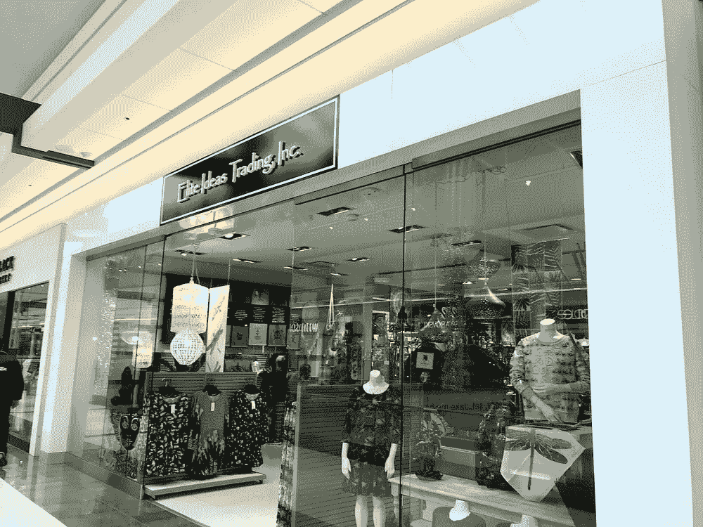
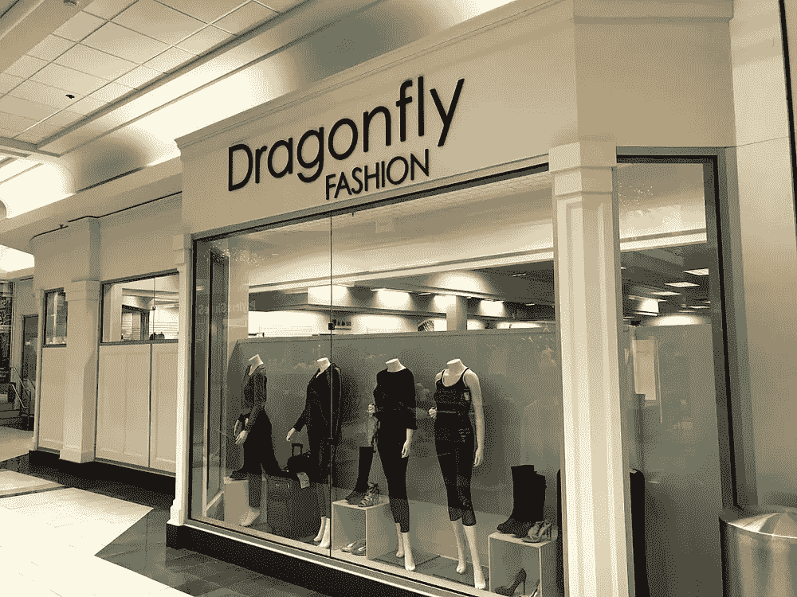
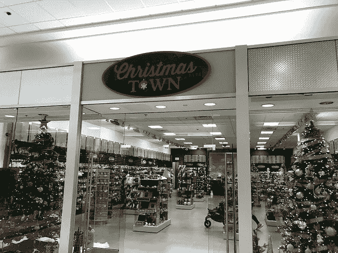
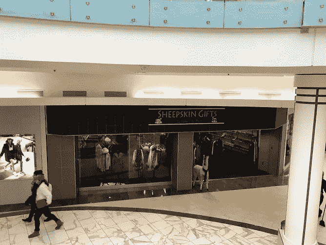
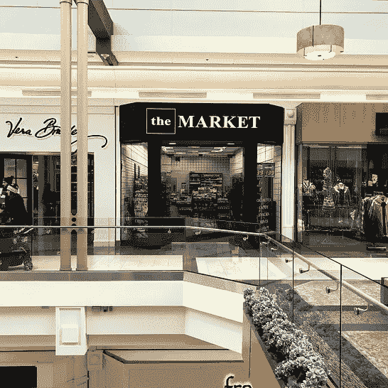
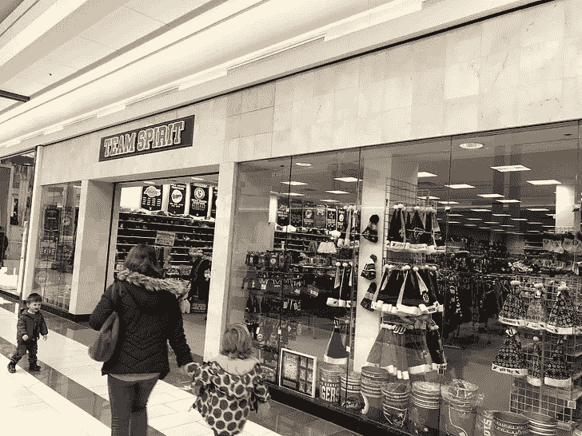
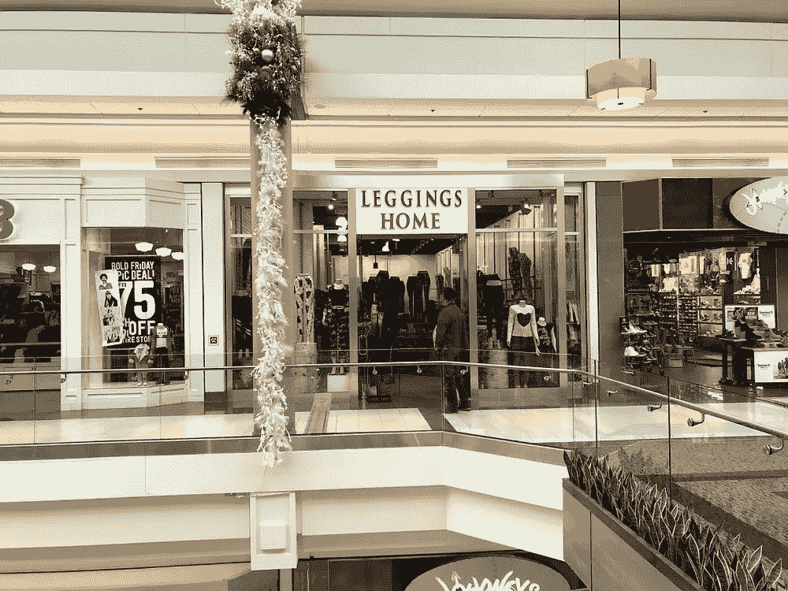
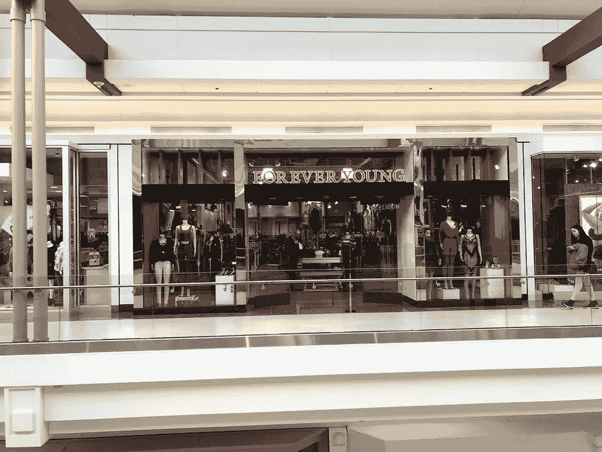

# 耻辱的购物中心

> 原文：<https://medium.com/hackernoon/the-mall-of-shame-5c9de67df34>

新罕布什尔州塞勒姆市罗金厄姆公园的购物中心是 100 万平方英尺的零售中心，包括 144 家商店、餐馆和售货亭。它绝不是美国最好的购物中心，但就在 2015 年，它还是西蒙地产集团(Simon Properties Group)投资组合中按平方英尺计算的[最卖座的地产](https://en.wikipedia.org/wiki/Mall_at_Rockingham_Park)，这要归功于它在马萨诸塞州边境上充当销售税避税天堂的角色。中产阶级的主食，如威廉姆斯&索诺马、蔻驰、Lush 和一家苹果店(以及必去的美食街 Sbarro)帮助占[18 亿美元的年销售额](https://www.eagletribune.com/news/rock-solid/article_a3fcf742-b175-5b7c-8e57-03e83aaca229.html)。

但是在这个看似健康的资本主义大教堂里，有一种奇怪的趋势在起作用。制作精美的销售装置正被板条墙所取代。曾经被 Landor 和 Pentagram 的创意人员弄得焦头烂额的商店标识，正被 PowerPoint 中的符号所取代。精心布置的模特照片正被混杂的二手人体模型所取代。

据我统计，108 家店面中有 11 家(不包括餐馆和售货亭)现在由独立经营者经营。夫妻创业没有错，但这些商店里的许多产品似乎来源可疑，一些商店(如圣诞镇)的承诺肯定很短，品牌也很平庸。目前，这些独立品牌占据了 10%的店面，但有人想知道，当这个购物圣地开始变得更像一个奢华的交换场所时，会发生什么？

**在“夫妻店”的零售市场中，有百分之多少的购物中心，即使是像这样成功的购物中心，对仍在推动其大部分销售的商店来说，变得没有吸引力了？**

行业出版物讲述了一个[稳定行业](https://www.pymnts.com/news/retail/2018/simon-malls-shopping-centers/)的故事，它正在取代西尔斯，提供更多的体验式服务，如水疗。酒店甚至公寓正在占据消失的零售商腾出的一些空间。但是推测你最喜欢的肉桂卷旁边会弹出什么是很有趣的。以下是我在逛当地商场时遇到的四个问题:

# 迷你主播什么时候离开？

在什么情况下，苹果公司决定不值得在一家破旧的紧身裤店和一家有可疑许可的运动用品商场之间来回奔波？

迈克高仕被安排在一家卖羊皮(和羊驼毛)拖鞋的商店旁边，感觉如何？对于《天桥风云》的粉丝来说，[不难猜](https://www.popsugar.com/fashion/photo-gallery/35435881/image/35435894/Comme-des-Garcons-Goes-Amish-Country)。

这些高端商店什么时候会转向“生活方式中心”或其他零售解决方案？如果一些摇钱树离开去了更绿的牧场，会不会引发死亡螺旋？人们认为购物体验将限制电子商务的最终 TAM，但如果高端光泽消退，为什么要离开你的沙发呢？

# 这是科技创业公司的机会吗？

这些业务缺乏全国性零售商的规模和复杂性，但他们需要销售工具、营销支持和一系列其他服务。Square 和 Shopify 可能会填补这一空白，但是否有针对小规模面对面零售优化的新解决方案尚未开发出来？也许这些迷你品牌中的一些会解开在后亚马逊世界繁荣的秘密并走向全国？

# 从快速时代到黄金时代？

随着在里奇蒙高中(Ridgemont High)看《T2 时光》长大的一代人进入《T4 黄金女郎》(Golden Girls)时代，我们会看到购物中心成为老年人的全方位服务娱乐中心吗？他们已经把它们作为低调的健身房，也许听力学家、矫形鞋和 CPAP 小贩将开始填补这些空置的店面，以迎合这群更成熟的野猫？无论是老年人还是初为人父母者，更完全地迎合特定人群可能是与“百货店”竞争的一种方式。

# 新一代零售会出现吗？

也许这只是生活循环的一部分，DNVBs 将利用租金下降的优势，帮助橙色朱利叶斯的家园带来一点魅力？也许多层次营销公司利用这些空间作为陈列室，出租给他们的合作伙伴？虽然一些购物中心将不可避免地永远关门，但聪明的企业家肯定会找到这些空间的用途。

你认为未来十年购物中心的支柱是什么？

[*约瑟夫·弗莱厄蒂*](https://twitter.com/josephflaherty) *是* [*的内容总监&社区创始人集体*](http://www.foundercollective.com/) *，一家种子阶段的风险投资公司，已经投资了优步、BuzzFeed、PillPack、SeatGeek、Cruise、HotelTonight、The Trade Desk，以及* [*许多更多优秀的创业公司*](http://www.foundercollective.com/collective) *。*