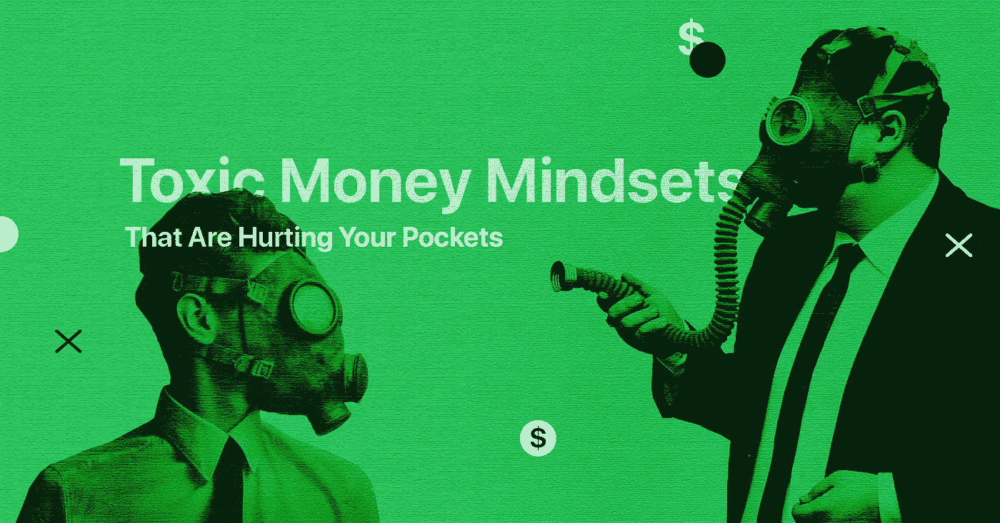

# 让你贫穷的心态

> 原文：<https://medium.com/hackernoon/the-mindsets-that-keep-you-poor-3dac62195c9d>

## 当然，还有‘解药’。

当你想到“钱”的时候，你会想到什么？昨晚的晚餐？你打算买的车？信用卡账单？可能是抵押贷款？当你想到钱的时候，除了所有潜在的财务压力或里程碑，还有另一种成分总是会出现在派对上——情绪。

无论是紧张、兴奋还是焦虑，有一点是肯定的:金钱会带来巨大的情感负担。然而，我们中的绝大多数人保持着严格的分析方法，与电子表格作斗争，试图从我们的预算中创造奇迹，并且在大多数情况下未能实现我们的财务目标。

当然可以。做数学对于确保繁荣的未来非常重要。但这还不是全部。控制你的思想和情绪也是这个等式的重要部分。

为了融入健康的金钱习惯和行为，你对金钱的心态应该是成功的，而不是让你被困在恐惧、惰性和匮乏中。下面你可以找到最常见的有害金钱心态和简单的补救方法，让它们变得对你有利。

# 不，钱不是你的目标

信不信由你，你看待金钱的方式对你的财务有影响。一个常见的错误是认为它是目标，而不是工具。

你可以说“我的目标是存 10，000 美元”或者“我的目标是为某个特定的课程存钱”。把钱当成一种工具，带你到达你的财务目的地，减轻了为了到达目的地而储蓄或做出牺牲的负担。

当你把总数抛在脑后，用文字来表达你的最终目标时，你会更容易看到你的储蓄和兼职是如何推动你实现这些目标的。

# “只有‘有钱’的人才会存钱”

说到储蓄……那些刚开始职业生涯的人往往会陷入这种自我强加的思维陷阱:除非你有六位数的薪水，否则不可能储蓄。听起来很熟悉？

这只是一个不省钱的借口，简单明了。无论你现在的工资水平如何，总有储蓄的空间。如果你的工资很低，没人指望你能存一半。找到一个舒适的每月储蓄水平，最重要的是，坚持下去。即使这意味着要拿乔治·华盛顿当挡箭牌。

另一个轻松增加储蓄的好策略是在你的一生中保持不变的生活方式。当然可以。你可以调整一下，让生活更舒适。毕竟那是你的权利。但是每次加薪的时候都去疯狂购物并不是明智的财务选择。

# 极度节俭对你没有帮助

说到有效的资金管理，控制你的支出是至关重要的。但这并不意味着你必须只买身边最便宜的东西。让我们举一个例子。

想象一下，你需要一件新 t 恤。如果你遵循极端节俭的原则，那么你会比较所有的价格标签，选择市场上最便宜的。但是质量呢？那件 t 恤能穿一个多月吗？

多花 20 美元可以买到一件质量更好、更耐穿的 t 恤，而不是每四周就要更换一次的 t 恤。同样的逻辑也适用于你生活中的几乎任何开销。再说一遍，这并不是说要选择“奢侈”的东西，而是“高质量”的东西。

# “信用卡已经支付了”

你有没有去过一个电器商店，发现自己盯着一台崭新的巨型电视看了几分钟，然后想…'这完全是我应得的'？你不是一个人，我们都有这样的时刻。但残酷的事实是:如果你没有存钱，你可能买不起。你是做什么的？三个选项:

*   愁眉苦脸地走出商店，给自己买一个安慰性的冰淇淋，存上几个月的钱，然后回来买电视机。
*   戴上前总统的面具然后偷走它。不要那样做！
*   打开你的钱包，拿出你的“闪亮”信用卡，刷一下，嘣！你有一台新电视可以用来观看《权力的游戏》最终季。

你需要停止告诉自己你应该得到你买不起的东西。虽然信用卡可能是满足一时冲动的一种方式，但从长远来看，它们也会让你支付高额利息，从而损害你的钱包。

与其赊账购买消费品，不如提前存些钱以后犒劳自己。如果信用卡是你应对计划外支出的唯一解决方案，那么确保你选择的是市场上最低的利率。

对于密码持有者来说，一个很好的选择是密码支持贷款，如 [C-LEVER](https://c-lever.com/) ，它提供以稳定币发行的即时个人贷款，利率为 0.5%，期限长达 12 个月。

# 预算不适合我

预算是指建立一个如何花钱的计划的过程。预算有助于你保持个人财务在正轨上，避免超支，并确保你留下一些钱用于储蓄。

虽然预算的好处显而易见，但大多数人仍然认为它“太复杂或无聊”，无法在日常生活中实施。但是预算不再像照片银行的照片显示的那样…你知道，那个手里拿着计算器坐在餐桌旁的家伙。如今，你可以用一个应用程序点击几下就能创建一个预算。

甚至那些使用数字货币进行日常支出的人现在也有了像 [Crypterium](http://crypterium.com) 这样的选项来跟踪他们的加密借记卡支出和应用内交易。总的来说，找到最适合你的工具，资金管理就会变得容易得多。

# 底线

你和金钱的关系不一定是一场斗争。摆脱糟糕的金钱心态会让你从阻碍你财务成功的态度和感觉中解放出来。如果这是你第一次听说他们，你没有什么可担心的。正如本杰明·富兰克林曾经说过的那样:对知识的投资回报最高。

## 关于[地穴](https://medium.com/u/3c3059b00067?source=post_page-----3dac62195c9d--------------------------------)

根据毕马威和 H2Ventures 的说法，Crypterium 是最有前途的金融科技公司之一。我们正在打造一款移动应用，以满足数字资产时代的银行需求。

我们的目标很明确:有了 Crypterium，无论你用传统货币做什么，你都可以用数字资产来做。这个想法得到了 TechCrunch 联合创始人 Keith Teare 和超过 40 万注册用户的支持，而且这个数字还在与日俱增。

该团队由前 Visa 中欧和东欧总经理 [Steven Parker](https://medium.com/u/d5786b203ba6?source=post_page-----3dac62195c9d--------------------------------) 和来自全球金融机构的高管领导，如复兴保险、伦敦衍生品交易所、美国运通等。

加入我们的[电报新闻频道](https://t.me/crypterium_en)或其他社交媒体，了解最新动态！

[网站](http://crypterium.com/) ๏ [电报](https://t.me/crypterium) ๏ [脸书](https://www.facebook.com/pg/crypterium.org) ๏ [推特](https://twitter.com/crypterium)๏[Reddit](https://www.reddit.com/r/crypterium_com/)๏[YouTube](https://www.youtube.com/channel/UChl-t3ilQK9mKj0jgXCdaxA)๏[LinkedIn](https://www.linkedin.com/company/crypterium/)