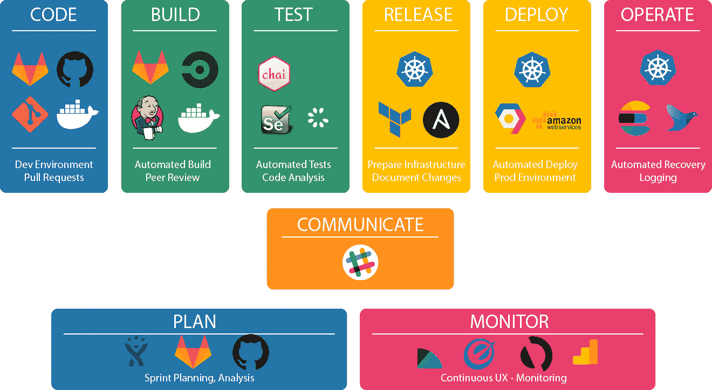

# 软件开发生命周期进化中缺失的一环。

> 原文：<https://medium.com/hackernoon/the-missing-link-in-the-evolution-of-the-software-development-life-cycle-62fe4778f4d8>

Photo by [Johannes Plenio](https://unsplash.com/@jplenio?utm_source=medium&utm_medium=referral) on [Unsplash](https://unsplash.com?utm_source=medium&utm_medium=referral)

在过去 10 年左右的时间里，我们开发、测试和部署软件的方式一直在突飞猛进。为了简洁起见，也为了不让任何老派开发人员在[打孔卡](https://en.wikipedia.org/wiki/Punched_card)上看到可怕的代码倒叙，我讨论的时间线将集中在过去 11 年(Github 上线的时候)以及我们在管理和部署软件时错过的一大步。

# 目前的流程

我们在现代软件开发中交付代码的方式在大多数地方或多或少是相同的。它归结为一个软件开发生命周期(SDLC)和产品/项目计划，并可以分为以下几个部分。

## 密码

你们使用像 Github、Bitbucket、Gitlab(或者对那些讨厌自己的人来说，SVN)这样的工具协作编码。这允许多个开发人员一致地在一个项目上工作。这一部分我们很熟悉。编码之后，你进入下一步，那就是构建。

## 建设

这一部分也被一些定义明确的过程所锁定。为了确保开发人员可以在本地构建和运行代码，我们有 docker。为了在部署时构建代码，我们使用了 Jenkins、Circle CI、Travis 等工具…

## 试验

根据您的堆栈和测试目标，您的工具可能会有所不同，但归根结底都是一样的。你有你的单元测试、集成测试、UI 测试……你可以使用像 Mockito 这样的工具用于 Java Spring 项目；用于 javascript/typescript 项目的 mocha、chaiselenium 用于 UI 测试，虽然您使用这些工具的方式有所不同，但是我们使用这些工具的动机是相同的。所有这些测试都可以并且应该由您先前定义的构建过程来运行。

## 发布和部署

在你努力工作之后，你的测试都通过了，你的测试覆盖率是 100%(我说的对吗😉)好玩的部分开始了。你可以发布和部署你的代码。虽然在此之前，我们曾经有过“[集成地狱](https://www.solutionsiq.com/agile-glossary/integration-hell/)”，但现在在集成不同组件方面，我们处于一个相当好的位置。在本文中，无论您是使用 Kubernetes 还是 Rancher 进行编排和容器管理，使用 AWS 还是 GCP 进行基础架构，都没有关系。关键是你的代码是活的，用户在使用它并且喜欢它。

Image from [https://hackernoon.com/delivery-pipelines-as-enabler-for-a-devops-culture-ebc45963f703](https://hackernoon.com/delivery-pipelines-as-enabler-for-a-devops-culture-ebc45963f703)

## 操作和监控

在发布和部署之后，您必须确保您的应用程序是健康的，能够承受负载，当它们停机时能够恢复…

无论您是在 Kubernetes 上扩展 pods，还是确保您的应用程序没有在 ELK 中记录错误，或者只是关注您在 NewRelic 上的性能指标；你需要确保你的代码已经准备好，正在运行，并且做着它应该做的事情。

## 项目规划和沟通

不仅仅是编码和交付软件有了长足的进步。项目规划和沟通方面的改进也有助于每个相关人员交付更好的产品。我们从严格的电子表格和甘特图，到交付产品的敏捷方式，从长达 100 页的清单，到像吉拉和 Asana 这样的工具。通信已经从永无止境的电子邮件线程(不幸的是，我们仍然有这些)发展到使用 Slack。

总而言之，软件行业一直专注于如何以更快的速度交付更多的价值，同时不牺牲质量。但是，在这一演变过程中仍然有一个缺失的环节。

将所有这些部分粘合在一起的一个大的缺失部分是对您的配置的管理。在这一过程的每一步中，API 键、配置和运行代码的上下文都会发生变化。

# 完整事物中缺少的一个环节

有了所有这些工具和流程，我们仍然缺少一种适当的方式来管理我们的配置。

当你开发的时候，你使用你的本地环境，有一套配置。即使您想将您的本地环境指向一些外部服务的 QA，您仍然在改变代码如何运行的上下文。

当您使用 Jenkins 进行构建时，您希望在模拟或测试环境中运行(不希望在您的生产服务器上运行那些 e2e 测试)。当你发布你的代码到产品中时，你需要在正确的地方有正确的 API 密匙。您不希望意外地将您的测试条带密钥升级到您的生产环境中，或者将它们一起忘记。

虽然在 SDLC 的每一步都需要配置，但是没有为它定义阶段，因此很不幸，它在很大程度上被忽略了。这导致整个软件行业出现了[多种多样的解决方案](/@mlevkovsky/configuration-management-the-good-the-bad-and-the-ugly-16a01120763b)。这会导致重大停机(看着你[网飞](https://twitter.com/adrianco/status/1118447255579549696?ref_src=twsrc%5Etfw%7Ctwcamp%5Etweetembed%7Ctwterm%5E1118447255579549696%7Ctwgr%5E393039363b636f6e74726f6c&ref_url=https%3A%2F%2Fmedium.com%2Fmedia%2Fd9a957179a990f97053f18a649ebf7aa%3FpostId%3D16a01120763b))、安全漏洞(看着你 [Equifax](https://techcrunch.com/2018/12/10/equifax-breach-preventable-house-oversight-report/) )或者浪费大量时间试图找出你的整个技术体系崩溃的原因(看着你每一个软件开发人员，包括我自己)。说到配置管理，很难安全地管理团队成员，以安全的方式在整个组织中共享他们，并随着配置文件的发展对其进行版本控制。

上面提到的所有以前的变化和发展开始时都是混乱无序的，现在已经被软件世界标准化并达成一致。

当前的解决方案根本无法满足当前 SDLC 的需求。

ansible-vault、git-encypt、vault 和 Consul 等解决方案试图解决安全性和共享性问题，但在涉及到加入、退出、版本控制、发布跟踪等方面时却完全失之交臂。

是时候发展和修补缺失的环节了。配置管理，我的意思是正确的配置管理是阻止真正 CI/CD 的最后一个方面。

在[ConfigTree.co](https://configtree.co/)我们相信未来是协作的，并且正在朝着协作配置管理的空间努力。

不再想为什么两个服务不能连接，不再想在有人退出的情况下不得不打乱和更改您的 prod 密钥，不再想知道为什么您的外部服务认证失败。

如果你厌倦了处理管理不当的文件和你自己处理挫折的方式，请告诉我:)在下面发表评论或在 twitter 上给我留言，地址是 [@mlevkov](https://twitter.com/mlevkov) 或 [@configtree](https://twitter.com/configtree) 。

如果你喜欢这篇文章，请点击👏这样其他人就可以享受了。