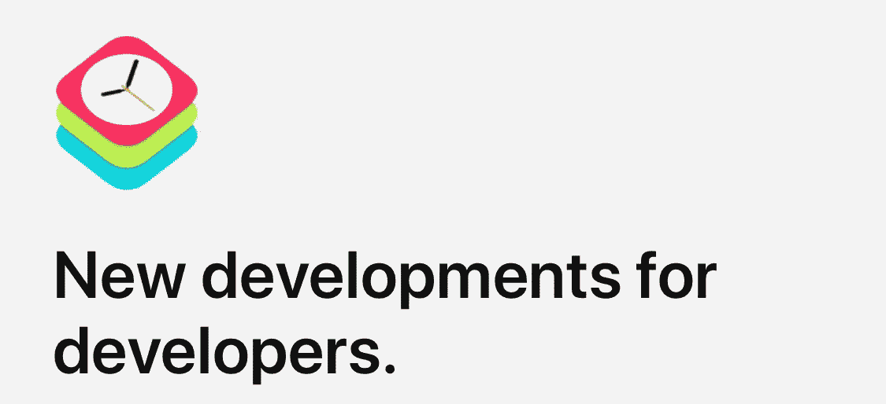
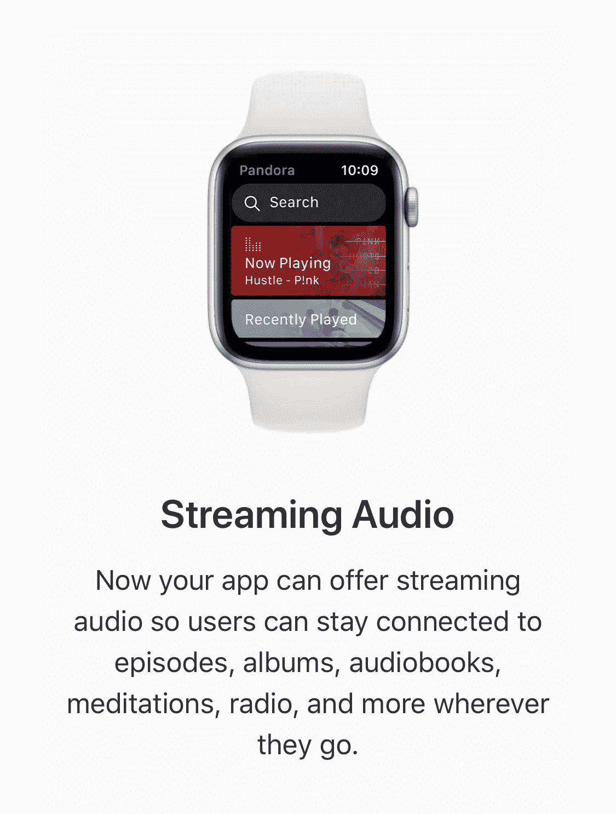
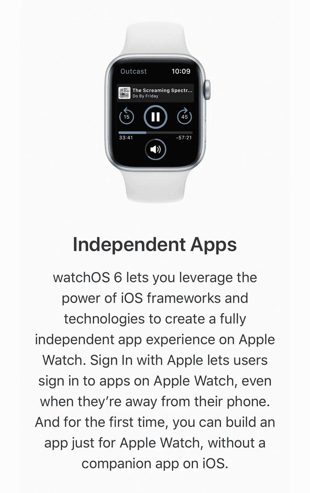
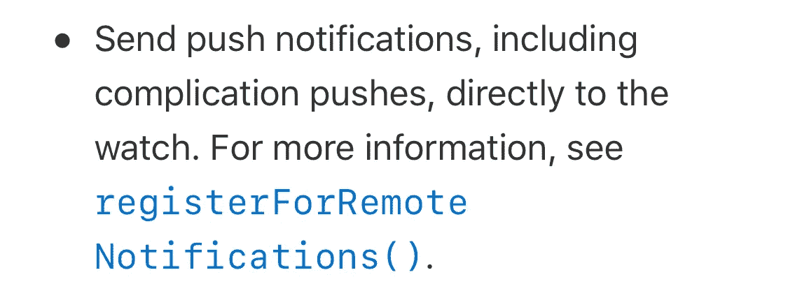
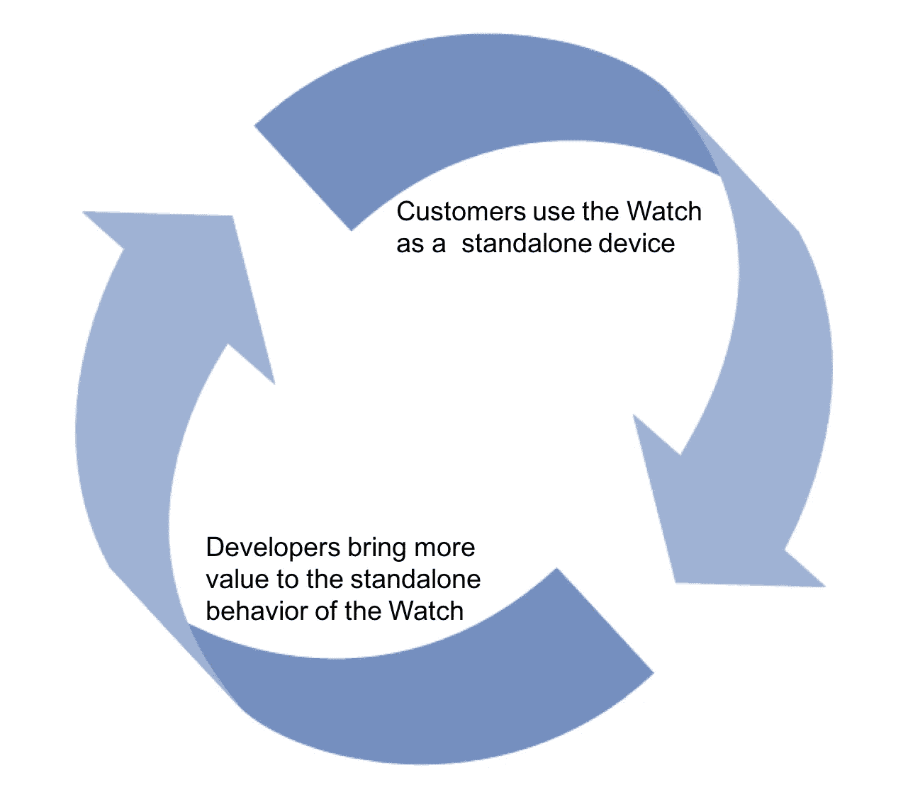

# WWDC19 最重要的公告

> 原文：<https://medium.com/hackernoon/the-most-important-announcement-from-wwdc19-554aae296f52>

## 苹果已经宣布了其不同操作系统的新功能和版本，但有一件事可能是巨大的

昨天，苹果公司举办了全球开发者大会，会上发布了很多公告，我在这里就不一一介绍了，因为有很多其他地方会比我更好地介绍它。

但有一个特别的公告让我兴奋不已，因为它延续了我已经讨论了一段时间的一条道路，我相信它有很大的潜力来创造一个新的设备和服务生态系统。

我指的是围绕手表 OS 6 的[公告。](https://www.apple.com/watchos/watchos-preview/)

# 更换智能手机

过去，我曾讨论过如何通过将智能手机的许多功能分散到多个更专注的设备上，来取代智能手机成为主要的消费设备类别。我称之为[智能手机解体](/@jorge.serna/apple-airpods-and-the-disintegration-of-the-smartphone-cb8e29efc8e3)。

Apple Watch(和 AirPods)将在这方面发挥作用，但目前这不是一个现实的期望，因为 Apple Watch 从根本上来说是 iPhone 的一个配件，因此它无法取代 iPhone。

为了实现这一点[，重要的是](https://hackernoon.com/the-lte-apple-watch-virtuous-cycle-for-a-new-ecosystem-a9211c608f54):

1.  Apple Watch 可以是独立于 iPhone 的联网设备。
2.  应用程序可以带来相关的有价值的功能，这些功能会让用户不时放心地把手机留在家里。

第一点在去年苹果手表手机版的推出中得到了体现。但是，正如我在过去讨论的那样，开发人员可以利用这种连接做的事情的局限性并没有使第二点成为现实。

随着 Watch OS 6 的出现，这种情况开始发生变化。

# 现在苹果手表上的 Spotify。真的。

在宣布 Watch OS 5 的时候，提到了对提供[背景音频](https://developer.apple.com/documentation/watchkit/playing_background_audio)的应用的支持。但这一功能不支持手表中的真实流，只支持离线播放的播放列表同步。我在去年的帖子中提到过[，这是为了提供一个“电池友好”的解决方案，但没有支持苹果音乐(主要是 Spotify)在无手机模式下的替代方案。](https://hackernoon.com/is-apple-furthering-the-smartphone-disintegration-with-watchos-5-3a2e9dfaf70b)

随着 Watch OS 的最新发布，这种情况发生了变化，它最终将支持流媒体音频(当然，没有提到 Spotify，但这是它*真正*的意思):

这可能感觉不是一件大事，但让用户选择在他们可以独立使用的设备上保留他们现有的偏好(Spotify 与 Apple Music)，是推动无手机使用的重要一步。

# 支持独立应用

在 WatchOS 5 之前，Apple Watch 的应用程序只不过是运行在 iPhone 上的应用程序的小工具。

首先，你不能让手表中的独立应用程序与手机上的“完整应用程序”不相关联。虽然从理论上来说，如果手机不在，应用程序可以利用手表的连接性(支持手机的机型可以使用蜂窝连接，其他机型可以使用 Wifi 连接)，但最终大多数人的预期是，应用程序将以某种方式与手机结合使用。

随着时间的推移，这促使许多开发人员停止对手表应用程序的支持，他们明白，如果用户无论如何都带着手机，手表的价值充其量也是有限的。最近这样做的是口袋妖怪 Go 的开发者 Niantic，他们已经[宣布停止他们的手表应用](https://www.theverge.com/2019/6/1/18648527/niantic-discontinuing-support-pokemon-go-apple-watch-app)，这是 2016 年宣布的手表[的旗舰应用之一。](https://www.thrillist.com/news/nation/pokemon-go-apple-watch-announcement-at-apple-keynote-2016)

但现在这种情况可能会随着 Watch OS 6 而改变，因为现在应用程序可以在不与 iOS 应用程序配套的情况下开发，这将推动人们关注利用手表连接的互联体验。手表内的 AppStore 将提供对它们的访问，所以现在设备不再是一个配件，而是开始通过特定的应用程序获得自己的身份。

# 但关键是通知

但最终，手表中的应用程序仍然存在许多可用性问题。打开和操作它们通常很麻烦，实际上主要的交互模型是反应式的:接收通知并对其做出响应。Apple Watch 带来的主要功能是通过我们手腕上的通知来引起我们对正在发生的相关事情的注意(一条消息、一个优步的到来、一个日历事件……)。

到目前为止的问题是，来自应用程序的通知只有在附近时才会从 iPhone 转发到手表。因此，将手机放在家里的手机手表用户只能从苹果的一些原生功能中获得通知:iMessages、Mail、Calendar 和其他功能。

如果你依靠 WhatsApp 进行通信，或者希望在有人进入你家时得到 Nest cam 的通知，或者你正在通过 Slack 等待一条重要消息……那么你不能把手机留在家里或让它耗尽电池。那么，为什么要为 Apple Watch 的蜂窝连接多花钱呢？

现在，手表应用将能够接收推送通知，而无需通过 iPhone。正如苹果公司的开发者文档所述:

通知是手表应用程序的正确体验，让它们在没有 iPhone 的情况下工作可以推动一个真正的无手机价值生态系统，也是为 Apple Watch 获得额外蜂窝计划的真正原因。

当然，这取决于开发者实际上在做这件事(这在一些应用中可能很难做到，比如 WhatsApp )，这样[才能启动良性循环](https://hackernoon.com/the-lte-apple-watch-virtuous-cycle-for-a-new-ecosystem-a9211c608f54)。

