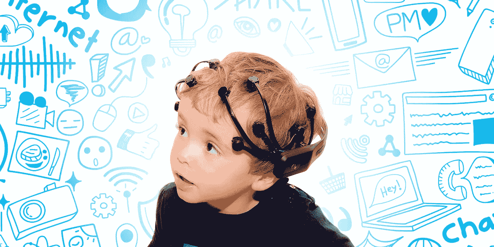
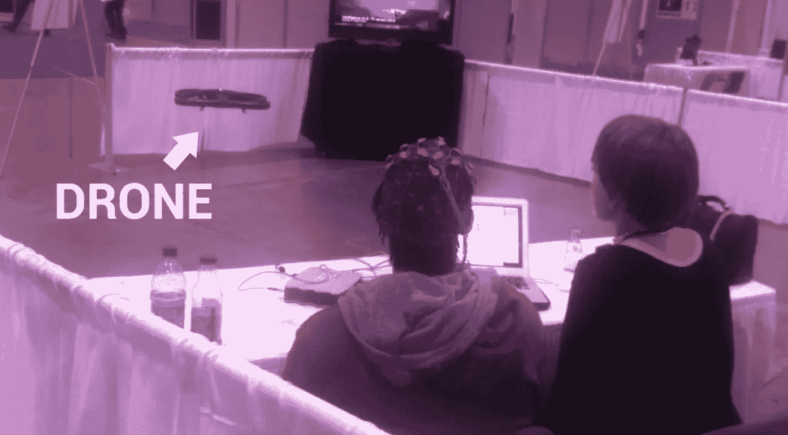
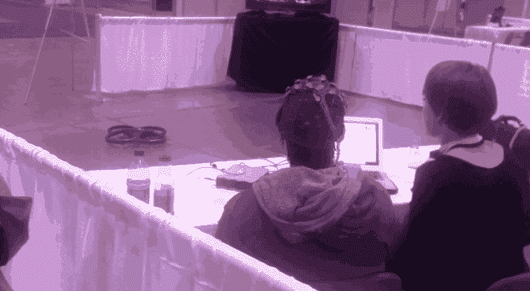
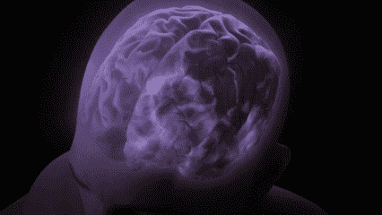
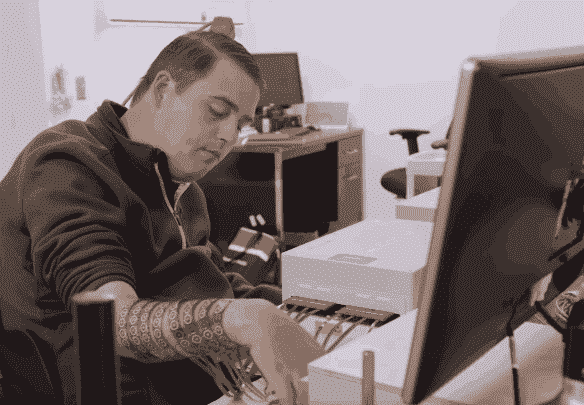
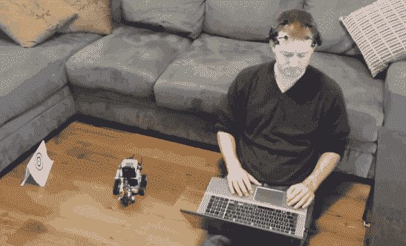
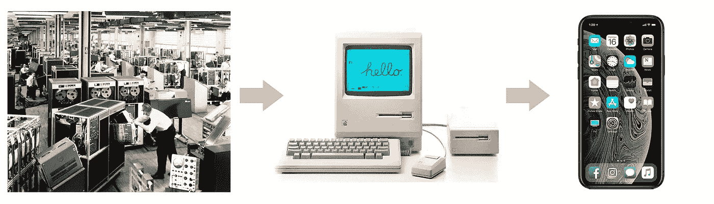
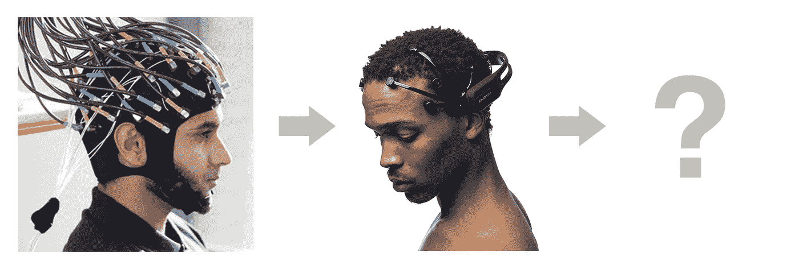
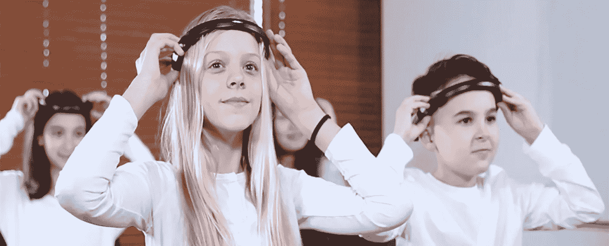

# 没有人谈论的最重要的技术

> 原文：<https://medium.com/hackernoon/the-most-important-tech-no-one-is-talking-about-c171c438e1a>

## 脑机接口会让你大吃一惊。也许真的是这样。

如今，科技领域有很多缩略语。

人工智能，增强现实，BTC，虚拟现实，IOT。

所有这些都是有希望的未来技术。公司正投资数十亿美元，希望它们能成为下一个大事件。

然而，有一个缩略词并没有得到太多的关注。然而，它有潜力像其他事物一样改变我们的生活。

是 **BCI** ，代表[脑机接口](https://en.wikipedia.org/wiki/Brain%E2%80%93computer_interface)。

# 连接我们的大脑和电脑

4 年前，我在气会议上第一次和有了接触。我用意念驾驶了一架无人机。

> “如何用意念驾驶无人机？”

首先，你需要把你的大脑和电脑连接起来。有几种方法可以做到。最简单的一个，我做了，就是戴上一个**脑电图耳机。**

EEG 代表[脑电图](https://en.wikipedia.org/wiki/Electroencephalography)。这是一个复杂的词，意思是从你的大脑读取电信号。

过程是这样的:

1.  你戴上耳机，它与电脑相连。
2.  你想想你的手。耳机捕捉到了这个信号。
3.  你想想你的脚。耳机也能捕捉到这个信号。

然后，计算机将这些信号映射到无人机的控制器。

这类似于将游戏控制器的按钮映射到游戏中的动作。除了按钮是你的思想，动作控制无人机。

手映射到“起飞”，脚映射到“向前飞”，当你停止思考时，无人机降落。

然后你坐下，想想你的手，瞧！无人机飞起来。

这是 4 年前的事了。这是一个早期的原型，我很难控制无人机。然而，这是一次令人兴奋的经历。从那以后，我就一直关注着 BCI。

# 科学——不是魔法。

人脑是由称为神经元的细胞组成的。就像计算机一样，神经元使用电信号相互交流。你所经历的一切——你的思想、感觉、情感——都来自这些信号。

有了正确的传感器，我们可以检测到这些信号，并利用它们与计算机进行通信。

脑电图只是我们将大脑与计算机相连的方式之一。还有其他方式，如 [fMRI](https://en.wikipedia.org/wiki/Functional_magnetic_resonance_imaging) 、 [ECoG](https://en.wikipedia.org/wiki/Electrocorticography) 、[局域场电位](https://en.wikipedia.org/wiki/Local_field_potential)、[单体记录](https://en.wikipedia.org/wiki/Single-unit_recording)。

# 当前和未来的使用案例

现在，BCI 主要用于研究和医疗目的。

[NeuroLife’s brain implant gives paralyzed patient control over his hand](https://www.youtube.com/watch?v=_6oNoLWcDqw).

它帮助残疾人重新控制他们的身体。它使人们能够用他们的思想打字，重新控制他们的手，甚至在 2014 年世界杯上踢球。该技术还承诺帮助患有神经疾病的人，如阿尔茨海默氏症和帕金森氏症。

这太棒了。如果仅仅是这样的话，这将是当今科技领域最有趣的领域之一。

**其实不然。我们也可以利用 BCI 来增强身体机能。**

对这项技术未来的预测听起来像科幻小说:

*   拥有无限的云存储空间来存储您的回忆。
*   用你的思想即时访问维基百科和谷歌搜索。
*   把你的梦录下来，早上当电影看。
*   通过*下载*学习新技能— [矩阵式](https://www.youtube.com/watch?v=6vMO3XmNXe4)。
*   与人工智能融合——防止我们被它取代，并在此过程中成为统一、普遍和不朽的超智能生物。或者类似的东西。

我尽量不要对这些想法过于兴奋。我不认为我们会在有生之年看到它们。

然而，我发现这个简单的应用程序，比如用你的思想控制一个玩具，很吸引人。今天，在当前的技术下，有很多[的](https://www.youtube.com/watch?v=zlUZ6bhUcBk)[的](https://www.youtube.com/watch?v=FtDEogdFC58)视频的人在做这件事。

现在考虑这将如何与[物联网](https://en.wikipedia.org/wiki/Internet_of_things)相结合。想象一个世界，每个电器都是连接的，可以用你的思想控制。这对社会的影响是迷人的。

就像科技界的许多人一样，我从小就是《星球大战》的超级粉丝。当我还是个孩子的时候，我只能梦想能够使用原力。我在房子周围走了一圈，试图用意念移动物体，但没有成功。

[The Force — Volkswagen Commercial](https://www.youtube.com/watch?v=2zwMWLE9fBU)

回过头来看，用我的意识控制那架无人机感觉就像使用*原力*。这是一个实现了的童年梦想。感觉就像魔法一样。上一次有这种感觉是第一次用 iPhone 的时候。说到这个…

# BCI 的苹果？

在 70 年代，电脑又大又丑又贵。它们很难使用。它们只被科学家和研究人员使用。

苹果用个人电脑改变了这一切。他们把这项无比强大的技术带给了每个人。它改变了世界。

今天，BCI 耳机又大又丑又贵。它们极难使用。它们主要被科学家和研究人员使用。

我很期待这家公司能像苹果公司对待个人电脑一样对待 BCI。这家公司将使这项技术易于在大众市场使用。它将改变世界。

事物都在运动。上个月，Elon Musk 的 Neuralink 宣布了他们在 BCI 实现飞跃的任务取得了令人印象深刻的进展。[脸书将于 2019 年底展示他们自己的耳机](https://tech.fb.com/imagining-a-new-interface-hands-free-communication-without-saying-a-word/)。

像 Emotiv 这样的公司已经销售这种耳机很多年了。几百块钱，想买就买一个，自己试试！

我可以向你保证，谷歌、微软和苹果正在开发他们自己的版本。

# 神经生成

回到 2015 年，我很难驾驶那架无人机。想到我的手的整个想法是令人困惑的。

> 你到底是怎么看待你的手的？

这到底是什么意思？您是否闭上眼睛，想象它们？不，你得睁大眼睛。你的手动吗？不，你的手不能动。整个经历不可思议。我从来没有真正掌握它的窍门。

我的挣扎让我想起了我的祖父母与平板电脑和电脑的斗争。

我在电脑、智能手机和互联网的陪伴下长大。他们是我的第二天性。然而，对于上一代人来说，简单地打开电脑可能会很困难。

我相信 BCI 是下一代科技差距将会出现的地方。

回到 2015 年，我无法让无人机飞行几秒钟。我相信，在这种技术下长大的孩子不会有问题。

我已经可以想象我的孩子回家，用他们的大脑打开灯和电视。他们会坐在沙发上，玩游戏，和来自世界各地的朋友聊天，分享他们的想法。

与此同时，我会是那个大喊:

我等不及了。

# 对 BCI 感兴趣？以下是一些附加内容:

*   观看[埃隆的麝香神经氨酸宣布](https://www.youtube.com/watch?v=lA77zsJ31nA)。
*   阅读[等等，但是为什么会有关于 Neuralink 使命的综合性文章](https://waitbutwhy.com/2017/04/neuralink.html)。
*   观看[西拉伊·拉瓦尔关于这种可能性的视频](https://www.youtube.com/watch?v=wxBk4WXMaiI)。
*   有几百美元可以花吗？您可以[购买自己的脑电图耳机](https://www.emotiv.com/)。