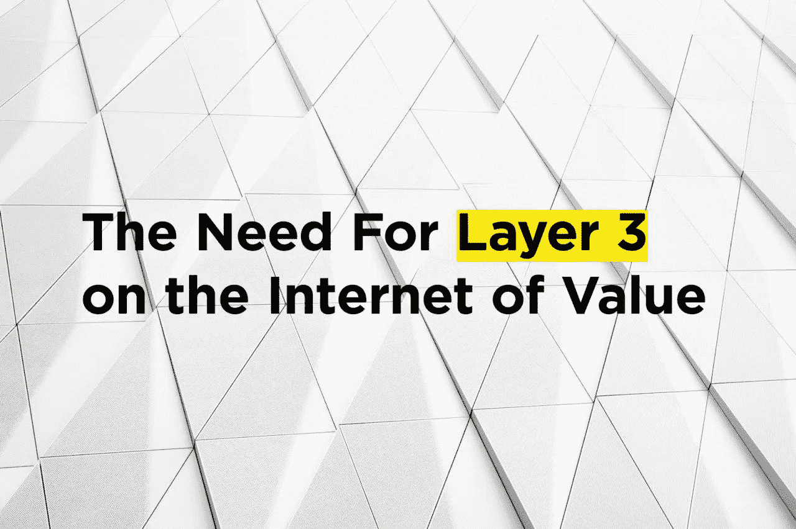
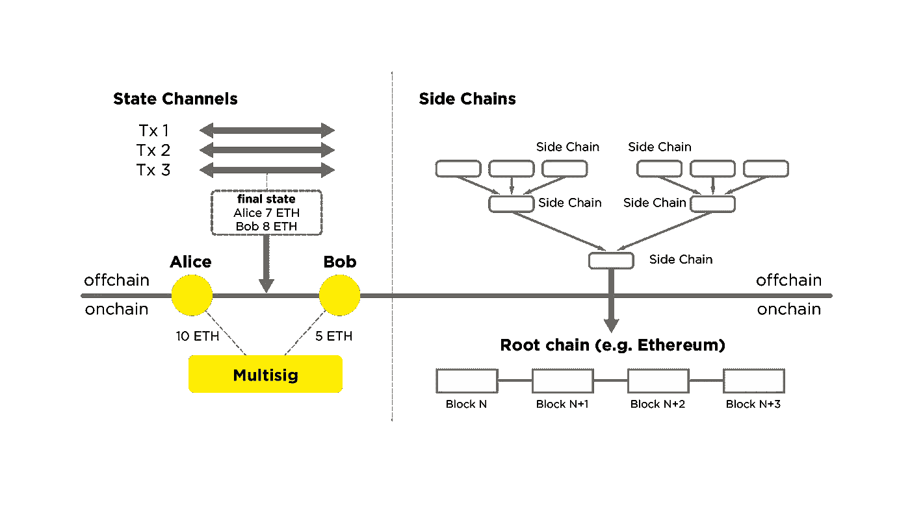
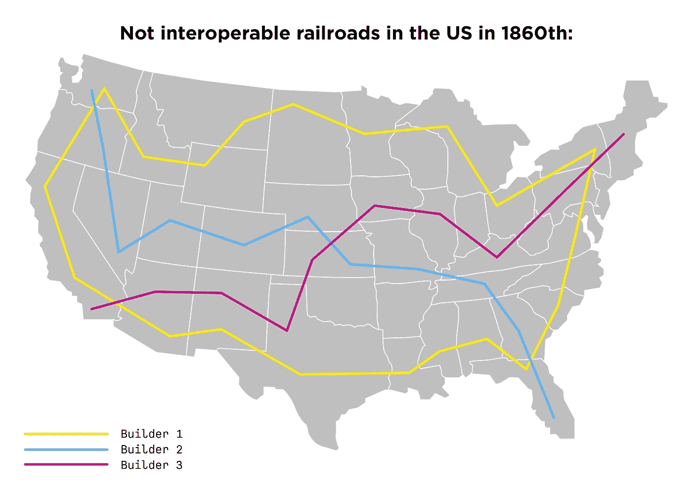
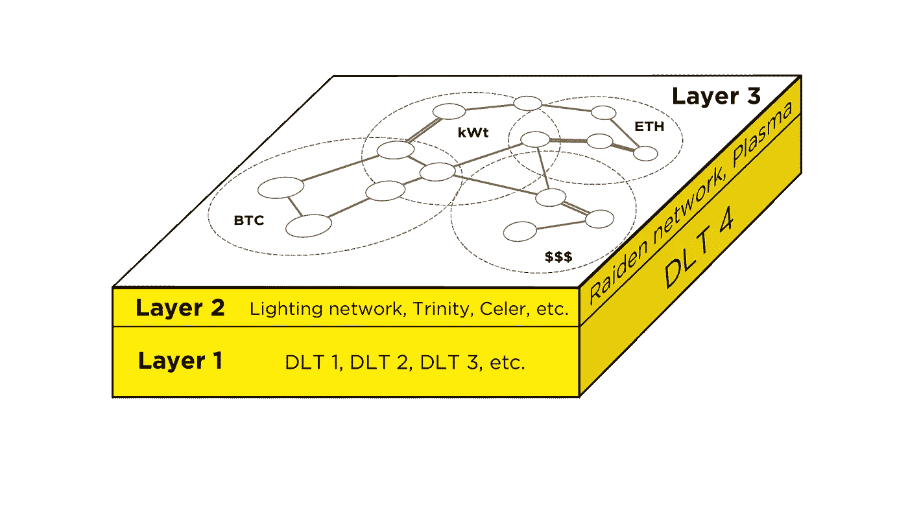
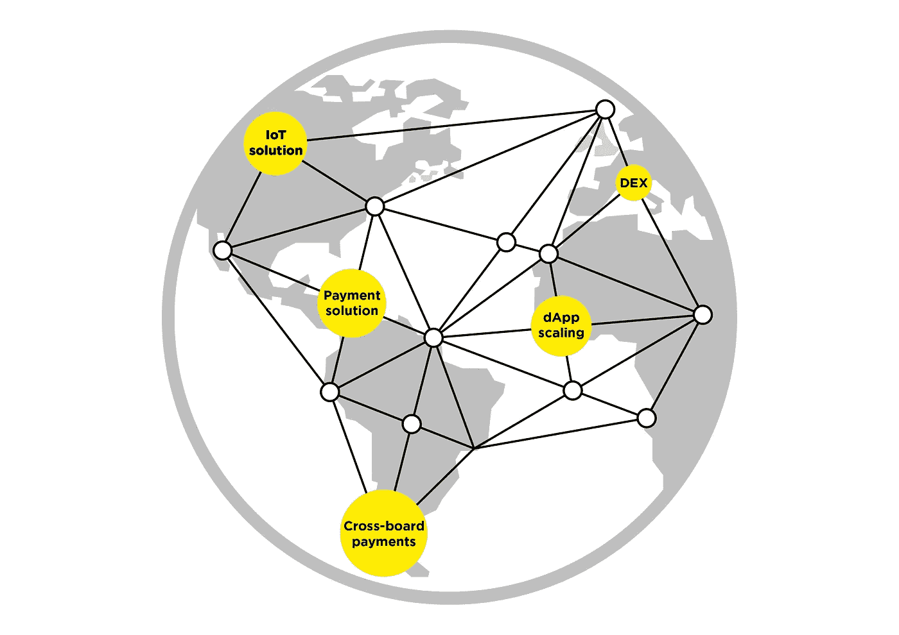

# 价值互联网对第三层的需求

> 原文：<https://medium.com/hackernoon/the-need-for-layer-3-on-the-internet-of-value-85ae3ab2a9ea>

在过去十年中，我们目睹了革命性创新的出现，其进化意义尚未得到充分认识。当然，我们指的是[区块链](https://hackernoon.com/tagged/blockchain)、加密货币，以及更普遍的我们称之为价值互联网的现象。区块链和相关技术有机会改变金融世界和其他价值体系，就像互联网改变我们交换信息的方式一样。

到目前为止，已经有了一些重要的里程碑:2008 年比特币的推出；从 2011 年开始，altcoins 的出现；2015 年以太坊的推出。我们将这一层称为第 1 层，即基础层，其经济功能是创造价值，技术功能是确保会计和加密资产转移的基本功能。所有这些都是在分布式注册中心的基础上实现的，并且交互条件在代码级别上受到严格控制。

看来，[技术](https://hackernoon.com/tagged/technology)终于出现了，它将使我们能够创造、数字化和传递价值，就像我们在传统互联网上创造和传递信息一样，而无需第三方的调解和限制。但是大规模采用仍然没有实现。挑战不仅仅是惰性；世界上很少有人意识到这项创新的重要性。问题主要在于纯技术性质的限制，其中主要是:

1.基本加密生态系统的可扩展性和有效性有限，因此:

-网络吞吐量低；

-交易速度低。

2.不断增长的内存需求，用于分布式注册表副本的本地存储。

3.高转让费(共识的成本永远高于非分布式数据库中的确认成本)。

当然，一些区块链系统正在试图解决这些问题。有些人甚至会。但是他们的努力主要在于减少分散化和降低对审查的阻力([更适合企业解决方案，而不是通用的价值互联网](https://blog.bigchaindb.com/the-dcs-triangle-5ce0e9e0f1dc))。此外，这些努力被孤立于个别项目，没有为现有生态系统的共同问题提供答案:比特币、以太坊和其他。

因此，这里我们至少面临一个额外的挑战，即:

4.互操作性的缺乏或极端限制；不同区块链生态系统之间不可能相互作用。

所有这四个限制都与第 1 层的问题有关。第一组(1-3)的问题已经由单个区块链和生态系统的开发者以及特殊项目解决，主要目标是在流行的区块链系统上创建某种覆盖。例子可能包括比特币生态系统的闪电或以太坊的雷电等项目。因此，解决第一组问题的解决方案被称为所谓的第二层。

第 2 层实际上是基线(第 1 层)之上的链外上层结构，主要是为了解决第一个问题——可伸缩性。大多数提出的解决方案涉及状态通道或侧链。主要优势包括提高生产率和可靠性，以及无信任操作。

*Layer 2: solving scalability problems with state channels and side chains.*

闪电网、雷电网、三位一体网(支付渠道)以及策勒网、反事实(广义国家渠道)等二层项目属于国家渠道项目。同时，血浆、RSK 和液体使用侧链来解决基本区块链系统的可扩展性问题。

但是，正如我们上面讨论的，它们都没有解决我们的第四个问题——互操作性问题。尽管像 LN 和 Raiden 这样的项目声称他们会在未来实现，但对于任何专注于特定 DLT 的项目来说，这都是一个相当大的挑战。事实是，由于技术方法的差异和项目时间表之间的不一致，在两个不同的区块链之间提供原子不可信事务是一项极其困难的任务。

## 但是为什么这是一个如此严重的问题呢？

让我们试着用一些历史例子来想象一个没有互操作性的物理世界。19 世纪，美国经历了铁路建设热潮。几家大公司参与了铁路网的建设和发展。但是想象一下，如果这些公司中的每一家都按照自己的标准建造铁路，而与其他公司的标准不一致，会有什么后果？不同的轨距，不同的轨道形状等。也许这些假设的宽度或形状中的一个会比今天使用的更好，或者这些标准中的一些会更适合特定的任务。然而，每家公司都必须打造自己的生产线，同时生产符合其专有标准的独立汽车和机车，等等。我们将不得不为每一个不兼容的铁路网络建立几个不同的火车站，而不是在每个村庄建立一个通用火车站。

你认为在这种情况下会发生什么？铁路还会成为开发新地区、改善地区间经济联系等的重要渠道吗？？

换句话说，缺乏互操作性会如何影响这项技术的采用？

一些第 2 层解决方案的开发者声称他们计划在将来解决互操作性的问题。但是今天，尽管如此，他们继续改善他们的项目集中在一个特定的区块链；顶多在兼容的区块链上(比如比特币叉子，或者类似以太坊的智能合约项目等。)

另一方面，第 2 层项目甚至应该尝试解决互操作性的问题吗？在我们看来，这个问题属于不同的层面；即第三层。这意味着最好单独解决，并借助更专业的方法。

用互联网本身的发展来做类比可能是恰当的。互联网有自己的技术层，每一层都执行特定的功能:

-链路层:本地网络中设备之间的各种技术和数据传输协议，例如以太网、WiFi、PPP、HDLC 等。

-网络层:通过广域网传输数据的协议。

-传输层:负责完整传送数据等的协议。

网络层的特点是它尽可能地抽象于底层协议技术。它的任务是确保全球数据传输的可能性，或者用我们的话来说，确保各种设备和局域网(LAN)的互操作性，将它们全部绑定到一个单一的全球网络(互联网)中。

*Layer 3*

在我们看来，一个类似的主要任务应该由第三层的项目来完成:确保在一个单一的全球价值互联网中独立的区块链生态系统的互操作性和功能。第 3 层项目固有的主要特征是:

-应该基于链外技术。

-是区块链不可知论者，即不局限于特定的区块链生态系统。

-提供无信任多资产交易的可能性，即在支付过程中允许一种加密资产与另一种加密资产的轻松交换。

-确保支付的原子性。

至于原子性，我们应该回到使用传统互联网的类比。传输层负责原子性的模拟:它在那里被渲染成一个独立的技术层。价值互联网是否会出现类似的情况，只有时间会证明。同时，这个问题应该以某种方式解决。

总的来说，正是由于上述特征，第 3 层技术并不局限于确保互操作性和将单个区块链系统整合到一个全球网络中。它们还可以连接传统金融体系和实物资产，或其他非区块链价值载体。正如传统互联网中的网络层从特定的底层数据传输技术中抽象出来，并确保它们的全球交互一样，价值互联网中的第 3 层技术可以提供互操作性和全球价值传输，而不管这种价值来自哪里，也不管它的基本载体是什么。

此外，价值互联网中的第 3 层技术可以成为以下实用解决方案和服务的基础:

-支付系统

-分散式跨链交易所(跨链 DEX)

-跨境支付(“加密签证”)

- dAPP 缩放

-物联网(IoT)领域的解决方案，以及其他。

然而，最大的好处将来自价值互联网的网络效应。每一项新服务，以及被这项服务吸引的每一个新参与者，都将为所有参与者增加整个价值网络的价值，包括各种 DLT 项目。

*Layer 3 Solutions.*

想象一下，如果有人在 20 世纪 70 年代只接触到几个局域网，被要求描述未来的全球互联网——一个允许世界一半人口即时共享任何信息的互联网。想象一下，如果让他们预测这将如何影响人们的经济、职业和社会生活。在 20 世纪 70 年代，很难预测我们现在司空见惯的事情。

同样，在我们目前的进化阶段，很难想象类似的发展——我们称之为价值互联网——会把我们引向何方。

## **结论**

很可能在未来的某个时候，基本的 DLT 技术(第 1 层)将执行价值载体的主要功能，一种特殊价值的监管。开发人员将主要关注这些基本和自然功能的彻底实现。

与此同时，价值转移的物流功能将被纳入技术层面的上层结构——第 2、3、4 层。他们的任务是解决特定层次的问题，如可伸缩性、互操作性和原子性。由于被分成不同的技术层次，它们将能够超越低级技术的限制而行动。

对于互操作性来说尤其如此。毕竟，一个给定的区块链生态系统，不管它是什么，它本身不可能成为我们所说的价值互联网，就像 WiFi 不可能成为互联网一样。但是他们一起工作可以。然而，这只有在第三层技术出现的情况下才会发生，这种技术可以确保它们的互操作性。

我们在 [GEO Protocol](https://geoprotocol.io/) 团队自 2015 年以来一直致力于这一领域的研究，我们正在开发一个解决方案，我们希望它能够成为未来价值互联网的一部分。

## 遵循 GEO 协议:

【[传媒](https://medium.com/geoprotocol/) | [推特](https://twitter.com/geo_protocol)|[GitHub](https://github.com/geo-protocol)|[Gitter](https://gitter.im/GEO_Protocol/)|[电报](https://t.me/geoprotocol)|[LinkedIn](https://www.linkedin.com/company/geoprotocol/)|[YouTube](https://www.youtube.com/channel/UC3jEvQvZAmCUXa7dCoX9_Lg/)