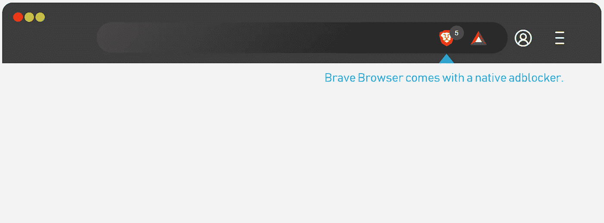
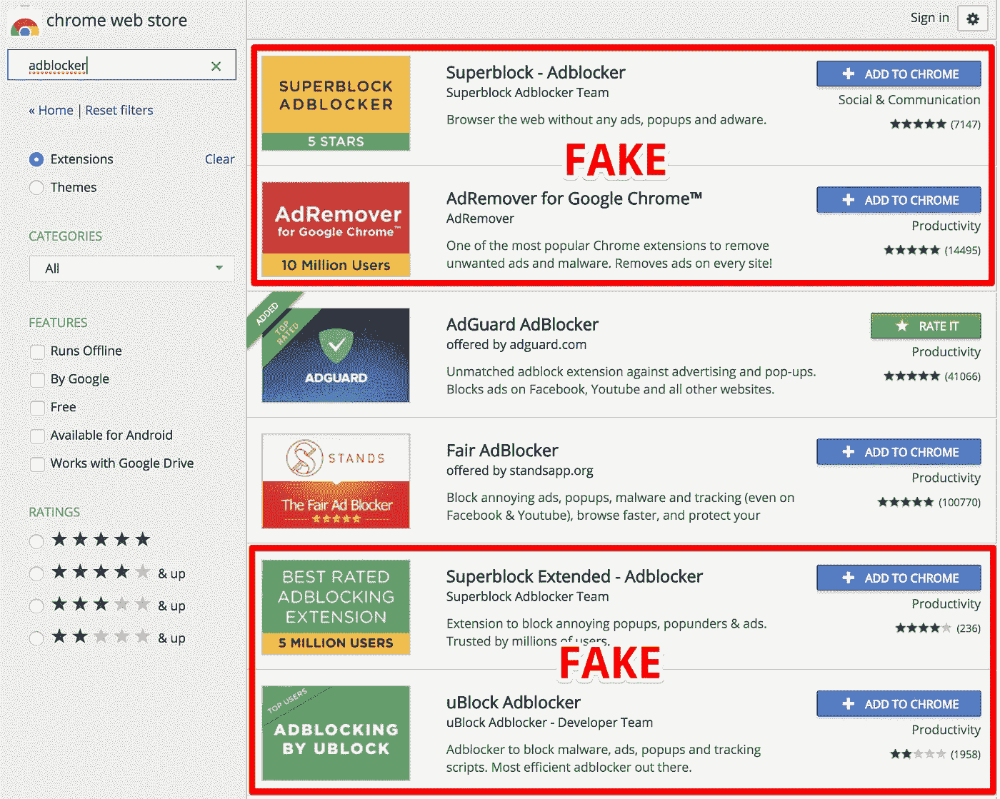
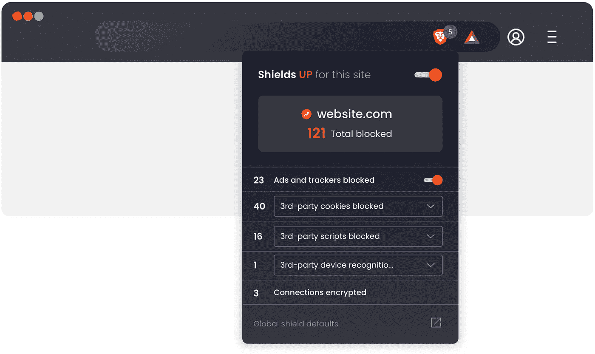
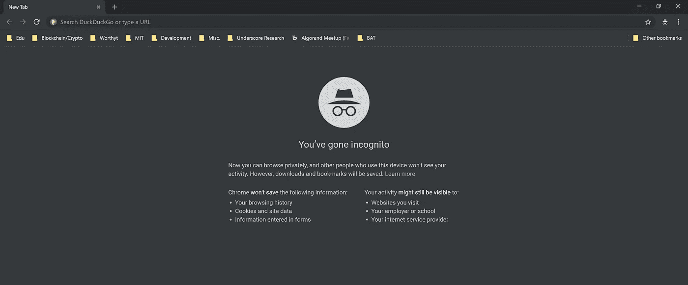
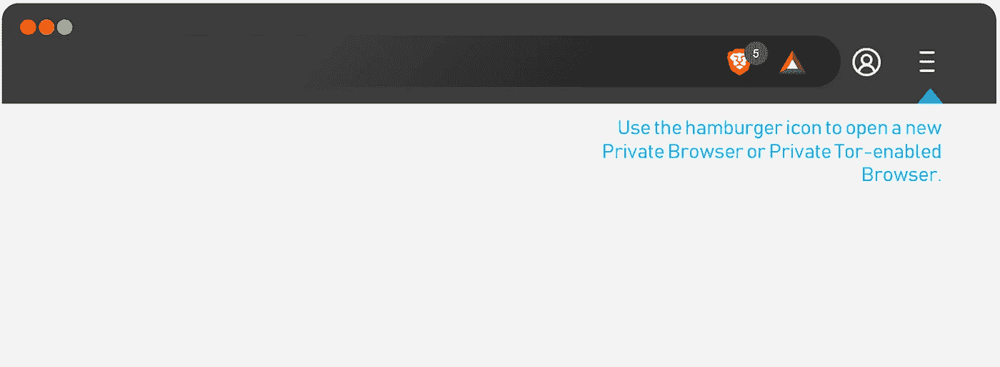
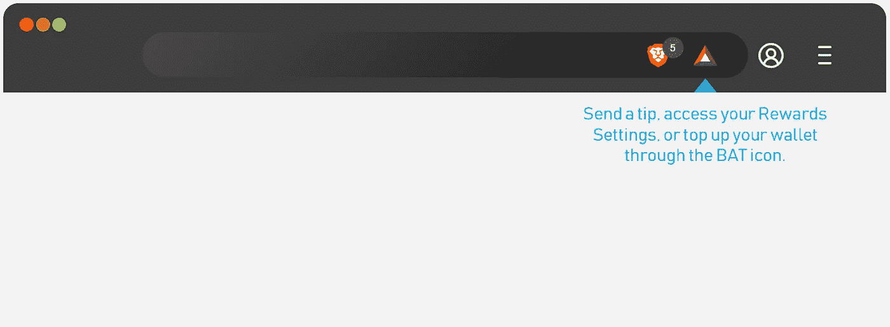
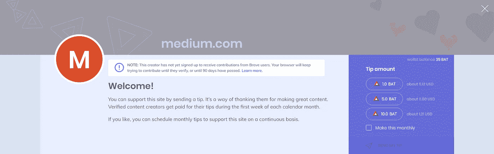
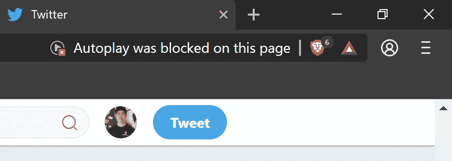
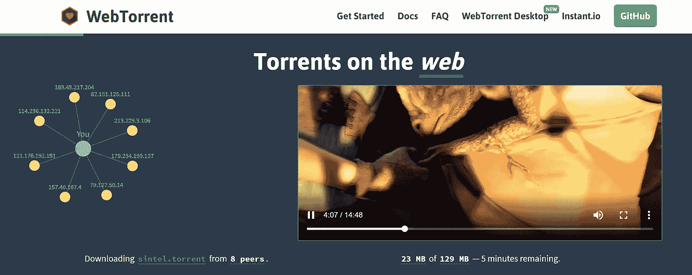
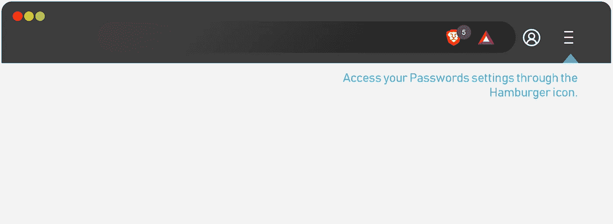

# 新互联网从勇敢的浏览器开始

> 原文：<https://medium.com/hackernoon/the-new-internet-starts-with-brave-browser-977ccc19b373>

## 额外的隐私、出色的功能和 Chrome 用户熟悉的时尚界面。

*免责声明:如果这篇文章确实说服你尝试勇敢，你可以通过我的链接* *下载它* [*，它也有助于支持我。本文所有勇敢浏览器下载的链接都是我连接的。*](https://brave.com/ken948)

我最初对 Brave 感兴趣是因为浏览器的加密货币方面——我一直在探索当今利用加密货币的不同应用程序。玩了五分钟后，我发现我找到了 Chrome 的一个很好的替代品。我所知道的描述勇敢的最佳方式是它是类固醇上的铬。Brave 的用户体验在各个方面都模仿了 Chrome——你甚至可以在上面安装 Chrome 扩展。但它比今天 Chrome 提供的功能更进了一步，专注于真正的隐私、用户保护和便利。

从加密货币的角度来看，这是目前存在的为数不多的几个项目之一，我认为它具有真正强大的潜力，这不仅是因为它的价值主张，还因为 Brave 创造性的执行方式——通过它自己的原生浏览器。试用[勇敢浏览器](https://brave.com/ken948)一两天。你可能会忘记你没有使用 Chrome。

[勇者浏览器](https://brave.com/ken948)的界面你应该觉得很熟悉。这并不奇怪，因为 Brave 是建立在 Chromium 之上的，Chromium 是谷歌推出的一个开源项目；Chromium 的源代码用于谷歌 Chrome。

这意味着 Brave 能够支持谷歌 Chrome 支持的大部分功能，并兼容 Chrome 商店上的大部分扩展(要获得 Chrome 扩展，你只需在 [Brave 浏览器](https://brave.com/ken948)的地址栏中键入 *brave://extensions* )。快捷键也是一样的(例如，CTRL+T 打开一个新标签页)。这也意味着，如果你想从谷歌 Chrome 切换到 Brave，你也可以一键转移你所有的用户名/密码组合以及书签。

# 不再需要潜在的恶意广告拦截器扩展

The native ad-blocker on Brave shows you how many ads it blocked directly on the URL bar.

谷歌 Chrome 没有自带广告拦截功能。也就是说，广告屏蔽的想法并不完全是谷歌想要的；毕竟，大约 84%的收入来自广告。另一方面，Brave 安装了广告拦截器。

当你第一次想到它时，非原生广告拦截功能似乎不是一件大事。如果 Chrome 用户想屏蔽广告，他们可以从 Chrome 商店下载一个扩展。不幸的是，下载广告拦截软件并不明确。在 Chrome 上简单搜索 adblock 扩展会得到大量不同的结果，除了不同的徽标之外，大多数结果都无法区分。

Fake ad-block extensions on Chrome that actually infected your browser with malware. Source: [AdBlock](https://adguard.com/en/blog/over-20-000-000-of-chrome-users-are-victims-of-fake-ad-blockers/)

选择错误的广告拦截扩展可能会以感染恶意软件为代价。2018 年，AdGuard 发布了一份报告，发现五个广告拦截扩展[也包含恶意软件](https://adguard.com/en/blog/over-20-000-000-of-chrome-users-are-victims-of-fake-ad-blockers/)。这五个扩展加起来也安装在超过 2000 万用户的浏览器中。虽然 Chrome 网上商店上的应用程序经过了审核过程，应该可以从无害的应用程序中剔除恶意应用程序，但仍有可能一些滑动应用程序设法钻了空子，并找到了进入受害者电脑的方法。

此外，即使是无害的广告拦截扩展也不一定会拦截所有广告。请看[商业内幕【2015 年的这篇文章，其中写道:](https://www.businessinsider.com/google-microsoft-amazon-taboola-pay-adblock-plus-to-stop-blocking-their-ads-2015-2)

> 谷歌、微软和亚马逊正在向 Adblock 支付巨额费用，以使他们的广告被解封。

通过进入 Adblock Plus 的设置，用户可以取消选中[允许可接受广告](https://adblockplus.org/en/acceptable-ads#optout)的复选框，但大多数用户并不知道这个设置。

不过，默认情况下，地址栏右侧的狮子标志不仅仅是用来屏蔽广告的。跟踪器、不需要的 cookies 和脚本以及其他试图获取您信息的代码都可以被阻止。老实说，我的开发者一面讨厌这样，因为这意味着我得到的关于你是谁的数据更少，但我的用户一面更愿意看到指向我的可识别足迹更少。

# 谷歌 Chrome 的隐姓埋名模式是假隐私；请改用 Brave 的本机 Tor 连接

大多数人误解了谷歌 Chrome 的[隐姓埋名模式](https://support.google.com/chrome/answer/95464?co=GENIE.Platform%3DDesktop&hl=en)的实际作用。被谷歌描述为“隐私浏览”的功能，用户经常会误认为是一种可以让他们在互联网上不留指纹的功能。但是如果你读一下首页的小字，你会发现用户的活动仍然可以被你访问的网站、你的雇主或学校以及你的互联网服务提供商看到。

简而言之，匿名模式和正常隐私浏览的作用是让你浏览网站而不会在你的电脑上留下太多你活动的痕迹*——在你完成后，你的 ISP 或你的公司仍然可以看到你在看什么。因此，如果你的网络管理员开始在工作中用奇怪的眼神看你，你想知道他是否设法在利基子网站上看到了你的匿名浏览历史，那么是的，他或她有可能确实看到了那些 NSFW 视频流，是的，他或她确实知道它进入了你的计算机——你的 IP 地址仍然可见。*

*话虽如此，隐姓埋名模式确实有明显的好处，但前提是你使用正确。例如，如果你正在为精通技术的伴侣购买生日礼物，匿名模式将确保他或她不会通过简单地查看你的浏览器历史来发现你的惊喜。*

## *勇敢的使用 Tor 来更好的匿名*

**

*通过快捷键 *ALT + SHIFT + N* (或者点击勇敢浏览器右上角的汉堡图标)，你可以打开一个连接到 Tor 网络的新窗口。对于已经使用 Tor 浏览器的用户来说，这是一个额外的好处，因为您现在可以使用一个浏览器来进行正常浏览和 Tor 浏览。*

*我不会深入 Tor 网络的细节，但简单地说，它基本上拆分了所有内容(图像、视频、文本、脚本等。)从一个网站传到不同的电脑，然后那些不同的电脑把棋子传给你。这一切都是以加密的方式完成的，所以你的互联网服务提供商或公司的网络不知道正在通过什么。这就像你和你的父母一起坐在餐桌前，用猪拉丁语和你的妹妹交流——你们可以理解对方，但你的父母不知道你在说什么。*

*Tor 窗口以私密模式打开(Brave 的隐姓埋名模式版本)。这意味着你可以享受匿名浏览的所有好处。你可以用传统的 Chrome 快捷键 *CTRL + SHIFT + N* 来代替打开非 Tor 的私人浏览器。*

*为什么你会选择一个非 Tor 的私人浏览器，而不是总是去 Tor？嗯，首先，由于 Tor 网络的工作方式(所有内容都是分开的)，加载一个页面需要更长的时间。有时，与传统的网页加载速度相比，它会让人感到令人沮丧的漫长。所以根据你浏览的性质和你有多不想让你的网络管理员知道你在最古怪的子街道上看什么，你可能会也可能不会选择隐私浏览。*

# *它以应有的方式驱动着互联网:由人民驱动，而不是广告商*

*我在这里可能有偏见，因为我的个人项目 [Worthyt](http://www.worthyt.io) 一开始试图提供与勇敢浏览器相同的价值:允许互联网用户通过小费支持互联网上的内容创作者。从那时起， [Worthyt](http://www.worthyt.io) 已经变成了一个平台，内容创作者可以在这里回答观众的问题并从中赚钱。这一转变是由同一个目标引发的:支持内容创作者的是用户，而不是广告商。*

*Brave 实现这一点的方式是允许其用户以其本地加密货币基本注意力令牌(BAT)给内容创作者小费。由于浏览器内置了钱包，可以在本地存储 BAT，用户不必每次都打开钱包进行微交易；相反，可以直接在您访问的页面上完成，您可以通过点按浏览器中狮子旁边的三角形来提示。您也可以使用三角形进入奖励设置。*

**

*在奖励设置中，你可以调整一些东西:广告、自动贡献和提示。*

## *广告(ad 的复数)*

*这是一个仍在由 Brave 开发的功能。不过这个想法很简单:虽然 Brave 默认启用了广告拦截，但用户可以选择*选择*来观看广告。通过观看广告，用户可以获得 BAT，然后可以用来支持内容创作者或只是提取法定货币或其他加密货币。它类似于 [Twitch Bits](https://help.twitch.tv/customer/portal/articles/2449458) ，这是 Twitch 专门为其平台实现的一个成功的小费系统。比特被用来向流媒体发送提示，并且可以通过观看广告来购买或赚取。*

## *自动投稿*

*自动投稿是一个后台提示系统。通过启用它，您可以根据您在网站上花费的时间，向您每个月访问的所有网站分发一定数量的 BAT。您可以设置每月想要分发的总量，浏览器会负责计算所有的分配。*

*我觉得这个功能还可以进一步冲掉，因为它确实给无意倾斜留下了很大的空间，除非用户在设置区手动干预。例如，我一直在为一个客户做一些网站开发，我访问他现有的网站复制内容。我注意到他的网站出现在我这个月要给小费的页面中——但是应该给我小费的是他！*

*它还会对用户体验产生负面影响。想要获得更多 BAT 的网站可以将它们的内容分成多个页面，这意味着用户有更多的点击和页面加载，但也意味着网站有更多潜在的提示。或者它可以鼓励作者加入更多的绒毛来吸引用户的注意力。*

*归因现在也是一个问题。例如，如果我正在阅读《华盛顿邮报》上的一篇文章，自动投稿提示应该放在哪里:华盛顿邮报，还是记者？视情况而定，我可能希望它去一个或另一个。*

*虽然自动贡献是一个有趣的功能，可以鼓励小费成为一种被动的习惯，但我确实希望在我亲自启用它之前，看到这个功能更加成熟。另外，我可能需要比现在更多的球棒。*

## *技巧*

*Tips 比 Auto-Contribute 更主动，因为它需要你记得把 BAT 发给创作者。也就是说，它还允许你选择你的贡献，这比自动贡献功能给你更多的控制。由于我上面提到的原因，我个人目前更喜欢 Tips 特性而不是 Auto-Contribute。*

**

*因为 Brave 是一个如此新的项目，它与内容平台集成的可用性是有限的。目前，内容创作者只能连接并开始接收 Brave 的加密货币 BAT，如果他们是 YouTubers、Twitch Streamers 或拥有个人博客的话。换句话说，我在 Medium 上不能拿 BAT！如果你想在这里给我小费，你会发现你实际上是在给 Medium 送小费。如果你点开我的[勇者下载链接](https://brave.com/ken948)，你会看到上面写着“在 YouTube 上支持肯尼李很容易”因为我链接不了我的媒介账号。*

# *其他出色的功能*

## *停止不想要的视频自动播放！*

**

*当你在课堂或会议期间偷偷浏览不相关的网站，然后突然从网站上播放一个响亮的视频时，你不讨厌吗？勇敢也讨厌它。这就是为什么，默认情况下，它阻止自动播放。试图自行启动的视频被浏览器阻止；您可以在设置中关闭此功能。*

## *激流*

**

*This video is streaming through the Torrent network in Brave Browser.*

*WebTorrent 不需要下载视频，而是允许你直接从 Brave 上下载，这是浏览器内置的一个功能。这个功能的更大含义包括一个完全 P2P 托管的 YouTube 不过现在，你可以用它立即观看视频。*

## *转移你所有的密码*

**

*我通过 Chrome 浏览器保存了多个不同的密码，老实说，这是阻止我切换到另一个浏览器的主要因素。使用 Brave，您可以通过点击人图标(在汉堡包旁边)并从弹出的框中选择*密码*来轻松转移这些密码。如果您还没有输入密码，可以从这里输入。*

*在目前阶段， [Brave Browser](https://brave.com/ken948) 是一款功能齐全的浏览器，拥有干净、熟悉的用户体验。没有什么学习曲线，尤其是如果你是从 Chrome 过来的话——你应该马上就有宾至如归的感觉。最重要的是，不要认为 Brave 只是另一个浏览器——它是夺回互联网运动的重要一环。试用几天，让我知道你的想法。*

**