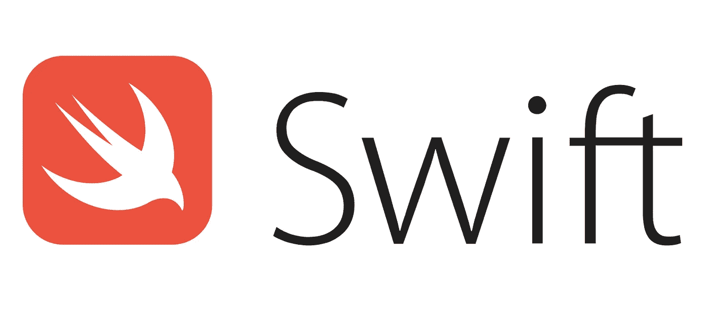
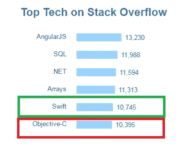
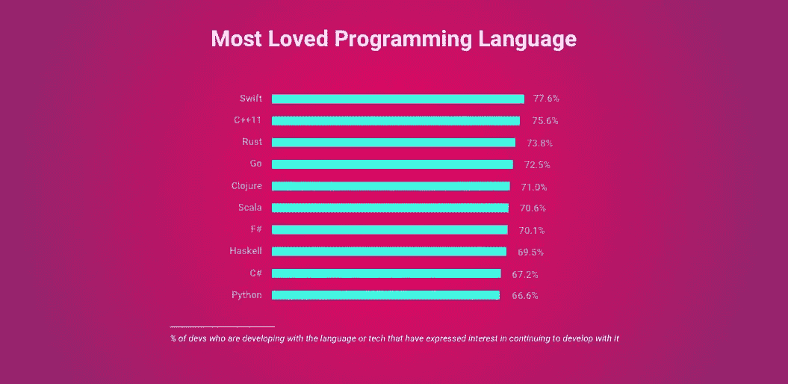

# 您应该始终使用 Swift 进行 iOS 应用程序开发，原因如下！

> 原文：<https://medium.com/hackernoon/the-only-time-you-should-use-for-ios-app-development-is-swift-heres-why-79c837e718f3>

# 旧的编程语言不会很快消亡，但坚持使用它们的公司会。

无论您是一家初创公司、移动应用程序开发机构还是一名个人开发人员，如果您还没有调查过 Swift，那么您应该调查一下。

原因是 Swift 不仅有潜力在未来几年开发响应迅速、功能丰富的 iOS 应用，而且已经接管了 Objective-C。

Upwork 的一项研究还显示，Swift 是自由开发者、应用开发商店和创业公司增长最快的技能之一。

事实上，Swift 已经被科技巨头使用，包括 Hubspot、Lyft、Asana、Pandora 和[1120 多家公司](https://stackshare.io/swift/in-stacks)。

由于几个关键的特性和好处(*，我们将很快讨论*)，Swift 比 Objective-C 更快、更智能、更好

# iOS 版 Swift 应用开发的兴起

长期以来，objective-C 一直是构建 iOS 和 OSX 应用程序的首选语言。但在 2014 年苹果宣布 Swift 编程语言之后，它为那个时代带来了终结。

Glimpse of Swift’s Growth

Swift 是现代的、安全的、比 Objective-C 更复杂的，并且为开发 iOS 应用程序提供了高水平的交互性。

苹果甚至在 2014 年 WWDC 期间将 Swift 描述为*“没有 C 的目标-C”*。

事实上，在其推出的短短几个月内，Swift 的下载量就超过了 1100 万次。

由于这种最初的反应，Swift 也成为 2015 年最受欢迎的编程语言，[根据 StackOverFlow 2015 开发者调查](https://insights.stackoverflow.com/survey/2015)。

Image Credit: StackOverFlow

然而，增长并不止于此。Swift 也成为历史上增长最快的语言 [TIOBE Index](https://www.tiobe.com/tiobe-index/) &进入 2017 年 top 10 榜单。

即使在 2018 年，在 2018 年 9 月 Swift 4.2 发布后，Swift 仍然保持在 top 10。

尽管有这些因素，许多初创公司和大型组织仍然进退两难，不知道哪一个是 iOS 应用开发的更好选择。

在本文中，我们将解释 Swift 到底提供了什么，使得世界顶级科技巨头采用这种语言。

# iOS 应用程序开发的未来有利于 Swift 的 7 个原因

尽管与 Objective-C 相比，Swift 是一种“年轻”的编程语言，但它提供了构建经济高效的现代 iOS 应用程序所需的一切。

以下是您在所有 iOS 应用程序开发工作中应始终选择 Swift 的主要原因。

# 原因 1 — Swift 更易于维护

你知道为什么 Objective-C 无法满足不断变化的需求吗？

一句话——**遗产**。

遗留问题阻碍了 Objective-C 的发展。你看，没有 C 的进化，Objective-C 就不能进化。

C 编程语言基本上要求程序员维护两个文件来构建可执行的应用程序，这一要求也延续到了 Objective-C 中。

另一方面，Swift 放弃了这种两个文件的要求。LLVM 编译器和 XCode 可以很容易地识别代码中的依赖关系，从而自动执行增量构建。

换句话说，在 Swift 中不需要将目录(头文件)与主体(实施文件)分开。

Swift 直接将头文件和实施文件合并成一个单独的(.swift)文件。

这意味着，程序员花费更少的时间记账，因为 Swift 消除了样板代码，这意味着有更多的时间来创建应用程序逻辑。

# 理由 2 — Swift 更安全

安全在移动应用中至关重要，尤其是对基于应用的创业公司而言。如果该应用程序也更容易维护，这是一个额外的特权。

Swift 两者都提供，而 Objective-C 则没有。

在 Objective-C 中，如果你试图用一个 nil 指针变量调用一个方法，它什么也不返回。整个代码块变得不可操作，从而导致错误的代码。

虽然这可能看起来有益，因为它可以防止应用程序崩溃，但它也是一个主要的错误中心。

另一方面，当指针变量为零时，Swift 会生成编译时错误。这使得程序员不得不有目的地强制编写代码，彻底消除产生坏代码的可能性。

简而言之，它迫使程序员立即修复问题，使错误识别和修复过程更容易。

# 原因 3 — Swift 更快

Swift 在 iOS 应用程序开发过程中提供了一定的速度优势。

例如，Swift 中复杂对象排序的运行速度[比 Python 中快 3.9 倍](http://osmium.com.au/swift-programming/)。

事实上，[灵长类实验室的一份报告](http://www.primatelabs.com/blog/2014/12/swift-performance/)也证实了 Swift 的性能与 C++不相上下，这表明苹果非常认真并致力于提高 Swift 运行应用逻辑的速度。

总体而言，Swift 已被证明是性能最快的语言，超过 Objective-C 或任何其他用于构建 iOS 应用程序的语言。

# 原因 4 — Swift 在内存管理方面实现了统一

在 Objective-C 中，自动引用计数(ARC)只支持面向对象的代码和 Cocoa Touch APIs，而将过程化的 C 代码和 API(如核心图形)留在后面。

另一方面，Swift 提供了对程序代码和面向对象代码的全面支持。

这意味着，在 Objective-C 中，当使用低级 API、过程代码和核心图形 API 时，处理内存管理是程序员的责任。

然而，Swift 在编译时通过 ARC 处理所有内存管理，节省了时间和脑力，可用于创建应用程序逻辑。

# 原因 5 —支持动态库

动态库基本上是可以链接到 iOS 应用程序的可执行代码块。

简单来说，动态库在 iOS 应用程序之外，但包含在从苹果应用商店下载的应用程序捆绑包中。

在 Swift 发布之前，iOS 从来不支持动态库，尽管它们适用于 Mac。

现在有了 Swift，可以添加动态库。

事实上，Swift 还允许 Swift 应用程序链接最新版本的 Swift 语言。因此，Swift 缩小了应用程序的规模，因为外部代码仅在使用时才链接。

# 理由 6 — Swift 有一个光明的未来

Swift 在 2015 年由苹果公司开源，这表明苹果公司愿意从社区获得反馈，以做出一致的改进，因为个人开发者有助于使该语言更加成功。

事实上，自从苹果公司将 Swift 开源以来，世界各地的开发者在修复漏洞、增强 Swift 语言本身甚至添加有用的功能方面做出了巨大贡献。

因此，Swift 现在不仅得到了许多开发人员的支持，而且还成功地变得设计良好&结构良好。

# 结论:

我们(*和世界*)见证的 Swift 的飞速发展确实令人鼓舞，充满希望。

Swift 的功能包括更简洁、更具表现力的语法、易于编写和可读性，以及更短的开发周期，这使得它成为构建任何类型的 iOS 应用程序的完美选择&适用于任何设备。

简而言之，苹果带着未来的愿景开发了 Swift，以增强未来几年的 iOS 应用程序开发流程。

简而言之，现在已经证明，毫无疑问，Swift 在许多方面都是比 Objective-C 更好的语言，将是初创公司和组织与 [Swift 一起进行 iOS 应用开发](https://www.zealousys.com/swift-app-development/)的最佳选择。