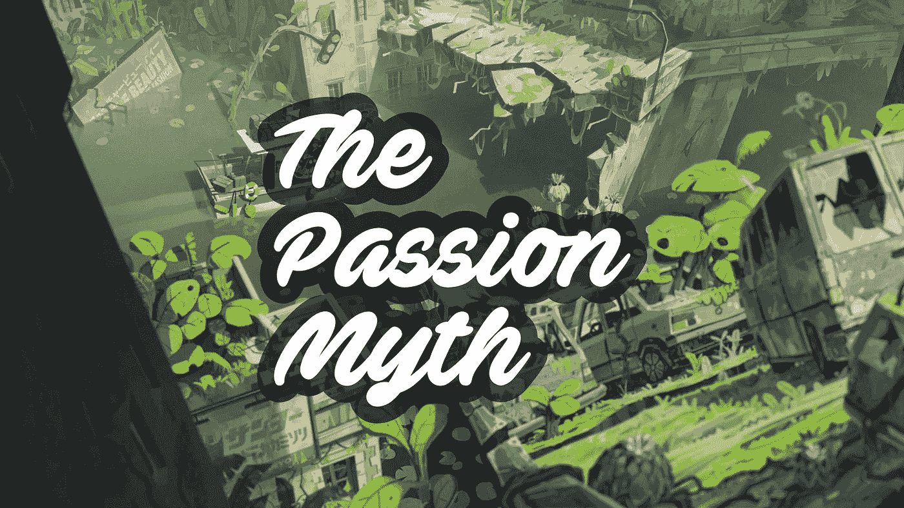
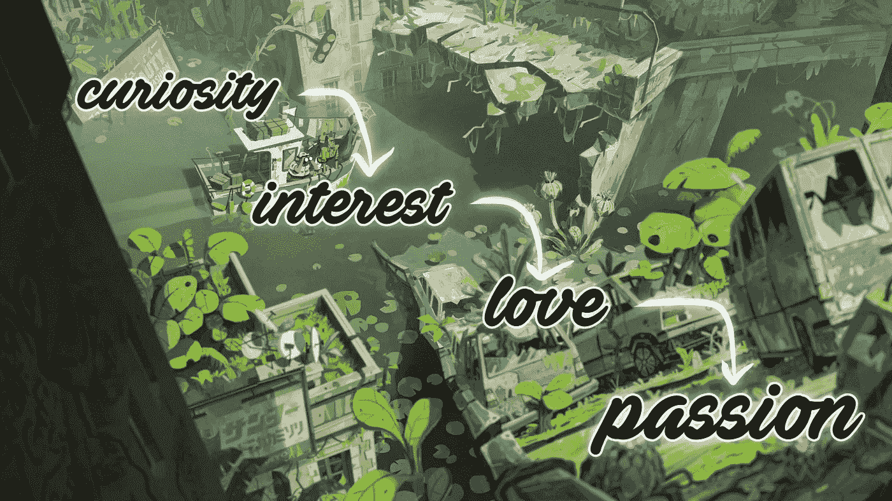
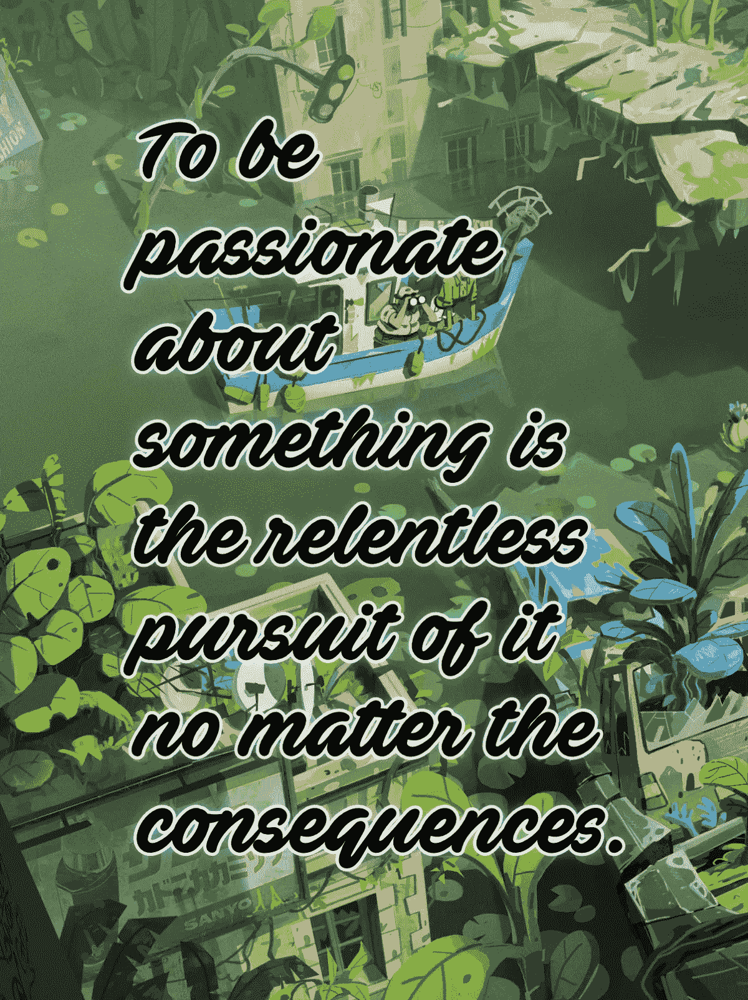
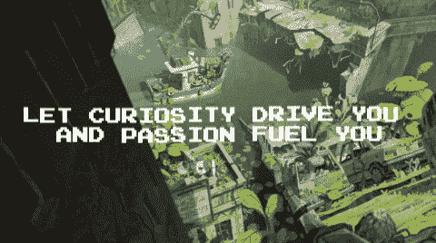

# 你找不到激情，你创造激情。

> 原文：<https://medium.com/hackernoon/the-passion-myth-you-dont-find-passion-you-create-it-17a5213caed1>

## 我们都在寻找自己的激情，但大多数人都误解了这个概念。

## 你不是生来就有激情的

我们并非生来就有激情。我们生来就有天赋。

我们找不到我们的激情。我们发现我们的天赋可以给我们一个提示，告诉我们什么是值得尝试的。

我们天生没有激情。我们建造它们，孵化它们，培育它们。

## 寻找你的激情…

也许你已经有了激情。如果你在寻找激情的现有来源，问自己:*“我对什么有激情？”*不会有太大帮助。

相反，你可以问:*“当我做一件事的时候，我感觉沉浸在了什么事情中？”*、*“我可以花几个小时学习和讨论什么主题？”*。

顺便说一下，这不一定与你的职业有关。举重🏋️‍♂️，观鸟🦆制陶🏺，慈善工作💙，哲学🏛️可以成为你的全部激情。虽然它们可以，但这些不一定要成为你的职业，因为你对它们充满热情。尽管从事你热爱的事业是一个人能取得的最大成就之一。

如果你确信没有你有丝毫热情的东西，你不会被设计所击垮，而是由你自己去创造它。如果你想创造新的激情，停止审视你的灵魂。相反，抬起你的头，看看外面！出去尝试一下吧！

激情是可以构建和选择的，而不是我们与生俱来的，这一事实既让人麻痹，也让人充满力量。我们到底从哪里开始？我们选什么？选择是巨大的…

## 想法一:跟随你的好奇心

激情的种子是好奇心。好奇会导致兴趣，兴趣会发展成爱，爱会发展成激情。

你对某件事感到好奇或有一点点兴趣吗？深吸一口气，一头扎进去。建一个 website🖥️，预定一个萨克斯管班🎷，报名参加在线珠宝制作课程💍，写一篇关于运动鞋的博客👟，要求参与 work🖌️有趣的设计项目，尝试烘焙一些酸面团🥖志愿去柬埔寨教科学👨‍🏫。

## 想法二:追随你的天赋

> “大多数人都是反过来理解的。他们认为我们发现了自己的激情，这让我们擅长某些事情。实际上，首先是发现自己很优秀。”—奥利弗·恩伯顿

也许你擅长处理数据📊或者你很有魅力💬或者你擅长 debating🗣️.与此同时，明智的做法是避免你可能因为劣势而不擅长的事情:如果你的耳朵听不懂音调，也许不要尝试唱歌🎤如果你的膝盖不好，也许不要参加长跑🏃‍♀️，如果你有很高的道德标准，也许不要进入银行业。💰

我在这里并不提倡远离任何你没有“天赋”的事物。天赋并不是激情的必要条件。天才所做的，就是增加你正在尝试的事情的几率，发展成一种激情。因为你可以更快变得更好。正是这种成长的良好感觉，擅长某件事的良好感觉，让这团火持续燃烧。
如果你对某件事非常好奇却没有天赋，见鬼；一定要尝试一下，不要让它阻止你。
*PS 你不必对自己做的每一件事都充满热情。

同时，在某方面有天赋并不意味着它一定会成为你的热情所在。你还是要经历艰辛才能让它成长，但是又一次；拥有那一点点天赋会增加那项活动发展成激情的可能性。

## 不会有灵光一现的时刻

不会是一帆风顺的。你必须经历艰难困苦，才能将这种兴趣培养成激情。这不会在一天之内发生，也不会有一个瞬间让你顿悟，找到你丢失已久的激情。这通常是一次漫长的过山车之旅。

## 激情在进化

我们热爱的东西会随着时间而改变。

就像我们的兴趣会改变一样，同样的事情也会发生在我们有激情的事情上，因为激情是一种兴趣，但要强烈 1000 倍。

有些激情会消失，有些会退化为兴趣，有些会通过时间的考验。激情的流动性是我们作为人类流动性的自然结果。就像我们在进化一样，我们的激情也在进化。

激情依旧。我们不是生来就有的。

## 你可能不需要有单一的激情

很少有人知道。

一方面，拥有一种激情很棒，因为它让我们把所有的精力和爱都集中在一件事情上。然后，我们就可以在这一点上成为前 5%的人之一。

但另一方面，有一种激情是危险的，因为你可以把你的认同感挂在这件事上，你知道他们说什么:不要把所有的鸡蛋放在一个篮子里。事实上，拥有多种激情并将它们结合在一起会产生比各部分之和(1+1=3)更大的结果。像 writing🖊️ + knitting🧶，摄像📹+历史记录📜，coding⌨️ + marketing✨.

我们关注的是深度(1 种激情)还是广度(多种激情)？我们应该把我们的好奇心当作一个指南针，它带我们到哪里，就带我们到哪里。但我们总是要努力平衡健康的超然与令人兴奋的依恋。

## 上瘾的界限很窄

*对某事充满激情就是不顾后果地不懈追求。*

如果那件“事情”的结果过于消极，我们倾向于称之为*上瘾*或*痴迷*。

如果那件‘事情’的结果过于积极，我们称之为*热情*。

但从根本上说，它们是非常相似的行为。

## 保持你的手指在脉搏上

你需要不断调整你的激情。

这是一种不健康的痴迷还是一种丰富的激情？你是累坏了还是太放松了？你这样做是为了获得掌声(外在的)还是为了自我表达的需要(内在的)？
你是让这件事成为唯一消耗你思想的事情，还是让它与其他事情保持平衡？什么是“正确的”天平？

只有你才是评判的人。不是社会，不是你的家人，不是你的朋友。

## 内在动机和激情

真正的激情始于内在动机。你为自己而做，而不是为了别人的喝彩、认可或接受。

当然，与世界分享你的激情仍然是一种快乐！这通常是它有意义的原因。分享你的天赋、艺术和知识。但是你需要确保外在动机(分享)和内在动力之间的平衡。

你必须为它的工艺，它的爱而做。否则，当掌声、喜欢和认可停止时，你的“激情”可能会消失。这不是真正的激情。

## 艰难困苦

“激情”:这个词起源于πάθος，最初用来形容痛苦。今天的“激情”是一个有积极内涵的词，但如果你仔细想想，它的起源绝对有意义...我们的激情是我们如此热爱的东西，以至于我们认为它们值得我们为之受苦。

> [男人]更关心拥有愉快的回忆和期望——尤其是后者。有了这些保证，他可以忍受一个极其悲惨的礼物。—艾伦·沃茨

当你有激情时，苦难不会结束；正是它开始升温的时候。有激情并不意味着你会一帆风顺。也不知道你会每天从床上跳起来。

你会跌倒，会累，会无聊，会失望，有时还会怨恨。但如果这真的是一种激情，那么痛苦是值得的。

## 工作是激情的燃料

成败在此一举。高潮或低谷。总是回去工作。

激情需要滋养才能成长和繁荣。你必须添加燃料来保持火不灭。

燃料以专注工作的形式出现。你可以称之为“心流”。没有挑战或失败的风险，就没有流动。这可能是痛苦的，但是如果你能克服消极的感觉，痛苦的另一边就只有积极的感觉了。

## 要耐心

激情开始是一个普遍的主题，随着时间的推移，它成熟为一个越来越集中的小众激情。例如，对汽车的热情可能演变成对修复 60 年代老爷车的热情🚗或者，对烹饪的热情可能演变成对美食素食甜甜圈的热情🍩你永远不知道你的好奇心会把你带到哪里。这也是乐趣的一部分！

这个不要想多了。不要指望你会从第一天就找到自己的位置。从广阔的地方开始，用你最初发现你的激情的完全相同的方法深入下去:尝试一些事情；被好奇心驱使。

## 重新混合:

📚[好到他们无法忽视你](https://amzn.to/2JZTl9p) —加州纽波特
🎙️Rich 罗斯播客— [激情的悖论](https://soundcloud.com/richroll/rrp429%0A)
📝如何找到你的激情