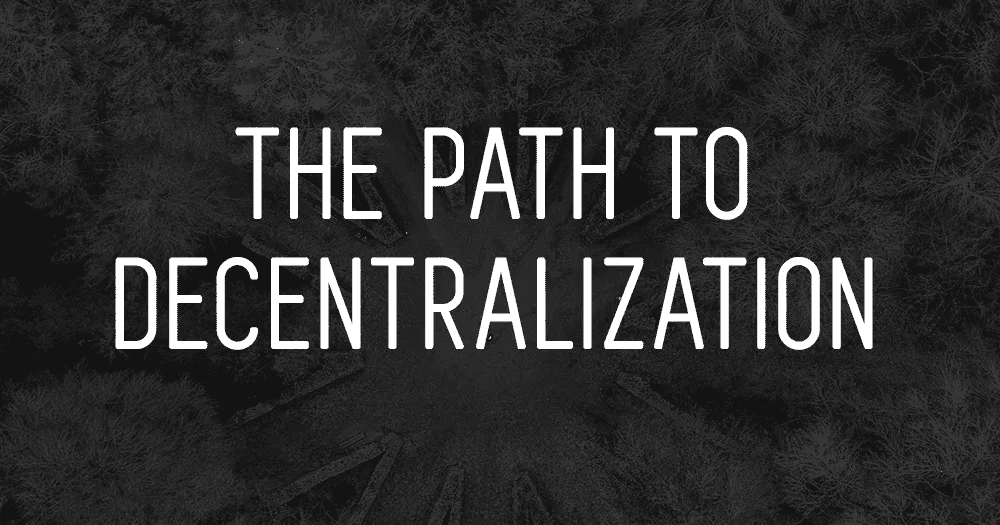

# 权力下放之路

> 原文：<https://medium.com/hackernoon/the-path-to-decentralization-c16f49e012c7>

## 这是一条漫长的路…

*2019 年 1 月 18 日，D 克莱恩*

# 黑盒

在我最喜欢的电视剧之一《IT 人群》(IT Crowd)的一个经典片段中(如果你还没有看过，说真的，请尽快把它添加到你在网飞的列表中)，主角们在伦敦市中心一家功能失调的公司高层建筑的黑暗肮脏的地下室中工作，试图摆脱他们新任命的老板。他们的阴谋是通过鼓励她在她的第一次演讲中向她的同事介绍一个简单的黑盒子来使无能无知的新 IT 经理尴尬。他们告诉她，这个简单的黑匣子就是……互联网。

APstock

当主角们在演讲的最后一排窃笑时，他们沮丧地意识到，没有一个在场的同事加入笑声，而是对这个据称是所有在线事物的中心的重要设备的存在感到敬畏(当然，它是无线的！).当盒子被意外破坏时，人群爆发出恐慌和混乱，逃离现场，对这个突然悲惨地失去互联网的世界的深远影响感到震惊。

如果互联网只是一个黑色的无线盒子，那么这个盒子被破坏将会是毁灭性的。当然，即使只是第二个盒子作为备份也要安全得多。简单地说，这就是集权的问题。

第二个盒子是去中心化的开始。当然，在现实中，互联网由遍布世界各地的成千上万个集线器组成，将各地的用户相互连接起来，从而不依赖于任何一个易受攻击的节点。这就是为什么互联网如此强大，如此具有文化和历史变革性。没有去中心化，互联网只不过是情景喜剧中的一个笑话。

# **中央集权问题**

这个中央集权的问题对于我们目前的法定货币金融体系来说非常重要。它是高度集中的，几乎完全由极少数人控制。如果这些实体中只有少数经历了某种危机，我们的整个金融体系就很容易出现极其严重的问题。这种情况时有发生，也确实时有发生，正如我们在哥伦比亚和土耳其等地所看到的那样，在这些地方，中央控制的货币已经崩溃，现在几乎一文不值，导致了从极端失业到食品短缺到医疗保健危机的广泛问题，所有这些问题都依赖于失败的中央枢纽，而这些中央枢纽是由无能的领导人集中运营的，并且恰好容易受到负面影响，通常是外部干预力量的影响。

这是许多加密货币的独特卖点，但即使是加密货币也并非都是同等分散的。事实上，各种加密货币的许多元素根本不是分散的，这经常导致加密领域不同阵营之间的激烈争论和分歧。一些货币只以一种或两种方式分散，而以其他方式集中，从而否定了真正分散的一些优势。让我们来看几个不同类型的集中化的例子。

# 验证，而不是信任

比特币本身源于一个基本前提，即如果使用数学而不是相信任何个人或群体的良好意愿，人们可以创造一种不受任何一方突发奇想支配的货币形式。没有信任是必要的；只有数学验证。于是，比特币分散了货币的生产；任何地方的矿工都可以参与生产，而不是在造币厂印刷，因此可以在个人自由的基础上控制所有权，而无需信任银行或中央当局。

## 采矿

甚至比特币在某种程度上仍然是集中的。现实是，比特币不再被一般的电脑爱好者挖掘。它主要由相对较少的强大 ASIC 采矿运营商和联营公司开采。随着一度占主导地位的矿业巨头比特大陆的持续衰落，这种集中化有所减弱，导致各种矿池的分布更加均匀。即使散列权力相对高度集中在少数矿池手中，它至少仍比任何传统的法定货币分散得多。

## 管理

治理——负责对某一特定货币做出决策的人——也可以集中化。以比特币为例，世界各地大量不同的开发者为这种货币的软件做出贡献，确保它的安全，优化它，提出改变，并维护它。然而，最终，矿工选择是否通过采矿行为发生重大发展变化。例如，在 SegWit2X 的案例中，该提议失败了，而一些矿工选择开采更大的比特币替代品比特币现金。由于、吴等个人以及阵营中的其他主要人物的主要影响，以及主要由少数实力强大的采矿场开采的事实，这种选择更加集中。这种集中化的程度在比特币现金 ABC 与 SV 分裂早期出现的哈希战争中得到了进一步证明，在这场战争中，只有少数强大的行为者将他们的大量资金投入到赢得链赛所需的矿业力量中。

## 所有权

随着时间的推移，这种情况可能会改变，但就目前而言，比特大陆也持有大量比特币现金。这是另一种集权——所有权的集权。如果只有少数几个实体拥有某一货币的绝大部分，就会把不适当的影响力掌握在少数人手中。比方说，不管出于什么原因，比特大陆决定出售其持有的 25%的 BCH 股份。货币的价值会立即跌入谷底。在某种程度上，这也可以说是关于比特币的，比特币的许多私钥也非常大量地集中在少数几个数字钱包中。

## 集中式加密货币

XRP 是另一种经常在讨论或激烈争论中央集权话题时出现的货币。这是一个从未被开采的货币的例子，所以从一开始就是完全集中的，并由 Ripple 的创始人独家拥有。从那时起，在某种程度上分散开来，现在 XRP 大约 60%的股份由 Ripple 持有，而杰德·麦卡勒等几位重要的创始人也拥有价值数十亿美元的 XRP。这种货币在治理方面也是中央集权的——这里没有民主的发展体系——在这个意义上，它也是中央集权的。因此，XRP 是一个货币集中生产、集中拥有和集中管理的例子，至少在很大程度上是如此。XRP 的支持者会指出，XRP 的实际交易正变得越来越分散，但值得一提的是，这只是在考虑集中化问题时应该考虑的一个属性。XRP 的所有权和交易共识可能会继续逐渐变得不那么集中，但就目前而言，XRP 在许多方面仍然非常集中。

# 权力下放的范围

所以，实际上，我们看到的是一个光谱。人们倾向于选择一个单一的属性来吹捧一种给定的货币是如何分散的，或者批评它缺乏分散性，但在现实中，人们应该考虑很多；生产、治理、所有权和交易的共识，等等。没有一个项目是完全分散的，因为总会有一些元素至少在某种程度上由相对较少的人控制。

当谈到努力实现真正的去中心化——或者最接近去中心化——有几个项目很突出。问题是，因为这些项目是如此分散，他们没有闪亮的大公司，高度公开和受欢迎的倡导者，或大规模的广告代理机构来推广他们。推动去中心化的货币的一些明显例子是 DigiByte、Vertcoin、Komodo、Zilliqa、Holochain、Monero 和 Ravencoin 等项目，但还有许多其他项目。这些项目往往比较低调，预算相对较少(或者除了对基金会的捐赠之外没有任何预算，因为大量集中的预算掌握在少数管理人员手中是一种集权形式)，大多数开发工作由志愿者和热心者完成，因此它们往往不会像 Tron 或 XRP 这样的市场力量一样受到关注。

正是这种不断走向去中心化的推动力将改变全球金融模式。曾经让互联网改变信息生产和传播方式的变革力量，现在可以延伸到世界与货币的互动方式。希望我们可以享受一个未来，像互联网一样，金钱不再受少数强大精英的支配，而是不受中央控制和漏洞的影响。

说真的，如果你还没看过 IT 人群，下周末留出一些时间来疯狂观看。

*本文由 D. Kleine 与*[*WeWriteCrypto*](http://wewritecrypto.com)*合作撰写。*[*WeWriteCrypto*](http://wewritecrypto.com)*在加密货币领域提供量身定制的代写服务。* [*联系我们*](mailto:vincent@wewritecrypto.com) *如果你喜欢达伦的风格。*