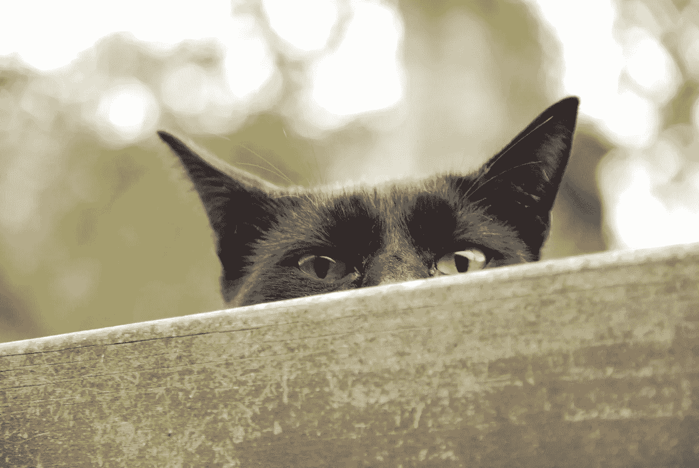
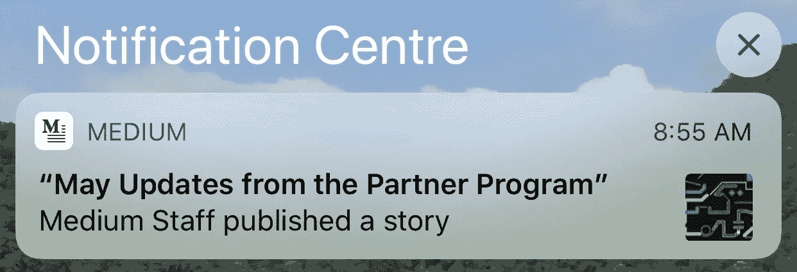
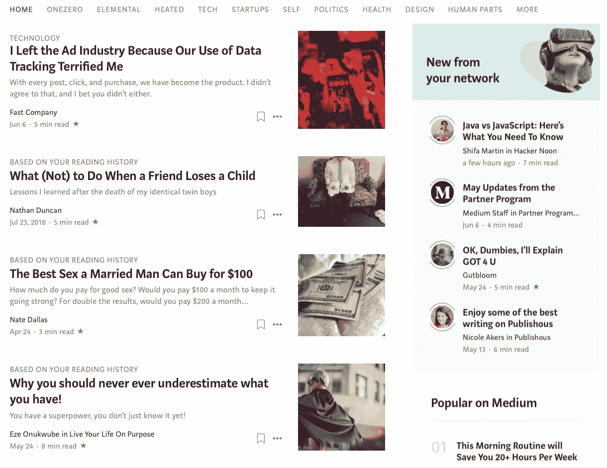
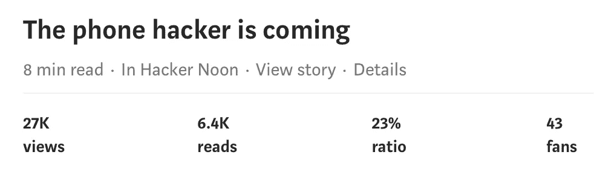
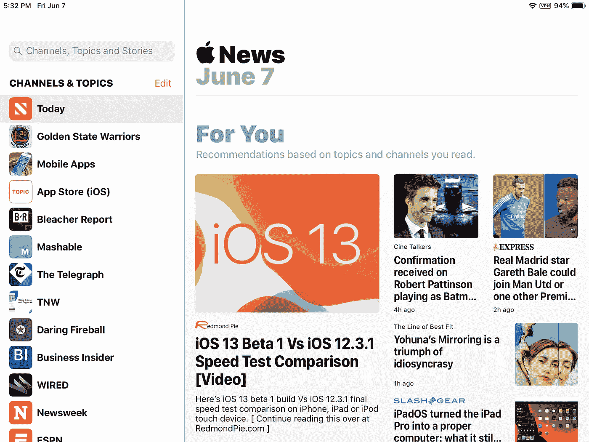

# 媒体的付费墙悖论

> 原文：<https://medium.com/hackernoon/the-paywall-paradox-of-medium-3dd0a6a7bde6>

## 创建启用媒体付费墙的内容的作者被同一付费墙阻止阅读媒体的内容

When the wall built with your help, is used against you (courtesy [pxhere](https://pxhere.com/en/photo/612404))

这篇文章是关于我的观点在一个月之后如何改变的。

几天前，我收到了来自媒体的以下通知。这导致了一个困境，或者应该理解为 trilemma。作为一名刚刚来到 Medium 付费墙之外广阔世界的移民，我刚刚意识到，现在我每月只能在 Medium 上阅读三篇文章，之后我将被驱逐到付费墙之后。所以，如果我读《中等邮报》,这是否意味着我在六月剩下的时间里只能读另外两篇文章？

出于好奇，我访问了 Medium 的主页，查看菜单上还有什么。“五月更新……”的文章就在那里。但是如果我被要求从那个页面上的所有帖子中用完我的三个帖子配额中的一个，那中等的帖子肯定不会在我的选择中。我们甚至没有讨论媒体上其他地方的数百个故事。

向其非付费作者发送这样的通知揭示了媒体与现实有多么脱节。我的意思是，为什么任何这样的作家会愿意浪费他们每月三篇文章中的一篇，去听媒体自吹自擂呢？(如果默认情况下此通知是打开的，那么 Medium 需要为非成员关闭它。)

那么，为什么我不只是支付 5 美元的费用，并访问所有的媒体？事实上，我这样做了两年多，因为我喜欢这个平台，想在上面支持作家。但我停止了付费，以抗议 Medium 对来自世界贫困地区的会员作家的歧视和不包容态度。

 [## 为什么我退出我的媒介会员

### Medium 不付钱给来自欠发达国家的作家，但对拿走我们的钱毫无顾忌

hackernoon.com](https://hackernoon.com/why-i-quit-my-medium-membership-909909657ba) 

尽管我们支付了同样的 5 美元会员费，但我们在媒体上写作是没有报酬的。如果我们不交会员费，我们一个月只能看三篇文章。(公平地说，如果你是一家媒体出版物的作者，你可以完全访问该出版物上的所有文章。但如果你是 Medium 上的独立作家，那么你只能得到三篇文章，外加 Medium 的 Twitter feed 上出现的任何内容。

当一个平台阻止为其提供内容的同一批作者访问网站时，情况就相当糟糕了。关于这一点没有两种方法。

## 付费墙的利弊

付费墙的理由是作家和记者投入时间和精力来创作他们的文章。这是他们谋生的方式。如果他们被迫免费提供他们的作品，他们该如何生存？

曾几何时，广告是答案。但在许多方面，我们的数据被脸书这样的人滥用，以及广告的侵入性之后，读者开始寻找广告的替代品。付费墙是解决这个问题的一种方法。截至目前，相当多的出版物都在效仿 NYT 建立付费墙，但只有时间才能证明它们是否会成功。

不过，我不会押注于付费墙，因为寻找逃避付费的方式是人类的天性。当然，我仍然为我在印度的报纸付费，但是每月不到 2 美元，因为它有很高的补贴。被谁？你猜对了，广告。

反对付费墙的论点是，免费互联网在过去二十年里对许多重大变化负有责任，主要是因为它促进了知识的自由流动。付费墙扰乱了这种流动，可能会扼杀进步的步伐。事实上，学术界是受付费墙打击最严重的领域之一，它的规模让我震惊。

下面的链接是一个关于这个问题的纪录片(这个视频通过在开始时突然停止发布一个类似付费墙的公告来戏剧化地描述一个付费墙，有一瞬间我以为这是一个付费视频！).我发现这些采访很有趣，因为学者们非常善于表达，你可以看到他们典型的学术超然是如何被付费墙的不合逻辑所扰乱的。就像公共资助的研究如何不能免费提供给研究人员，这导致研究论文的作者错过了与其他研究人员的评论和互动，而这反过来又是研究的生命线。顶级学术出版商爱思唯尔 35-40%的利润率往往高于一些最赚钱的科技公司，如苹果、脸书和谷歌*(礼貌用语:*[*Vimeo*](https://vimeo.com/273358286)*)*

## Medium 的付费墙是一种欺骗

我对付费墙了解不多，但 Medium 正在发生的事情是对它的曲解。我于 2015 年开始在 Medium 上写作，并随波逐流，因为 Medium 从一个无广告的平台演变为一个基于广告的模式，并最终成为一个付费的出版物。我认为灵媒界的当权者会做正确的事情。直到我退出媒体合伙人计划后，我才意识到这个制度是多么不公平。

让我用一个个人的例子来说明。我在 Medium 上的短文，[电话黑客来了](https://hackernoon.com/the-phone-hacker-is-coming-48e94ae3b259)，是为了让我的读者意识到手机黑客，以及如何保护他们的手机。我写这篇文章是没有报酬的，只要我的读者能免费阅读这篇文章，我就没意见。

然而，当媒体竖起收费墙时，整个事情变成了一场闹剧。那篇文章已经有 27000 次浏览(这只是我在 Medium 上发表的 200 多篇帖子中的一篇)。付费墙的运作方式是，希望阅读我帖子的读者向 Medium 付费，而我一分钱也没有。在 Medium 上有很多像我一样的作家，他们在 Medium 上发布了数千篇文章，却什么也没赚到。

雪上加霜的是，我的帖子现在甚至不向公众开放。如果这还不是敲诈，我不知道什么是。

是的，有一个叫做中型合作伙伴计划的项目，我已经参与了两年。上个月，当我意识到这也只是另一场闹剧后，我辞职了。媒介合作伙伴计划只支付给那些足够幸运地生活在 23 个国家之一的[的作家，这些国家毫无疑问都是富裕的发达国家。](/indian-thoughts/is-medium-trying-to-make-the-rich-richer-f47d10217b50)

包容性不是媒介的优势。

## 出锅入火？

当前的趋势是将付费墙视为公平，将广告视为邪恶。就我个人而言，我非常讨厌广告，并把尝试我遇到的每一个广告拦截器作为我的使命。但根据我目前的经历，我想知道从广告模式转向付费模式是否是一种“煎锅入火”的情景。比如说，我不介意 Duck Duck Go 上的广告。他们不会收集用户数据，而是只根据用户搜索的关键词来显示广告。如果这是真的，它当然不会打扰或令人毛骨悚然。我没意见，因为他们提供搜索服务，他们的努力应该得到回报。危险在于广告控制内容。但如果 Duck Duck Go 能够保持其广告模式的独立性，我看不出 Medium 为什么不可以。

## Medium 的编剧是怎么想的？

如果 Medium 费心去核实一下它的作者，我认为大多数人都不愿意成为一个非包容性付费系统的一部分，这个系统歧视 23 个富裕国家之外的作家，他们宁愿忍受一定程度的非侵入性广告，以避免这种情况。更重要的是，我敢肯定大多数作家更喜欢广告，而不是阻止向媒体提供内容的作家。然而，我们永远不会知道 Medium 的作者是怎么想的，因为 Medium 从来没有问过它的社区。

## 为什么灵媒会这样？

根据我与[德米特里·扎依采夫](https://medium.com/u/7f7d7c98862f?source=post_page-----3dd0a6a7bde6--------------------------------)的讨论，我可以提出三种可能性。

贪婪:Duck Duck Go 一类的广告会产生数百万的收入，但是 Medium 想要数十亿，并且相信付费墙会帮助他们淘金。

无能:媒体可能对自己缺乏信心。但现实是，Medium 是无能的，无法判断反对付费墙的广告的好处。否则，他们为什么要雇佣 Stripe 呢？尽管已经过了两年半，他还没想出如何在印度支付我的费用，而从那以后，他在收取我的会员费方面也没有任何问题。

**傲慢**:媒体认为它比它的作者更伟大，对他们的观点毫不在乎。忘掉对平台上所有作家的公平、包容和非歧视，Medium 的态度似乎是一种傲慢的‘要么接受，要么放弃’。

**无知**:媒体似乎有这样一种印象，比起他们需要他们的作者，他们更需要他们的作者。自从我进入付费墙后，我就没怎么享受过中等收入，我也不觉得我错过了什么。事实上，我已经开始远离媒体，经常跟在我所关注的离开媒体的出版物后面。

## Medium 作为内容提供商有多好？

我承认我想念很多媒体上的作家，主要是因为他们独特的个性在评论区闪耀。但就实际内容而言，没有媒体我也能过得很好，因为有几十个免费的新闻聚合器。即使是苹果新闻应用在印度的限量版，也可以从一系列出版物中选择文章，尽管并非所有的文章在印度都有(见下文)。将它与 Flipboard 和其他几个新闻应用混合在一起，就阅读内容而言，我认为没有必要使用媒体。

## 我喜欢中号什么？

Medium 通过为作者托管内容提供了很好的服务。我喜欢这个平台的简单设计和易用性，以及它允许作者与读者互动的方式。我还没有在其他地方看到这一点(我还没有努力寻找)，这可能是我仍然在这里的原因。

## 有人能引诱我离开媒介吗？

我希望随着更多的作家意识到这个平台的不包容性，事情会有所改变。我的感觉是，这样一个不平衡的系统最终会崩溃。我知道一些作家因为付费墙拒绝读者进入而停止写作，也有一些作家因为其非包容性的支付系统而离开平台。

那么，到底发生了什么呢？这是一个媒介趁火打劫的例子吗？

与此同时，如果 Medium 的竞争对手能够复制该平台的简单设计和易用性，并建立一个非侵入性的广告系统，为自己和作者创造收入，我很快就会消失。

## 媒体是在剥削作家吗？

Medium 的付费系统并没有真正给作家带来多少收入。由于 Medium 上的大部分写手都是业余爱好者，所以他们赚的钱不会超过几块钱(如果他们足够幸运能得到 Medium 的报酬的话)。所以钱不是这里真正的问题。但是在交了两年会费之后，我不得不面对这样一个现实:Medium 无意包容。

事实是，作为一个部落，作家往往是害羞和安静的，所以很容易被利用。我相信 Medium 正在利用这一点，避免将来自世界贫困地区的作家纳入 Medium 合作伙伴计划。如果我们默默地接受这种不公正，我们就成了问题的一部分。我的抗议方式是取消我的媒体会员资格，并通过定期写这样的帖子让读者了解正在发生的事情。

请评论、鼓掌、分享、转发，甚至可能的话，贴出你自己关于这个主题的故事。我们做得越多，Medium 就越难把头埋在沙子里，假装这个问题不存在。