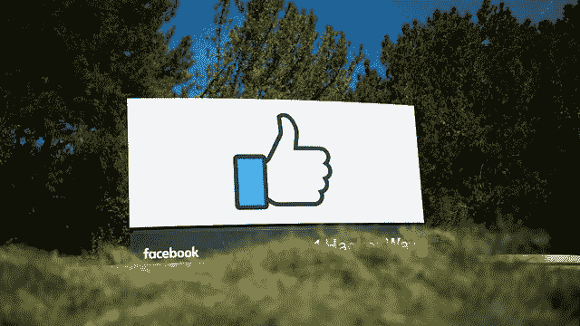
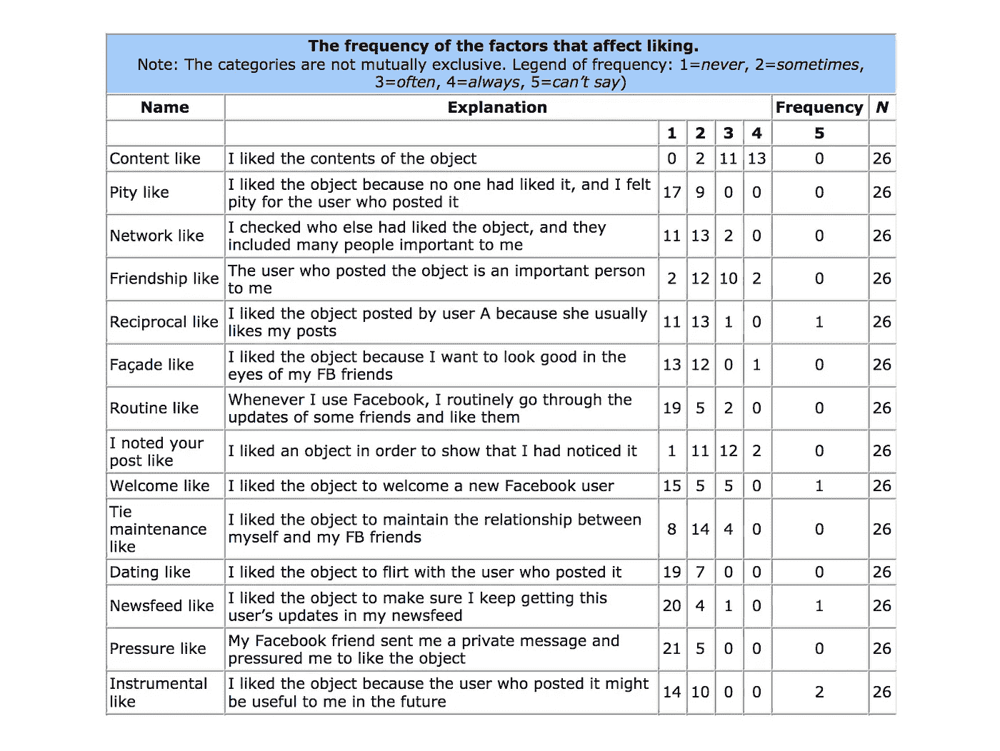
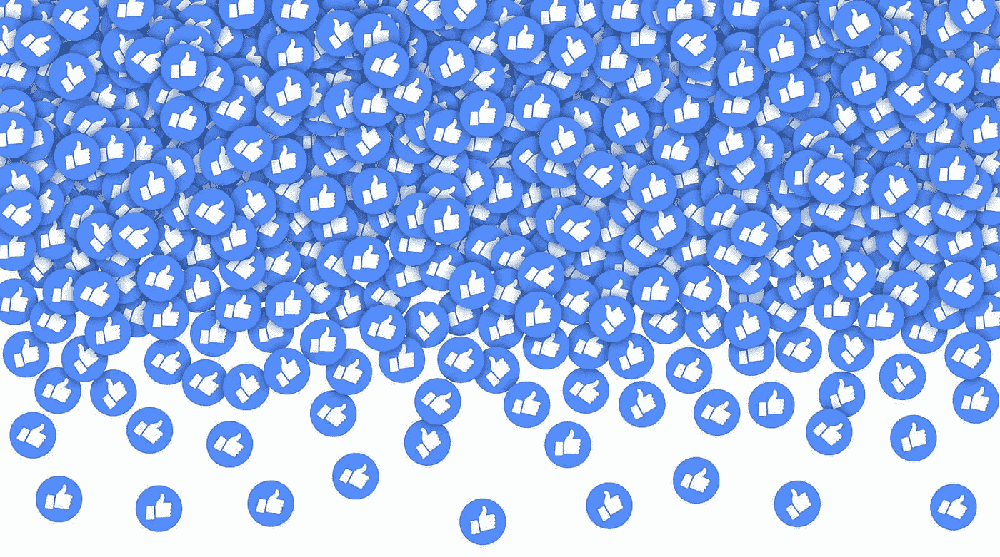

# 社会喜欢现象

> 原文：<https://medium.com/hackernoon/the-phenomenon-of-social-like-a9608f392f25>

## 喜欢按钮对你的产品真的重要吗？

1 Hacker Way — Facebook’s headquarters in Menlo Park. Photo: David Paul Morris

# 喜欢按钮的简短历史

第一个版本的 Like button 也叫做 Awesome button，是由脸书在 2007 年开发的。马克·扎克伯格担心这项功能的公共性质，选择直到 2009 年才推出[1]。

后来，在 2010 年，Like 按钮被添加到个人评论和其他内容中。从那以后，脸书几乎所有公开活动都变得讨人喜欢了。此外，脸书开始在他们的时间表中加入帖子和用户链接，作为活动日志的一部分。

这将喜欢从相对私人的动作(从一个用户到另一个用户，只有其对象被喜欢的用户的朋友可见)改变为基本公开的姿态。

本质上，Like 按钮包含一个二进制代码:要么用户喜欢某个内容，要么他们保持冷漠。

> 脸书没有不喜欢的按钮。它被测试为一个私人功能，但脸书认为这会阻碍人们分享

# 社交喜好的关键术语

*据脸书:*

> *“在脸书，喜欢是一种给予积极反馈或与你关心的事情联系起来的方式。你可以喜欢你的朋友发布的内容，给他们提供反馈，或者喜欢你想在脸书上联系的页面。”*

## **喜欢一个内容**

喜欢帖子、评论、照片等是脸书上最常见、最简单、最频繁的活动形式之一。2019 年，用户喜欢一个惊人的[每分钟 400 万个对象](https://www.brandwatch.com/blog/facebook-statistics/)。

## **经济术语**

“喜欢”按钮是新兴的基于声誉的商业模式集群的核心元素。它为越来越多的网络公司提供动力。Gerlitz 和 Helmond (2013)声称，“相似经济”是互联网赚钱原则演变的下一步。

在“类似经济”出现之前，网站的价值是相对于它获得的单个访问者(点击数)而言的。“击中经济”(罗杰斯，2002 年，在 Gerlitz 和 Helmond，2013 年引用)被谷歌的 PageRank 算法取代。这是基于网站之间创建的超链接的数量和价值，而不是网站上的单个点击量。

在“喜欢”阶段，喜欢按钮已经成为产生喜欢经济的网页的估价来源。

## **政治含义和用途**

在关于社交媒体和政治参与的讨论中，喜欢的利弊经常被提起。皮尤的一项研究(水烟凉等人，2012 年)发现，38%的美国社交网络用户使用社交媒体“喜欢或推广与政治或社会问题相关的材料”

# 喜欢语言

Table 1: The frequency of the factors that affect liking

两种最受欢迎的喜欢类型是“友情喜欢”(用户喜欢该对象，因为发帖人对他或她很重要)和“我注意到了你的帖子喜欢”(用户喜欢张贴在他或她的脸书墙上的对象，以传达“我注意到了你的帖子，谢谢你的帖子”的信息)。

除了积极的信号之外，这些行为还意味着喜欢者和接受者之间关系的稳定性。它们旨在加强这两者之间的联系。

这些发现说明了社会效应对喜好行为的重要影响。几乎一半的受访者使用过网络类、外观类和领带维护类，这一事实进一步支持了他们的观点。

*   有了像这样的**网络，用户喜欢一个对象/一个内容是因为其他脸书朋友已经喜欢了它。**
*   有了这样的**外观，用户喜欢这个对象，因为他或她想在他或她的脸书朋友(想象中的网络观众)眼中看起来不错。**
*   **维护**喜欢，用户喜欢该对象是因为他或她想要维护与他或她的脸书朋友的关系。

# 结论

社交赞是社交网络平台最容易被认可的货币。这是一项非凡的发明，它导致了社交网络行业内容增长的热潮。

人们找到了通过分享内容进行互动的方式，并把社交作为一种新的交流和信号形式。

**因此，社交 like 在社交网络平台的内容创作增长、参与和使用方面发挥了关键作用。**

Credits: [Fotolia.com](https://www.fotolia.com/tag/likes)

# 参考

1.  Johan Egebark 和 Mathias Ekströ，2011 年。“喜欢自己喜欢的还是喜欢别人喜欢的？工业经济研究所*，工作文件*，第 886 号(10 月 14 日)，http://www.ifn.se/wfiles/wp/wp886.pdf，2015 年 5 月 27 日获取。
2.  妮可·埃里森和丹娜·博伊德，2013 年。“通过社交网站的社会性”，载于:威廉·h·达顿(编辑)*牛津互联网研究手册*。牛津:牛津大学出版社，第 151-172 页。
    doi:[http://dx.doi.org/10.1093/oxfordhb/9780199589074.013.0008](http://dx.doi.org/10.1093/oxfordhb/9780199589074.013.0008)，2015 年 5 月 27 日访问。
3.  卡罗琳·格里茨和安妮·赫尔曼德，2013 年。《相似经济:社交按钮和数据密集型网络》，*新媒体&社会*，第 15 卷，第 8 期，第 1348-1365 页。
    doi:[http://dx.doi.org/10.1177/1461444812472322](http://dx.doi.org/10.1177/1461444812472322)，2015 年 5 月 27 日访问。
4.  韦科·埃兰蒂和马尔库·隆基拉，2015 年。[https://journals.uic.edu/ojs/index.php/fm/article/view/5505](https://journals.uic.edu/ojs/index.php/fm/article/view/5505)《脸书像纽扣的社会意义》
5.  Courtney Seiter，2016，*研究*，《脸书的秘密心理:我们为什么喜欢、分享、评论并不断回来》【https://blog.bufferapp.com/psychology-of-facebook】T4