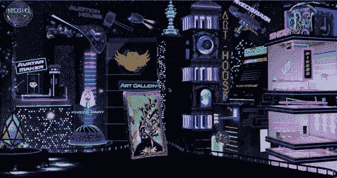
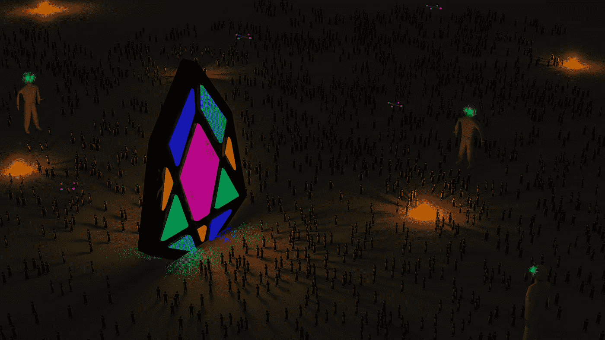
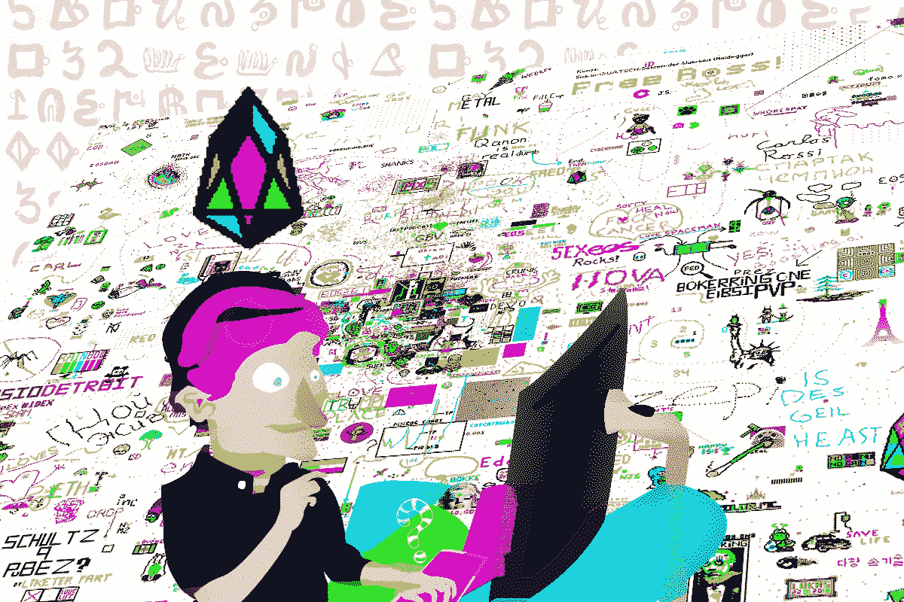
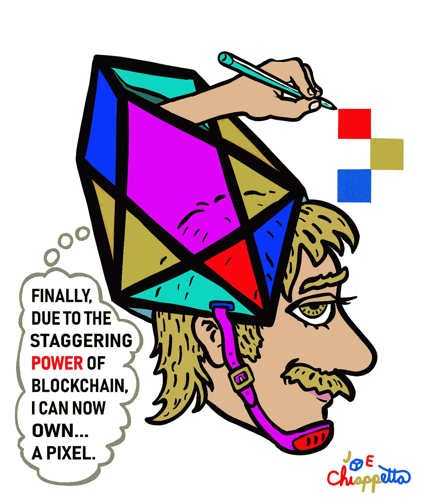

# pixEOS NFTs 将成为 EOS 区块链的游戏改变者

> 原文：<https://medium.com/hackernoon/the-potential-of-pixeos-5629a9146a0f>

Image by Fabi Yamada.

## 团队成员对 pixEOS 平台的见解。

我之前讲过 NFTs，现在来回顾一下。简而言之，NFT 是基于区块链的令牌，代表数字资产，允许它们展示独特的特征，成为伪造证据，并在基于共识的分散式账本上被跟踪。我们已经看到，在以太坊区块链、比特币/交易对手扩展和 Tron 等平台上，NFT 的标准出现了。

在 EOS 上， [pixEOS](http://hub.pixeos.one) 团队正忙于与我们在 [dGoods](https://dgoods.org) 计划中的合作伙伴合作，推出未来 NFT 协议的标准。虽然 NFTs 背后的代码已经完成，但 pixEOS 正在为游戏玩家、艺术家、开发者和收藏家创造一个充满活力的生态系统，将利用 NFT 实现的商业的真正潜力。我想花点时间多谈谈 pixEOS，以及为什么我认为它有可能彻底改变艺术、收藏和游戏世界。

[The pixEOS hub.](http://hub.pixeos.one)

[pixEOS](http://pixeos.io/) 正在从整体上改变 EOS 生态系统、艺术世界、游戏和加密货币生态圈。我们的旗舰分散式应用程序，或 dApp，被命名为 [pixEOS Paint](http://paint.pixeos.art/) 。这是一个互动的数字画布，建立在 EOS 区块链上。我们已经在画布上实现了一个赌注和利润分享的令牌系统，这仅仅是个开始。这幅画布代表了 NFT 协议发展的初始阶段，该协议将支持 pixEOS 平台的其他方面，包括我们的美术馆、艺术之家、拍卖行、个人画布以及一系列依赖于 NFT 资产的即将到来的游戏。

最终，pixEOS 将为 EOS 生态系统的所有居民提供一种方式来生成他们自己的 NFTs，以证实他们创建或提交给平台的艺术。此外，pixEOS 将开辟一个全球市场，允许购买、销售和转让以 NFTs 为代表的数字资产。由于我们积极参与了 [dGoods](https://dgoods.org/) 数字标准计划，这些 NFTS 将符合整个生态系统普遍采用的标准。因此，区块链支持的 NFTS 实体化艺术的参赛作品将消除任何关于出处的问题，智能合同驱动的所有权交换将削减第三方转让费从用户那里提取的任何成本。

为非艺术作品创造一个市场，并解决艺术品来源问题，只是 pixEOS 更大愿景的一小部分。PIXEOS 已经建立了一个基于奖励的代币赌注经济，该经济依赖于将一定比例的平台交易量重新分配给下注 pixEOS 代币的参与者。现在，pixEOS Paint dApp 代表了第一个这样的 pixEOS 平台元素，通过它可以将体积分配给平台桩。我们将扩展这一奖励系统，以涵盖平台上线后其他方面的交易量。奖励系统最终将与艺术屋和拍卖行的市场收入以及来自画廊的 NFTs 的直接销售以及我们将引入平台的其他游戏挂钩。

Image by Fabi Yamada.

# 推动加密的大规模采用

我们认为真正推动采用的因素之一是易用性，这就是为什么我们与 EOS 生态系统中的许多主要参与者合作，包括许多主要的钱包服务提供商。我们这样做是为了在与 pixEOS dApps 家族交互时最大化易用性。例如 pixEOS Paint，我们设计的 dApp 可以在移动和桌面平台上运行，因此尽可能多的人可以访问游戏。在我们这边，UX/UI 开发人员即将发布一个令人惊叹的新前端，允许我们的社区在一个[未来的网络大都市](https://hub.pixeos.one)中在 pixEOS 平台的不同方面之间导航，随着我们添加更多的功能，这个网络大都市将会扩展和发展。

正如我之前简要提到的，pixEOS 也正在与 [dGoods](https://dgoods.org/) 计划密切合作，以标准化 EOS 生态系统中的 NFT 协议，这将为 dapp 之间的互操作性创造机会，当开发人员接受 dapp 相互接口的方式时，这将为用户带来更多选择。

我们希望让尽可能多的人加入 EOS，因此该团队一直在为新人提供加密货币和区块链技术免费的 EOS 帐户(通过一些实际的审查来防止滥用。)这是团队做出的承诺；我们希望确保每个需要 EOS 帐户的人都有一个。

Image by Stellabelle.

# 以区块链的速度发展

为了在不到两个月的时间内将整个平台投入使用，我们的团队一直在挑灯夜战。我们的工程师很有天赋，在开发过程中，我们团队的创新方法解决了一个围绕历史节点的问题，这个解决方案可以被其他 EOS 开发人员应用。因为我们有如此有才华的人，我们唯一的限制因素是时间；我们需要时间来推出平台的额外迭代。

尽管如此，如果你看看团队最近的进展和实现我们目标的历史，你会发现我们没有失望；pixEOS 是长期的，我们也在短期内交付。在相对较短的时间内，他的团队从无到有建立了一个完整的社区，在熊市条件下成功筹集了资金，从零开始创建了一个 dApp，并在不到 2 个月的时间内上线，在 EOS 主网上部署了一个桩协议，在整个生态系统中建立了有意义的连接，并加入了 dGoods 计划，将 NFT 协议分层，以便其他 dApp 跟随我们的脚步穿过 EOS 生态圈。

我们如此迅速地成功开发的部分原因可以归功于 EOS 本身。作为一个平台，EOS 拥有我们需要的架构、治理、易用性和可靠性。最重要的是，EOS 社区纯粹的积极能量是生产力的一个巨大因素。我们认为，EOS 目前可以扩展，以适当处理 pixEOS 平台提供的潜力，而不会出现交易处理问题和随后的高额费用，这些问题和费用使使用基于区块链的网络变得不切实际。此外，当遵循适当的安全实践时，EOS 提供了一个极其安全的开发环境；考虑到如此多的事情处于危险之中，我们发现这既令人欣慰，又对我们决定在 EOS 区块链上开展工作至关重要。

我们在 EOS 发现了一个独特的机会；人们想要一个创造性的出口，在许多项目似乎利用了这一点，然后逐渐消失在蒸汽中之后，我们希望贡献一些东西，以一种持久而有意义的方式将这一点传递给用户，而不是只是化为乌有。实际上是一只翅膀和一个祈祷把我们放在这个位置上；我们找到了一些需求量很大的东西，然后就开始着手提供。我们非常幸运地在早期获得了区块制作人的支持，当人们开始理解 pixEOS 背后的想法的真正本质，以及它永远变革艺术和游戏世界的潜力时，这种支持就像滚雪球一样越滚越大。

Image by Yusaymon.

# 在平台内创造价值

我们没有专注于从为平台提供构建模块的生态系统中提取价值，而是加倍努力将价值构建到 pixEOS 中。这将反过来丰富 EOS，它将成为每个人参与活动和商业的一种方式，无论他们是休闲或竞争的游戏玩家、艺术家或收藏家。我们已经考虑了驱动 pixEOS 利润分享引擎的赌注和再分配系统的无数不同因素，这意味着要确保令牌的寿命。最终，我们将为我们的 PIXEOS 商店建立菲亚特门，允许用 pixEOS 代币交换商店的商品。

在建立强大令牌的道路上，pixEOS 与 EOS 生态系统中的几家块生产商建立了战略联盟。我们认为，通过参与外联并与他人一道努力实现类似的目标，我们都能取得更大的成就。在这种情况下，我们之所以能够蓬勃发展，是因为我们的合作伙伴关系扩大了 pixEOS 平台的范围和影响力，从而为不断增长的社区带来了令人惊叹的艺术和机会。

我们还知道，要对 pixEOS 这样的用户驱动的平台进行适当的微调，需要来自多个个人的反馈和输入。在此基础上，我们一直在倾听社区的声音，当情况危急时，我们会倾听并努力为每个人做出最好的决定。我们意识到，如果没有我们服务的社区，这个项目一开始就不会存在。我们感谢与我们联系的每个人的反馈和互动。

pixEOS 从根本上讲是基于利润分享的，这就是为什么我们独特的赌注系统会将一定比例的交易量返还给平台上的参与者。为了回馈社会，我们欠了这么多，我们真的想传播财富。这是我们向你们展示我们致力于水涨船高理念的方式；我们的成功是您的。

Image by Joe Chiappetta.

# 正确的时间，正确的地点

我们非常幸运，从一开始就能接触到一个自信的团队。随着我们不断成长并设定更高的目标，我们的团队也开始壮大。这是一种吸引定律的情况。正确的人在正确的时间来到我们身边，事情就这样走到了一起。我认为这反映了区块链工业的总体情况；如此多的人对做一些事情感兴趣，并且建造一些新的和令人惊奇的东西。我们的团队中恰好有很多这种类型的人，我们所看到的社区支持的倾泻有时是势不可挡的。

作为使用新兴技术进行建设的创作者，我们有优势与其他也在尝试将实用工具引入生态系统的优秀团队一起开发。这为在繁荣的环境中建立 dApps 之间的互操作性的伙伴关系创造了巨大的机会。区块链技术正在推动一种创造性的环境，在这种环境中，我们看到了初创公司不断增长的潜力和机会，pixEOS 很幸运地利用了这一点，并将其融入到一个令人惊叹的项目中。

如果你还没有，试试 pixEOS paint，画一些令人惊奇的东西，铸造一些 pixEOS 代币，开始下注赢取奖励。

