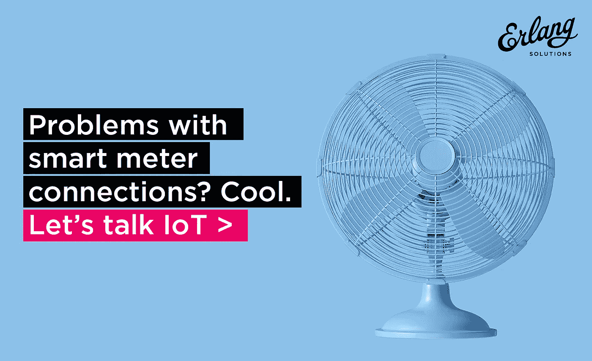

# 30 年前就解决了连接智能电表的问题！

> 原文：<https://medium.com/hackernoon/the-problem-of-connecting-to-smart-meters-was-solved-30-years-ago-powered-by-scalable-technology-69b46fc2fee7>

## 由可扩展技术支持

为了应对一系列经济、环境和技术挑战，全球各地的电力公司正开始经历一场彻底的变革。全球变化的驱动因素包括不断增加的排放、国内能源资源限制、不断增长的电力需求、新一代资产开发的融资限制、电力成本以及老化的基础设施。此外，电动汽车(ev)和电池存储在终端用户中的日益突出强调了对复杂电网的需求。

理解智能电网的关键是智能计量。根据 GlobalData 的数据，2017 年全球智能电表安装量为 8820 万，预计到 2022 年将增长到超过 5.88 亿。截至 2017 年底，中国以 4.069 亿智能电表安装量领先市场，美国和日本分别以 3870 万和 3650 万智能电表安装量紧随其后。

如今，数据消息的总数可能很低，但随着智能电网的不断发展，系统将需要扩展到数十亿条消息，并具有容错能力。例如，每个电表都需要在系统上进行配置，它需要与计费、控制平台、数据分析等相连接。我们只是刚刚开始想象如何利用这些数据来推动行业创新。智能电表的未来可以促进和改变可持续发展、医疗保健和点对点电力共享。

幸运的是，如何连接和控制数十亿设备的问题早在 30 年前的 20 世纪 80 年代就被开发 Erlang 的爱立信团队解决了。这是一种专门为关键系统的容错、高可用性和并发运行而构建的语言。虽然它是为电信行业而构建的，但现在它已被一系列行业领导者用于赌博、健康、广告、在线游戏以及高可用性和容错至关重要的任何地方。

Erlang 的并发性、非共享内存架构和内置的“失败和恢复”方法使其在高度可变的随机负载下表现得非常优雅和可预测。Erlang 在处理消息爆炸和多路复用(从单个事件开始向单个用户生成消息级联，这种消息级联可以以一致的方式跨越数百台服务器，并保持消息传递顺序)方面表现出色。Erlang 是所有主要物联网协议以及 M2M、NB-IoT 和其他移动应用的 EMQ X MQTT 分布式消息代理的基础。

要了解更多关于我们与 EMQ 的合作关系以及它能如何帮助你，请点击这里。

**……**

*最初发表于 www.erlang-solutions.com*[*。*](https://www2.erlang-solutions.com/iotsmartmetersme1)