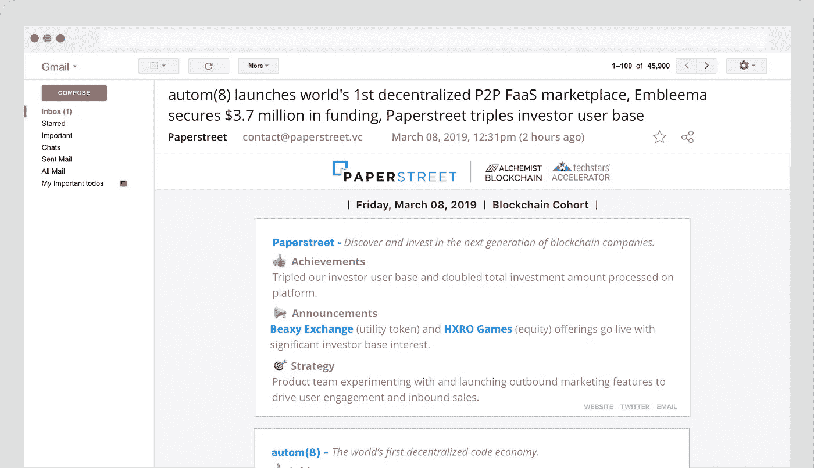

# 启动资金筹集的问题…

> 原文：<https://medium.com/hackernoon/the-problems-with-startup-capital-fundraising-ce4ae12526eb>

我们的公司 Paperstreet 将参加在纽约市举行的 Techstars 炼金术士区块链加速器会议，我们日以继夜地与公司和投资者会面，以了解他们的最终痛点是什么，以便我们可以战略性地定位自己，解决其他人不知道的问题，从而使我们的公司获得最佳的长期产品市场适应性。在本文中，我们将讨论找到这些棘手问题的策略，以及我们最终希望实现的目标。

当我们提到痛点时，我们通常将它们分为两个解决方案类别:advil 痛点和吗啡痛点。我们的意思是这些难题的解决方案:

*   **Advil:** “我头疼。我需要去打个盹。”
*   **吗啡:**“我快死了，请给我任何能解除这种痛苦的东西。”

> 在过去的一个月里，我们在筹资方面发现了哪些问题？

我们将用户群分为两部分:

*   **投资商**
*   **创业公司**

为了发现这些痛点，我们采访了数十家公司和投资者，以确定我们如何才能在他们的筹款活动中更有效。在此期间，我们发现了棘手问题，并将其归类到以下列表中:

**投资者**

*   流动性: *Advil*
*   更多交易流程: *Advil*
*   以下是我感兴趣的公司: *Advil*
*   转换后审阅文档:A *dvil*
*   他们投资的初创公司的一致更新: *Advil/Morphine*
*   获得最佳交易流程:*吗啡*

**创始人**

*   筹款期间的合规: *Advil*
*   天使投资人上限表管理: *Advil*
*   了解我的投资者以及他们如何帮助我: *Advil*
*   用户反馈: *Advil*
*   控制与他们的融资相关的敏感数据: *Advil*
*   追踪检查:*Advil/吗啡*
*   如何有效筹集资本:*吗啡*
*   跟踪投资者兴趣:*吗啡*
*   花时间筹款:*吗啡*

我们的业务是一个双边市场(投资者寻求投资，初创公司寻找投资者)，我们认为有必要了解市场的双方。我们争论了几个星期，争论哪一方是市场应该关注的一方。我们知道，如果我们能够推动投资者方面的巨大需求，我们将会有一个成功的产品。然而，在我们的采访中，我们没有发现任何投资者不可预见的痛点，我们可以在没有大规模的情况下轻松解决。我们发现，投资者大多相当善变。他们会不惜一切代价投资一家他们想进入的公司。他们中的大多数人在所有流行的众筹网站上都有账户，对任何一个网站都不忠诚。有一些方法我们可以在未来加以利用，以帮助投资者更加忠诚于我们的平台，但我们现在没有什么大问题可以解决，以向投资者提供最佳的交易流。

在初创公司方面，我们发现了创始人在融资方面的大量痛点。参加 Techstars 也给我们上了很多课，告诉我们作为创始人，在寻找投资者投资我们公司时，如何有效地做到这一点。我们有幸与 Techstars 的首席执行官之一大卫·科恩(David Cohen)一起参加了一个研讨会，我们在会上详细讨论了如何使筹款过程更加有效。在我们与 David 会面之前，Techstars 团队分享了这段视频，它基本上是我们亲自参加的研讨会的总结。如果你想为自己的创业公司筹集资金，我强烈推荐你观看这段视频，并练习他谈到的技巧。

David Cohen (Co-CEO of Techstars) Performing a Workshop on Startup Capital Fundraising

我们在采访中发现，公司的创始人花了无数的时间为他们的投资者造势。我们还发现，他们以前从未筹集过资金，也不知道自己在做什么。

我们如何帮助他们建立他们需要的工具，开始向全球投资者网络展示他们的公司？投资公司股权有点像约会，在做出承诺之前，市场双方都需要做出明智的决定。

经过多次头脑风暴和辩论后，我们集体决定测试我们上周私下推出的新功能。我们把它叫做****。**我们的假设是，如果公司持续不断地向投资者、顾问、导师和普通社区提供最新信息，这将使他们花费更少的时间来筹集资金，并帮助他们从投资社区获得更多的兴趣。通过专注于他们的产品，并通过一个平台展示他们正在取得的进展，同时让他们接触到一个庞大的投资者网络，他们将更专注于开发产品，而不是吸引投资者。说到底，筹集数百万美元并不是成功的秘诀，但创造伟大的产品并在需要时获得帮助才是。**

****

**Paperstreet Pulse example weekly newsletter.**

**我们发布了这个想法的第一个版本，它为订阅该列表的任何人提供了一种方式，可以访问所有参加 Techstars 炼金术士区块链加速器的首席执行官的独家更新。我们的希望是，如果这是成功的，并为我们不断增长的投资者网络提供价值，我们的下一步是为所有公司建立特定的页面，显示他们所有更新的时间表，提供更多关于创始团队和他们试图完成的内容。如果你有兴趣跟踪我们队列中的所有公司，请点击此[链接](https://www.paperstreet.vc/companies/techstars-blockchain)注册。**