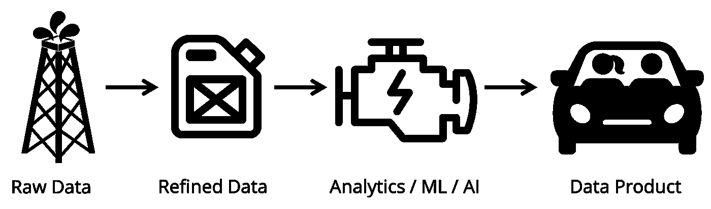

# 产品/数据匹配策略

> 原文：<https://medium.com/hackernoon/the-product-data-fit-strategy-9d34bc8183ca>

## 如何制造更好的汽车，而不是钻探更多的石油

Data strategy is about building better cars, not accumulating more oil. Images: [Zbynek Burival](https://unsplash.com/@zburival?utm_source=medium&utm_medium=referral), [Chris Barbalis](https://unsplash.com/@cbarbalis?utm_source=medium&utm_medium=referral)

## 你上一次购买原油是什么时候？

“[数据是新的石油](https://www.economist.com/leaders/2017/05/06/the-worlds-most-valuable-resource-is-no-longer-oil-but-data)”到目前为止是一个常用短语，表明数据作为一种关键资源的重要性。但是 Clive Humby 实际上是在一个经常被忽视的重要的[观察](https://ana.blogs.com/maestros/2006/11/data_is_the_new.html)的背景下创造了这个词:大多数人不会到处购买原油。用他的话说，

> 数据就像原油一样。它很有价值，但如果不提炼，就不能真正使用。它必须转化为气体、塑料、化学物质等，以创造一个有价值的实体，推动盈利活动。

原始数据，如点击流、一系列金融交易或大量医疗记录，很难使用。像石油一样，它需要提炼并转换成更容易使用的形式，比如干净、有组织的数据表。

现在，你买汽油不是为了它的装饰价值。你买它是为了给你的汽车引擎提供动力，这样你就可以去你想去的地方——而*那个*就是产生价值的东西。

## 机器学习和人工智能是新的内燃机

数据以同样的方式工作。真正产生价值的是一个*产品。*本帖我们重点关注*数据产品:*利用数据产生价值的产品。

数据产品需要一个引擎，消费提炼的数据，驱动价值创造。这个引擎可以像显示数据的重要方面一样简单明了，因此人类可以做出更明智的决策。我们称之为“分析”。该引擎也可以更加复杂:由机器学习模型或识别图像中对象的神经网络进行预测。

> 机器学习和人工智能是新的内燃机，数据产品是新车。

总之，这些组件构成了数据产品的价值链:

Value chain for a data product. Icons by Ale Estrada, Ayub Irawan, BomSymbols, Hadi Davodpour for the Noun Project

有时候，这个链条的一部分可以外包。例如，许多公司成功地销售“分析”或“见解”。这些本质上是数据精炼厂:他们的产品是精炼的数据，有时甚至是引擎。然后，其他产品利用它们在市场上创造价值。数据精炼厂的业务模型和策略与数据产品的业务模型和策略非常不同，这是我在这里关注的重点。

## 产品/数据匹配:数据产品的数据策略

这篇文章关注数据产品的数据策略以及如何找到适合的[产品/数据。这一切都是为了弄清楚这个链条中的各个部分如何相互配合，以优化价值创造。](https://hackernoon.com/the-challenge-of-product-data-fit-92543078551b)

这个过程的基础是理解产品如何使用数据来创造商业价值。这将引导您沿着链条上下移动，回答如下问题:

*   *优化价值创造最有效的引擎是什么？*
*   *引擎需要多少和什么类型的精确数据？*
*   *你如何生成(或获取)然后提炼原始数据？*

思考这些问题的一个方法是了解发动机的投资回报率(ROI)。为了简单起见，我将重点讨论引擎是机器学习模型的情况。

模型中的*投资*包括获取和存储数据的时间和金钱成本。它还包括提炼数据和训练模型的时间和成本。

模型上的*返回*取决于两个组件:

*   模型的*精度*
*   正确预测产生的*业务价值*(以美元、点击或其他可量化的指标表示)，以及错误或不准确预测的业务成本

## 数据战略是关于制造更好的汽车

数据策略的关键是:专注于增加回报，而不是增加投入。这听起来显而易见，但往往迷失在围绕数据和人工智能的炒作中。

有些人只关注数据量。他们总是抱怨“我们需要更多的数据！”或者吹嘘如何“我们正在生成*那么* *多* *的数据！”。*

但是这些短语通常是糟糕的数据策略的标志。他们强调投资而不是回报。真正的目标是制造更好的汽车和更高效的发动机，而不是积累更多的原油。

> 数据战略的重点是制造更好的汽车和更高效的发动机，而不是积累更多的原油。

另一个常见的分心是过于关注发动机。你不会用喷气发动机来驱动踏板车。同样，对于大多数早期数据产品来说，复杂的机器学习和人工智能是多余的。99%的时候，投资于弄清楚你的产品如何在市场上产生价值，比修补神经网络的内部工作更好。

## 将引擎与您的数据相匹配

你如何增加你的模型的回报？一种方法是提高模型精度。但这也将增加投资:你将需要更多的数据或更有效的方法。因此，这里的关键是通过将引擎与您拥有的数据量相匹配来保持正的 ROI。

推荐系统的发展就是一个例子:

*   从向所有用户推荐最受欢迎的商品开始。这个不需要用户层面的数据，推荐基于简单的汇总统计，所以投入很小。
*   当你收集更多的粒度数据时，你可以提出类似“购买了 X 的用户也购买了 Y”的建议。这需要每个用户有足够的数据，但是方法还是很简单的。
*   一个成熟的推荐引擎除了考虑用户和商品的其他特征之外，还会考虑用户的完整购物历史，通常使用一种叫做[协同过滤](https://en.m.wikipedia.org/wiki/Collaborative_filtering)的方法。

随着数据量的增加，引擎从简单的汇总统计发展到全面的机器学习。模型变得越来越精确，但是你永远不会投入超过你在每个阶段拥有的数据量的资金。

## 数据服从收益递减规律…

最终，很难仅仅根据准确性来衡量一个模型的投资回报率。原因是数据受到收益递减的影响。

假设您想预测一个州的选举结果，该州有 100 万选民在两个候选人 Daisy 和 Minnie 之间进行选择。你随机调查了 200 名投票者，其中 53%投给了黛西。[结果是](https://en.wikipedia.org/wiki/Binomial_proportion_confidence_interval)你可以 80%确定黛西真的会赢。但是如果你想有 90%的把握，你需要比这多一倍的选民，大约 450 人。要达到 95%，你需要 750 英镑，而要达到 99%，*还需要 750 英镑。*

真实的选举民意调查显然要复杂得多，你可能遇到的任何现实数据问题也是如此。但是原则是一样的。随着您希望让您的预测越来越准确，您需要收集的数据量将呈指数级增长。

## …机器学习和人工智能也是如此

能不能用更强大的引擎解决这个问题，比如深度学习？没有那么多。复杂的方法通常需要更大量的数据，并且它们也受到收益递减的影响。

Sample images from MNIST dataset. Source: [https://en.wikipedia.org/wiki/MNIST_database](https://en.wikipedia.org/wiki/MNIST_database)

[MNIST](https://en.wikipedia.org/wiki/MNIST_database) 是由手写数字图像组成的数据集。它被广泛用作图像识别中的玩具数据集，目标是正确识别每个图像中的数字。

你可以使用的最简单的算法之一是[多项式逻辑回归](https://en.wikipedia.org/wiki/Multinomial_logistic_regression)。尽管它很简单，但它能正确识别大约 92.5%的数字中的。一个简单的神经网络是合理的下一步，它可以很快让你达到大约 99.3%的准确度。显然非常令人印象深刻，但请注意，它只比简单得多的模型好 7%。进一步的改进甚至更难实现:一个最先进的深度学习模型，使用最新的研究方法，可以将准确度再提高 0.5%。

MNIST 是一个玩具例子。任何现实问题都要困难得多，你应该预料到模型的准确性会更低。有时候，性能提高 0.1%会有很大的不同，使用真正复杂的东西是有意义的。不管怎样，数据和方法都有很强的收益递减。

## 问更多有价值的问题

由于数据回报递减，最终很难仅仅通过提高准确性来增加机器学习模型的投资回报率。你还能怎么做？

准确性只是数据回报的一部分。另一个是预测的*商业价值。一种思考方式是想象你的模型是 100%准确的。对您的业务有什么影响？这完全是关于模型正在解决的问题，而不是解决方案的质量。因此，提高投资回报率的方法是提出更有价值的问题。*

这里有一个例子。黛西正在竞选公职，她派出志愿者去挨家挨户敲门，以增加投票率。然而，志愿者的数量是有限的，所以她想建立一个模型，只针对那些有可能投票给她的选民，而不是她的对手米妮。这被称为“响应建模”。

Daisy 可以建立一个更有价值的模型:预测哪些选民会在志愿者来访时投票给她，否则会留在家里。即使没有被访问，预测会投票的选民也不会成为目标，所以志愿者只访问那些他们有所作为的选民。这叫做“[隆起建模](https://en.wikipedia.org/wiki/Uplift_modelling)”。

精确的抬升建模比传统的响应建模需要更多的数据。因此，如果 Daisy 没有足够的数据，她应该从建立响应模型开始，并随着数据的积累完善这些模型。但是最终她应该转向提升模型，即使这些模型没有反应模型精确——因为总的来说它们比 T2 模型更有价值。

## 实现产品/数据匹配

让我们总结一下如何提高模型的投资回报率:

*   通过提高模型的准确性，同时确保对引擎的投资与数据量相匹配
*   通过增加预测的商业价值，特别是当它可以弥补不太准确的模型时

这就是你如何找到产品/数据匹配:迭代同时增加你的数据、你的模型和它们正在解决的问题的价值。

让我们看看它在更现实的情况下会如何发展。许多医疗保健初创公司尝试使用[临床决策支持](https://www.ahrq.gov/professionals/prevention-chronic-care/decision/clinical/index.html) (CDS)系统，这些产品旨在帮助临床医生以数据驱动的方式做出复杂的决策。

一些 CDS 产品专注于提供治疗建议，但它们在市场采用方面经常遇到挑战。一个原因是，一个错误的建议可能会严重破坏对系统的信任。就模型的投资回报率而言，一个错误建议的成本非常高。这意味着提出建议的模型必须非常精确，这反过来需要非常高的投资。最好是推迟建立建议引擎，直到公司获得足够的数据以及用户的信任。

构建 CDS 的成功策略将首先关注准确性不太重要的领域。一种方法是通过*以直观的方式显示数据*，为临床医生提供有用的见解。这是数据产品开发中一个非常常见的主题，我将在以后的文章中进一步阐述。

## 结果

*   数据战略是关于构建更好的产品，而不是积累更多的数据或使用更复杂的方法。
*   要做到这一点，您必须了解您的产品如何使用数据来产生价值，并专注于提高您的模型的投资回报率。
*   一种方法是提高模型的准确性，但你会很快遇到收益递减。
*   另一种方法是通过发现您的数据可以回答的更有价值的问题，即使模型不太准确，这也可以带来更好的 ROI。
*   这就是你如何找到产品/数据匹配:迭代同时增加你的数据、你的模型和它们正在解决的问题的价值。