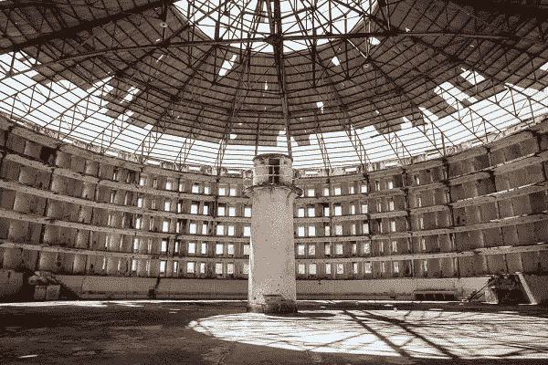

# 无限信息的心理成本

> 原文：<https://medium.com/hackernoon/the-psychological-price-of-limitless-information-41e946eb2b51>

## 为了了解一切，我们必须允许我们的一切被了解。值这个价吗？

我已经很多年没有坐下来思考任何事情了。我脑海中随时闪现的每一个问题，从仅仅是有趣的问题(“世界上最大的狗品种是什么？”)到潜在的改变生活的问题(“如果我的左臂有刺痛感是不是很糟糕？”)，可以输入我口袋里的超级电脑，即时自由回答。同样，我也不用去想我的朋友们在做什么——相反，我只需登录脸书，就能了解他们的生活，又一次即时而自由。虽然古代人花费大量财富来建立小型图书馆，但每个拥有智能手机的人都能获得比 21 世纪前人类总和还多的信息。

这太不可思议了——我们可以听任何录制的歌曲，了解任何话题，分享我们的观点，以数字方式表达自己，没有任何摩擦。获取如此多的信息真的会让人[上瘾](https://www.nbcnews.com/mach/science/surprising-ways-smartphones-affect-our-brains-our-lives-ncna947566)，虽然我们在学习如何以健康的方式使用这项技术方面还有很长的路要走，但我们的手机和互联网给了我们前几代人无法想象的超能力。

但是，在我用来描述我们在数字时代获取信息的两个词中，只有一个词是准确的。谷歌和脸书允许我们即时获取信息**，但不是免费的。**虽然我们无需为这些服务预先支付任何费用，但正如一句名言所说:

> “如果你不为产品付费，你就是产品。”

作为产品有很高的成本。脸书的剑桥分析公司和谷歌的秘密麦克风越来越清楚地表明，大型科技公司希望了解我们的一切。哈佛商学院教授肖莎娜·祖博夫(Shoshana Zuboff)称之为[“监视资本主义”](https://www.amazon.com/Age-Surveillance-Capitalism-Future-Frontier/dp/1610395697/ref=sr_1_sc_1)，像脸书和谷歌这样的公司的利润直接取决于它们对我们和我们行为的了解程度。不断获取信息意味着不断被监视、记录和评估，不管感觉有多自由，满足我们的信息瘾都有巨大的心理成本。

# 算法焦虑

你可能有过这样的经历:在公共场所，似乎通过第六感，知道有人在看着你。你可能不知道他们是谁，也不知道他们在哪里，但你能感觉到他们在看着你。这是一种奇怪的感觉，让一次正常的经历变得令人焦虑和紧张——甚至在咖啡店里写这篇文章时想想这种感觉都会让我感到有点不安。这种感觉是我们大脑中的[系统](https://www.psychologytoday.com/us/blog/the-narcissus-in-all-us/201102/how-you-know-eyes-are-watching-you)的结果，该系统不断确定我们周围的其他人在看哪里，这导致我们无意识地知道有人在看我们。

在数字世界中，我们也有类似的第六感。不管是有意识的还是无意识的，我们都知道当我们浏览互联网的时候，我们被监视着，这就像身体被监视一样引起焦虑。在[的一项研究](https://onlinelibrary.wiley.com/doi/abs/10.1111/j.1559-1816.2009.00521.x)中，研究人员发现，当在线学习的学生受到监控时，他们比没有受到监控的学生经历了更高水平的精神负担和压力。此外，在学习时被监视的学生在技能测试中的分数比没有被监视的学生要低。被监视会增加我们的压力，降低我们学习和记忆信息的能力。

我们被观察的时间越长，问题就越严重，尤其是当我们被以任何方式评估的时候。在威斯康辛大学[的一项研究](https://www.ncbi.nlm.nih.gov/pubmed/15676845)中，研究人员发现，工作表现受到长时间电子监控的员工比没有受到电子监控的员工“报告了更高水平的工作厌倦、心理紧张、焦虑、抑郁、愤怒、健康抱怨和疲劳”。

仅仅知道我们被监视就足以让我们感到不舒服。再加上[潜在雇主越来越多地使用互联网活动来判断求职者](https://hbr.org/2012/04/your-future-employer-is-watchi)的事实，我们最终会面临严重的心理健康问题，如焦虑、抑郁和愤怒，因为大型技术公司的算法会盯着我们看。

# 全景整合

1787 年，英国哲学家杰里米·边沁提出了一个想法，利用监视的效果来造福社会。他创造了圆形监狱，这是一种新型监狱的建筑设计。圆形监狱是一个圆形建筑；牢房在圆周上排成一排，一直堆到天花板。圆圈的中心是边沁称之为“检查员室”的地方，从这里守卫可以看到监狱里的每一间牢房。

A real-life Panopticon.

边沁想法的革命性之处在于，督察员的房间是以这样一种方式建造的，守卫可以看到外面，但囚犯看不到里面。正因为如此，囚犯们不知道他们是否被监视着，因此必须表现得好像他们一直被监视着。边沁认为，最终囚犯会完全规范自己的行为——**他们本质上会保护自己。**

在 21 世纪的社会中，大型科技公司就像互联网监狱中的监狱看守。我们知道我们在网上搜索、喜欢和发布的一切都可以被观察到，但我们不知道我们什么时候被监视，或者到底被记录了什么。我们是牢房里的囚犯，被不透明的算法强迫表现得好像我们一直被监视着。

虽然我们不知道我们的网络浏览到底被监视和记录了什么，但我们的任何行为随时可能被监视的可能性会产生巨大的心理效应:**从众**。当我们被观察时，我们下意识地开始让自己的行为向我们认为观察者对我们的标准靠拢。在悉尼大学的一项研究中，当呈现各种描述不道德行为的场景时，受试者在被观察时会对行为做出更严厉的评价，以便向观察者展示道德正直的良好形象。但是最大的收获是什么？他们甚至没有意识到他们的行为已经完全改变了。

> 我们知道我们在网上搜索、喜欢和发布的一切都可以被观察到，但我们不知道我们什么时候被监视，或者到底被记录了什么。我们是牢房里的囚犯，被不透明的算法强迫表现得好像我们一直被监视着。

我们无时无刻不在体验这种数字化的体验。你上一次打算用谷歌搜索某样东西却感到不安并决定放弃是什么时候？如果我们担心其他人看到我们历史中令人讨厌的搜索，我们总是可以删除它。但在潜意识里，我们突然停下来，因为我们知道谷歌在看着我们。我们内心的某些东西不希望我们的观察者不赞成——我们知道对可接受的行为有期望，我们无意识地渴望满足它们。

这很可怕——远比被监视带来的压力更可怕。通过观察我们的每一个数字动作，科技公司下意识地推动我们的行为符合他们的价值观和期望。这些期望是什么？你会再滚动一分钟。你会点击广告买一双新鞋。你会支持政客和有利于科技行业的法规。虽然我们不知道从众效应有多强，但互联网的全景性质利用我们的心理为已经强大的科技巨头提供了另一种控制我们的措施。

# 缓和对技术的关注

今天，我们已经变得如此依赖互联网，以至于如果不使用网络产品我们基本上不可能参与到社会中来，这些网络产品使我们容易受到持续的监视。但即使我们可以与大型科技公司分手，我认为我们也不想这么做。我很难想象没有我每天享受的轻松获取信息的生活，我个人也没有在短期内放弃它的野心。你可以说我是伪君子，但我一点也不讨厌科技——我认为互联网(以及科技公司)已经并将继续为这个世界带来巨大的好处。

但目前，由于不断受到数字监控，我们都承受着巨大的心理负担。虽然短期内我们不能选择不被监视，但我们可以采取一些措施来建设一个更好的互联网:

## 1)使用保证隐私的产品和技术

对于大多数科技产品来说，你不经阅读就不可避免地同意条款和条件中的数据权利(我们都这样做)。这为你使用该产品的一切被公司或更糟的是被外部行为者持续观察到打开了可能性；例如，在最近的丑闻中，[脸书允许网飞和 Spotify 访问用户的私人信息](https://www.usatoday.com/story/tech/2018/12/19/facebooks-latest-privacy-scandal-what-we-know-now/2361257002/)。

只要有可能，我们应该选择那些让我们的行为不可能被科技公司看到的产品。现有的技术可以确保公司无法看到私人用户的详细信息。一个很好的例子是 [Signal](https://signal.org/) ，这是一个端到端加密的信息应用程序，确保除了收件人之外没有人可以阅读你的信息。在可能的情况下选择使用 Signal 这样的产品将鼓励其他科技公司也将这些技术融入他们的产品中。

## 2)鼓励新的互联网商业模式

互联网监控的问题无处不在，因为实行“监控资本主义”的公司的商业模式将更多地了解用户与更高的利润直接联系在一起。当你的业务是销售定向广告时，每一盎司的信息都是有价值的，这使得公司不择手段地了解我们的一切。

但是我们可以选择采用其他的商业模式。例如， [Brave Browser](https://brave.com/) 和 [Basic Attention Token](https://basicattentiontoken.org/) 正致力于创造一种不依赖于激进数字监控的在线广告新模式。他们计划在用户设备上保持隐私浏览数据，并匿名使用这些信息来准确补偿内容发布者，定向广告并奖励用户的关注，同时阻止在线监控软件。我们应该鼓励像这样的新想法，创办更多尝试新商业模式的公司，而不是把旧的“监控资本主义”模式视为理所当然。如果没有新的商业模式，旧系统的激励太强大而无法克服。

## 3)更多地生活在模拟世界中

我已经用笔和纸写了 6 年多的日记了。从不敬的故事到深刻的忏悔，一切都包含在那些日记里，我非常保护它们。我已经多次考虑过用类似于 [Day One](https://dayoneapp.com/) 的东西来记录我的数字日志——快速打字、可搜索性和保险损失的实际好处是巨大的。尽管有这些好处，但知道这些话被严格地写在我每天放在桌子上的日记里，令人难以置信地感到安慰。除非有人闯入我的房子，否则这些文字不会被任何人读到，这让我松了一口气。

即使是我们不太保护的信息，将其留在模拟世界(或一般的离线世界)中也会有难以置信的价值。当你告诉朋友一个尴尬的故事时，你唯一需要担心的数据泄露是他们会说你的闲话。当你把照片留在硬盘上而不是上传到云端时，你就不必担心别人会怎么看你的照片。模拟世界是数字世界的避难所，在这个世界里，你做的任何事情都可能被科技公司看到，根据他们最近的隐私丑闻，也可能被任何人看到。利用这个机会，在模拟世界中不受观察地生活，不受我们当前数字现状强加的心理价格的影响。

如果你喜欢这篇文章，你可以在我的博客****上阅读其他人喜欢的文章，这是一篇关于技术和信仰交汇的所有话题的博客。****