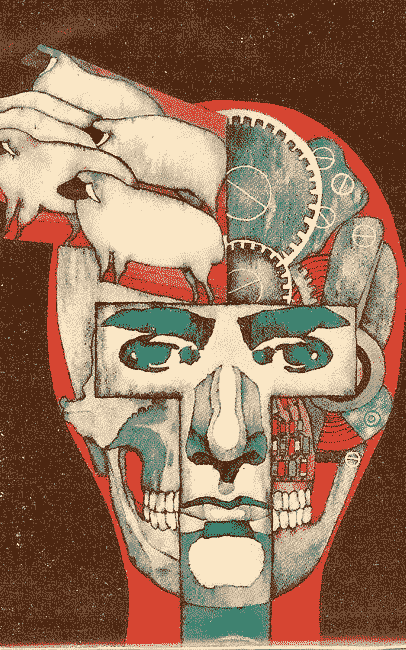

# 量子计算机:当代区块链技术的歼灭者

> 原文：<https://medium.com/hackernoon/the-quantum-computer-annihilator-of-contemporary-blockchain-technology-447daf5abda2>

# 随着加密货币越来越受欢迎，该领域的专家担心，当它到来时，量子计算机将如何威胁区块链技术，该技术目前仍然缺乏可靠的数据安全。

Photo by [Pawel Janiak](https://unsplash.com/photos/UiH8963wYHo?utm_source=unsplash&utm_medium=referral&utm_content=creditCopyText) on [Unsplash](https://unsplash.com/search/photos/bitcoin?utm_source=unsplash&utm_medium=referral&utm_content=creditCopyText)

# 隐现的威胁

量子计算机是我们的未来，不仅仅是加密货币，而是生活的所有领域，尽管人们担心它们可能会破解区块链用于安全的加密技术，尽管在目前看来，量子计算机是最有用的。

*威胁是真实的。*

然而，一些科学家认为，应对这一问题的唯一方法是使用量子区块链作为抵御威胁的屏障。

**一个简单的“以牙还牙”的例子。**

# 就像大脑中的绵羊

Source: Wooden Poster — Do Androids Dream of Electric Sheep

我对比特币挖矿的整个兴趣来自于一个熟人——他对此非常认真——在 2016 年向我介绍了他的“副业”:当时我在他拥有的语言学校担任文案和英语老师，并和他的妻子一起经营。我有自己的教室。教室旁边是教师室，在那里我们有我们的注册，课本和其他教育资源。

那是夏天。大部分学期课程已经结束。这意味着语言学校比一年中的任何时候都要安静。由于需求减少，课也少了，我的熟人在 7 月和 8 月占用了他的“老师”的房间。总之，长话短说，有一天，当我进来上课，正要上楼时，我听到老师的房间里传来恼人的“嗡嗡”声。

作为一个爱管闲事的人，我有一个眼球。在房间里的桌子和地板上，有五个比特币 GPU 矿工。我知道他们是什么，但从未见过他们本人。

我问我的熟人他在做什么，这让我着了迷。

大约一个月后，在与他进行了一些初步交谈后，我从亚马逊订购了一台便宜的 21 比特币电脑。我的熟人的 GPU 是一个更高的斑点，而且比他从中国买的贵得多。然而，这并没有困扰我。我只是想看看结果如何。这都是为了一点乐趣，一个爱好兴趣。

我高兴极了:几百英镑，我以为我要发财了。

> 很有可能！

它的运行成本，以及它产生的可笑的噪音，使得每秒 50 千兆哈希的机器不是一个真正的好投资。虽然我的熟人在教我比特币挖矿的所有细节，但我很快就对它失望了——主要是因为我的伴侣和女儿厌倦了它在备用卧室里发出的噪音(我的孩子尖叫着“它听起来像是我脑中的*绵羊】*)——不到一个月，我就关掉了机器，以比我当初购买时低得多的价格在网上出售了它。

然而，这并没有阻止我对它的兴趣，我会定期——事实上仍然会——阅读关于这个行业的文章。

# 区块链

本质上，区块链是一种数学代码结构，能够安全可靠地组织和存储数据。比特币是一种流行的加密货币，最近正在经历繁荣，它使用区块链技术来组织和存档该货币的交易。

*尽管有比特币和其他金融数据工具，但区块链有潜力存储任何类型的数据。许多人预测，在未来几年，区块链将成为许多领域的主导技术。然而，这并非没有一些疑虑和保留。*

标准密码函数是区块链的保姆。要破解其中的数据需要强大的计算机和资源，至少目前大多数人都无法获得。即使是最聪明、最昂贵和最先进的计算机也没有能力和速度来破解标准的加密功能…

> 然而，潮流正在改变。

# q 系统一量子计算机

量子计算机是新的曙光。就在最近，IBM Research 宣布它已经制造出了 [Q System One 量子计算机](https://www.research.ibm.com/ibm-q/system-one/)，并在其 YouTube *频道上声明:*

> *‘首次使通用近似超导量子计算机能够在研究实验室之外运行。’*

对科技工作者和未来来说令人兴奋的消息。IBM 还补充道:

“这是量子计算商业化的重要一步，有朝一日可能会在材料和药物发现、金融服务和人工智能等领域实现突破。”

随着这一革命性技术的出现，标准加密功能以及用于保护区块链的任何其他安全级别将很容易成为违规和来自系统外部的其他类型攻击的目标。

为了挫败这种威胁，并缓解那些对区块链和加密货币有既得利益的人的担忧，科学家们同意，对抗这种威胁的唯一方法是创造量子区块链——尽管量子计算机可以破解常规的区块链，但量子计算机无法破解量子区块链的密码，这就是为什么许多人主张在区块链加入量子密码术。

然而，行业专业人士认为，这个难题有一个简单得多的解决方案:量子密码术，就其本质而言，只是在标准区块链的基础上增加了一层加密，只要他们使用的量子计算机有能力破解量子区块链发起的密码，黑客就无法破解区块链。

# 爱因斯坦理论 2.0

[德尔·拉詹](http://sms.victoria.ac.nz/Main/GradDelRajan)，威灵顿维多利亚大学数学与统计学院的博士生，和他的导师[马特·维瑟教授](https://en.wikipedia.org/wiki/Matt_Visser)，提议*“让整个区块链成为一个量子现象”。*

他们建议——进入硬核科幻小说和爱因斯坦理论的世界——使用本质上纠缠于时间的量子粒子。“量子纠缠”发生在两个粒子纠缠在一起的时候，从这种联系中，它们仍然是一个单一的实体或系统，而不管彼此的空间接近程度。

Erwin Schrödinger, one of the fathers of Quantum Theory

应用这一理论——因为这是新西兰惠灵顿的两位科学家目前唯一的想法——将允许编码过程开始，其中单个量子粒子可以在其上标记其他粒子的历史。在不破坏原始量子粒子和区块链的情况下，破解这个粒子以获取其前身的加密数据是不可能的。

> 然而，这种安排依赖于物理定律来确保高度的安全性。

为了理解这是如何工作的，并因此从理论模型中应用，首先重要的是理解区块链的基本性质。简单地说，区块链是一个日志，或一本账簿，可以证明不同种类的信息。例如，财务交易或帐簿分类帐。然后将信息添加到数据库中，也称为块。这一过程一直重复到所述时间，这时——使用一种称为“散列函数”的数学工具——信息被加密。哈希过程会创建一个唯一的数字，它是数据的精确镜像。

重复该过程:在再次被哈希函数加密为唯一数字之前，更多信息随着下一轮交易被添加到“块”中。一个街区一个街区一个街区。一连串的积木。

# 防呆系统

让区块链成为网络犯罪分子的低风险目标的原因是，当代计算机缺乏黑客攻击哈希函数得出的数据所需的计算能力。试图改变，甚至破坏由散列函数组织的记录，至少目前是不可能的。

然而，随着量子计算机的出现，这个难题将被解决，或者至少更容易破解。对于银行、加密货币交易商和其他在新技术中拥有既得利益的人来说，这是一个噩梦般的场景。

# 量子纠缠

如前所述，Rajan 和 Visser 构想的解决方案旨在创造一个量子版的区块链，其本质是基于[量子纠缠](https://www.sciencealert.com/entanglement)理论。如果一个黑客，出于某种原因试图干扰‘连接’，或者粒子纠缠，结果就是破坏链接，保证了区块链的安全。纠缠的粒子受到整个时间和空间可能性的影响。

Quantum Entanglement in action. Source: WikiCommons

随着粒子纠缠在所有空间和时间环境中的影响，这意味着量子理论允许事物在过去受到影响，而不仅仅是在局部实在论和因果关系的直观概念中。

这两位科学家认为，这种类型的量子纠缠将足以通过在量子粒子上编码数据来保护量子区块链。在这种状态下，他们会通过不断添加来建立一个量子块。随着更多的数据连接到第一个量子粒子，这些数据随后与纠缠的第二个粒子合并，直到所有的编码数据都在第二个粒子上。然后转储第一个粒子，合并前面的数据记录以创建一个块。

*块与块等于一条链。*

量子纠缠是安全的，因为任何试图侵入该链的行为都会自动破坏它。先前“创建”的块也是完全安全的，不可访问，因为它们不存在。

Philip K. Dick — a genius who was ahead of his time. Source: WikiCommons

> 在你的大脑爆炸之前深呼吸！

我知道，这都是沉重的东西，非常乏味，看起来像是从菲利普·K·蒂克小说的一章中摘录的，但如果理论模型按计划工作，量子计算机的威胁和它们对当代区块链的潜在危险将不会发生。

> 所以，孩子们，也许二十世纪由爱因斯坦、薛定谔、波多尔斯基和罗森这些博学的人首先支持的想法可以将世界未来的加密货币巨头从眼泪谷中拯救出来。