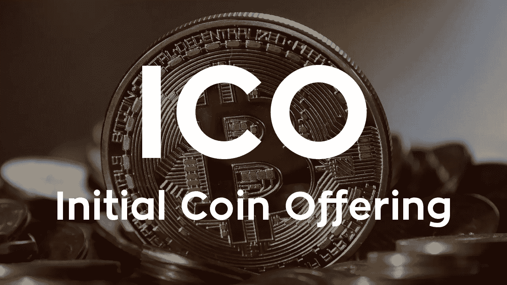
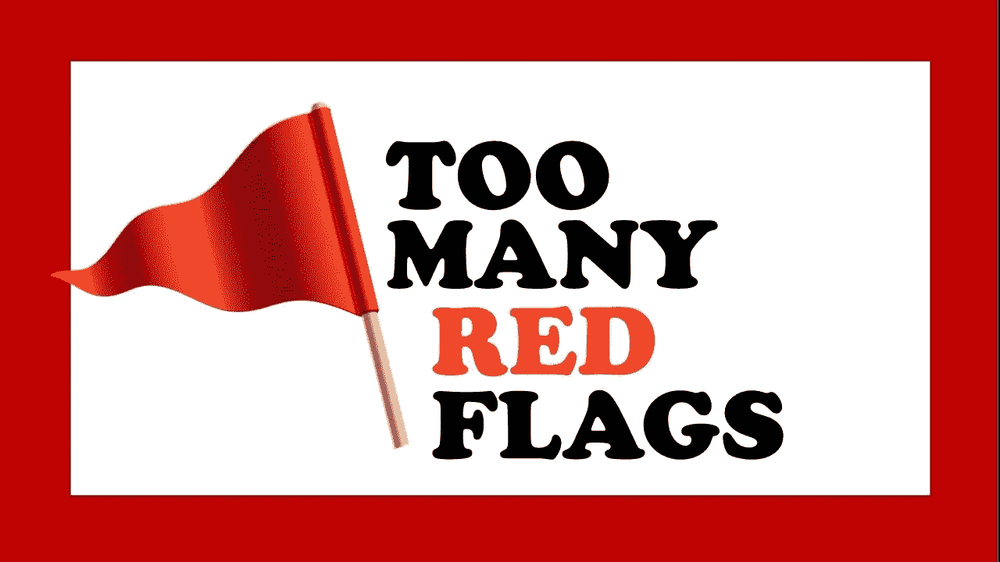
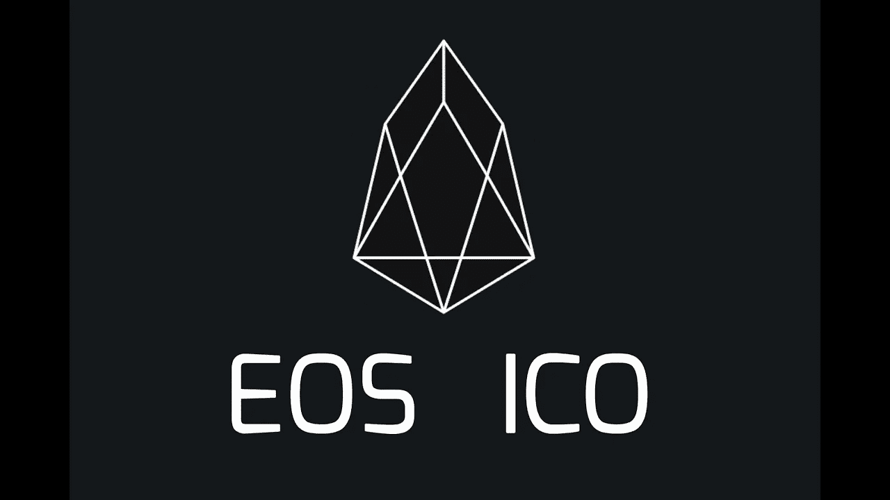

# 有问题的 Block.one 回购、EOS ICO 以及为什么使用安全令牌会有所不同

> 原文：<https://medium.com/hackernoon/the-questionable-block-one-buyback-the-eos-ico-and-why-with-security-tokens-it-would-be-different-a37e0980e72d>

Greed - for lack of a better word — is good

最新消息是，加密令牌 [EOS](https://eos.io/) 的开发商 [Block.one](https://block.one/) 将使用其在 2018 年 ICO 中筹集的创纪录的 40 亿美元中的一部分，以私人交易的方式从早期投资者手中回购至少 10%的 Block.one 股票。据发布消息的[彭博称，这将使该公司在 2017 年的种子期估值达到创纪录的 23 亿美元。](https://www.bloomberg.com/news/articles/2019-05-22/thiel-backed-crypto-startup-pays-out-6-567-return)

至于谁是幸运的股东，谁将在 1 年内从 6，657%的丰厚回报中受益，目前还不知道更多细节，也不知道回购的方式。

## **ico 的问题**

2019 年迄今为止，ico 在 68 笔交易中仅融资[3 亿美元](https://www.icodata.io/stats/2019)，而 2018 年融资[62 亿美元。尽管如此，尽管有许多讣告，ico 仍然可以在资助区块链本土项目中发挥重要作用。ico 会和 sto 一起找到自己的位置。问题是，到目前为止，它们已经被用来*而不是*sto，作为一种规避证券监管和以不受监管的方式筹集股本的方式——伪装成公用事业代币。](https://icowatchlist.com/statistics/year/2018)

**ICO 投资者应该学习的简单课程是:**

*   ico 不是 sto。代币并不授予你任何进入公司的股权或参与权。
*   **始终进行彻底的尽职调查**。这是基本的，但它经常被许多人忽视，我在 2017 年的文章*ICO 尽职调查* 中写道[。例如，Block.one 是一家位于开曼群岛的公司(这已经是一个危险信号),它是 EOS 的开发者。EOS 本身并不是一家公司。它是一项资产，是 Block.one 的产品。当你购买 EOS 令牌时，你将钱交给了 Block.one，作为回报，你除了简单地期望他们会用你的钱开发产品之外，什么也没得到。这可能会发生，也可能不会发生。你对此没有保证。没有法律义务。一个人可以用这笔钱去做那件事(如果诚实的话),或者他们可以给自己发一笔丰厚的股息，或者回购自己的股份(就像他们计划的那样),或者全部花在派对上。他们可以用这笔钱做任何他们想做的事情，你没有任何发言权。](https://www.bianconiandrea.com/articles/2017/)
*   **甚至不要考虑购买没有托管的 ICOs】，在一个可靠的司法管辖区，有非常明确的条款和条件，并有可靠的托管代理来监督募集资金的使用和分配。**

## **与 sto 的区别**

如果 Block.one 做了一个 STO，那就不一样了。根据附在证券上的条款和权利，你可以购买股权或利润分享。很可能，您将被授予投票权，以影响 Block.one 的管理。规避这些权利将更加复杂，您仍然可以行使作为安全令牌持有者的一些基本权利。最终，你也可以从这种回购中受益(尽管这不是自动的，它在很大程度上取决于股东协议和公司章程，这就是为什么适当的尽职调查非常重要)。

## **EOS ICO，到处都是红旗**

对于 EOS 令牌持有者来说，从一开始就有大量的警告信号。**筹集的金额不成比例。该公司没有产品。他们过去没有——现在仍然没有——如何投资这笔钱的明确计划。据[彭博](https://www.bloomberg.com/news/articles/2019-05-22/thiel-backed-crypto-startup-pays-out-6-567-return)称，他们将筹集的现金直接或通过 Novogratz 公司——银河数码——投资于美国国债、BTC 以及 1 . 74 亿美元的风险投资交易，然后用 ICO 基金支付的另一笔 7100 万美元的巨额支票收购了该公司。**

**更糟糕的是，ICO 的发起人——即 Block.one 富有的股东——是华尔街的投资者，他们不需要任何资金来启动一家区块链科技初创公司。他们本可以用自己的零花钱轻松完成。ICO 对他们来说是一笔意外之财，实际上是一份礼物，一笔 40 亿美元的财富从天真的代币持有者手中转移到富有、聪明和肆无忌惮的华尔街人士手中。**

这种人会把钱装进口袋是可以预料的。这些迹象随处可见。以下[帖子是 9 个多月前在 Reddit](https://www.reddit.com/r/eos/comments/9734i1/dont_forget_block_one_still_has_around_3_billion/) 上发布的:

> *代币持有者 1:想象一下，如果 Block One 回购了约 10 亿美元的 EOS(硬币),然后处理掉降低供应量的硬币，情况会怎样？或者，如果 Block One 至少出来说他们打算用剩下的 30 亿美元做什么呢？这两种价格都可能是目前价格的两倍以上。*
> 
> 代币持有者 2:这是个好主意，但现实是，手头的“现金”不能也不应该很好地转化为代币价值。简而言之，代币不是股权:作为持有人，你对清算事件中的资产没有或有要求权，因此现金不能有效地用作确定市值的手段。一旦清算，所有这些现金都将归 B1 的股东所有。非常重要的区别。
> 
> *令牌持有者 3:全对，但不认为 B1 在部署资源方面做得很好……*
> 
> 这就是为什么我想让 B1 宣布另外 30 亿美元的去向，但当然我想他们可能永远不会兑现他们的承诺…幸运的是，它是由美国公民创建的，彼得·泰尔是投资者(顶级创业投资者)…在我看来，这不太可能是夜间飞行。
> 
> *令牌持有者 4:伯尼·麦道夫是一位美国公民，作为投资者也享有很高的声誉，许多知名人士都和他一起投资。*

## **代币持有者*兜风***

Ahahahaha…tie´

代币持有者的信仰显然是错误的。回购确实会发生，但受益的只是股东。股东是众所周知的美国公民和华尔街投资者的事实并没有改变什么。 *Pecunia non olet* ，专为华尔街人士而设。

在华尔街谈论道德和原则显然是幼稚的。如果说原则和道德曾经存在过，现在它们早已不复存在。这不是问题所在。

更重要的是，这一可疑的回购表明代币持有者根本不值得考虑。事实上——通过将 ICO 的资金收入囊中——block . one 的管理层和股东发出了完全无视代币持有人合理的——尽管在法律上不可强制执行——期望的信号。

如果有的话，他们会拍拍肩膀，并会被他们的朋友祝贺，因为他们带着天真的代币持有者兜风。他们在华尔街的声誉不会受到影响，这只是他们履历上的又一次成功交易。他们将为自己和他们的华尔街伙伴支付可观的回报，这将确保他们在接下来的交易中有大量的融资机会。

否则——如果他们对代币持有者有一点点考虑，担心他们的行为可能会适得其反——他们就会采取不同的行动。

至少——在兑现 6.500%以上的回报之前——他们会给那些从峰值损失 70%以上的 EOS 令牌持有者一些回报，并至少说——谢谢。

**令牌持有者，现在问自己一个简单的问题:如果 EOS 开发者*向你伸出手指*，那么 EOS 令牌对开发者来说值多少钱？此外，对于市场而言，EOS 代币应该值多少钱？**

**得出你自己的结论……**

我将用戈登·盖柯的名言“贪婪，找不到更好的词来形容，是好的……贪婪抓住了进化精神的本质。各种形式的贪婪……标志着人类*向上的浪潮。*

然而，与此同时，唯一向上飙升的是彼得·泰尔和他的朋友们在福布斯亿万富翁中的财富……多亏了你们的钱。

*****************************************************************

**披露**:我从未拥有过 EOS 代币，在 Block.one 活动和业务中也没有任何经济利益

*******************************************************************

***如果你喜欢这篇文章，请在左下角“鼓掌”x 次，这样它就会被更多的人分享。多谢***

# eos # blockone #区块链# security tokens # bianconiandrea # crypto # think block tank # sto # ico