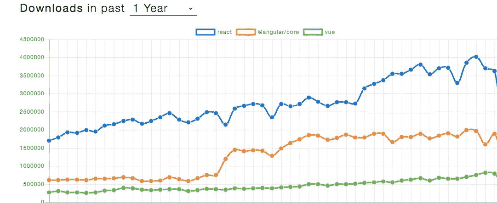
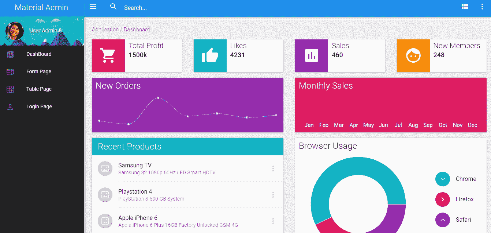
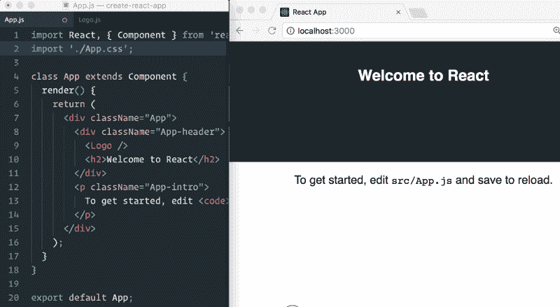

# 2019 年你应该知道的 React 开发者工具

> 原文：<https://medium.com/hackernoon/the-react-developer-tools-you-should-know-in-2019-e681dc4f4332>

## 2019 年优化 React 工作流程的有用工具

React takes the lead into 2019

虽然前端世界在过去十年中经历了一些动荡，但在过去几年中， [React](https://hackernoon.com/react/home) 的可组合和可扩展方法已经证明了自己的可行性和可持续性。看起来，2019 年只会标志着 [React](https://hackernoon.com/tagged/react) 及其生态系统的又一个增长年，该生态系统一直在快速增长。

这可能是一个很好的时间来看看一些最好的特性，[工具](https://hackernoon.com/tagged/tools)和库，以引入今年你的 React 工作流，以充分利用它。所有这些都是开源的，所以请随意尝试一下。

希望这些伟大的工具可以帮助加快您的工作流程，并在 2019 年使用 React 时打开新功能的大门。随意评论，补充自己的建议和经验。为了方便起见，我将这些资源进行了分类，请随意查看。

# 共享可重用组件

2018 年初发布的**[**Bit**](https://github.com/teambit/bit)**用新的能力彻底改变了我们分享和管理组件的方式。它迅速流行是有原因的。****

****通过 Bit，您可以轻松地将任何项目或库中的组件共享为可重用的集合，而无需任何重构或代码更改。然后，您或您团队的其他成员可以从云中发现并使用这些组件，就像用乐高积木构建应用程序一样。****

****组件可以通过一个活动平台被发现，每个组件都被隔离测试并显示结果，文档被自动提取。通过内置的组件搜索和收集，这创造了前所未有的组件可发现性和协作体验。****

****组件可以使用 NPM 和 Yarn 安装在任何项目中，甚至可以使用 Bit 本身导入，这样您就可以从任何项目开发它们，并在不同的应用程序之间同步更改。****

****团队可以在组件集合上共享和协作，并同步他们的组件以更快地构建新应用。试一试:****

**** [## 用代码组件进行位共享和构建

### Bit 帮助您在项目和应用程序之间共享、发现和使用代码组件，以构建新功能和…

bitsrc.io](https://bitsrc.io) 

*   **见** : [故事书](https://storybook.js.org/)， [CodeSandBox](https://codesandbox.io/) ， [Styleguidist](https://github.com/styleguidist/react-styleguidist) 带更多[游乐场](https://blog.bitsrc.io/11-react-ui-component-playgrounds-for-2018-eef5a87a1bf8)和[工具](https://blog.bitsrc.io/9-tools-and-libraries-to-boost-your-react-component-workflow-6ff4b49511c2)。
*   **参见** : [构建 UI 组件设计系统](https://blog.bitsrc.io/building-a-consistent-ui-design-system-4481fb37470f)。

# 组件库

虽然有大量的库可以在 React 中提供组件，从社区项目到[企业构建的库](https://blog.bitsrc.io/building-a-consistent-ui-design-system-4481fb37470f)，但在 2019 年到来时，一些库似乎仍在做这项工作。这里有一些最好的，你可以在下面找到更多，包括 ant-design，semantic-ui，elemental-ui，rebass 和许多其他的。

*   **扩展列表**

 [## 23 个最佳反应 UI 组件库和框架

### 23 个最好的 React UI 组件库和框架来构建您的下一个应用程序！

hackernoon.com](https://hackernoon.com/23-best-react-ui-component-libraries-and-frameworks-250a81b2ac42) 

**一些极品** : [React Material-UI](https://github.com/mui-org/material-ui) ， [Grommet 2.0](https://github.com/grommet/grommet) ， [React Bootstrap](https://github.com/react-bootstrap/react-bootstrap) ， [Reactstrap](https://github.com/reactstrap/reactstrap) ， [Prime React](https://github.com/primefaces/primereact) ， [Elemental-UI](https://github.com/elementalui/elemental) ， [Semantic-UI](https://github.com/Semantic-Org/Semantic-UI-React) & [更有](https://blog.bitsrc.io/11-react-component-libraries-you-should-know-178eb1dd6aa4)。

# 样式组件

2018 年有很多关于使用从 JS 中的 CSS 和 [styled-components](https://github.com/styled-components/styled-components) 到 Sass、Less、CSS 模块、内联 CSS 甚至 Stylable 等项目的方法来设计组件的讨论。

实际上，这是个人偏好和应用程序架构需求的问题，所以选择权在你。似乎许多团队仍然避免直接使用 JS 中的 CSS，而更喜欢先尝试更传统的方法。你可以在下面找到完整的讨论，以及对你所做的每一个选择的利弊的更深入的评论。看一看。

 [## 2019 年 React 组件的 5 种风格

### 通过简短而详细的回顾，了解 2019 年 React 组件的风格

blog.bitsrc.io](https://blog.bitsrc.io/5-ways-to-style-react-components-in-2019-30f1ccc2b5b) 

*   另见:【2019 年 JS 库中的 9 个 CSS

# 状态管理

这是一个令人痛苦的话题，也是 2018 年一个伟大的对话(或争吵)的开始。而 Redux 传统上统治着 DOM(明白了吗？)，商店现在开始营业(我又做了一次)不同的工具越来越常见。在这里，您可以找到对工具和差异的深入回顾。

在流行的工具中，你可以找到**，以及 [**Mobx**](https://github.com/mobxjs/mobx) 的重新崛起，它融合了 React 的封装组件范式。它还评论了新的 [**上下文-API**](https://blog.bitsrc.io/react-context-api-a-replacement-for-redux-6e20790492b3) ，它是 [**Redux**](https://redux.js.org/) **的一个很有前途的替代品。****

** [## 2019 年反应状态管理状态

### 在野外观察国家管理…商店开门营业了！🐯

blog.bitsrc.io](https://blog.bitsrc.io/state-of-react-state-management-in-2019-779647206bbc) 

# 测试

2018 年[“JS 状态”调查列出了展望 2019 年最受欢迎的测试框架](https://blog.bitsrc.io/top-javascript-testing-frameworks-in-demand-for-2019-90c76e7777e9)，流行的测试框架如 [**Jest**](https://jestjs.io/) 、 [**Mocha**](https://mochajs.org/) 、 [Karma](https://karma-runner.github.io/2.0/index.html) 等，以[使 TDD 在组件级别上更简单](https://blog.bitsrc.io/a-guide-to-test-driven-development-tdd-shorter-feedback-loop-faster-workflow-ce5bd6b247c4)。

这里有几个关于用 Jest & Enzyme 测试 React 组件的有用而深入的指南，Jest & Enzyme 可能是今年开发大多数 React 应用程序的最佳组合。看一看。

 [## 用 Jest 和酶深入测试 React 组件

### 关于使用 Jest & Enzyme 测试 React 组件，您应该知道的一切。举例说明。

blog.bitsrc.io](https://blog.bitsrc.io/how-to-test-react-components-with-jest-and-enzyme-in-depth-145fcd06b90)  [## 如何使用 Jest 和酶测试反应成分

### 了解如何使用 Jest 和酶测试 React 组件

blog.bitsrc.io](https://blog.bitsrc.io/how-to-test-react-components-using-jest-and-enzyme-fab851a43875) 

*   当与[位](https://bitsrc.io)结合使用时，每个组件都可以在与 src repo 分离的情况下单独测试，以确保它真正可以在任何地方重用。

# 启动程序和样板

随着[**create-react-app 2.0**](https://blog.bitsrc.io/introducing-create-react-app-version-2-0-6667aee5db17)的发布，看起来这个 React 应用样板仍然是最受欢迎和推荐的项目。然而，也值得看看像[**React-样板**](https://github.com/react-boilerplate/react-boilerplate) 和[**React slings hot**](https://github.com/coryhouse/react-slingshot)这样的项目，它们为不同的用例提供了一种选择。

请参阅本文的第 5 部分，了解它们之间的区别。

 [## 在 React 中加快开发的 5 个工具

### 加速 React 应用程序开发的 5 个工具，侧重于组件。

blog.bitsrc.io](https://blog.bitsrc.io/5-tools-for-faster-development-in-react-676f134050f2) 

# React 挂钩和上下文 API

虽然 React 在 2018 年推出了许多新功能，但就社区讨论和潜力而言，有两个功能可能是最重要的。第一个是 React 的**上下文 API** ，经过长时间的等待后，它正式成为 Redux(以及更多)的潜在替代品。第二个是 **React 钩子**，它让你不用写类就可以使用状态和其他 React 特性，这有助于管理状态等等。看一看。

**上下文 API**

 [## React 上下文 API——Redux 的替代品？

### 将使用 Redux 进行状态管理的 React 应用程序转换为使用 React 的新上下文 API

blog.bitsrc.io](https://blog.bitsrc.io/react-context-api-a-replacement-for-redux-6e20790492b3)  [## 为什么您应该考虑 React 中的新上下文 API？—深度潜水

### 全新 React 上下文 API 的引入。

blog.bitsrc.io](https://blog.bitsrc.io/why-you-should-consider-the-new-context-api-in-react-a-deep-dive-d588b66c57b5) 

**挂钩**

 [## 了解 React 中的挂钩

### React 16.7 钩子介绍，有例子。

blog.bitsrc.io](https://blog.bitsrc.io/understanding-hooks-in-react-a-deep-dive-d5d5dc88ecd9)  [## 了解 React 挂钩—使用状态

### 开始在 React 中使用钩子所需要知道的一切。

blog.bitsrc.io](https://blog.bitsrc.io/understanding-react-hooks-usestate-6627120614ab) 

# 排除故障

嗯，这里没有太多新的东西，因为 React 开发工具和 Redux 开发工具仍然可以快速简单地完成工作。React dev-tools [扩展](https://chrome.google.com/webstore/detail/react-developer-tools/fmkadmapgofadopljbjfkapdkoienihi?hl=en)允许您检查 React 组件层次结构，检查和编辑组件属性和状态，甚至查看组件更改如何影响其他组件。

Redux dev-tools [扩展](https://github.com/zalmoxisus/redux-devtools-extension)允许您检查每个状态和动作负载，并重新评估“分阶段”的动作。对于每个 React 组件的本地状态，您可以有多个存储或不同的实例，甚至可以进行“时间旅行”来取消已经采取的操作。这是丹·阿布拉莫夫的演示视频。

# 反应静态站点生成器

React 为基于组件的静态网站的组成带来了一个新时代，有了像 [**Gatsby**](https://www.gatsbyjs.org/) 和 [**React static**](https://github.com/nozzle/react-static) 这样的新框架。这些库利用 React 的组件和能力，为构建漂亮的静态网站提供快速、省力、灵活且强大的体验。以下是 2019 年需要关注的 9 个这样的图书馆的完整回顾(你听说过**吗？).看一看。**

** [## 2019 年 9 台 React 静态站点发电机

### React 的下一代静态站点生成器真棒！

blog.bitsrc.io](https://blog.bitsrc.io/9-react-static-site-generators-for-2019-f54a66e519d2) 

# 结论

React 生态系统正在快速发展，围绕组件的一般生态系统也是如此:从 UI 组件到各种 API 和 Node.js 模块。随着变化的流动，新的机会和工具涌现出来，为我们提供新的能力，这不仅可以加速我们构建软件的方式，而且可以实际地改变我们构建的软件。我们可以提高可重用性、协作性、测试覆盖率、减少 bug 和捆绑包大小等等。

请随意深入挖掘，找到您需要的宝石，并分享您自己的经验。感谢您的阅读，让我们在 2019 年度过美好的一年！

[https://hackernoon.com/react/home](https://hackernoon.com/react/home)** 

# **了解更多信息**

** [## 在 React 中加快开发的 5 个工具

### 加速 React 应用程序开发的 5 个工具，侧重于组件。

blog.bitsrc.io](https://blog.bitsrc.io/5-tools-for-faster-development-in-react-676f134050f2)  [## 2019 年的 11 个 JavaScript 动画库

### 一些最好的 JS 和 CSS 动画库。

blog.bitsrc.io](https://blog.bitsrc.io/11-javascript-animation-libraries-for-2018-9d7ac93a2c59)  [## 如何在项目和应用程序之间共享 React UI 组件

### 如何使用 Bit 在团队的所有项目和应用程序之间轻松共享和同步 React UI 组件。

blog.bitsrc.io](https://blog.bitsrc.io/how-to-easily-share-react-components-between-projects-3dd42149c09)********