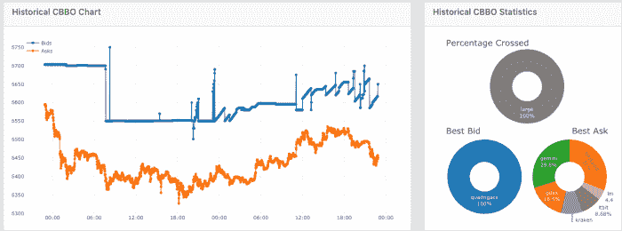
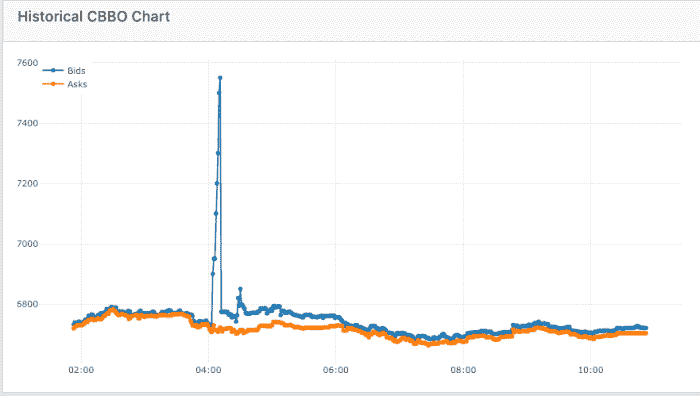

# QuadrigaCX 惨败的真正教训！

> 原文：<https://medium.com/hackernoon/the-real-lessons-from-the-quadrigacx-fiasco-eeb7b1b20cb0>

在过去的一周里，QuadrigaCX 的故事被不断讲述，但所有的故事都错过了最重要的一点*。在丢失钥匙的传说中，一个可疑的死亡，&硬币存在的问题是 QuadrigaCX 经常违反 ***最佳执行*** 原则的事实。*

*等等？？？他刚才是不是说最佳执行的失败比损失 1.9 亿美元的比特币更重要？？？*

****是的*** ***我做到了。亲爱的读者，你看，任何在 QuadrigaCX 上购买比特币的人要么是可悲地不知道比特币的价格，要么可能是在洗钱。在 CoinRoutes，我们跟踪大量交易所的最佳出价和报价，在过去一年中，QuadrigaCX 上的*出价*一直比其他地方的最佳*报价*高出多个百分点。九月底的价格图表很常见:****

**

*(在这个图表中，我们可以看到 QuadrigaCX 在此期间的最佳出价是 100%,平均每枚硬币比其他交易所的最佳出价高出 150 美元以上。)*

*这种价格差异的存在是因为**没有** ***的理性原因*** 。由于加拿大没有货币管制，为什么会有人愿意在那里的边缘交易所为比特币支付不必要的价格？？？这当然不是因为他们一流的保管服务…*

*当然，这让人怀疑该交易所是否真的拥有他们声称的比特币，而且，即使他们拥有，这些比特币是否是从当局“感兴趣”的地方被盗或被买卖的。(OFAC 国家、贩毒集团等)。也就是说，我确信 QuadrigaCX 成功说服了一些贫穷的散户投资者放弃他们的资金，因为这些投资者很容易被利用。虽然这是一个极端的案例，但它应该为整个行业敲响警钟，开始关注最佳执行。*

*在你认为这篇评论只适用于边缘交易所之前，很遗憾事实并非如此。据我所知，在散户投资者市场占主导地位的交易所中，没有一家纳入竞争对手的数据。在极端情况下，这可能会给他们的客户带来巨大的潜在损失，就像去年夏末发生在纽约的一个“受监管”的交易所一样:*

**

*在这个例子中，客户在 10 分钟内输入了多个订单，并交易了超过 7550 美元的比特币，而所有其他交易所提供的比特币价格约为 6720 美元*

*虽然交易所*可以*整合数据馈送(如 CoinRoutes 提供的)以足够容易地避免这些问题，但只要单个交易所保持隔离，就没有办法提供最佳执行。在一天中的任何时间点，即使仅在一个交易所执行的合理规模的订单，其成本也比智能路由或算法订单高得多。我们在 CoinRoutes 有实时工具来评估这些额外的成本，这些成本通常很大。例如，下面的表格显示了在单个交易所买卖多种货币的超额成本，订单价值从 55，000 美元到 200，000 美元不等(为了避免挑选具体的交易所，该表格没有指明它们，而是使用了接受美国投资者账户的三个最大的交易所)*

**

*那么，考虑到所有这些，我们应该从*中学到什么呢？我建议如下:**

1.  **交易所应停止忽视最佳执行，并实施整合数据和/或路由技术。**
2.  **精明的投资者应该“用脚投票”，停止在单一交易所界面上交易。使用可访问多个交易所账户的 CoinRoutes 或交易平台等系统，更重要的是，使用整合所有相关交易所市场数据的算法。**
3.  **厌倦了对加密市场的问题挥舞手臂的监管者应该认真对待最佳执行。这将推动该行业向前发展，包括批准比特币交易所交易基金。毕竟，如果最佳执行和操纵监督是关键规模交易所的标准，SEC 就没有理由反对一项精心设计的提案。**

**总之，虽然 QuadrigaCX 的惨败产生了有趣的故事，但它凸显了密码市场中比糟糕的房地产管理更重要的缺陷。当市场制定出必要的技术、政策和程序来实现最佳执行时，那些采纳者将会蓬勃发展，而那些拒绝吸取这一教训的人将最终失败。**