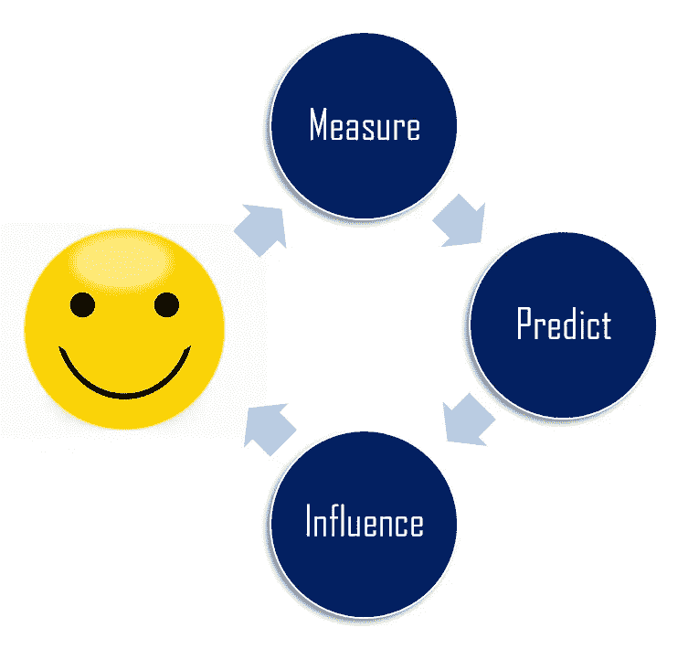
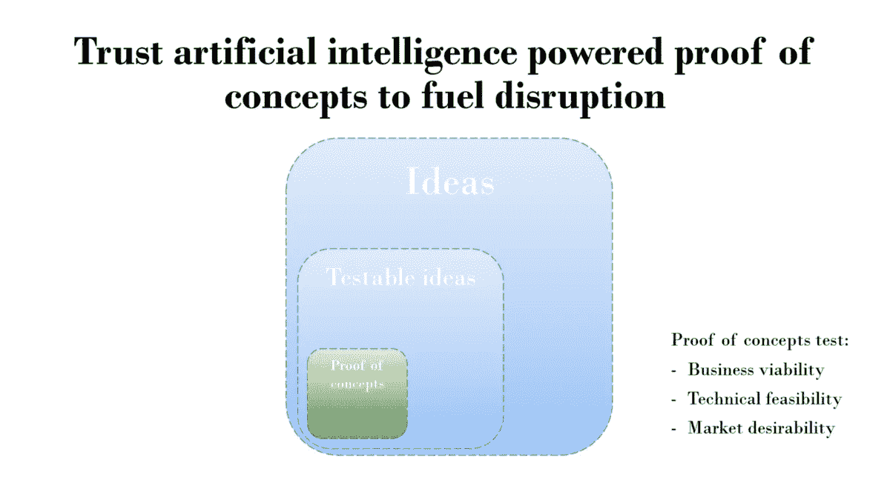

# 计算意义制造的兴起

> 原文：<https://medium.com/hackernoon/the-rise-of-computational-sensemaking-bad0d0ff7bea>

## 通过在现实世界中部署传感器来克服人工智能中的意义障碍

Photo credit: [Simon Jowett](https://www.flickr.com/photos/sjpowermac/)

没有哪个自尊的人工智能研究者会声称人工智能会在这个世界上很快取代人类的角色。仍然有许多基本的人工智能挑战阻止了超级人类计算机的崛起。这些挑战不会消失，甚至不会在这个数据中消失——或者如果你将“人工智能革命”——我们现在面临的挑战。

通过一个即将到来的科学新领域的例子，我们正在由我的同事[马丁·阿兹密尔](https://www.linkedin.com/in/martin-atzmueller-79b281b/)经营的[计算意义制造实验室](http://www.cslab.cc/)探索，我想展示在基础和应用人工智能的边缘实际上已经做了什么工作，以及为什么这与科学、工业和社会相关。

在这篇文章中，我将论证:

*   *基本的*人工智能挑战，如意义障碍，可以由行业在*应用的*人工智能概念验证中解决。
*   即使是社会中最难衡量的东西，幸福，也可以通过新的科学计算感官分析来解决。

# 人工智能触及了意义的障碍

引用人工智能研究人员 Melanie Mitchell 的话:“商业化人工智能的竞赛给研究人员带来了巨大的压力，要求他们生产出能够“足够好地”完成狭窄任务的系统。但最终，开发值得信赖的人工智能的目标将需要对我们自己的非凡能力进行更深入的调查，并对我们自己用来可靠、稳健地理解世界的认知机制有新的见解。”

我完全同意梅勒妮去年 11 月在《纽约时报》上写的非常有影响力的专栏文章。她继续说道:“今天的人工智能系统严重缺乏人类智慧的精髓:理解我们经历的情况，能够理解它们的意义。”理解上下文、多重解释和细微差别是人类的核心特征。

以下面的沙质曲线图像为例:

Photo credit: [Bureau of Land Management California](https://www.flickr.com/photos/blmcalifornia/)

计算机很难理解上面的沙质曲线和下面的人体曲线之间的区别:

Photo credit: [Heitor Magno](https://www.flickr.com/photos/heitorm/)

这是一个人类在基本层面上理解周围世界方面胜过计算机的例子。

虽然我很想讨论人工智能的基本问题，但我现在就说到这里。还有很多更有趣的研究要做。关键是，通过在现实世界中应用人工智能进行概念验证，工业界或许能够帮助解决这些基本问题。可能的应用会让你大吃一惊。

# 拯救计算机的意义

回到马丁的计算感知实验室。去年，我们了解到，随着物联网、智能设备和无处不在的计算的出现，计算意义构建能够以前所未有的规模收集多模态交互数据。这些新的[技术](https://hackernoon.com/tagged/technologies)能够洞察人类行为，并能够进行结构建模和社会互动结构的分析。

## 优化幸福的数据驱动框架

目前关于幸福的研究主要集中在自我报告上，如白天重建法和经验抽样。虽然这些研究方法有很强的优势，但它们也有缺点，这些缺点可以通过使用移动设备、传感器网络和可穿戴传感器来弥补。

Figure from [Towards Estimating Happiness Using Social Sensing,](https://pdfs.semanticscholar.org/f414/88f1c25ad56ef60e445e39a519ed52bdaf6c.pdf) Atzmüller, Kolkman, Liebregts & Haring

在我们看来，客观数据可以被测量，以允许预测，并最终影响个人(以适应/改变他们的行为)，以增加他们的福祉和幸福，例如，使用建议。

## 幸福的证明

想法很棒，我们的论文被接受了🎉。一些更传统的科学家在发表论文时会认为他们已经完成了。但我们认为这项工作只是开始。我们想把我们的工作带出实验室，并在工业中验证。不仅是因为它*能用*，而且你可以用它赚*的钱*。

Figure from [Designing Intelligent Disruption](/datadriveninvestor/designing-intelligent-disruption-e44770e2ccf0)

像日立这样的公司已经活跃在幸福测量领域。因此，这项研究和业务并没有你想象的那么牵强。我们已经研究了几个用例，在学生和专业团队中，我们看到了潜在的商业模式。同样，我们没有找到合适的资金来进行实际的概念验证。这篇博客公开邀请工业界参与这项重要的工作。

一旦我们筹集到资金，并建立了第一个概念证明，我会向你汇报。现在我要回去工作了😊。

澄清一下，在这篇文章中，我认为:

*   *基本的*人工智能挑战，如意义障碍，可以由行业在*应用的*人工智能概念验证中解决。
*   即使是社会中最难衡量的东西，幸福，也可以通过新的科学计算意义来解决。

向我们的世界添加传感器，并让算法根据传感器数据试图找出正在发生的事情，这是人工智能中心的一个非常重要的研究方向，但这种探索可能与工业更相关。我们可以携手合作，共同受益于所有新的和令人兴奋的可能性。

[https://upscri.be/hackernoon/](https://upscri.be/hackernoon/)