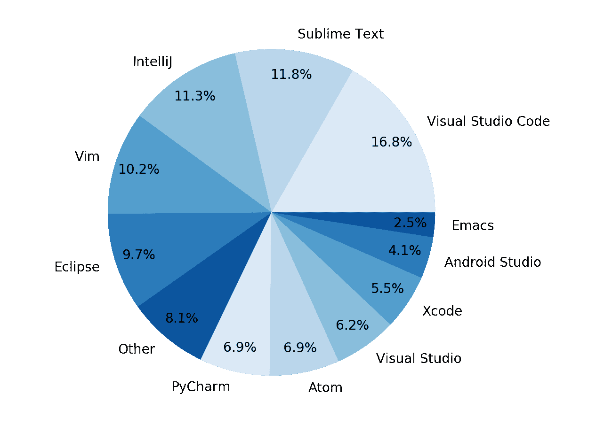
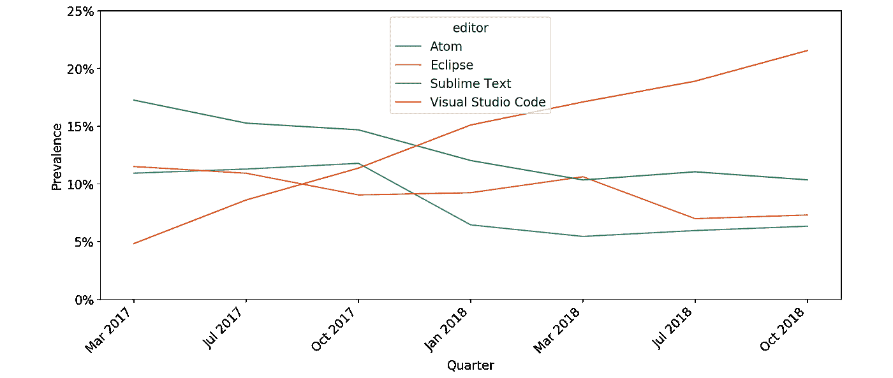
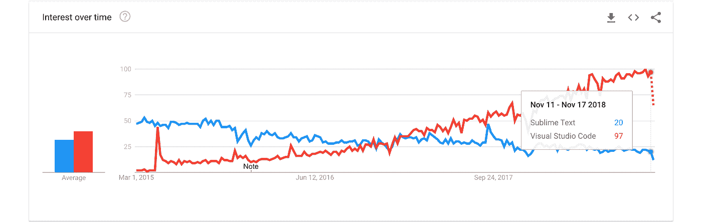
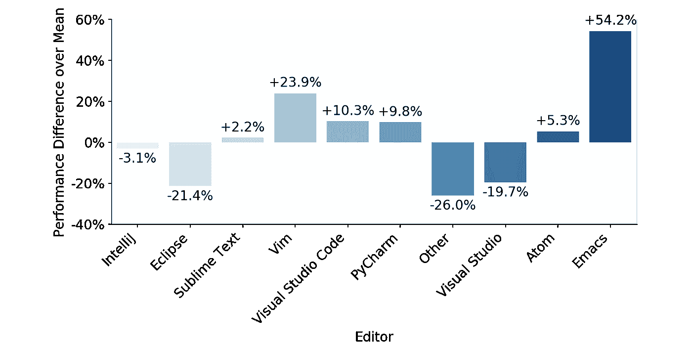
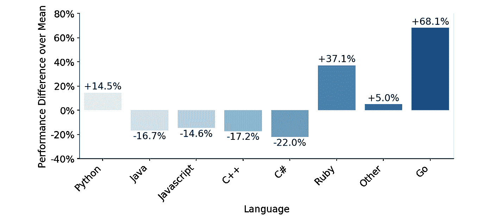
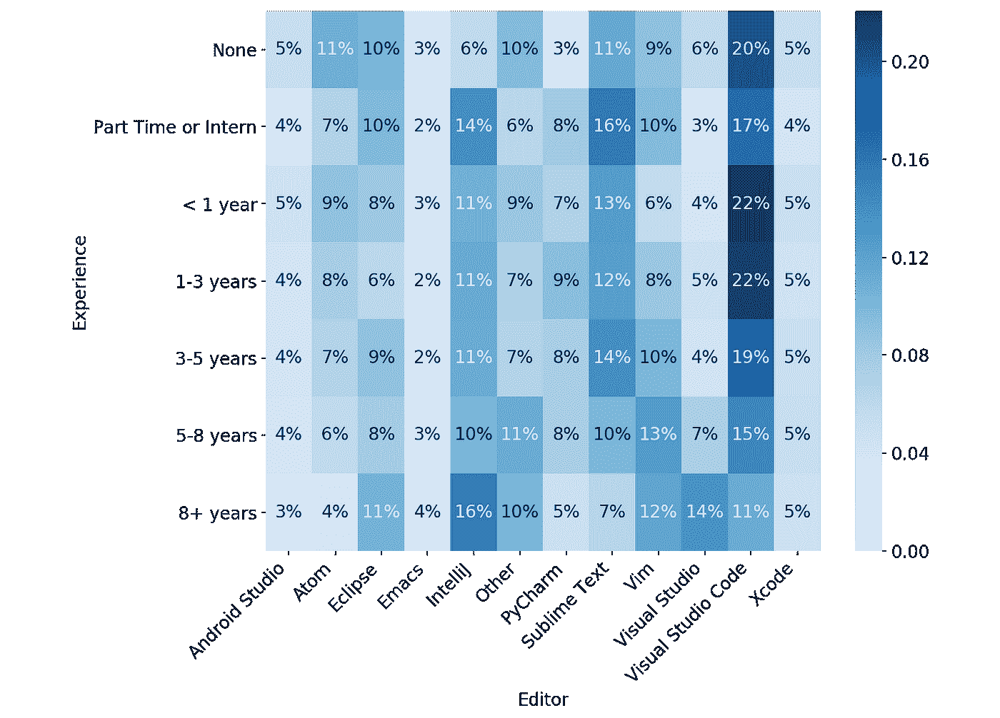
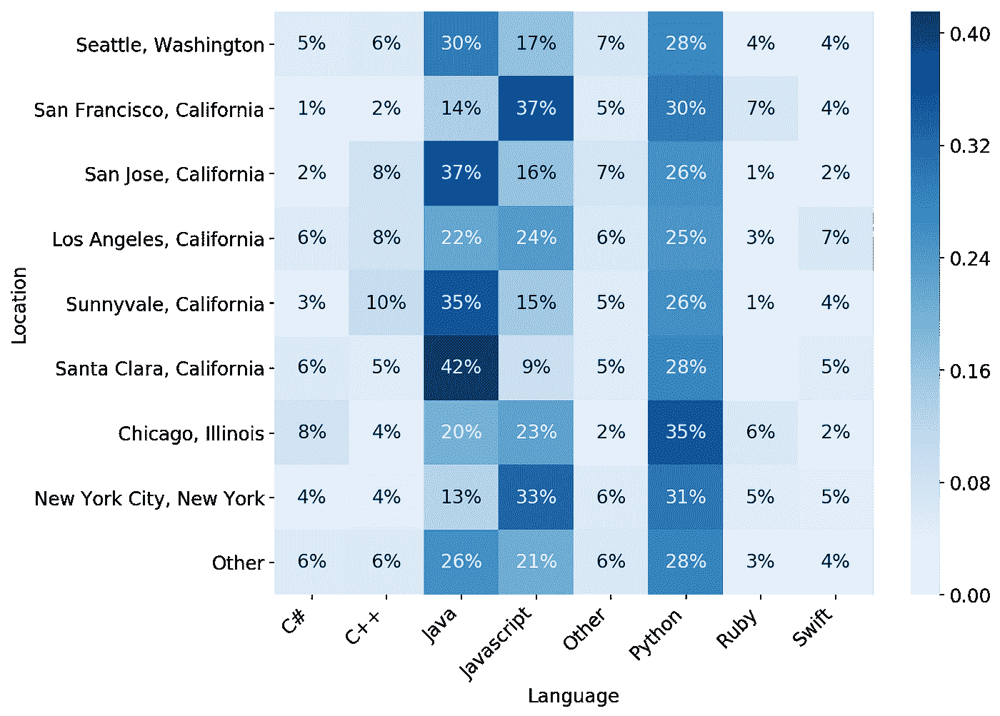

# 微软 Visual Studio 代码的崛起

> 原文：<https://medium.com/hackernoon/the-rise-of-microsoft-visual-studio-code-a3d143490a52>

## ***TL；Visual Studio 博士代码的使用率正在迅速上升！VS Code 现在是大多数工程师在编程面试时选择的编辑器，它似乎正在迅速从其他顶级编辑器那里夺取市场份额。***

> [林恩·莱文尼克和阿蒙·巴特拉姆，2018 年 12 月 4 日。最初发表于 triplebyte.com/blog](https://triplebyte.com/blog/editor-report-the-rise-of-visual-studio-code)

Triplebyte 每周面试数百名工程师。对于每一次采访，我们都记录下使用的编辑、语言和操作系统。我们不会用这些信息来决定谁能通过我们的面试(我认为这不公平)。然而，这是令人着迷的数据！它让我们深入了解不同的工程师群体更喜欢哪些工具，以及这些偏好如何随时间而变化。它还允许我们在编程面试中识别工程师选择的工具和他们的表现之间的相关性。

一年前，我的同事 Mike 写了一篇关于这个数据的文章。但从那以后，Triplebyte 增长了很多，我们现在有足够的数据来深入研究。这是我这篇博文的目标。

# 编辑器使用率

首先，我收集了去年所有采访中使用的编辑的数据:

从这个图表中首先突出的是 Visual Studio 代码的重要性。去年，VS Code 占了 17%的份额，是多个三字节候选者使用的编辑器。这让我大吃一惊，原因有二。首先，VS Code 是微软相对较新的产品，其次，去年它甚至没有出现在我们的图表上——它的份额很小，足以落入“其他”类别。

为了更好地理解这一点，我绘制了同样的数据:

呀！VS 代码在吃别人的午饭！这里的故事很清楚。在过去的一年里，VS 代码的使用率从 5%上升到了 22%。与此同时，Sublime Text 的使用率从 17%下降到 11%，Atom 的使用率从 11%下降到 6%。连月食都在下降。而且 VS 代码每个月都在加速。谷歌趋势显示了同样的事情:

VS Code 正在崛起，并且有望成为我们见过的最具统治地位的编辑器。也许*我*应该试一试！

# 面试通过率

然而，编辑器的使用只是故事的一部分。并非所有的用法都是相同的。我想看看最好的程序员使用哪些编辑器。为了了解这一点，我提取了三字节候选人在面试中的表现数据，按照他们使用的编辑器进行了分组:

这张图表显示了每个编辑的用户通过我们面试的比率，与所有候选人的平均通过率相比。首先，注意 Emacs 和 Vim 的卓越之处！使用这些编辑器的工程师通过我们面试的几率明显高于其他工程师。而且效果尺寸也不小。Emacs 用户通过我们面试的几率比其他工程师高 50%。如何解释这一现象？一种可能的解释是 Vim 和 Emacs 是老派。你可能会期望他们的用户有更多的经验，从而做得更好。然而，请注意 VS Code 是第三好的编辑器——而且是全新的。这稍微削弱了这种叙述(并使 VS 代码看起来更占优势)。

Emacs 和 Vim 用户是否有一些其他的特征使他们更有可能在面试中成功？也许他们更愿意在短期内投入时间和精力定制一个复杂的编辑器，以便从更强大的工具中获得长期回报？

从负面来看，使用 Eclipse、intelliJ 和 Visual Studio 的工程师通过我们面试的几率较低。Eclipse、IntelliJ 和 Visual Studio 有什么共同点？嗯，都是 IDEs。不过 PyCharm 也是一个全功能的 IDE，而且表现出了很高的通过率。还会发生什么？Eclipes、IntelliJ 和 Visual Studio 的另一个显著特征是它们与 Java 和 C#的紧密联系，那么我们可能仅仅看到了特定编辑器和特定语言之间相关性的结果吗？

为了调查这一点，我还查看了不同语言的面试通过率:

Java 和 C#的通过率确实相对较低，虽然注意 Eclipse 的通过率比 Java 低(-21.4% vs. -16.7)，所以我们不能把它的性能差完全解释为 Java 拖累了它。

还有，围棋是怎么回事？Go 程序员很棒！为了更深入地探究这些问题，我按语言查看了编辑器的用法:

图表上的百分比是每个编辑的百分比。所以我们可以看到，比如 97%的工程师用 Python 编写的 PyCharm 程序(有道理——名字里就有)。Eclipse 以 Java 为主(94%)，Visual Studio 以 C#和 C++居多(88%)。我真的不能说因果关系是怎样的，但似乎语言(Java，C#)和 ide(Eclipse，Visual Studio)都与面试中较低的通过率有关。这些数据来自我们的内部访谈，但同样的结果也适用于使用我们平台的外部公司进行的访谈。

Triplebyte 在做出采访决定时不考虑语言或编辑选择。还有很多优秀的 C#和 Java 程序员(我们已经帮助他们中的许多人在我们平台上的公司找到了工作)。然而，似乎经历过我们过程的普通 C#或 Java 工程师比普通的 Ruby 或 Go 工程师做得差。我不知道为什么。

这个图表的另一个发现是 VS 代码和 Sublime 的区别。VS 代码主要用于 JavaScript 开发(61%)，但较少用于 Python 开发(22%)。有了 Sublime，数字基本反过来了(51% Python，30% JavaScript)。有趣的是，VS 代码用户比 Sublime 工程师通过面试的比率更高，尽管他们主要使用成功率较低的语言(JavaSript)。

# 体验/位置

总结一下，我按照经验水平和地点对数据进行了分类。在这里，您可以看到不同经验水平的语言使用情况:

同样，行总和为 100%，所以图表显示了具有给定经验水平的人使用每种语言的百分比。这里最值得注意的是 Python 和 Java 在只有实习或兼职经验的求职者中的受欢迎程度。我们是否看到最近从大学毕业的人使用他们被教导的语言？

然后是按经验水平划分的编辑器用法:

首先，你可以看到随着经验水平的提高，VS 代码的使用在减少。在初级工程师中肯定更受欢迎。你也可以看到 Vim 和 Emacs 在更有经验的工程师中更受欢迎。看似有理的是，这确实是 Vim 和 Emacs 用户在我们的采访中通过率如此之高的主要原因。

最后，我们研究了位置和所用语言之间的关系:

我喜欢这张图表，因为它显示了海湾地区的地理情况。在半岛上，更大的公司往往位于那里，你会看到很多 Java 开发人员。在初创公司占主导地位的旧金山，你会看到更多的 JavaScript。

# 结论

下面是我们在过去一年中看到的工具使用趋势的总结，以及工程师选择的工具和他们的编程能力之间一些有趣的关系:

**Visual Studio 代码正在崛起。在过去的一年里，它已经成为最受欢迎的编辑器，并且每个月都在增长。我想知道编辑器的前景是否正在经历一个结构性的转变，从一个相对分裂的市场到一个单个编辑器拥有超过 50%市场的世界？**

**使用 Vim 或 Emacs 等老派编辑器的工程师往往是优秀的程序员。**也就是说，这一发现最好的解释是，这些编辑器在更有经验的工程师中尤其受欢迎。

**用围棋的工程师也特别强。**如果你知道原因，请告诉我。

在我们的面试中，使用 Eclipse 或 Visual Studio 的工程师表现较差(平均而言)。这种相关性仍然适用于对使用我们平台的外部公司的采访。

对所有这些都要半信半疑。最后，我想说我们不认为这些是因果关系。也就是我不建议你在这个数据的基础上开始使用 Emacs 和 Go(或者停止使用 Eclipse 和 Java)。有强大的程序员使用每一套工具。在任何面试中最重要的事情是使用你最熟悉的工具。

**非常感谢您的反馈。**我对这些数据有很多疑问，我很想知道其他程序员对我们过去一年所看到的情况有什么看法。给 ammon@triplebyte.com[的阿蒙](mailto:ammon@triplebyte.com)或者 lyn@triplebyte.com[的林恩](mailto:lyn@triplebyte.com)发邮件！

无论你选择哪个编辑，如果你是一名工程师，有兴趣与旧金山、纽约、洛杉矶和/或西雅图的顶级科技公司合作，请查看我们的流程。

如果你是一家对招聘优秀工程师感兴趣的公司，[探索我们的平台！](https://triplebyte.com/company)