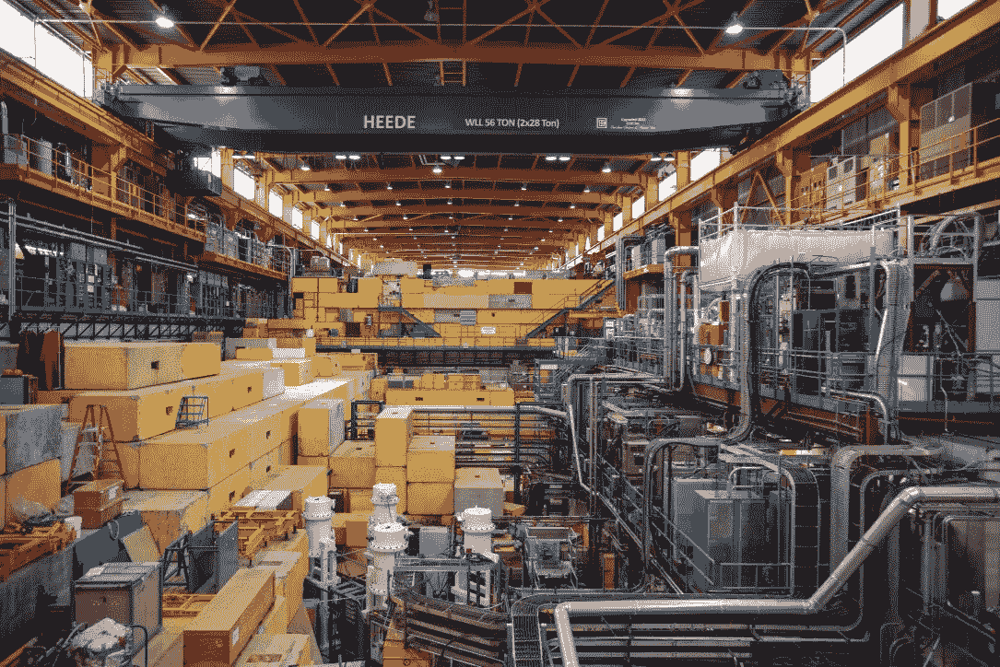

# 温哥华科技的崛起

> 原文：<https://medium.com/hackernoon/the-rise-of-tech-in-vancouver-b5f6a2ee4afe>

## **全球创业中心**

Looking at Cypress Mountain

如果你不知道温哥华的科技实力，这是可以原谅的。毕竟，许多住在这里的人并没有意识到过去几十年来这里发展的技术基础的深度。

在 Hootsuite 之外，有大量的鱼和一些其他当地知名的名字，技术在许多方面都不为人知。这并不是因为它不在这里，而是这个领域的许多人以典型的谦逊的温哥华方式开展业务。

然而，科技行业的基础是显而易见的。技术的根源就像硅谷一样，在许多方面都是政府通过研究机构长期资助和支持的副产品。

这些研究机构的发展侧重于物理科学，使它们成为创新的理想场所。然后，学生和教授作为企业家继续追求这种创新。

有些人来这里是专门从事技术的。其他人通过视觉找到他们的科技之路。

随着 20 世纪 60 年代技术的到来，这座城市开始成为木材贸易的国际来源。自然环境是基础。以前的伐木区现在是一个孤独和安静的生产场所。

群山推动个人成长和视野。它们提供了对世界的独特诠释，这也是人们来这里并留下来的原因。因为温哥华科技的核心是与户外的关系。

我给你讲个故事吧。

# **让大自然成为你的导师**

The Baden Powell Trail

想象一下被森林包围的寂静时刻。

独自走在山路上，你的伴侣是有节奏的呼吸声和你的脚步在地面上移动的声音。

当微风吹动上面的树木时，你停下来闭上眼睛。落叶的声音清晰如水晶般，因为它们触摸到了旅途中的每一根树枝。

当你经过时，鸟儿会向其他鸟儿发出信号，当你离开它们隐秘的栖息处一段安全距离时，它们会安静下来。

空气似乎变了。干净。一种只有在山里才能感受到的新鲜。

当你环顾四周的森林时，你会意识到你的感官在这里得到了提升。

你深吸一口气，当你睁开眼睛时，你会发现一切都变得更加清晰。颜色和形状更详细。然后是雪松、壤土和泥土的味道。

这个地方与城市形成了鲜明的对比，在城市里，噪音、电话和混乱要求你关闭电脑才能工作。

在这里你可以思考。反思。解决问题。

你可能正在考虑你的下一轮融资——工资问题。也许你失去了一个关键客户或团队成员。也许是时候考虑一个支点了…

在森林里，独自一人，你的精神肌肉可以放松。你可以挖掘你潜意识的力量。让答案来找你。

自然环境的力量并不新鲜。它解放思想和解决方案的能力为历史上许多创造天才所熟知。

但是在你这个超级互联的世界里，你的注意力被无休止地分散了。你离开城市的能力通常是困难或不可能的。

然而你却在这里，离市区有三十分钟的路程。没有汽车。你的手机藏起来了。你可以自由思考。

当你放松的时候，你的思想会漂移。融资的宣传将开始演变。你是否需要做那个支点将变得更加明显。也许你会想出一个改变世界的新概念。

这种突然的意识不是偶然的。当你回到你的自然环境时就会发生这种事。森林。这座山。或者大海。

这一刻你感觉觉醒了。活着。

温哥华因许多事情而闻名。昂贵的住房。美丽的景色。山脉、森林和海洋。这些不是新的。他们一直都在这里。

二十年前，当人们问你做什么时，他们不是在谈论你的工作。他们在谈论你从事的众多户外活动中的哪一项。

山地自行车或徒步旅行。滑雪或滑雪板。帆船或帆板运动。

在这里，你可以每天做许多这样的活动。如果有足够的时间和精力，在同一天做几件不同的事情。

这种环境的力量不仅仅基于美的美学。温哥华的环境是实用的。它吸引了想融入自然的人们，因为他们追求他们雄心勃勃的商业想法和塑造世界的概念。

今天，当这里的人问你做什么时，你会问:你在做什么？你在和哪家初创公司合作？你看重什么体验？

# **借谷**

温哥华的科技史是一部政府支持、研究机构以及与硅谷长期关系的故事。

这种关系体现在大型科技机构的存在上，这些机构通常通过金融交易来到这里。其中一些是对现有资产的收购，另一些是基于融资。

在许多方面，温哥华借鉴了硅谷的发展模式，而硅谷是在弗雷德·特曼(Fred Terman)的指导下从斯坦福走来的。在温哥华，我们设计了作者和金融家威廉·珍妮薇所说的三人游戏；即政府、企业家和金融部门之间的相互作用。

如果我们看看硅谷的历史，我们可以看到温哥华在某种程度上效仿的模式，它正在凭借自己的力量成为一个技术中心。

回到 20 世纪 60 年代，硅谷的科技正在经历变革。斯坦福大学的弗雷德·特曼极大地提高了物理科学的地位，并在发展斯坦福研究园方面发挥了重要作用。这一努力旨在吸引越来越多的联邦政府研发拨款。

研究园、强大的自然科学存在和战后政府资助的大幅增加吸引了世界各地的顶尖人才。它还提供了许多受过高等教育的企业家，他们继续发展创业文化，在该地区建立各种真空管和微波创新。

这些创新与 20 世纪 50 年代人造卫星发射后成为主流的硅芯片的发展不谋而合。一家新公司 Fairchild Semi 由另一家硅谷初创公司的八名前员工创建，将成为该地区的一家支柱公司。在接下来的几年里，它的创始人继续开发了几个引人注目的副产品和创新。

虽然英特尔和 AMD 被认为是最知名的飞兆衍生产品，但该公司的影响力可以追溯到包括新生的苹果电脑在内的众多硅谷公司。

Fairchild 的指导、知识和技能在硅谷的传播伴随着融资模式的采用和正式化。早在 20 世纪 50 年代，美国联邦政府就在寻找鼓励私人投资高风险企业的方法。

这一努力有助于鼓励两个今天被认为是普遍的具体金融概念。即使在今天，附带权益和有限合伙模式仍为私人股本、对冲基金和风险资本使用的大部分风险资本模式提供了基础。

Fairchild Eight 利用这些相对较新的税收和法律结构参与创建了一家名为 Davis and Rock 的风险投资公司。这种模式在 20 世纪 70 年代初变得广泛使用且更加正式，当时飞兆的另外两名员工创建了两家当今最具标志性的风险投资公司。

一家是凯鹏华盈，另一家是红杉资本。

为什么提到山谷？因为随着我们探索温哥华科技飞地的崛起，我们将能够看到该地区硅谷创业和创新文化的演变。

在温哥华，一个政府资助的研究机构，一个来自宾夕法尼亚的律师和地下室的两个教授的归来将为我们今天的技术革命提供基础。

# **从禀赋到量子物质**

温哥华有很多优势。被丰富的自然资源包围的港口城市。实用的自然环境。开阔的空间和温和的天气。

所有这些都吸引了世界各地的人才。

但我们靠近硅谷人才和资金的双向渠道，这是一个不可低估的优势。

这条管道被称为卡斯卡迪亚走廊。

温哥华位于卡斯卡迪亚走廊的一端，这条走廊穿过西雅图和波特兰，另一端是硅谷和洛杉矶。

五十多年来，人才、资金和资源一直沿着这条走廊来回流动。

温哥华的科技生态系统和企业家精神在一定程度上是这条走廊上人才流动的副产品。另一部分原因是来自世界各地的各种各样的人不断涌入。

人才流动与公共资助的研究机构相结合，创造了一个创新和创业的反馈回路。

我们的科技故事始于小镇西边的一块土地，并已发展成为价值数十亿美元的科技和创业经济的重要组成部分。

我们的第一个研究机构不列颠哥伦比亚大学(UBC)成立于 1899 年，当时名为温哥华学院，隶属于蒙特利尔的麦吉尔大学。麦吉尔于 1906 年接管学院，随后被命名为不列颠哥伦比亚省麦吉尔大学学院。

1907 年的大学捐赠法案被用来通过出售多达 200 万英亩的公有土地为一所省立大学提供资金。目前位于温哥华西侧的校园就是那次出售和投资的结果。

校园周围的土地现在被称为“大学捐赠地”这片广阔的森林区域包括今天全年各种活动的小径。

根据 1908 年的《大学法》，UBC 正式成为一所大学，1910 年，位于城镇西侧的灰点镇被省政府保留为校址。经过漫长的建设阶段，正式校园终于在 1925 年开放。

该大学在二战后进行了扩建，包括在 1948 年安装了范德格拉夫原子发电机。⁴:这个装置标志着加拿大第一个核研究设施 Triumf 的建立。

Inside Triumf

Triumf 是加拿大国家核物理和基于加速器的科学实验室。该设施成立于 1968 年，最初是 UBC、西蒙·弗雷泽大学和温哥华岛的维多利亚大学之间的一个核研究联合体。截至今天，该联盟还包括其他几所加拿大大学。

自成立以来，该设施已从加拿大政府获得了超过 10 亿 1B 的投资。不列颠哥伦比亚省政府也提供了 4000 多万加元的额外资金。Triumf 仍然是在这一研究领域代表加拿大在全球的重要机构。⁵

Triumf 在 UBC 校园的存在进一步扩大了 UBC 大学物理科学的优势。UBC 大学的物理科学在该校发挥了重要作用，并继续影响着温哥华的科技和创业文化。

UBC 校区也成为了一个新的量子物质研究设施的所在地。

量子物质研究所(QMI)⁶)于 2010 年在不列颠哥伦比亚大学校园成立。它在 2012 年进一步扩大，包括新成立的**马普量子材料中心**，该中心将与 QMI 设施共存。⁷

QMI·马普学会伙伴关系是马普组织在德国以外建立的第三个伙伴关系中心。⁸:这标志着不列颠哥伦比亚大学和加拿大在量子物质和材料研究领域的全球领先地位。

2015 年，加拿大政府通过新的加拿大第一卓越研究基金(Canada First Research Excellence Fund)向 QMI 提供了为期 7 年的 6650 万美元的资助。

这些设施以及世界级的研究和教学能力使 UBC 成为温哥华高技能创业人才的重要来源。UBC 对斯坦福经验等物理科学的重视是其创新文化的核心特征。

正如我们很快将看到的那样，一些著名的公司通过 UBC 直接或由该大学各种项目的研究生开发和剥离。⁹

# **亚瑟·埃里克森卷入其中**

Triumf 联盟的另一个成员，**西蒙·菲沙大学(SFU)** 成立于 1965 年。SFU 校区位于伯纳比山上，毗邻温哥华市区，是由亚瑟·埃里克森和杰弗里·梅西根据 1963 年举行的一次竞赛设计的。

SFU 大学是一所公共资助的专上研究机构，是目前唯一获得美国研究认证的加拿大大学。

与 UBC 一样，SFU 也因培养本地技术人才而闻名。以 IT 衍生产品为重点，SFU 继续在温哥华地区创建创新型创业公司。⁰

1960 年，省政府还出资创办了一所职业技术学校，名为 **BC 省技术学院(BCIT)** 。从 1964 年开始，BCIT 专注于健康、工程和商业。

如今，BCIT 大学拥有超过四万名学生，它已经将其任务扩展到包括航空航天技术设施、应用研究和环境技术工程培训。

北温哥华的卡皮拉诺学院成立于 1964 年。它在 2008 年获得了大学的地位，学生人数超过 7000 人。**卡皮拉诺大学**是温哥华电影业人才的重要来源。

这些公共资助的研究机构为温哥华提供了世界级的研究、设施和人才。这些机构的数千名高技能毕业生继续为温哥华、全国乃至全世界的创新经济做出贡献和发展。

温哥华与硅谷长期而富有成效的关系意味着我们既是那里所使用和开发的技术进步的贡献者，也是其受益者。人才、技术和思想的流动始于 20 世纪 60 年代中期。

但直到 60 年代末，当两位 UBC 教授在地下室开始一个项目时，温哥华才找到了它的基础。

正是通过这些跟随其后的公司，人才和专业知识得以孵化和衍生，为温哥华的科技生态系统奠定了基础。

# **风险模型来到温哥华**

回顾温哥华的科技史，我们可以看到人才是如何在当地产业中流动和循环的，这与硅谷的情况没有什么不同。

温哥华的技术支柱公司 our Fairchild 始于 60 年代末，由 MacDonald Dettwiler 创立。但是在那次活动之前有两家公司来了。

**Sierra Systems，**一家 IT 服务和管理咨询公司成立于 1966 年，加拿大西部的第一家风险投资公司紧随其后。

大约在 1968 年英特尔成立的时候，黑格·法里斯从宾夕法尼亚州的法学院回到温哥华，创立了**风险投资西部管理公司**。Ventures West 是加拿大西部的第一家风险投资公司，在随后的几年里，它在当地科技行业的发展中发挥了至关重要的作用。

麦克唐纳·德特韦勒协会后来被称为 **MDA** (MDA: TSX)是由 UBC 的两位教授唐·麦克唐纳和韦恩·德特韦勒于 1969 年创立的。

MDA 最初是一个兼职项目，在麦当劳的地下室进行，专注于计算机硬件、软件和完整的系统。

这些合作伙伴是 UBC 应用科学学院的产物。麦克唐纳是 UBC 电气工程系的系主任。在 50 年代和 60 年代，Dettwiler 是 UBC 专注于计算机的特殊项目部门的负责人。

创始人不可能预见到 MDA 会在未来几十年成为温哥华科技界的核心。即使在今天，MDA 仍然是一个创新的公司。

MDA 有许多值得称道的创新，包括:

航天飞机上使用的加拿大 1 号和 2 号武器

●一整套信息系统

●卫星

●机器人技术

这些创新为温哥华、美国政府和美国宇航局之间提供了强有力的联系。

在早期，MDA 开发了无线执法技术，随后该技术被分拆成一家名为**移动数据国际(MDI)** 的新公司。

由 Ventures West 资助的 MDI 在 80 年代末以 1 . 05 亿美元的价格卖给了摩托罗拉。

1983 年，MDA 无线数据调制解调器的发明者丹·盖尔巴特与肯·斯潘塞一起在 MDA 工作，共同创立了 Creo Products。

Creo 的使命是将光盘的优势与磁带的效率结合起来。他们的工作导致了光学磁带录音机的发展，随后是数字制版技术。Creo 在 2005 年被柯达以大约 100 万美元的价格收购.

# **清洁能源。永远。**

高级物理学家兼 Creo 产品公司的首席工程师 Michel Laberge 于 2001 年离职，开始在他的车库里发展他的聚变能想法。凭借 UBC 大学的等离子体物理学博士学位，他开始利用现有的知识和新技术开发一种新的现有聚变技术。

**通用聚变**:清洁能源。到处都是。永远，是这一愿景的焦点。

一般聚变代表了我们能源现在和过去的未来景象。通用聚变的目标令人印象深刻，足以引起杰夫·贝索斯的注意，他通过风险投资部门投资了该公司。

MDA 的影响不止于此。过去的员工继续创建其他企业，包括最近成立于 2012 年的 **Urthecast** (乌尔:TSX】**。**

Urthecast 的联合创始人 Wade Larson 在 MDA 工作了近 20 年，积累了空间领域的全球经验。Urthecast 为国际空间站提供了第一台高清太空摄像机。这种关系有助于促进与 MDA 的重要合作伙伴关系，以推进为地理空间和地理分析市场开发基于卫星的高清视频和摄像机技术的宏伟目标。

在 70 年代末和 80 年代，温哥华通过建立一系列公司和一些战略性收购，经历了其技术实力的扩张。

地球物理学家杰弗里·巴拉德于 1979 年创立了巴拉德研究中心。目标是开发高能锂电池。80 年代末，他们从电池转向燃料电池技术，并于 1993 年上市。今天它被称为**巴拉德电力系统**(BLD:TSX)。

退休后，巴拉德继续创建通用氢公司，这是一家为移动工业设备制造燃料电池动力装置的公司。它在 2007 年卖给了 Plug Power。

# **水转无线**

科琳·莱格兹丁斯是来自巴拉德的高级工程师，拥有 UBC 大学的材料工程博士学位，她接着创办了 Axine Water Technologies。Axine 是一种尖端的废水处理解决方案，不使用任何有毒化学品。

在生物技术领域，1981 年，一群 UBC 的教授成立了 Quadra Logic Technologies(QLT:TSX)，他们是:Julia Levy 博士、John Brown、Jim Miller、Anthony Phillips 和 Ron MacKenzie。他们最显著的成功是 20 世纪 90 年代针对黄斑变性的 Visudyne 的开发。他们在 2004 年与 Atrix Pharma 合并。

在游戏领域，唐·马特里克和杰夫·森伯在 1982 年为苹果 2 开发了一款游戏，从而创立了独特的软件。马特里克随后在 1991 年将与众不同的唱片卖给了电子艺界。

90 年代初，端点安全解决方案公司**Absolute Software**(ABT:TSX)成立。他们于 2000 年上市。

**MPR Teltech** 被分离出来成立 **PMC 塞拉。**

mdi 和 MPR Teltech 的前雇员 Norman Tom 和 Andrew Harries 聚集了摩托罗拉的人才，在 PMC Sierra 温哥华办事处的一部分建立了 sierra wireless。⁶

跨国无线通信设计和制造商 Sierra Wireless 开发了嵌入式模块、网络解决方案以及云和连接物联网服务。

他们拥有多项率先上市的技术解决方案和创新，包括全球首款 LTE 设备。

该公司于 1999 年上市，至今仍是温哥华科技界不可或缺的一部分。最近与大众的一项交易旨在为大众的下一代汽车开发连接性。

前 MDI 的 Derek Spratt 于 1993 年创建了 PCS Wireless，在 90 年代中期的 2Ghz 蜂窝网络中发挥了关键作用。1997 年，⁷ It 与 Unique 宽带系统公司合并。

他于 1996 年创立了 Intrinsyc software(ITC:TSX ),并于 2000 年在 tsx 上市。intrinsyc 为⁸的移动市场开发了 Windows CE 软件工具，该公司今天仍在发展。

# **安全走向一种新的浪潮**

沃伦·罗伊、埃里克·帕尔塞尔和达夫·里德在 2003 年成立了全球接力组织。一家 SaaS 公司在 1999 年专注于电子数据管理。该公司受益于加拿大更严格的隐私法和本世纪初网络泡沫破裂期间的金融问题。⁹

Global-Relay 是一家白手起家的公司，创始人并不是技术人员，但它继续在基于云的领域蓬勃发展。

1999 年，现为 UBC 大学商业和创业学教授的黑格·法里斯(1968 年为 Ventures West Management 的前创始人，1990 年为私人风险投资公司 Fractal Capital 的创始人)与学生乔迪·罗斯(UBC 大学理论物理学博士)、亚历山大·扎戈斯金(UBC 大学物理学和天文学博士后研究员)以及鲍勃·威恩斯一起创立了 D 波系统。

D-Wave Systems 是 UBC 物理科学部门的副产品，是世界上第一家制造和销售量子计算机的量子计算公司。它拉开了 UBC 量子研究的序幕。

D-Wave 正在开发通过数据处理以以前被认为是纯理论的速度解决世界上最大问题的能力。他们的客户包括几个著名的硅谷技术和军事名称谷歌，美国宇航局，洛斯阿拉莫斯实验室，洛克希德马丁公司以及与德国大众汽车公司的合作伙伴。

这些开创性的量子计算机能力也有望为癌症研究做出重大贡献——这是 Triumf 和温哥华 BC 癌症机构的重点领域。

Rose 的最新项目 Kindred AI 反映了 D-Wave 在人工智能和机器学习方面的深度参与。Kindred 是与 D-Wave 校友苏珊娜·吉尔伯特共同创立的，是一家专注于人工智能的温哥华和多伦多联合创业公司。

D-Wave 投资人安德鲁·弗斯曼(Andrew Fursman)在 2012 年创立了一家名为 **1QBit** 的专门的量子计算软件公司。他们在 2014 年与 D-Wave Systems 合作，并在 2015 年被世界经济论坛评为顶级技术先锋。

1QBiT 的 Fursman 断言，温哥华是世界上“拥有使用量子计算机经验的人密度最高的”城市。⁰

你可以说温哥华有一种量子思维状态。

随着 QMI 设施和马普伙伴关系在 UBC，人们只能期待我们在量子研究和计算的领导地位扩大。

大众与温哥华的关系不仅包括 D-Wave 和与 Sierra Wireless 的合作，还通过温哥华成立了 **PayByPhone。**

大众汽车于 2016 年从 PayPoint UK 购买了本地支付应用 PayByPhone，金额未披露。PayPoint 最初在 2010 年以 4500 万加元收购了这家温哥华公司。这家市值 700 亿美元的德国公司对温哥华公司的兴趣如此之高，表明温哥华的创新能力远远超越了国界。

PayByPhone 的创始人之一达伦·斯通(Darren Stone)毕业于 SFU 大学计算机科学专业，并与另外五家创业公司合作，包括 **Rentmoola** 。

他的联合创始人达伦·格里芬(Darren Griffin)也是 SFU 大学的校友，此后他创办了 Glance Technologies。

# **资本和人才的流动和循环**

温哥华的创业生态系统在新千年有了显著的扩展。

几个出口提供了一股人才和资本流，以支持未来的企业家，并为新企业创造渠道。

举个例子，斯图尔特·巴特菲尔德在 2004 年创立的 Flickr 在第二年被卖给了雅虎。他与塞尔吉·莫拉乔夫、卡尔·亨德森和埃里克·科斯特洛一起回到绘图板，创建了游戏平台。

当游戏没有成功时，他们发现他们开发的远程交流和协同工作的应用程序可能更有价值。

通讯工具变得**松弛**。

利用精益创业原则，他们将 Slack 开发成一种工具，这是技术产品有史以来采用速度最快的工具之一。

从 2003 年到 2007 年左右，大量的鱼由一个人在一间公寓里创立并经营。Markus Frind 创建这家公司最初是为了完善他的简历。

他在 2007 年才开始增加员工人数…到三个人。他逐渐发展出一个 75 人的团队，并在 2015 年以 5.75 亿美元的价格向 Match group 出售了大量鱼类。

他用一小部分收益资助了一家总部位于温哥华的金融科技初创公司 **Grow** 。

2008 年，UBC 的学生:弗雷泽·霍尔、达西·休斯、哈米德·阿多拉希和丹·艾森哈特创办了**侦察仪器**。专注于智能可穿戴护目镜和眼镜的公司 Recon 于 2015 年被英特尔以 1.75 亿美元收购。

然后是 Greg Young，他在 2007 年在一家当地经纪公司工作时，将命令查询职责分离和事件采购(CQRS/ES)结合起来，并使它们正式化。Adam Dymitruk， **Adaptech Group** 的创始人兼首席执行官在 2008 年加入了 CQRS/ES 共识；然后在 2018 年通过形式化事件建模将创新向前推进了一步。

这种在 2007 年看似晦涩的思考信息系统的方式现在被认为是优化和扩展复杂信息系统的开创性方法。

通过收购 Jet.com，包括亚马逊、网飞、Ebay、LinkedIn 和沃尔玛在内的一些全球最大的科技公司已经悄悄采用了 CQRS/ES。

今天，Dymitruk 和 Adaptech 与 Young 在英国的合资企业 Event Store 合作。他们为包括大型企业在内的各种公司设计和实施 CQRS/ES 和 EM 创新，着眼于其运营的未来。

2003 年，Business Objects 从希捷手中收购了 Crystal Decisions 及其位于温哥华市中心的技术中心。2008 年，当科技巨头 SAP 将市中心的科技中心变成一个新的运营基地时，该业务再次易手。

Crystal Decisions/Business Objects 的三位资深人士:前 Business Objects 首席执行官 John Schwarz、工程副总裁 Ryan Wong 和高级副总裁 Dave Weisbeck 离开 SAP，创办了 Visier。

Visier 受益于其创始人在 Crystal Decisions 和 Business Objects 方面的经验，为企业人力资源部门提供基于云的劳动力分析和规划解决方案，并将它们从支出转化为资产。

SAP 是来到温哥华的几家大型科技公司之一。电子艺界、微软、索尼图像公司、亚马逊、脸书和 Salesforce 也在该地区设立了店铺。

这些公司将有利的移民政策和以极具竞争力的价格获得高技能人才库作为在这里开设办事处的原因。

更接近一些世界上最具创新性的公司可能是他们在这里的另一个潜在动机。

这还不是温哥华发生的一切…

# **游戏是游戏玩家的工作**

我们的游戏传统可以追溯到 1982 年 Distinctive Software 的 Don Mattrick 和 Jeff Sember。电子艺界在 1991 年购买了独特的软件。

收购时，Distinctive Software 是北美最大的独立游戏开发商。自那以后，电子艺界一直留在温哥华地区，为这里蓬勃发展的博彩业提供了支柱。

与众不同的各种员工将继续开发一系列游戏衍生产品，发扬硅谷的仙童八人组的精神。**激进派娱乐**于 1991 年首创，激进派出了**狂吠犬**和**遗迹**。

收购完成后，马特里克将为艺电工作，随后在微软和 Zynga 担任高管职位。

在东区游戏、黑牙工作室和思考猿等公司的带领下，当地游戏业继续繁荣发展。⁴

几个政府资助的机构帮助温哥华的游戏和电影产业培养顶尖人才。

与卡皮拉诺大学和 BCIT 大学一起，**温哥华电影学院**和**艾米丽·卡尔艺术与设计学院**为这两大温哥华产业提供技能培训项目。

这种特殊的技能优势和邻近谷和日本这两个世界上其他领先的游戏中心，⁵提供了温哥华在游戏世界的独特优势。

近年来，电子艺界的裁员被索尼图像公司(Sony Imageworks)、微软(Microsoft)的游戏开发以及国内外游戏商店的出现所抵消。

以 Namco Bandai、Capcom 和世嘉为首的日本游戏巨头的涌入，推动了该领域的增长。韩国游戏公司 Netmarble 于 2016 年进入温哥华市场，当时他们以 8 亿美元收购了总部位于旧金山的 Kabam 及其温哥华工作室。

除了人才培养，政府还以其他方式帮助这些博彩企业家。⁶

联邦政府和省政府提供的各种财政激励措施旨在保持该行业的健康和强大。这些措施包括对 R&D 的税收抵免，获得顾问，以及对风险资本的税收抵免。

电影和电影发展增加了科技产业的深度。

# **冒险遗产**

Looking to the British Properties in West Vancouver

温哥华最初是一个木材中心，木材被采伐并出口到世界各地。

虽然各第一民族部落在该地区人口稀少，但它被西班牙新世界探险家“发现”，随后被英国人宣称拥有。

温哥华及其周边地区因盛产木材以外的自然资源而闻名。

那里盛产鱼。像铜、金、银、锌和铁这样的金属。能源包括天然气、石油和丰富的煤炭储量。

有了一个天然港口，最终有了一条连接该市和该省其他地方(以及加拿大)的铁路，这些资源的贸易增长并扩大了。

森林产品贸易将温哥华介绍给了世界，并发展了丰富的贸易关系，随着资源部门的扩大，这将证明是有价值的。

资源开采就其本质而言需要承担风险和风险管理。它还需要复杂的供应链和专业化的风险导向型金融安排。

因此，温哥华有投机活动和风险资本的历史。我们对风险融资的态度推动了早期技术和创业公司的发展。

Ventures West Capital 是加拿大西部最早的风险投资公司，今天仍然是最大的风险投资公司之一。今天，一些额外的风险投资公司为创业和技术融资提供了机会。

加拿大和美国之间的紧密联系意味着资本流动相当自由和开放。这意味着早期企业在本地和跨境获得资本相对容易。

温哥华面向太平洋和以资源为基础的历史提供了从西雅图到硅谷和之间的所有点的强有力的联系。这些联系反映了卡斯卡迪亚走廊沿线人才和资金的持续流动。

# **丰富的资源**

如今，获得金融资源是不固定的，而且相对容易，只要有适销对路的产品或想法。随着初创企业的创建和成长，当地可以获得各种级别的金融建议和专业知识。

温哥华也有一个繁荣的天使投资社区，有很多创业经验。

据最新统计，有 130 多个不同的组织旨在帮助处于不同阶段的新一代公司。其中包括许多专门从事不同领域和公司发展阶段(从创业到规模化)的孵化器。

各级政府提供一系列资源来帮助发展中的公司。作为创新经济中三方游戏的重要组成部分，政府可以通过 **BC 创新委员会(BCIC)等组织向成长型公司提供支持，包括融资、建议和援助。**

政府还建立了一个 12.6 亿美元的创新基金，同时承诺投入数亿美元用于超级集群的创建。他们还承诺为各个领域的初创企业提供融资。这些是对现有税收激励措施的补充。⁷

加拿大政府通过一系列激励措施和投资支持创新，包括加拿大商业发展银行(BDC)的**。**

温哥华的初创企业已经证明，他们不仅可以筹集资金，还可以从金融行业的一些精英那里吸引资金。其中包括:

●安德森·霍洛维茨、凯鹏华盈、考菲尔德和拜尔斯、软银(Slack)

●杰夫·贝索斯的风险投资部门:贝佐斯探险公司

●中情局风险部门:In-Q-Tel (D-Wave)

●富达投资(Hootsuite、D-Wave 系统)

●高盛(D-Wave Systems)

截至 2019 年 2 月，温哥华各行各业的许多初创公司都有筹集大量资金的记录，包括⁸

**Slack** :职场协作平台

*   成立于 2013 年
*   筹集了 12 亿美元

**Hootsuite** :社交媒体关系平台

*   成立于 2004 年
*   筹集了 2.997 亿美元

**D-Wave 系统**:量子计算/半导体设计和制造商

*   成立于 1999 年
*   筹集了 2.047 亿美元

临床阶段生物制药

*   成立于 2003 年
*   融资 1.2587 亿美元(上市前)
*   融资 6360 万美元(2017 年 4 月 IPO)

**一般聚变**:磁化聚变能的发展

*   成立于 2002 年
*   融资 1.271 亿美元

**访问者**:基于云的劳动力分析

*   成立于 2010 年
*   筹集了 9150 万美元

**工作台**:在线记账

*   成立于 2012 年
*   筹集了 4910 万美元

**视觉批判**:基于人群的客户智能平台

*   成立于 2000 年
*   筹集了 4140 万美元

**Clio** :律师事务所的网络工具

*   成立于 2008 年
*   筹集了 2600 万美元

**移动化**:移动商务平台

*   成立于 2007 年
*   筹集了 2490 万美元

**Allocadia** :营销绩效管理软件

*   成立于 2010 年
*   筹集了 2400 万美元

**Payfirma** :移动、电子商务、店内多平台支付解决方案

*   成立于 2010 年
*   筹集了 2350 万美元

**Trulioo** :在线身份验证

*   成立于 2011 年
*   筹集了 2330 万美元

Tasktop:软件开发和交付的以任务为中心的界面

*   成立于 2007 年
*   筹集了 2225 万美元

这个列表代表了温哥华地区所有科技相关活动的一小部分。

许多温哥华公司看到了有利可图的退出，释放了资本和人才，重新部署到新的企业。这些收购通常来自境外，表明了这座城市的想法和人才的价值。⁹

有了各种政府资助的研究设施、丰富的融资机会和过去几十年建立的几个基金会公司，难怪温哥华的创业文化在新千年爆发了。

仅在过去的六年中，新企业家可获得的资源数量就大幅增长。包括几个创业孵化器、风险投资公司、政府项目和不同的融资方案。

接下来是在温哥华市中心开发一个价值数百万美元的超级集群概念，将斯坦福的研究模式变成我们自己的模式。

# **我们的悖论**

Looking down from Grouse Mountain

这座城市高高耸立在山上，隐约可见。从这里看，船就像玩具一样。

远处的西班牙河岸，是对第一批到达这片海岸的新大陆探险家的致敬。在银行上方，是捐赠地和 UBC，Triumf 和量子物质研究所的所在地。

就在斯坦利公园的左边，由吉尼斯家族建造的狮子门桥通往我站的英国地产。

在远处最左边，西蒙弗雷泽大学像国王一样坐落在伯纳比山顶。在下面的城市里，成千上万的企业家在各种科技飞地和咖啡店之间穿梭。

温哥华的吸引力在于科技创业和大自然的奢华。

世界改变焦点和逃避的悖论。

崔斯特瑞姆韦彤，CCO 和 CSO 下一个十年技术。

感谢侯赛因·哈拉克、发射学院和威廉·约翰逊

所有照片均由凯蒂·麦肯兹提供:【https://www.mackenziephotography.ca/ 

* 2019 年 4 月 18 日更新，纳入 Adaptech Group 和 CQRS/ES。

**备注:**

1.  公有土地是指政府“拥有”的公共土地
2.  大学周围的森林地带被正式命名为太平洋精神公园。
3.  UBC 简史。不列颠哥伦比亚大学的故事。2017 年 6 月 7 日更新。不列颠哥伦比亚大学在线档案馆。http://archives.library.ubc.ca/general-history/a-brief-历史上的 ubc/
4.  由在普林斯顿和麻省理工学院任教的美国物理学家罗伯特·j·范·德·格拉夫创建。
5.  Triumf。历史。triumf online[http://www.triumf.ca/home/about-triumf/history](http://www.triumf.ca/home/about-triumf/history)
6.  它被称为斯图尔特·布鲁森量子物质研究所
7.  UBC 公共事务媒体发布。UBC 凭借 6650 万美元的联邦政府投资成为量子材料研究的全球领导者。2015 年 7 月 30 日。news . UBC . ca[http://news.ubc.ca/2015/07/30/ubc-positioned-as-](http://news.ubc.ca/2015/07/30/ubc-positioned-as-)全球量子材料研究的领导者，联邦政府投资 6650 万美元/
8.  同上。
9.  UBC 大学-工业联络处 UBC 副产品的完整清单。[https://uilo.ubc.ca/ubc-spin-](https://uilo.ubc.ca/ubc-spin-)公司/上市公司
10.  SFU 创新的创业公司被列入“准备发射火箭”名单。2017 年 5 月 13 日。[http://innovates . vpr . sfu . ca/story/sfu-innovates-startups-are-recognized-ready-rocket-list](http://innovates.vpr.sfu.ca/story/sfu-innovates-startups-are-recognized-ready-rocket-list)
11.  MDA 于 2017 年 10 月 5 日更名为 Maxar Technologies Ltd。
12.  德里克·斯普拉特。摩托罗拉无线数据部门/MDI-概述和历史。derekspratt.com。[http://www . derekspratt . com/html/business/other/Motorola % 20 overview . html](http://www.derekspratt.com/html/business/other/motorola%20overview.html)
13.  MPR Teltech 是 BC Tel 的咨询部门
14.  库珀·h·兰福德，杰米·r·伍德和阿斯特丽德·雅各布森。温哥华无线集群的演变和结构:核心企业的成长和损失。2015 年 1 月 15 日。Researchgate.net。[https://www . researchgate . net/publication/265533886 _ The _ evolution _ and _ structure _ of _ The _ Vancouver _ wireless _ clus](https://www.researchgate.net/publication/265533886_The_evolution_and_structure_of_the_Vancouver_wireless_clus)之三 _ Growth _ and _ loss _ of _ core _ companies
15.  PMC-Sierra 于 2016 年被出售给 Microsemi
16.  伊恩·约翰逊。塞拉无线创始人诺曼·汤姆斯。2001 年 9 月 17 日。环球邮报。[https://www . the globe and mail . com/technology/Sierra-wireless-founder-Norman-toms/article 20461566/？尼克·沃德尔。等待一个领导者。温哥华的科技产业。2010 年 1 月 27 日。坎泰克信。](https://www.theglobeandmail.com/technology/sierra-wireless-founder-norman-toms/article20461566/?page=2,)[http://www . cante chletter . com/2010/01/寻找领导者-vancouvers-tech-history/](http://www.cantechletter.com/2010/01/looking-for-a-leader-vancouvers-tech-history/)
17.  德里克·斯普拉特。PCS 无线-概述和历史。derekspratt.com。[http://www . dereksprat . com/HTML/Business/PCS % 20 Wireless/PCS _ Wireless _ overview . HTML](http://www.derekspratt.com/HTML/Business/PCS%20Wireless/PCS_Wireless_Overview.html)
18.  德里克·斯普拉特。Intrinsyc 软件的历史和概述:derekspratt.com。[http://www . derekspratt . com/HTML/Business/Intrinsyc/Intrinsyc _ overview . HTML](http://www.derekspratt.com/HTML/Business/Intrinsyc/Intrinsyc_Overview.html)
19.  尼尔森·班尼特。沃伦·罗伊:数据库。事实证明，美国的会计丑闻对 Global Relay 的电子邮件存档业务是一件好事。2011 年 9 月 19 日。温哥华的生意。[https://www.biv.com/article/2011/9/warren-roy-data-base/](https://www.biv.com/article/2011/9/warren-roy-data-base/)
20.  T.梅兰森。总部位于温哥华的 1QBit 有望成为加拿大的下一个软件巨头。2015 年 11 月 19 日。加拿大宽媒体有限公司(CA)。[https://www . BC business . ca/Vancouver-based-1qpit-looks-to-be-make-Canada-next-software-giant](https://www.bcbusiness.ca/vancouver-based-1qbit-looks-to-become-canadas-next-software-giant)
21.  玛雅·科索夫。一个人刚刚以 5.75 亿美元的现金出售了他的初创公司，他可以保留每一分钱——以下是他是如何做到的。2015 年 7 月 14 日。商业内幕。【http://www.businessinsider.com/how-】T2Markus-frind-bootstrapped-plenty of fish-and-selved-it-5.75 亿美元？op=1
22.  前 Grouplend
23.  埃利奥特·西米亚特基，托马斯·赫顿，特雷弗·巴恩斯。“新经济”中的韧性和温哥华的第二次生命。2015 年 8 月。城市地理。routledge Informa ltd .[http://blogs . UBC . ca/Trevor Barnes/files/2015/08/Proofs-UrbanGeography _ Vancouver 2015 . pdf](http://blogs.ubc.ca/trevorbarnes/files/2015/08/Proofs-UrbanGeography_Vancouver2015.pdf)
24.  保罗·提尔。温哥华本地电子游戏公司。gamejobhunter。[http://gamejobhunter . com/blog/local-video-game-companies-Vancouver/](http://gamejobhunter.com/blog/local-video-game-companies-vancouver/)
25.  克莉丝·坎贝尔。温哥华的电子游戏产业欣欣向荣。2014 年 5 月 20 日。CDM(数字媒体中心)[https://the CDM . ca/news/Digital-Media/2014/03/20/van couvers-video-game-industry-is-proving](https://thecdm.ca/news/digital-media/2014/03/20/vancouvers-video-game-industry-is-thriving)
26.  视频游戏和互动媒体。2017.温哥华经济委员会。[http://www.vancouvereconomic.com/games-interactive-media/](http://www.vancouvereconomic.com/games-interactive-media/)
27.  #BC 技术战略。2016 年 1 月。不列颠哥伦比亚省政府(https://bctechstrategy . gov . BC . ca/app/uploads/sites/10/2016/04/BC tech _ strategy . pdf)
28.  Crunchbase 数据库。截至 2019 年 2 月。所有数字均为美元。[https://www . crunchbase . com/app/search/companies/b 8 bad 2 FD 0 FB 50 da 745 fa 57d 690047 f 6 ce 327 f 155](https://www.crunchbase.com/app/search/companies/b8bad2fd0fb50da745fa57d690047f6ce327f155)
29.  TRW 的 Index.co。2017 年 8 月。[https://index.co/city/vancouver/acquisitions](https://index.co/city/vancouver/acquisitions)