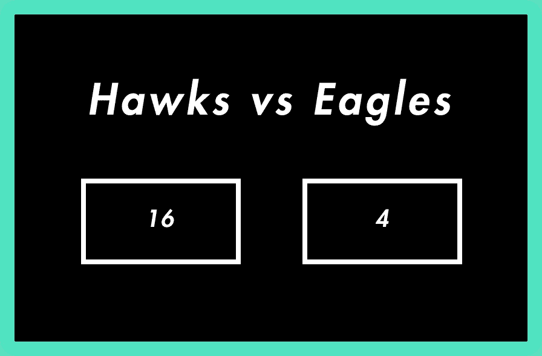

# 反应精通之路——处理事件

> 原文：<https://medium.com/hackernoon/the-road-to-react-mastery-handling-events-9da8bb1c6f1d>

如果您还没有阅读本教程/文档指南的第一部分，您可以在这里查看！

[](/@ethoshansen/the-road-to-react-mastery-understanding-state-29ef20572bc9) [## 反应掌握之路——理解状态

### React 中的状态是基于类的组件的一个非常强大的特性，有点类似于带有一些…

medium.com](/@ethoshansen/the-road-to-react-mastery-understanding-state-29ef20572bc9) 

或者，如果您已经牢牢掌握了 React state，那么就可以从这里开始继续学习了。

## 我们离开的地方

上一次，我们有一个记分板，它保存了两个静态团队分数，存储在记分板组件的状态中。*一个不变的记分牌，那一点帮助都没有！*是的，我完全同意，所以在本指南中，我将带你通过使用事件处理程序和改变状态来创建一个有用的动态记分板。


## 快速待办事项列表:

我们需要:

*   向记分板组件添加按钮。
*   写一个函数，让团队的分数增加 2。
*   按下按钮时调用该函数。

首先，让我们看看我们已经有的代码:

```
class ScoreBoard extends React.Component {
  constructor(props) {
    super(props);
    this.state = {
      scoreOne: 0,
      scoreTwo: 0
    };
  }render() {
    return(
      <h1>{this.props.teams[0]} vs {this.props.teams[1]}</h1>;
      <p>{this.state.scoreOne} vs {this.state.scoreTwo}</p>;
    );
  }
}ReactDOM.render(
  <ScoreBoard teams=["Hawks", "Eagles"]/>,
  document.getElementById('root')
);
```

## 添加按钮

为了给我们的记分牌功能，我们需要添加按钮，最终将增加两个队的分数。让我们从创建两个外部组件开始。

```
class ScoreBoard extends React.Component {
  constructor(props) {
    super(props);
    this.state = {
      scoreOne: 0,
      scoreTwo: 0
    };
  }render() {
    return(
      <h1>{this.props.teams[0]} vs {this.props.teams[1]}</h1>;
      <p>{this.state.scoreOne} vs *{this.state.scoreTwo}*</p>;
      <button>Team One + 2</button>
      <button>Team Two + 2</button> );
  }
}
```

太好了，现在我们有两个按钮了。他们做什么了吗？**还没有！**但是他们**会**，这就是我们接下来要重点实现的。

```
class ScoreBoard extends React.Component {
  constructor(props) {
    super(props);
    this.state = {
      scoreOne: 0,
      scoreTwo: 0
    };
    this.teamOneScores = this.teamOneScores.bind(this);
    this.teamTwoScores = this.teamTwoScores.bind(this);
  } teamOneScores() {
    //Increase team one's score by two
  } teamTwoScores() {
    //Increase team two's score by two
  } render() {
    return(
      <h1>{this.props.teams[0]} vs {this.props.teams[1]}</h1>;
      <p>{this.state.scoreOne} vs *{this.state.scoreTwo}*</p>;
      <button onClick={this.teamOneScores}>Team One + 2</button>
      <button onClick={this.teamTwoScores}>Team Two + 2</button>
    );
  }
}
```

我们在这段代码中采取了几个步骤，所以我将带您浏览一下。默认情况下，React 不会将函数绑定到调用它的类，因此我们必须将组件的`this`绑定到函数，否则当调用`this.props`或`this.state`时将返回 null。这是在构造器中完成的。

`onClick`在用户点击按钮时被调用(非常简单明了)，我们为它传递合适的团队、`teamOneScores()`和`teamTwoScores()`的函数。

现在，剩下要做的就是改变每个队的分数。要改变一个组件的状态，你可以调用`this.setState`，这正是我们要完成记分板的事情！

```
class ScoreBoard extends React.Component {
  constructor(props) {
    super(props);
    this.state = {
      scoreOne: 0,
      scoreTwo: 0
    };
    this.teamOneScores = this.teamOneScores.bind(this);
    this.teamTwoScores = this.teamTwoScores.bind(this);
  } teamOneScores() {
    this.setState(state => ({
      scoreOne: state.scoreOne +  2
    }));
  } teamTwoScores() {
    this.setState(state => ({
      scoreTwo: state.scoreTwo +  2
    }));
  }render() {
    return(
      <h1>{this.props.teams[0]} vs {this.props.teams[1]}</h1>;
      <p>{this.state.scoreOne} vs *{this.state.scoreTwo}*</p>;
      <button onClick={this.teamOneScores}>Team One + 2</button>
      <button onClick={this.teamTwoScores}>Team Two + 2</button>
    );
  }
}
```

我们走吧！每按下一个按钮，相应的分数被引用，然后增加 2，然后保存到状态。我们现在有了一个动态的、功能性的、有用的记分牌。现在老鹰队和老鹰队终于可以重新比赛了！



*   有更有效的方法来完成这一点，然而，这似乎是最简单的，作为对 React 中事件处理程序的介绍。如果你想看看其他方法，在事件处理程序中使用自定义参数，请告诉我！

感谢您的阅读！敬请期待更多的反应善良！

我是一个 17 岁的软件开发人员，如果你喜欢这个小的迷你系列，请跟我来保持更新我正在做的下一步！