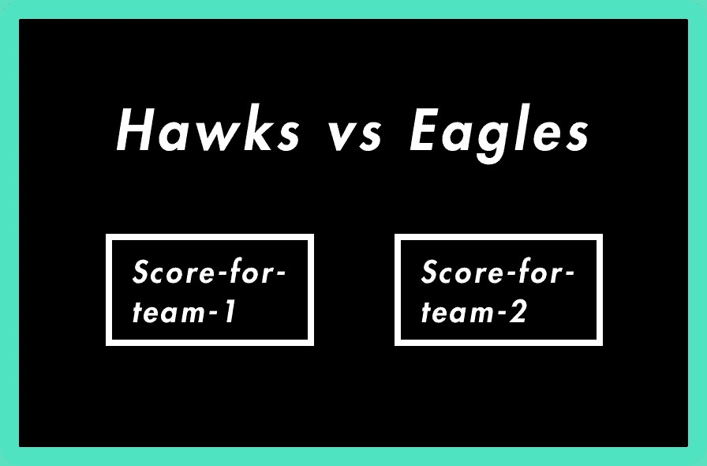
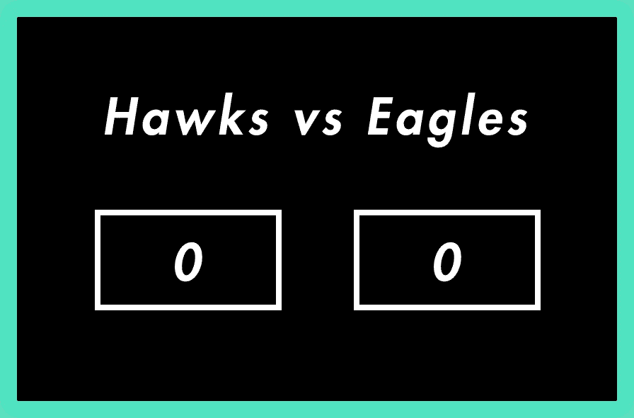

# 反应掌握之路——理解状态

> 原文：<https://medium.com/hackernoon/the-road-to-react-mastery-understanding-state-29ef20572bc9>

React 中的状态是基于类的组件的一个非常强大的特性，有点类似于 React props，但是有一些显著的区别。状态封装了与组件实例相关联的可定制属性和值(而属性是只读的)。状态对于其单个组件来说既是可控的又是私有的，因此是 React 的一个非常强大的特性。


为了帮助你形象化状态，想象如果一个组件是一个人，他们的肤色、国籍、名字等都是道具——通常是由父母赋予这个人的不变属性。组件的状态可以被认为是人选择穿的衣服，是动态的和可变的！


不管你是否理解这个有点糟糕的类比，让我们开始吧！

为了让我们的组件有状态，我们需要使用基于类的组件，而不是基于函数的组件。

所以**不用这个**:

```
function RandomComponent() {
  return <p>Heyyyyy</p>;
}
```

我们将在**使用这个**:

```
class RandomComponent extends React.Component {
  render() {
    return <p>Heyyyyy</p>;
  }
}
```

明白了吗？太好了！现在，让我们制作一个组件来模拟一场篮球比赛的记分牌，每当有人得分时它就会更新。

```
class ScoreBoard extends React.Component {
  render() {
    return(
      <h1>{this.props.teams[0]} vs {this.props.teams[1]}</h1>;
      <p>*score-for-team-1* vs *score-for-team-2*</p>;
    );
  }
}ReactDOM.render(
  <ScoreBoard teams=["Hawks", "Eagles"]/>,
  document.getElementById('root')
); 
```

现在我们有了一个记分牌，显示了球队的名字，最初设置的值，不会改变，这意味着它们可以在道具中设置。然而，我们现在需要整合他们的分数，因为到目前为止，黑板会笨拙地显示“团队 1 的分数与团队 2 的分数”，这不是很有帮助。



这就是国务院介入的地方。让我们将它合并到组件中。

```
class ScoreBoard extends React.Component {
  constructor(props) {
    super(props);
    this.state = {
      scoreOne: 0,
      scoreTwo: 0
    };
  }render() {
    return(
      <h1>{this.props.teams[0]} vs {this.props.teams[1]}</h1>;
      <p>{this.state.scoreOne} vs {this.state.scoreTwo}</p>;
    );
  }
}ReactDOM.render(
  <ScoreBoard teams=["Hawks", "Eagles"]/>,
  document.getElementById('root')
);
```

现在我们有一个记分牌，显示每个队的 0 分。太好了！这比我们以前那些笨拙的占位符好多了。



但是如果有人得了一分会怎么样呢？现在，什么都不会。这意味着我们所创建的本质上是一个有状态组件形式的无状态组件。所以真的，没什么帮助。我们需要纳入一个评分机制，这个记分牌是任何人的任何用途。

这正是我们在探索反应事件和突变状态时要做的。因此，要了解如何使我们的状态动态化，以及如何使我们的组件更加强大，请查看下面的第 2 部分！

[](/@ethoshansen/the-road-to-react-mastery-handling-events-9da8bb1c6f1d) [## 反应精通之路——处理事件

### 如何利用 React 组件最强大的特性之一！

medium.com](/@ethoshansen/the-road-to-react-mastery-handling-events-9da8bb1c6f1d) 

感谢阅读！