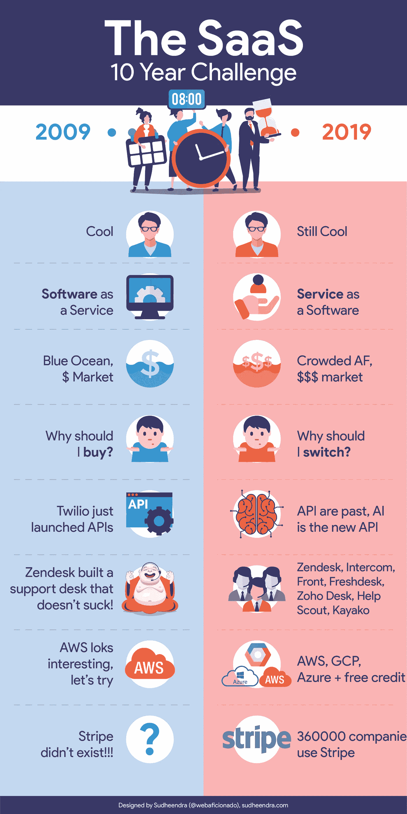
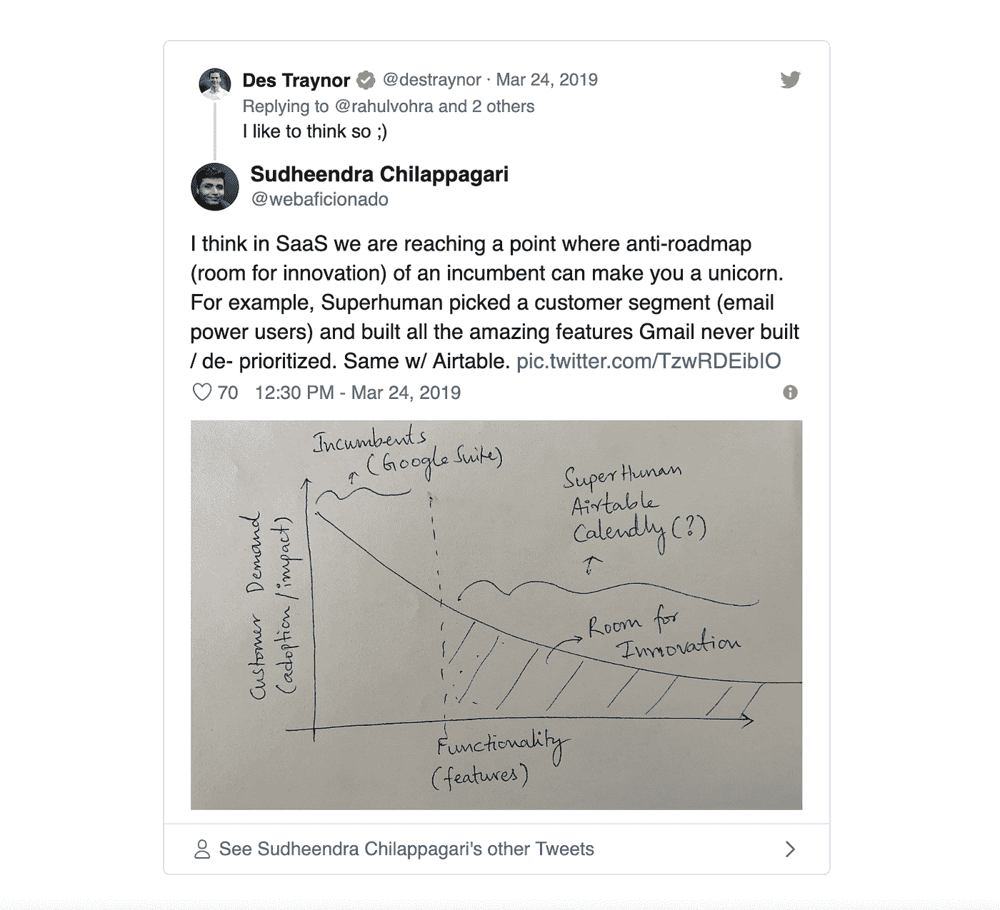
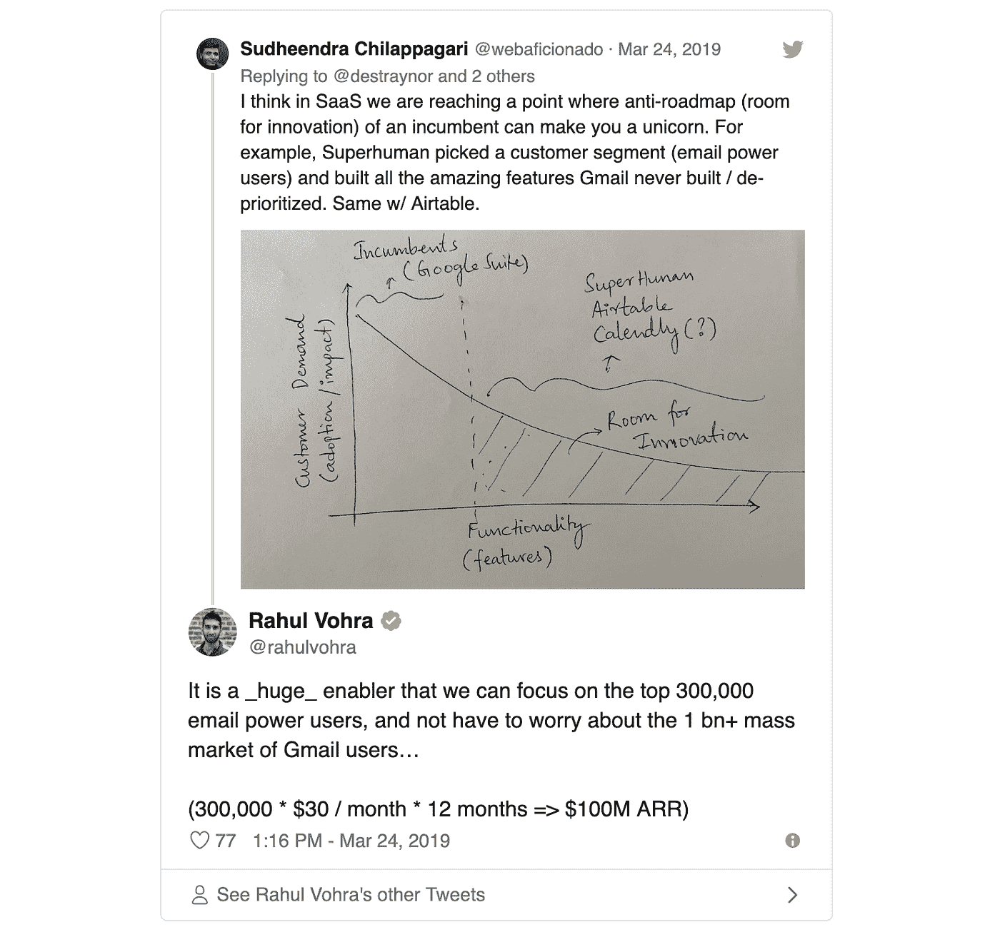

# SaaS 十年挑战

> 原文：<https://medium.com/hackernoon/the-saas-10-year-challenge-ca21265f9061>

如果你在互联网上，你可能听说过这个最新的时尚，10 年挑战，或 2009 年对 2019 年的挑战。很简单，你把一张 2009 年的老照片贴在一张 2019 年的近照旁边，给它加个好看的标题。有点像这样👇

Same old Salesforce, just 10x bigger and better 😬

当人们疯狂地发布他们的 10 年挑战时，数据科学家很高兴他们找到了一个黄金数据集来训练他们的面部识别算法。玩笑归玩笑，严肃地说，我开始想如果 SaaS 接受 10 年挑战会怎么样..为您呈现“SaaS 十年挑战”

让我们看看一些有趣的趋势，并了解我们作为一个行业走了多远！

**从“卖软件”到“服务客户”**

*   过去，如果你是一家 SaaS 公司，你会在云上销售软件…没有安装成本，没有安装，也不用担心升级时的停机/维护。2019 年，如果你以为你是卖软件的，那你就错了。你*实际上是以软件的形式提供你的服务*，理解这种转变的公司是引领市场的公司。据 SaaS 资深人士[大卫取消](https://medium.com/u/52d45a2865c1?source=post_page-----ca21265f9061--------------------------------) (CEO，[漂移](https://medium.com/u/e7a3db4bbcc3?source=post_page-----ca21265f9061--------------------------------))***客户体验*** *是新的营销* ***帮助*** *是新的销售*。
*   在 2009 年，SaaS 是一个相对较新的事物，在大多数 P&L 报表中没有预算和软件支出项目。这对 SaaS 企业家来说意味着新的挑战，因为这是一片蓝海，他们必须在销售产品之前教育市场。当我问帕特·格雷迪(红杉)关于 HubSpot 的历程时，他说在最初的五年里，几乎每个季度都很艰难。快进到 2019 年，客户已经在使用某种形式的云软件来运行他们的运营。因此，买家会问一个不同的问题——“那么，我为什么要换呢？”
*   直到 2009 年，软件都是通过节省成本和时间来简化业务运营，从而提高组织效率。开发人员并不真正关心用户体验，一旦软件被购买，PMs 也不会衡量客户参与度。报告是吸引买家注意力的唯一功能，用户在购买过程中几乎没有发言权。由于苹果、谷歌和脸书为消费者创造了愉快的体验，这种情况开始突然改变。Zendesk(2009)的推出给支持代理人带来了笑容，就像他们名字中的“禅”一样。如今，如果你是一家 SaaS 公司，没有什么比客户体验更重要了。随着现收现付模式成为常态&留存成为增长的关键驱动力，2019 年为构建和销售 SaaS 产品设立了新的标杆。像漂移、[、超人](https://medium.com/u/bc415f9e3258?source=post_page-----ca21265f9061--------------------------------)、观念等公司。为下一代软件树立了榜样。

**2019 年是 SaaS 黄金时代的开始**

*   2009 年，SaaS 是街区里的新人……今天是 SaaS 的黄金时代。我几乎认为 2019 年是 1999 年的网络革命，但对于经济效益更好的 B2B 软件来说
*   Salesforce 在 2009 年[第一次达到了 138 亿美元的 1B 收入。这意味着 1%的销售收入会让你成为独角兽🦄(1% * 138 亿美元= 1.38 亿美元 ARR ~ 13.8 亿美元估值)。我最近在 Twitter 上分享了我对这个话题的想法，当时人们想知道 Zoom 如何在拥挤的视频会议市场上建立起 3 亿美元的 ARR 业务](https://techcrunch.com/2009/02/25/salesforce-hits-1-billion-dollars-in-annual-revenues/)

拉胡尔·沃赫拉(创始人，超人)点头回答..

*   SaaS 的商品化:我们在 2009 年开始看到品类领导者的出现，像 [Okta](https://medium.com/u/7b847836aa03?source=post_page-----ca21265f9061--------------------------------) 、 [Dropbox](https://medium.com/u/2d2c8f4cb281?source=post_page-----ca21265f9061--------------------------------) 、Gainsight 这样的公司才刚刚起步。今天，我们至少有十几家类似的公司，它们有着几乎相似的价值主张(特征),几乎没有区别。例如，看看非常拥挤的帮助台软件类别，G2Crowd 说,[至少有 40 家 SaaS 公司](https://www.g2crowd.com/categories/help-desk)更不用说那些没有进入魔力象限的公司了。想象一下，对于客户来说，决定使用什么工具是多么痛苦的事情？几乎所有的软件最终都会成为商品。唯一的区别是品牌，不要搞砸了:)

**SaaS 世博会背后的催化剂**

*   2009 年是 API 革命的开始——允许软件应用程序相互通信的隐藏主干。今天，API 正在吞噬世界，中间件公司正在赚钱。这个领域的领导者 [MuleSoft](https://medium.com/u/1d08fbe24b8b?source=post_page-----ca21265f9061--------------------------------) 在上市后被 [Salesforce](https://medium.com/u/f4fb2a348280?source=post_page-----ca21265f9061--------------------------------) 以 65 亿美元的高价收购！
*   直到 2009 年，它只是关于 SaaS，但我们开始看到 IaaS(基础设施即服务)革命。AWS ec2 免费层让我注册托管我的网站，就是这样..我被迷住了！今天，如果你是一名开发人员，而不是使用 IaaS 平台来构建你的软件，我会感到惊讶。AWS、GCP 和 Azure 是云基础设施市场的领导者，其次是 Segment 等公司，它们在客户数据基础设施等细分领域确立了自己的领导者地位。
*   SaaS 市场的融资目前处于历史最高水平。2009 年，1 亿美元的 ARR 意味着 10 亿美元的估值(约 10 倍)，你已经准备好作为一家 SaaS 企业上市了。如今，越来越多的 SaaS 公司试图保持私有化，并在收入在 3 亿至 5 亿美元之间时申请 IPO，或者被私募股权公司(如 Vista Equity Partners、Openview 等)收购。)

**其他一些有趣的事实:**

*   2009 年，[Jason m . lem kin](https://medium.com/u/e67120d2dec7?source=post_page-----ca21265f9061--------------------------------)(SaaStr 的创始人)仍在 Adobe(收购 EchoSign 后),著名的 SaaS 博主 Tomasz Tunguz 刚刚辞去了他在谷歌的项目经理职位，加入了[红点风险投资](https://medium.com/u/e326ed3f18d?source=post_page-----ca21265f9061--------------------------------)😇
*   最著名的 SaaS 独角兽[条纹](https://medium.com/u/3ecae35d6d66?source=post_page-----ca21265f9061--------------------------------)，在 2009 年还不存在！如今，Stripe 已经诞生了一大批订阅业务，我敢打赌，在为 SaaS 公司提供支付服务方面，它们将是市场领导者
*   最后，如果[麦当劳](https://medium.com/u/a765f651bcda?source=post_page-----ca21265f9061--------------------------------)决定以 3 亿美元收购一家 SaaS 公司，你会说这是疯了。本周(2019 年)，McD 抢购了 [Dynamic Yield](https://medium.com/u/774fe5a6bbe3?source=post_page-----ca21265f9061--------------------------------) (机器学习平台)，为他们的客户创造亚马逊风格的个性化体验。欢迎来到未来！😍

> 今天身处 SaaS 就像是文艺复兴时期的画家。如果你知道如何构建和销售软件，你是不可阻挡的。任何时候都不晚，来加入 SaaS 运动吧..SaaS 革命万岁！

如果你想在 SaaS 发展自己的事业，并且需要建议，请随时联系我 hello@sudheendra.com。