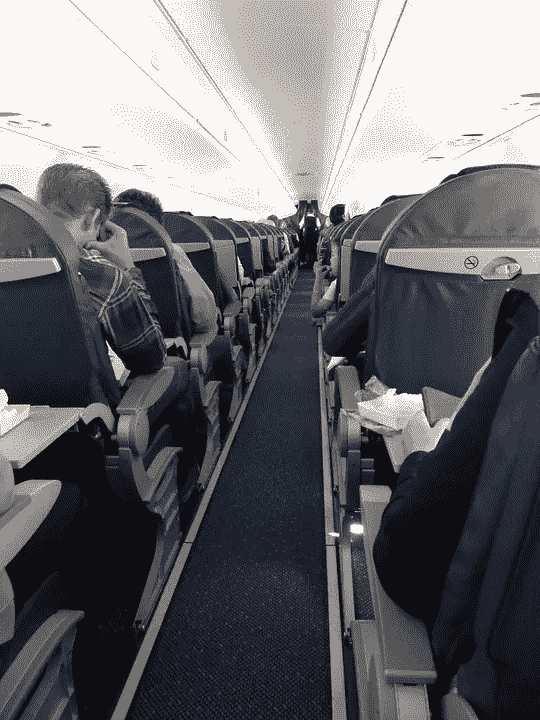

# 旅行时获得免费饮料、升级和真诚微笑的秘密

> 原文：<https://medium.com/hackernoon/the-secret-to-getting-free-drinks-upgrades-and-genuine-smiles-when-you-travel-52a5fc1542c5>

Image Credit: alusruvi/Pixabay

我的一个非常好的朋友听我讲了很多旅行的故事，在这些旅行中，我得到了免费的饮料、免费的酒店和汽车租赁升级以及各种免费的旅行。然而，没有亲身经历过我的故事，他总是怀疑有一定程度的修饰，使我的故事更具娱乐性。

我们最终有机会一起去[旅行](https://hackernoon.com/tagged/travel)，我能够展示一点尊重和真诚微笑的力量。

**善良很酷**

我们坐在沉闷、不舒服的机场候机楼里开始了我们的旅行，离起飞还有很长时间。无聊之余，我探索了航站楼，找到了航空公司的俱乐部休息室。尽管不是会员，我还是进去了，并立刻知道接下来几个小时我要去哪里。唐坐在前台后面一把比他小两号的椅子上，是一个身材高大的夏威夷人，面带真诚的微笑。他显然对自己超大手中的平装书不感兴趣，他似乎乐于聊天。

简单寒暄之后，我问他加入俱乐部要花多少钱，他们是否提供一日游。他笑着抱歉地说:“一年大约 500 美元。我们没有日租，但如果你只是想看看的话，这次我可以让你滑。”我谢过他，赶紧回去抓我的哥们。

在航空俱乐部度过了一段悠闲的时光后，我们登上了飞机，见到了凯利，一个二十出头的冲浪小伙子，他是我们接下来五个小时的服务员。每个人都坐定后，我问他住在夏威夷哪里，在哪里冲浪，用什么样的冲浪板，等等。

我们一上飞机，我就问凯利能不能帮我弄一杯鸡尾酒。他笑着问我是否想要一件他的“特别创作”我毫不犹豫地回答道:“当然了。”

他回来等着我品尝饮料。我咽下一大口，真诚地告诉他:“你是个艺术家。你应该把这叫做‘凯利的创造’。“在我们着陆之前，我又有了几个凯利的作品，都是免费的。

我们告别了凯利，希望在回程的航班上能再见到他，然后向汽车租赁公司走去。天气很热，柜台的女人看起来不高兴。

我带着灿烂的微笑走近她，问她今天过得怎么样。她回答说:“情况要变得更糟了。所有从大陆来的航班都在降落。”她显然不开心。

开了一会儿玩笑后，她不情愿地笑了，最终笑我的老土幽默。她免除了我朋友成为授权司机的费用，还免费给我们升级了一辆稍微好一点的车。

**那又怎样**

同样，企业家也能很好地找到并培养与服务员工的短暂关系，这些员工通常会被自负的专业人士所忽视，比如:女服务员、汽车租赁代理、空姐和呼叫中心代理。

这些人每天都会遇到一大群不开心、不满、粗暴无礼的旅行者。因此，通过简单的微笑和向这些努力工作的人展示他们应得的礼貌，很容易让你与众不同。打招呼时真诚地问:“哇。你这么忙怎么能在压力下看起来这么酷？”会得到一个微笑和一笔特别的交易。

**建立连接**

用友好、真诚的微笑建立真诚的联系。然后把你接近的人当作同事，这是许多服务人员很少从他们的大多数苦恼的、只顾自己的顾客那里体验到的礼貌。

这种互动应该始终基于真诚的兴趣表达。例如，在漫长的一天旅行后，我在凌晨 1 点左右接近一家酒店的夜班服务员。他显然是在学习一本教科书，我真的很钦佩他在大学期间有一份晚上的工作。

而不是忽视他的书或问他一个肤浅的问题，如“你的专业是什么”或“你在哪里上学？”我问他:“你毕业后的梦想是什么？”他犹豫了，显然在考虑是应该给我一个深思熟虑的、诚实的答复，还是应该保持交易模式，给我一个粗略的、油嘴滑舌的答复。

他选择了诚实，并告诉我他希望有一天能开一家兽医诊所，因为他热爱动物。我们进行了愉快的交谈，我甚至没有要求就获得了免费升级，我们和我分手时真诚地祝他一切顺利。直到我来到我的多房间套房，我才意识到他给我升级了。我对这个套房不太满意，我只在里面呆了几个小时。让我度过这个夜晚的是我们短暂分享的个人联系。

**真正的奖励**

如果你在翻白眼，我会告诉你一个秘密——真正的回报不是省下几美元。

这种人际关系建立的基础是注入单调乏味环境中的轻松和友善。当你与沿途遇到的人建立起真诚的关系时，旅行会变得不那么平凡，而且会变得更加快乐。这种互动有时会带来小而有形的免费赠品，这是一个不错的奖励，但真正的回报是与一些与你共享这个星球的了不起的人建立短暂而有意义的联系。

*在这里关注约翰面向初创企业的推特供稿:*[***@ johngreathouse***](https://twitter.com/#!/johngreathouse)