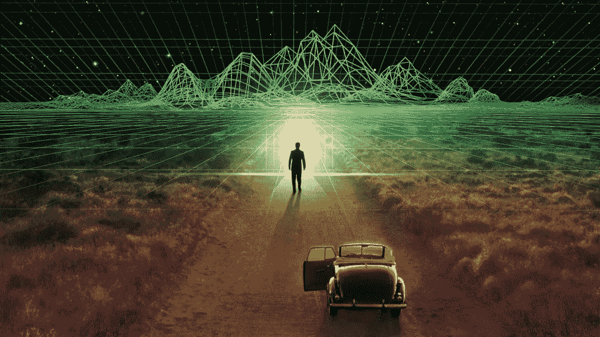
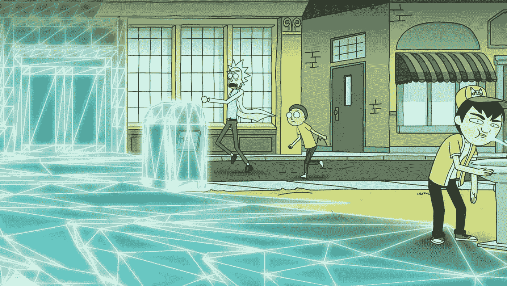
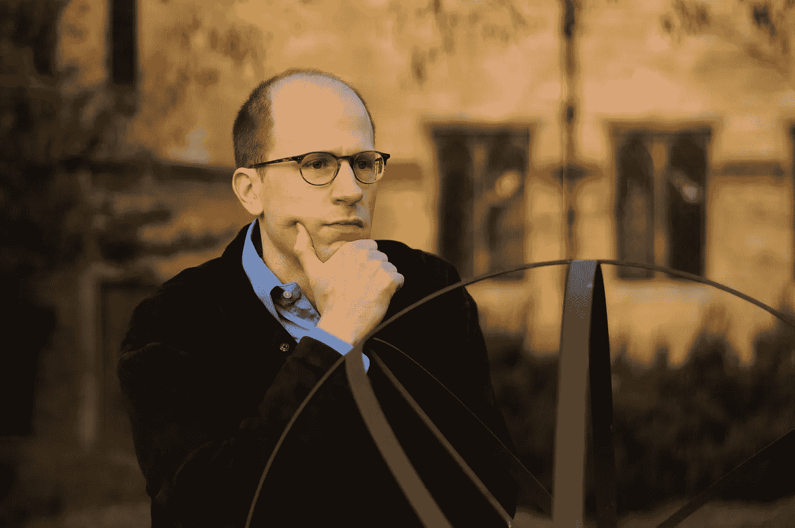
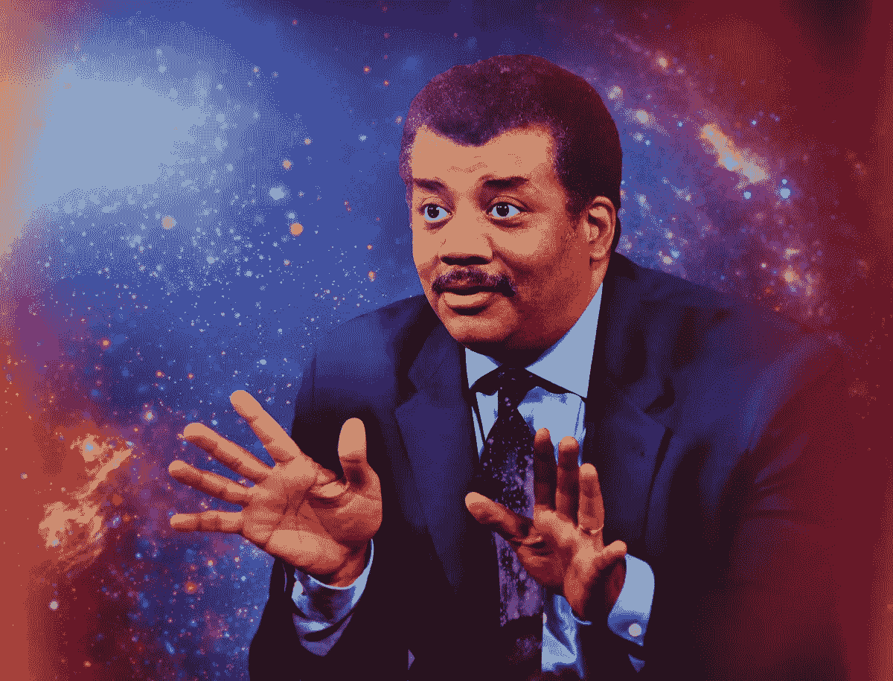

# 模拟假说和终极宗教

> 原文：<https://medium.com/hackernoon/the-simulation-hypothesis-and-the-ultimate-religion-3aa61b12c034>

模拟假说指出，我们生活的宇宙不是真实的，而是一个计算机模拟，一个极其详细，逼真和精确的视频游戏，如此完美，以至于没有办法区分它是真实的。但是现实世界在我们有限的模拟之外。

几年前几乎被忽视的这一论点正在迅速传播，特别是在某些技术科学哲学圈子里，并且可能很快成为主流，最终成为终极宗教。

# 但是，我们生活在模拟世界中吗？

很有可能。事实上，我们不是生活在一个模拟环境中是不太可能的。不幸的是，没有可能的方法来确认或否认我们是否在模拟中，除非模拟的创造者留下了证据，或者决定在未来的某个时候让它引人注目。

主要有两个论点支持*的信念*，即我们生活在一个模拟环境中。

## **技术进化**

Pong 被认为是第一款视频游戏，于 1972 年底推出。在这大约 50 年里，技术进步是巨大的。我们已经从功能有限的单色游戏发展到超详细的 3d 场景、拥有数千名同时在线玩家的大规模持久在线世界、超逼真的驾驶模拟器，以及近年来虚拟现实商业开发的第一步，在许多情况下，这在客观上很难与现实区分开来。

对于宇宙进化的尺度来说，50 年算不了什么。智人已经存在了大约 100，000 年，所以过去的 50 年只占我们这个物种存在时间的不到 0.05%。

> 对我们来说，在模拟中最有力的论据可能是…40 年前我们有 Pong——两个矩形和一个点。这就是游戏。现在，40 年后，我们有照片般逼真的 3d 模拟，数百万人同时玩。而且一年比一年好……**如果你假设有任何改进的话，那么游戏将变得与现实难以区分**
> 
> ***埃隆马斯克***

考虑到技术的发展(指数性或非指数性，另一个有趣的讨论)，可以预期，在几年内，虚拟的模拟世界将实际上与现实难以区分。即使我们考虑到技术进化程度的巨大倒退，我们也只会把不可避免的进化推迟几百/几千/几万年。在宇宙尺度上，它们仍然是微不足道的价值。

因此，考虑到我们正在目睹的不可阻挡的技术进化，除非发生灾难性事件、[大过滤器](https://curiosity.com/topics/the-great-filter-might-be-whats-preventing-aliens-from-reaching-us-curiosity/)或其他理论灾难，似乎很有可能有一天人类将能够创建与现实完全不可区分的虚拟世界或模拟。

## **现实的极限与资源优化**

对于我们目前的发展水平来说，执行一个像我们可能生活的那样详细的模拟，需要不可想象的大量资源(硬件)。然而，我们应该记住，有不同类型/程度的模拟，更重要的是，没有必要模拟模拟的所有细节。

从你阅读本文时可能处于模拟的基础开始，为了维持这些模拟，可能没有必要对地球上其余的 75 亿居民进行详细的模拟，包括它的每一个原子、夸克或任何被考虑的最小粒子。为了使模拟足够详细和可信，例如，模拟参考点周围约 10 米的范围就足够了，就像当您在视频游戏中检查外部场景时，根本不需要建筑物的内部存在，因为您永远不会在其中。

如果我们认为我们的整个星球是一个模拟的对象，我们可以假设地球表面和星球附近发生的一切都是我们居住的详细模拟的一部分。鉴于当前物理学似乎施加的限制，在中期内，我们不太可能能够旅行到最近的恒星(比邻星，位于 4.22 光年处)，因此模拟可以简单地将远空间表示为模拟外层的像素。这意味着没有必要模拟显然存在于我们宇宙中的数十亿颗恒星、行星和其他物体中的每一个。

在某种程度上，物理定律施加的限制可以解释为模拟的创建者施加的限制。没有必要模拟外层宇宙，因为我们永远也不能去外层旅行。模拟的创建者施加了诸如光速的限制，或者将这些物体放置在荒谬的遥远和不可及的距离，从而为模拟节省了宝贵的资源。

Rick and Morty S01E04: M. Night Shaym-Aliens!

还有证据表明，对“下限”(亚原子世界)的模拟并没有达到应有的完整程度。[双缝实验](/predict/the-double-slit-experiment-demystified-disproving-the-quantum-consciousness-connection-ee8384a50e2f)似乎表明，亚原子现实只有在被观察时才存在，这进一步表明，我们正处于一个模拟中，只有被观察的现实的一小部分存在。

因此，进行模拟所需的资源量，尽管同样巨大、昂贵，并且对于我们目前的发展程度来说是负担不起的，但并不像完全模拟宇宙那样荒谬。

我们不能忘记，对于我们有限的零度文明来说，按照[卡尔达舍夫等级](https://en.wikipedia.org/wiki/Kardashev_scale)(一种根据能够使用的能量来衡量文明技术进化程度的等级)，像[戴森球](https://www.youtube.com/watch?v=pP44EPBMb8A)这样的结构将提供几乎无限的能源和资源，这纯粹是科幻小说。然而，第二类或第三类文明可能不会面临任何资源或硬件限制来创建任何类型的模拟。

在任何情况下，如果模拟假设是真的，我们当前专注于启动和维护模拟的必要资源/硬件的心态，可能在我们的模拟之外缺乏意义，在那里现实的法则(真实的法则，在我们的模拟之外，反过来可能是另一个高级模拟的副产品)可能与我们在我们有限的*现实*中观察到的那些无关。

# **非常聪明的人为模拟论证辩护**

模拟论证的起源似乎可以在笛卡尔那里找到，后来由汉斯·莫拉维克发展，最近几年由英国哲学家尼克·博斯特罗姆发展。此外，尼尔·德格拉斯·泰森和埃隆·马斯克等另外两位备受尊敬的人物也为模拟假说辩护。我们来看看为什么。

## 尼克·博斯特伦

可能是花了更长时间思考和辩论模拟假说的人。他的论文“[你生活在计算机模拟中吗](https://www.simulation-argument.com/simulation.html)”是对这个课题感兴趣的人的主要参考。

他的论点陈述了以下三个命题中的一个是正确的:

*   *a)达到后人类阶段(能够进行模拟)的发达文明的百分比接近于零；或者*
*   对模拟感兴趣的后人类文明的百分比接近于零；或者
*   ***c)生活在模拟中的人的百分比接近 1。***

在这些假设下，结果如下:

*   *如果(a)是真的，我们可能会在到达后人类阶段之前灭绝。*
*   *如果(b)为真，有可能是没有兴趣也没有能力进行模拟。*
*   ***如果(c)是真的，那么几乎可以肯定我们是生活在一个模拟中。***

鉴于目前的形势和近年来的技术发展，尼克·博斯特罗姆最后提出了三种选择:

*   *a)我们很快就会熄灭(这样我们就无法发展创造模拟的能力)。*
*   *b)在某个时候，我们将对开发模拟失去兴趣，或者我们将无法实现这一能力。*
*   我们生活在一个模拟中，事实上，模拟与现实的比例是几十亿比一。

## **埃隆·马斯克**

埃隆·马斯克(Elon Musk)曾在无数场合提到，在他看来，我们很有可能生活在一个模拟中。

> 我们现在有十亿分之一的机会生活在计算机模拟中
> 
> ***埃隆马斯克***

他支持模拟假说的主要论点包括对我们社会技术进化速度的推断。即使假设进化的速度下降到当前速度的千分之一，外推未来一千年的速度(在进化规模上微不足道)，人类也很有可能能够进行超详细的模拟，事实上，应该进行数千/数百万次模拟。所以，单纯从统计上来说，[我们活在现实中的概率是十亿分之一](https://www.youtube.com/watch?v=IvBJ4dZoyKE)。

在 YouTube 上有许多视频，马斯克在其中阐述了他的观点。对我来说，最有趣的是这个回答你会对 AGI 人问什么的小片段。(人工通用智能)

在他的演讲和采访中直接或间接提到模拟论点也很常见，如在 2019 年 4 月进行的[特斯拉自动驾驶演讲中](https://youtu.be/Ucp0TTmvqOE?list=WL&t=6574) ( *直接链接到 min: 1:49:30* )。

## 尼尔·德格拉斯·泰森

他对假说的支持主要是基于他没有令人信服的论据来反对模拟论证。泰森还经常依赖于技术发展的程度，尤其是与当前视频游戏相关的技术。

> 我希望我有一个很好的论据来反对这个假设，但我没有。
> 
> [***尼尔·德格拉斯*** 泰森](https://www.youtube.com/watch?v=CoMDzAiQpbY)

# **模拟假说是宗教吗？**

就像无法证明上帝的存在一样，也无法证明模拟假说的确定性。也许将来我们可以找到支持模拟论证的有力证据，但我们可能永远不会达到 100%的确定性。

**因此，模拟论证不是科学，而是信仰。**

模拟论证的宗教含义可能是另一篇文章的主题，但是，作为总结，我们可以确定一些要点，在我看来，表明模拟假说将在不久的将来成为最终的宗教。可能，在某种意义上，非常远离历史和当前的宗教，没有他们的仪式和用具，但我毫不怀疑模拟假说将在未来几年变得非常流行。事实上，已经有一些最初的运动，目前发展非常有限，如由自动驾驶汽车公司 Otto 的创始人 Andrew Levandowski 创立的[未来之路](http://www.wayofthefuture.church/)、将[与 AI](https://www.wired.com/story/anthony-levandowski-artificial-intelligence-religion/) 等同的宗教，Otto 在 2016 年被优步收购，显然是从谷歌自动驾驶汽车项目窃取了 10GB 的机密信息。

总的来说，所有宗教都有一些共同点，其中一些可能也非常适合模拟论证:

## **上帝**

他是模拟的创建者，是定义所有模拟参数(物理定律)、其开始(创建)和结束(死亡、启示、转世和/或回到模拟之外的真实宇宙)的人。

## **谜团**

宗教也有神秘和未知的重要组成部分。正如马斯克提问… *模拟之外是什么？*

## **奇迹和上帝的调解**

在模拟视角下，我们可以在两种情况下证明奇迹的合理性:

*   **外部操作**:创建者可以访问模拟，并可以编辑某些参数(例如，为一个模拟人治疗癌症)。
*   **模拟中的错误**:异常的编程失败(错误)可能会转化为模拟中的错误，而这些错误对于模拟中的居民来说是无法解释的。

## **道德原则**

一个人能够有道德的行为仅仅是因为这是外部为其设定的程序。其他模拟可能有非常不同的道德法则供参与者享受。

## **创世纪**

(*模拟的*)宇宙已经开始。同样，有两种选择:

*   模拟实际上是从大爆炸开始的。
*   模拟在任何随后的任意时刻开始，在这种状态下，证明一个不存在但模拟且可信的大爆炸的开始是合理的(同样，我们可能已经从今天开始存在，我们对过去的记忆只是人为的想法，我们不可能区分现实)。

## **来世**

根据模拟的类型，其参与者可以是外部现实中的生物(真实的宇宙或模拟我们的高级模拟，如虚拟机中的虚拟机等等)。一旦他们死了，厌倦了当前的模拟或者只是想完成它，他们会回到现实中继续他们的真实存在。这意味着死后的生活。

# 终极宗教

事实上，有无数的科学家研究和捍卫模拟假说，以及模拟之外全新生命的真实可能性，是下一个伟大宗教的两个足够强大和可行的论据。一种以技术为主要成分的宗教，基于目前可观察到的技术发展。一种由科学和受人尊敬的科学家支持的宗教，带有信仰和宗教用具的次要成分。非宗教人士的宗教。

**终极宗教。**

  T 感谢您的阅读，希望您觉得有用。如果你喜欢它，请**考虑订阅** [ **灰色事件** ](https://graymatters.substack.com/) **🧠** ，这是我与[琼·加梅尔](/@gamell)共同撰写的每周时事通讯，在这里我们讨论生产力、科技、新常态以及介于两者之间的一切。