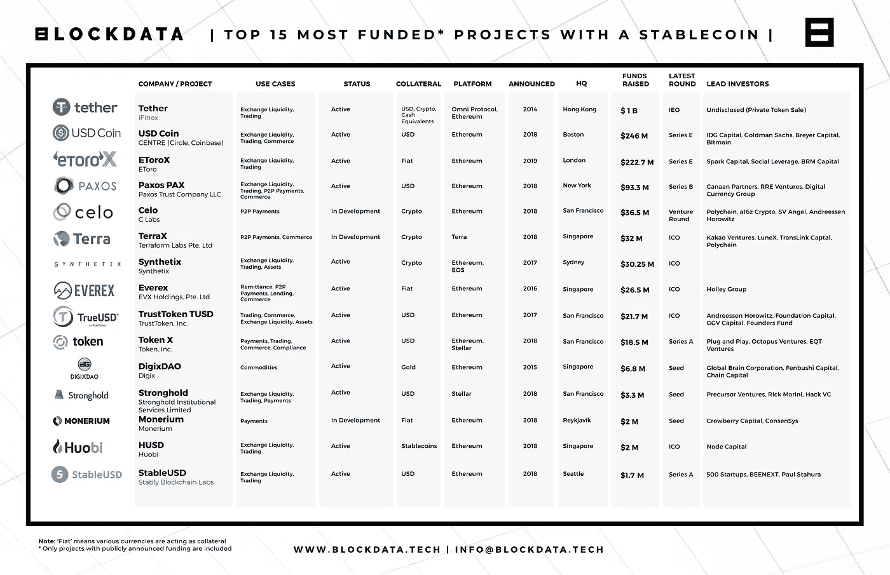
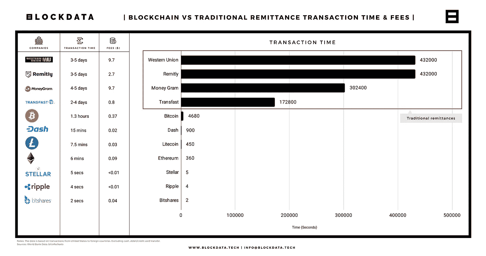
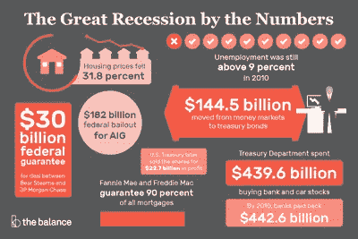
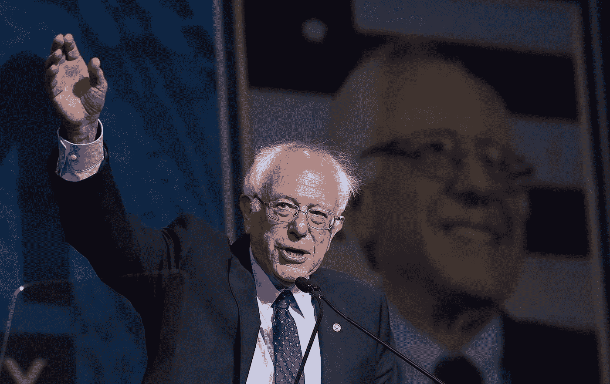
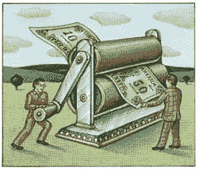
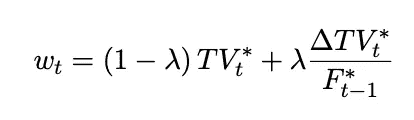
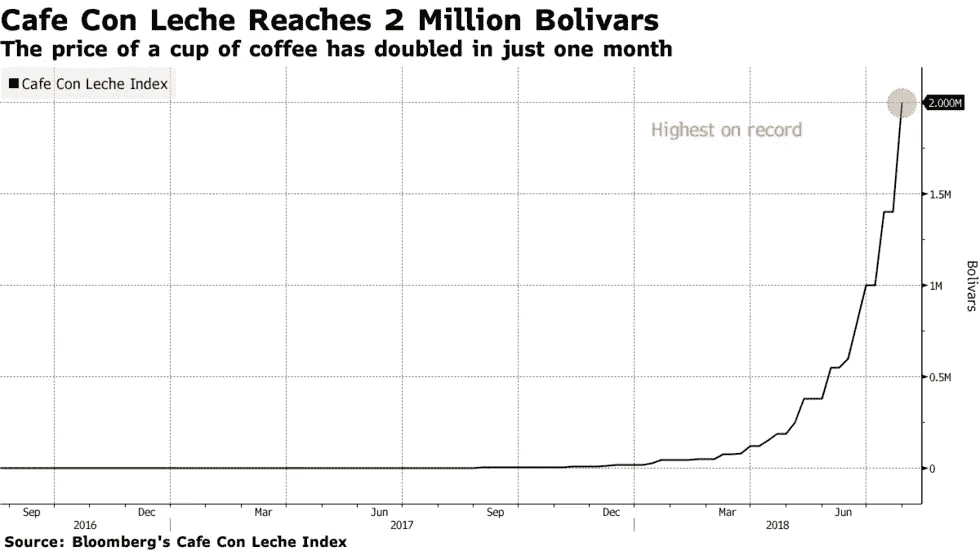
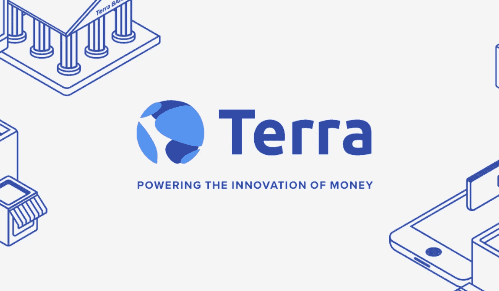

# 你决定花费的稳定硬币将决定未来银行业的发展

> 原文：<https://medium.com/hackernoon/the-stablecoin-you-decide-to-spend-will-determine-how-future-banking-unfolds-f4164058c1a0>

We may soon live in a world where the currency you choose to use each day matter ([source](https://edge.app/blog/stablecoins/))

与比特币等其他投机性加密货币不同，tablecoin 是一种加密货币，旨在通过最小化价格波动来保持“稳定”。这很重要，因为**人们不喜欢花费(升值的风险)和接受(贬值的风险)持续波动的货币**。

然而，对于区块链世界之外的人来说，当稳定的美元存在时，为什么稳定的硬币甚至很重要的问题是有意义的([虽然对于那些生活在货币比比特币](https://www.bbc.com/news/business-47553048)更不稳定的地方的人来说是有意义的)。当他们有许多其他问题要解决的时候，[脸书挑选他们的高层管理人员和工程师来领导一个稳定的项目](https://techcrunch.com/2019/06/06/facebook-libra-launch/)、[同时筹集 1B 美元的外部资金](https://www.coindesk.com/facebook-said-to-be-seeking-1-billion-in-funding-for-crypto-project)，这似乎是不合理的。

通过快速开发他们的 Stablecoin initiative，GlobalCoin，脸书展示了这个项目是他们的首要任务之一。[他们的白皮书将于 6 月 18 日](https://techcrunch.com/2019/06/06/facebook-libra-launch/)发布，而 [GlobalCoin 将于 2020 年第一季度](https://www.bbc.com/news/business-48383460)推出。

因此，理解为什么稳定的加密货币对我们这些用户很重要，为什么它对脸书和摩根大通这样的大型组织很重要，还有其他 122 个 Stablecoin 项目，这些项目也是由一些顶级投资者[资助的，包括安德森·霍洛维茨，创始人基金，高盛，雷德·霍夫曼(LinkedIn 创始人)，杰克·多西(Twitter 联合创始人)](/blockdata/breaking-down-the-most-funded-stablecoin-projects-as-of-may-2019-63df2767b5bf)和许多其他加密基金。仅在今年的前 15 个 Stablecoin 项目中，就筹集了超过 17.43 亿美元来资助这些计划。

Amount funded to Stablecoin projects show that something is here

稳定币将会是我们未来的一部分，但是我们必须明白使用它们意味着什么。无论谁赢得了成为主导者的竞赛，都将对我们的社会如何演变产生重大影响，因此我希望介绍它们为什么重要以及我们应该期待什么。

首先，货币在区块链意味着你可以**避免支付给所有的中间人**，他们为结算支付和汇款支付了巨额费用，同时**加快了资金转移**。这些问题之所以存在，是因为转移资金需要高度的信任，这是区块链科技为我们总结的。

这非常重要，埃森哲发布了一份报告，声称区块链技术可以将全球十大投资银行中的八家的基础设施成本平均降低 30%，相当于 2017 年 80 亿至 120 亿美元。

此外，最近的一项研究结果(2019 年 3 月)显示， [**区块链汇款比传统汇款渠道**](/@blockdata_tech/blockchain-is-disrupting-the-700-billion-remittance-industry-b79a01a95a10) 平均快 388 倍，便宜 127 倍。关于这个到 2022 年将成为万亿美元市场的行业，以及区块链如何解决汇款问题的更多信息，[我推荐阅读他们发表的报告](https://www.blockdata.tech/insights/)。

Blockchain has shown significant improvement over traditional transfers ([source](/@blockdata_tech/blockchain-is-disrupting-the-700-billion-remittance-industry-b79a01a95a10))

尽管有这些好处，加密货币的波动性使其对企业和用户没有吸引力，这就是为什么许多人仍然没有采用加密货币进行汇款。然而， **Stablecoin 通过消除升值和贬值的风险消除了这一痛点，**这样加密货币就可以像我们使用信用卡一样用于主流用途。

其次，**信任问题可以消除**。在韩国，有一种说法是“一旦你借钱给别人，你就失去了一个朋友”，因为没有正式的合同，你很有可能永远无法收回你的钱。即使你有律师，打官司也需要支付法律服务费。

根据 T21 CouponCodesPro 对近 3000 名成年人的调查，

> “大约三分之二借钱的人再也见不到了。”

这个问题通过智能合约得以解决，在智能合约中,**代码拥有特定的条件，因此当这些条件得到满足时交易就会发生。例如，如果有一个条件，说我的朋友在他的 Stablecoin 帐户中获得的下 10 个硬币将会来到我这里，那么一旦满足该条件，他就没有办法阻止这 10 个硬币离开他的钱包。没有朋友损失，也不需要雇用一个执行者，如果金额变大！**

这也适用于我们对**银行和政府的信任，他们有权力对我们的经济做他们想做的事情**，特别是在不与黄金这样的稀缺或固定资源挂钩的法定货币体系内。决策过程不需要透明，也没有办法确保经济增长的公平分配。央行控制着信贷供应、流动性、利率和资金流动速度，如果它们像 2009 年那样做出糟糕的决定，我们将承担后果。

Remember the mess US was in during this time? ([source](https://www.thebalance.com/2008-financial-crisis-3305679))

由于法定货币(在拉丁语中的意思是“让它去做”)在技术上没有任何支持，公平地说，我们的货币完全是基于一种信念，即你可以用商品和服务来交换你的钱。

为什么我们生活在一个权力属于少数人的世界里？这是因为美联储系统是由少数人制造的。创始人之一，纽约国家城市银行行长弗兰克·范德利普说，

> “我和任何阴谋家一样神秘——事实上，一样鬼鬼祟祟。我们知道，发现是绝对不能发生的，否则我们所有的时间和努力都将浪费。如果我们这个特定的团体联合起来写了一份银行法案，这份法案将没有任何机会在国会通过。”

但是，如果它是由智能合约驱动的，那么我们可以**增加决策方式的一致性，并且** [**防止一个集中的实体突然印刷大量免费货币**，从而导致快速通货膨胀](http://solely)。

Do we want our monetary source to be controlled without our knowing? ([source](https://www.youtube.com/watch?v=mQUhJTxK5mA))

此外，如果 Stablecoin 采用利益相关共识算法，**其中你拥有的治理量与你的利益相关，**那么一个人就不能再只为自己的利益而工作，因为他们会因为做出不利于社区的决策而被削减。那些在这个系统中统治的人通过投票和给区块链增加街区来获利。因此，只要不裁员，他们就能保持盈利。

这确保了那些管理稳定货币的人为社区的最大利益而工作。你也可以把你自己的钱贡献给最优秀的州长，让他们有更大的发言权。作为回报，当你决定在州长(也称为验证者)的利润上下注时，你可以分享利润。

Remember how this guy raked in 2.3 million contributions 4 years ago? Proof-of-stake is actually not a foreign concept to us ([source](https://www.huffpost.com/entry/bernie-sanders-campaign-contributions_n_5678356ce4b06fa6887e03c5))

考虑到这些好处，重要的是要问一问为什么这么多公司想成为先行者，为什么脸书走得这么快。脸书有他们自己的具体原因，但也有非常令人信服的商业原因，为什么许多投资者在多个稳定的项目上下赌注。

虽然 NGC 风险投资公司的一位合伙人很好地解释了细节，但主要原因是当更多的人使用稳定币时，稳定币创造了它自己的价值和经济。

为了更好地理解这意味着什么，我们可以探究一下稳定资本是如何盈利的。利润的两个主要来源是每笔交易的低提成(如税收)和铸币税，铸币税是指当发行更多的货币，并且硬币的面值和生产成本之间存在正差额时获得的利润。

在稳定货币的情况下，发行货币的生产成本将为 0，因为所有的现金都是虚拟的。然而，这里重要的是**货币乘数**，用高度简化的术语来说，这意味着对于每单位的 Stablecoin you mint，将会产生 5 单位的 Stablecoin，并在 Stablecoins 的生态系统中流通([有关更多详细信息，请参考此处的](/@tony.gu/the-business-logic-of-stable-coin-3543095c9103))。

Seigniorage may seem like magic, but going through a few examples will explain why this works! ([source](http://outheretoo.blogspot.com/2011/11/seigniorage.html))

这创造了一个机会，如果人们积极地使用这些稳定的硬币来消费，企业会突然获得巨大的价值。[2000 年，美国政府每年获得约 250 亿美元的铸币税](https://web.archive.org/web/20091104172133/http://banking.senate.gov/docs/reports/dollar.htm)，这给我们带来了一个重要问题:我们希望看到哪个生态系统取得成功？

T 这个问题变得越来越重要，因为 [Tether，这个拥有最大市场份额的稳定货币，已经表明它可以谎称 100%盯住美元，而人们对此毫无办法](https://www.bloomberg.com/news/articles/2019-06-05/biggest-crypto-exchange-takes-on-tether-with-own-stablecoins)。如 Tether 所示，[加密货币很容易被集中，而不一定起到分散平台的作用](https://blockgeeks.com/guides/what-is-tether/)，这使得评估每种稳定货币的过程变得更加重要。

有意思的是，有些白皮书甚至没有提到铸币税这个词。在 Circle 的 USDC 稳定币的案例中，他们确实提到了他们将如何应对铸币税可能产生的情况，声称“[如果代币的价值超过 Circle 维护的预先融资的法定缓冲区](https://www.centre.io/pdfs/centre-whitepaper.pdf)，那么代币将被“[放置在储备中以服务于未来的请求，否则将被烧毁/销毁](https://www.centre.io/pdfs/centre-whitepaper.pdf)。”

然而，没有关于如何使用这笔准备金的具体细节。**如果他们不说明铸币税利润将如何使用，我们如何让稳定的投资者负责他们将使用利润造福社区**？

Terra 是一个展示了他们的国库将如何使用的团队，该团队正在利用他们赚取的铸币税创建一个稳定的 DApp(去中心化应用程序)平台。通过让 Terra 的验证者根据下面的等式选择将资助哪些 DApps 以及资助多少，他们可以客观地选择那些具有稳健的经济活动和有效利用资金的 DApps。

How Terra weighs how much funding a DApp should get, with more details of how this works in ([source](https://s3.ap-northeast-2.amazonaws.com/terra.money.home/static/Terra_White_paper.pdf?201904))

这确保了最符合 Terra 社区利益的 DApps 得到资助(还记得一些 ico 卷走的钱吗？)，同时保持透明度，防止中央集权做出可能造成不公平优势的可疑决策。铸币税起作用是因为 [**Terra 的目标是用他们的赌注令牌**](/terra-money/scaling-seigniorage-a72356a118ae) 取代法定抵押品。

By having multiple economies work together, cost of speculative attacks increases and vulnerabilities from external price shocks decreases ([source](/terra-money/the-revolution-of-money-and-finance-6452cfba6e07))

那么问题就变成了为什么我们在今天的经济中看不到这些好处？这是因为政府支出是由一个委员会根据他们的目标选择的，这个委员会也受到游说者的影响。

> T2:如果一个经济体优先奖励那些为其增长和稳定做出贡献的人，那么这个经济体一定会比现在更有潜力。

在铸币税之上，Terra **通过** [**与世界主要货币**挂钩，而不是仅仅依靠一个](/terra-money/rationale-for-including-multiple-fiat-currencies-in-terras-peg-1ea9eae9de2a)并让验证者投票选出最佳汇率，从而利用算法来维持其最佳价格。如果验证者没有投票选出最佳价格(在所选中位数的 1 个标准差以内)，那么他们将再次被削减。

> **通过算法解决许多关键的信任问题，并让主要利益相关者承担责任**，Terra 成为一个功能分散的平台，奖励那些努力使其变得更好的人。

这意味着，对于那些货币不稳定的国家来说，将钱存在 Terra 比存在当地货币更好，因为协议支持以适当的法定汇率进行原子互换。

例如，如果一杯咖啡值 5 个硬币，而通货膨胀严重，那么我可能需要 10 个硬币来买同样的咖啡。但是如果我在 Terra 上持有当地的硬币，那么我会知道验证器会调整汇率，这样我仍然可以得到咖啡，而不必支付两倍的价格。

Price of coffee in Venezuela doubled in one month, with 1,227,638% inflation in 3 months ([source](https://www.bloomberg.com/news/articles/2018-07-26/imf-s-1-000-000-inflation-forecast-is-looking-low-for-venezuela))

关于 Terra 的更多信息，我强烈推荐他们的白皮书。

Terra is a Stablecoin to keep an eye on ([source](/@EVALUAPE1/blockchain-project-review-terra-7-6-new-generation-stablecoin-a8f293a4b82e))

正如 Terra 向我们展示的那样，我们下一步选择把钱花在哪里会强烈影响我们的未来。经济学有着有趣的动态，活跃的交易转化为价值的创造，所以**如果我们不对稳定币项目如何使用新价值负责，那么稳定币的好处可能会流入少数人的口袋**。

正如脸书克里斯·休斯的前联合创始人所说，“[脸书对市场的封锁保证了用户不能通过转移到替代平台来抗议](https://www.nytimes.com/2019/05/09/opinion/sunday/chris-hughes-facebook-zuckerberg.html?module=inline)”脸书的庞大规模可能会使脸书进入的领域很难出现任何竞争，这就是为什么在脸书开发他们的新 Stablecoin(特别是关于用户隐私)时，考虑有哪些替代方案以及我们应该注意什么是很重要的。

我乐观地认为稳定币会带来很多好处，但是每个稳定币项目公平分配多少好处的**问题是我们需要关注的一个问题。**有了 Stablecoins，我们可以选择在每笔交易中使用哪种货币。

这让我们有机会推动我们想要的未来，我希望这种授权能够得到技术社区的问责和健康讨论，以便我们能够建立一个授权给所有人的未来。

更多关于脸书的天秤座项目，看看我其他的黑客故事吧！

为什么脸书现在发布他们的“区块链”项目 Libra 的白皮书？尽管不是区块链，脸书还是走了一条区块链项目的惯用路线，因为它已经意识到时机对脸书计划的成功至关重要。

[**为什么脸书发展稳定？
在经历了多年应对用户信任的混乱之后，为什么脸书在一个可能会进一步侵蚀用户信任的项目上进展如此之快？**](https://hackernoon.com/why-is-facebook-developing-globalcoin-3aee84db733c)