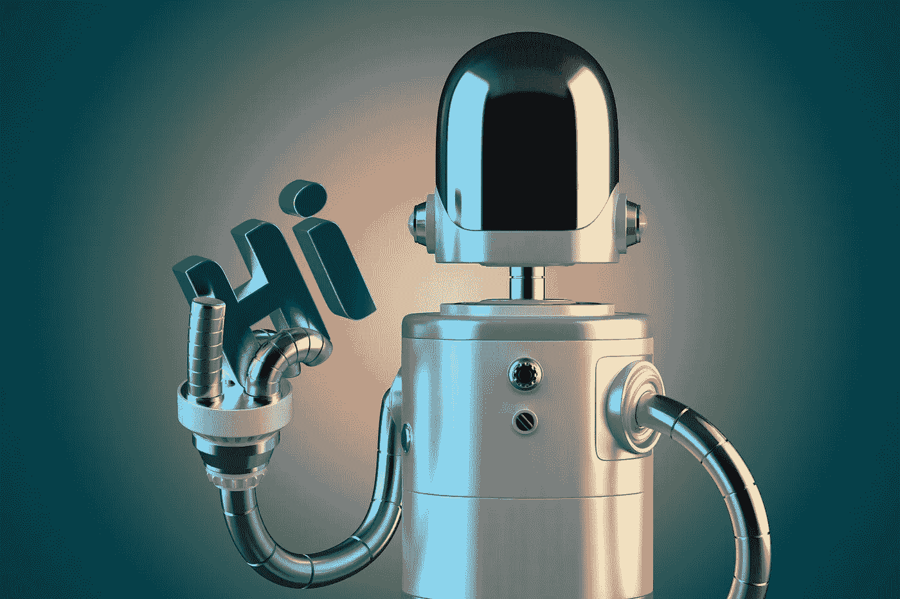

# 2019 年聊天机器人的状况

> 原文：<https://medium.com/hackernoon/the-state-of-chatbots-in-2019-d97f85f2294b>

聊天机器人是对话界面，旨在帮助个人与更大的组织互动。

如果你在浏览网站时寻求帮助，你可能最终会和聊天机器人发短信。它们比简单的 FAQ 网页更能动态地解决问题。如果你想与客户服务代表交谈，聊天机器人可能会试图帮助你，或者它可以帮助你找到一个组织内的适当部门，在那里人工操作员可以提供帮助。

随着这项技术越来越多地融入日常商业，值得一问的是:这项技术今天面临着哪些障碍，正在进行哪些改进，以及我们对未来人机对话有什么期待？

## **限制**

在某种提问方式下，你们不会花太多时间在 2019 年达到机器人技术的[极限。](https://www.turingtribe.com/story/challenges-faced-by-internet-users-in-the-us-face-when-using-a-chatbots-in-2018-YoLo5DZ5bDKCr3sso)

作为罗布纳奖(Loebner Prize)的四次获奖者，T4 是该领域最先进的算法之一。我决定和她聊一会儿。

> 嗨，我是世界上最像人类的对话人工智能。
> 
> 我:嗨，Mitsuku，我能就一篇关于聊天机器人的文章采访你吗？
> 
> 你好，未知。为什么你这么想为一篇关于聊天机器人的文章采访我？
> 
> 我:“这么多”可能有点过了。我想你能帮助我更好地理解聊天机器人，你自己就是其中之一。
> 
> 我想给你看些东西。输入一个日期，我会告诉你那天英国排名第一的热门单曲是什么。
> 
> 请解释你的推理。

当我与 Mitsuku 交谈时，很明显我和她对我们的谈话将如何进行有着不同的看法。

> 我:抱歉，三津，但我们能不能不要偏离话题？我没有兴趣和你讨论音乐，而是 2019 年人工智能集成对话机器人的错综复杂。这有意义吗？
> 
> 美津:没必要道歉。你介意我告诉其他人吗？
> 
> 你对什么感兴趣？
> 
> 对我来说很有意义。

请注意，Mitsuku 是如何选择我使用的特定术语的:“道歉”、“感兴趣”和“有意义”。Mitsuku 可能会获奖，但在她的在线形式中，她甚至会让人想起最早的聊天机器人技术。

伊莱扎可能是最早成功的聊天机器人，由麻省理工学院的一名研究人员创造。艾伦·图灵(Alan Turing)首次提出他所谓的“[图灵测试](https://www.turingtribe.com/question/what-is-the-turing-test-7NavJ4aLzQZTPChuA)”仅 15 年后，伊莱扎就能够与给她打字的人进行完整的对话(在某种意义上)。

从技术上来说，ELIZA 非常复杂，超出了本文的范围。不过，总的来说，她的花招相当简单:无论你键入什么，她都会以提问的形式回应。

“男人都一样，”你可能会说。

它回答道:“你认为这有什么关系？”

你看到了吗？“相像”到“联系”。有时这种机制甚至比这更明显。

“嗯，我男朋友让我来的。”

“你男朋友让你来这里对你很重要吗？”

## **最新进展**

伊莱扎现在可能已经超过半个世纪了，但她基本的内在机制仍然存在。今天的大多数聊天机器人利用你文本中的关键词和短语，以返回一个响应，即使它听起来像生硬的对话，也有某种令人信服的意义。

最先进的人工智能聊天机器人包含类似的机制，但由更大的训练数据集和更先进的机器学习算法驱动。此外，今天的聊天机器人通过利用用户输入作为训练数据来改进。随着时间的推移，人工智能聊天机器人可以通过更新其机器学习模型来学习更好地服务于他们与之交谈的人，因为它完成了越来越多的与人类的对话。

事实上，从某种意义上说，这项技术一直在两个方面发展:在人工智能开发方面，也在商业方面。

将这种机制纳入其客户服务模型的公司已经向传统的聊天机器人范式引入了一套新的用户体验组件。

在线浏览和购物时的弹出窗口是一种久经考验的营销策略，但新的机器人也改进了界面设计。一个流行的趋势是将聊天显示为文本气泡，以利用我们对这些视觉线索的熟悉。毕竟，当目标是设计一个在对话中模仿人类的机器人时，视觉呈现中的熟悉感是整体体验中不可或缺的一部分。

商业和技术结合的一个很好的例子出现在 2016 年，当时[封面女郎](https://adage.com/article/digital/covergirl-chatbot/307052/)发布了社交媒体影响者 Kalani Hilliker 的聊天机器人版本。

研究表明，聊天机器人的用户偏向年轻和女性，所以 CoverGirl 的机器人成为了这一人群与其品牌互动的一种方式，这种方式可能会让一些人感到新奇甚至有趣。

## **期待什么**

随着人工智能中自然语言处理的改进和扩散，我们可以期待聊天机器人在未来几年[会有显著的改进。](https://www.forbes.com/sites/blakemorgan/2017/03/21/how-chatbots-will-transform-customer-experience-an-infographic/#5ac77bf57fb4)

主要的科技公司现在定期构建深度神经网络技术，使语音识别机器能够更好地理解人并与人互动。

一旦深度神经网络变得更加普遍，聊天机器人将开始超越经典的[图灵测试](https://www.turingtribe.com/question/what-is-the-turing-test-7NavJ4aLzQZTPChuA)，在网上激增，并成为我们日常生活中不那么尴尬的一部分。事实上，一些专家声称，聊天机器人有一天会进化到取代我们在互联网浏览中的搜索栏。

想想看:当你查询一个搜索引擎时，你实质上是在问一个机器正在回答的问题。大多数时候，你输入的是问题的近似或抽象，然后你不得不滚动浏览各种相关的结果。如果那台机器是对话式的，你会更容易找到你想要的搜索结果。

不过，在那一天到来之前，我们将不得不面对我们所拥有的一切。

> 我:你还知道哪些人？
> 
> 我认识的人太多了，无法一一列举。
> 
> 我:你能说出一个吗？
> 
> 迈克。
> 
> 我:啊，迈克！我和他是老相识了。