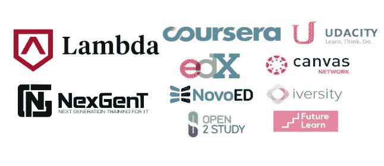
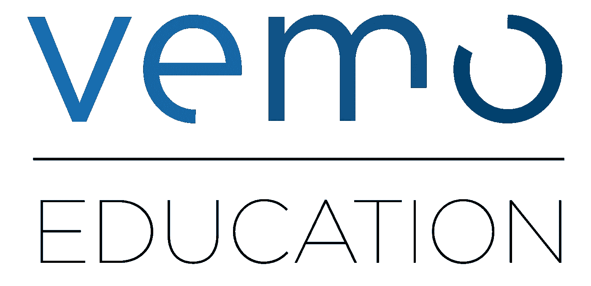
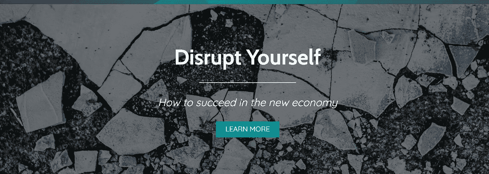

# 大学被打破:反思与预测

> 原文：<https://medium.com/hackernoon/the-state-of-college-today-reflections-and-predictions-468600ccbd96>

大学(如我们所知)是破碎的。

美国的高等教育体系正在从基础上重建，我们才刚刚开始看到这一戏剧性转变的影响。

*   学生和家长支付大学学费的方式正在改变
*   学生们**学习的方法和地点**正在发生变化(已经有一段时间了)
*   我们的**文化**正在改变，最终接受“传统的”四年制大学并不适合所有人

但是在我们谈论高等教育正在发生的所有变化之前，让我们来谈谈为什么大学，简单地说，在美国是破碎的。

# 大学坏了。

今天大学的很多破局方式是不可能错过的。我说的不仅仅是几周前爆出的高调贿赂丑闻。

虽然家长支付数十万到数百万美元通过“旁门左道”保证大学入学令人担忧，但与其他大学破产指标相比就相形见绌了。

## 1.学生贷款让数千万人陷入瘫痪

4420 万美国人目前背负着近 1.5 万亿美元的学生贷款债务(这是美国成年人口的 20%)。

更令人吃惊的是，这些贷款中有超过 11%是拖欠的(超过 90 天没有支付或违约)。

这个拖欠率是信用卡拖欠率的 5 倍！

学生贷款已经成为一种负担，以至于一些公司开始提供学生贷款偿还作为额外福利。

向大声疾呼，感谢他们帮助了许多已经负债的人，但是我们也需要从源头上解决问题！

来源:[美联储](https://www.federalreserve.gov/releases/g19/current/default.htm)，[彭博](https://www.bloomberg.com/news/articles/2018-12-17/u-s-student-loan-debt-sets-record-doubling-since-recession)

## 2.学费上涨是无情的

从 1988 年到 2008 年，学费平均每年上涨 3.5%。从 2008 年到 2018 年，学费继续以仍然令人窒息的每年 3%的速度增长。

1998 年，私立四年制大学的学费是美国男性平均收入的 77%。

到 2016 年，这一比例**上升至 116%** 。

在公立大学方面，增长更为显著。1998 年，这一成本平均占美国男性平均收入的 29%，到 2016 年将增长到 52%。

收入根本跟不上学费的增长。

来源:ProCon.org

 [## 十年来公布的费用平均增长率-高等教育趋势-大学…

### 在 2008-2009 年和 2018-2019 年之间，公立四年制大学公布的州内学杂费以每年 10%的速度增长

trends.collegeboard.org](https://trends.collegeboard.org/college-pricing/figures-tables/average-rates-growth-published-charges-decade) 

## 3.大学和学生之间的激励机制被扭曲了

学生们继续上大学，继续承担这些重要的贷款，因为他们相信他们正在做一个很好的投资。在他们的职业生涯中，大学毕业生比高中毕业生挣得多得多，对吗？正确，但是…

最根本的问题是，如果他们上的大学被证明是一项糟糕的投资，正如越来越多的私立四年制大学所做的那样，**只有学生支付这笔罚金**(他们支付一大笔，通常是终身的罚金)。

政府或学生贷款公司已经向学院支付了费用，他们在学生教育和职业安置方面的表现不佳根本不会受到处罚(除了一些非常有限的公共资助的大学处罚)。

政府也没有采取有意义的激励措施，在就业需求最大的领域提供教育。

对许多人来说，这些大学唯一真正的激励因素是一个太遥远的因素:继续招收愿意支付不断上涨的学费的新生的能力。

# 大学现在是如何变化的

## 你在哪里以及如何学习

*   MOOCs :大规模开放在线课程并不新鲜，但它们提供的课程深度仍在急剧增加。在 EdX、Coursera、Khan Academy 和 Udacity 之间，你几乎可以从任何地方免费学到任何东西。
*   **代码学校** (v2！):代码学校已经经历了一波演变，无效的项目和失败的学校，可持续融资和盈利的新模式正在出现，整合正在加速。
*   **技校**:技校过去指学习木工之类的手艺，或者当电工学徒。这个概念已经被像 [NextGenT](https://www.nexgent.com/) 这样的公司重新注入活力，这些公司在网络安全等高需求领域提供许多技术认证项目。

## 你如何付款

*   **ISAs** :收益分成协议。学生同意将他们未来收入的一定比例交给学校或贷款人，而不是预先支付学费。通常有一个收入“下限”,学生必须超过这个下限，收入份额才能在毕业后生效。通常还会有一个偿还“上限”(这样以前的学生就不会在毕业后立即获得一个高薪职位时支付一大笔钱)。像 [Vemo Education](https://vemo.com/) 这样的公司已经开始将这种支付模式引入大量的代码学校和传统的四年制大学。
*   **有偿学习:**几家公司将 ISA 的想法更进了一步。除了前期什么都不付，这些公司其实是在给你发工资让你学习。他们押注于软件开发和数据科学等高需求职业领域，并试图让顶尖候选人尽可能容易地进入他们的学校。几个“带薪学习”的公司有[拉姆达学校](https://lambdaschool.com/)、[现代劳工](http://modernlabor.com/)、 [CareerKarma](https://careerkarma.com/) 。

## 文化变化和压力

*   **减轻四年制大学的“压力”**:这需要很长时间，我们国家特别富裕的地区仍然相当抗拒，但代码学校和替代高等教育选择已经开始被接受，成为相当一部分高中毕业生的更好选择。

感谢您的阅读。如果你喜欢这篇文章，我想你会喜欢我的新书**。在有限的时间内，我提供一个免费的预发布章节。**

**现在就在这里认领你的: [**我要一个免费的扰乱自己的章节**](https://disruptyourself.co/free-chapter) **！****

****

# **预测:10 年后上大学…**

*   **中层民办高校**不复存在****
*   **代码学校将(继续)**大幅整合****
*   **所有剩下的大学都提供 ISAs，许多提供带薪学习选项**
*   **社区大学作为一种低成本的高等教育选择仍然存在，甚至可能在影响力和规模上有所增长**
*   **一小部分顶级代码学院获得了“常春藤联盟”的地位,并多样化地为开发人员、数据科学家、设计师、产品经理等提供强大的课程(本质上是科技公司的人才堆栈)**
*   **随着违约率飙升，学生贷款债务**价值暴跌****

# **预测:20 年后的大学…**

*   ****常春藤联盟和顶尖研究型大学**是仅存的“守旧派”**
*   **在美国，社区大学作为一种有保障的、健全的公立中等教育，在任何地方都是免费的(在许多州已经是这样了)**
*   **所有剩下的大学都提供 ISAs 和“有偿学习”选项**
*   **代码学校看起来像大学，大学看起来像代码学校，以至于很难区分**

# **大学正在改变，这是一件好事**

**大学今天断了。**

**但幸运的是，许多创业公司、公司和公众人物开始关注和建设下一代高等教育。**

**这将是破坏性的，这将是可怕的(有时)，但随着正确的思想集中在这个巨大的问题上，我们的国家将建立一个中等教育系统，它具有:**

*   **强大的免费选项(社区大学)**
*   **与高需求职业更加一致**
*   **学生和教育提供者之间真正的激励联盟**
*   **学生很少或没有债务(！)**

****你认为未来 10-20 年大学会有什么变化？**在推特或者评论里告诉我: [@amitch5903](http://www.twitter.com/amitch5903)**

# **亚历克斯·米切尔在媒体上提供更多信息**

** [## 为什么我相信牛眼

### 消除申请大学的恐惧、不确定性和疑虑。作者:亚历克斯·米切尔

medium.com](/@Amitch5903/why-i-believe-in-bullseye-2b6959c45ec9)  [## 我的千年 MBA:回顾

### 不是每个人都适合读 MBA。从一个刚毕业的学生的学位中学到你将会(和不会)得到什么。作者:亚历克斯…

medium.com](/startup-frontier/my-millennial-mba-a-retrospective-d4902116905f)  [## 两年后…“未来 10 年的 10 项大胆技术预测”

### 哪些预测趋势良好？哪个看起来不靠谱？作者:亚历克斯·米切尔

medium.com](/@Amitch5903/2-years-later-10-bold-technology-predictions-for-the-next-10-years-e413aefdfdd1)  [## 2019 年产品经理十大播客

### 通过这些伟大的播客在 2019 年取得飞跃！—作者:亚历克斯·米切尔

medium.com](/startup-frontier/top-10-podcasts-for-product-managers-in-2019-da8d4d3b22ea)  [## 不要定下决心。设置个人 okr。

### 如何设定 2019 年最佳个人 OKRs？作者:亚历克斯·米切尔

blog.usejournal.com](https://blog.usejournal.com/dont-set-resolutions-set-personal-okrs-a374d8754ce9)  [## 致千禧一代的(金融)公开信

### 一代金融家赢了，金融家输了。作者:亚历克斯·米切尔

medium.com](/@Amitch5903/an-open-financial-letter-to-millennials-d52f25fbff1d) 

📝稍后在[杂志](https://usejournal.com/?utm_source=medium.com&utm_medium=noteworthy_blog&utm_campaign=guest_post_read_later_text)上阅读这个故事。

🗞每周日早上醒来，你的收件箱里会有本周最值得关注的科技故事、观点和新闻:[获取值得关注的时事通讯>](https://usejournal.com/newsletter/?utm_source=medium.com&utm_medium=noteworthy_blog&utm_campaign=guest_post_text)**