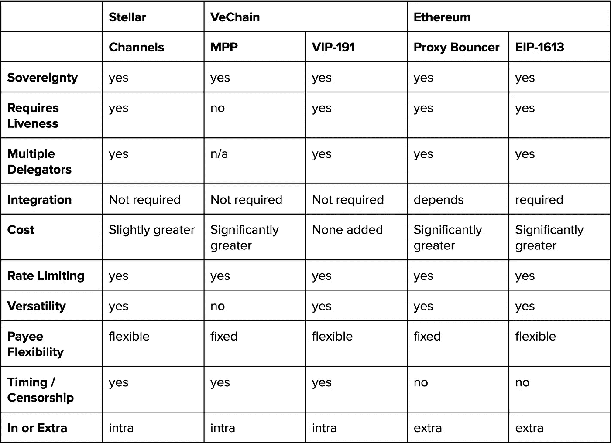

# 元事务的状态

> 原文：<https://medium.com/hackernoon/the-state-of-meta-transactions-d00735a4e3af>

[**Figure**](https://waterandpower.org/museum/Early_LA_Gas_Stations.html)**:** The feeling when the latest batch of gas is delivered

认领那只小猫需要几个步骤？来自 CryptoKitties 创造者的官方指南指导用户在购买 Ether 之前首先安装 Metamask，然后是许多额外的步骤。由此可见区块链 UX 有多可怕。没有底层协议令牌，用户是无助的。这使得很大一部分人无法接受区块链教。

有一个叫做“元交易”或“费用委托”的概念，允许第三方代表用户支付交易费用。今天，我们将调查以太坊、Stellar 和 VeChain 中支持这些交易的不同技术，并将它们与我们的评估框架进行比较。

# 元事务用例

元事务的一个常见用例是提高首次用户的可用性，但是他们有更多的应用。

1.  dApps 希望用户只使用他们的本地令牌(例如:付费)
2.  dApps 希望用户使用他们的本地令牌进行治理、投票等，而无需将用户绑定到底层链上(这使得链迁移更容易)
3.  为用户简化会计。即使对于最勇敢的会计师来说，计算多个账户中每一笔交易的资本利得也是痛苦的。
4.  简化密钥管理。为每台设备准备一个包含资金和子钱包的主钱包
5.  鼓励特定的行为。例句:鼓励用户增加而不是减少指数期货的流动性(当然，还有其他更有意义的方式，比如兑换回扣)
6.  如果账户不需要为交易提供资金，可能会增加隐私。dApp A 的用户也是 dApp B 的用户并不明显，因为他们通常不需要互相发送本地令牌。

# 以太坊

以太坊是区块链地区最大的开发者社区之一，它有一套支持元交易的多样化提议。请注意，其中一些仍然是建议，而其他的正在被广泛使用，到目前为止，对于什么是最好的方法还没有达成共识。(如果你觉得分类有任何问题，也请告诉我)

基于智能合同的委托人

*   [代理保镖](https://github.com/austintgriffith/bouncer-proxy)
*   [灵知保险箱](https://blog.gnosis.pm/announcing-the-gnosis-safe-beta-personal-edition-19a69a4453e8)
*   [状态识别气体继电器](https://github.com/status-im/contracts/blob/73-economic-abstraction/contracts/identity/IdentityGasRelay.sol)

新令牌标准

*   [ERC-1776](https://github.com/ethereum/EIPs/issues/1776) 本地元事务
*   [ERC-865](https://github.com/ethereum/EIPs/issues/865) 在一次交易中，用代币而不是汽油支付转账
*   [ERC-1003](https://github.com/ethereum/EIPs/issues/1003) 令牌标准(ERC20 扩展)
*   [ERC-1228](https://github.com/ethereum/EIPs/issues/1228) 委托执行

包装合同

*   [ERC-20 包装器](https://github.com/horizon-games/ERC20-meta-wrapper)

EVM 的变化

*   [EIP1035](https://github.com/ethereum/EIPs/issues/1035) 交易执行批处理和委托

继电器网络

*   [Uport TxRelay](https://github.com/uport-project/uport-identity/blob/develop/docs/reference/txRelay.md) (需要兼容的智能合约)
*   [阿拉贡的薪酬协议](https://github.com/aragonlabs/pay-protocol)
*   [EIP-1613](http://eips.ethereum.org/EIPS/eip-1613) [加油站网点](/tabookey/1-800-ethereum-gas-stations-network-for-toll-free-transactions-4bbfc03a0a56)

签名标准

*   [ERC-1077](https://github.com/ethereum/EIPs/blob/master/EIPS/eip-1077.md) 可执行签约短信退款合同

由于以太坊的提案太多，我们不会对每一个都进行详细介绍，而是将重点放在代理保镖和 EIP-1613 上。

**代理保镖**

中继器可以部署代理契约，并向其白名单中添加额外的地址，使它们能够通过该契约进行交易。这允许任何 dApp 用户与它选择的任何智能契约进行交互，因为事务是由代理契约转发的。该系统的局限性在于，msg.sender 是代理契约，而不是帐户，这在与特定类型的智能契约交互时可能是一个问题。

**EIP-1613**

因为元事务依赖于第三方来中继事务，所以早期的实现有一个单点故障，即唯一的中继器。已经有人尝试创建抗审查的分散中继网络。然而，如果没有协调层，可能会出现[雷鸣般的羊群问题](https://en.wikipedia.org/wiki/Thundering_herd_problem)，导致所有中继器试图中继相同的事务，只有一个成功，其余的浪费气体。

EIP-1613 使用一个称为 RelayHub 的信任锚，它充当中继的注册器(也称为加油站)。RelayHub 协调中继和 dApp 合同之间的事务。中继是有利害关系的，它们建立信誉分数，这将使用户能够选择中继，减少被审查的担心。

# 主要的

**频道**

[恒星通道](https://www.stellar.org/developers/guides/channels.html)最初是作为一种方法来[增加单个地址的交易吞吐量](https://www.lumenauts.com/blog/boosting-tps-with-stellar-channels)。这是因为 Stellar 事务必须按顺序排序和提交，并且不能保证 Horizon 服务器(节点软件)的正常性，这可能会导致严重的顺序错误。渠道是一种迂回的方式，通过使用不同的帐户发送交易，同时维护这些交易资金的相同“源”帐户来增加吞吐量。

创造性地，渠道的概念可以[重组为元交易](https://www.lumenauts.com/blog/better-stellar-fee-channels)。

1.  创建明星客户
2.  有最低余额的基金账户
3.  用户创建一个交易，将他们的发起人指定为“源”地址(即付款人)
4.  用户将未签名的交易转移给他们的赞助商
5.  赞助商签署交易
6.  用户签署并提交交易(注意，用户可以在将交易发送给发起人之前签署交易，但是他们必须相信发起人会及时提交交易)

请注意，Stellar 协议要求每个账户的最低账户余额为 0.5 XLM(T9)。因此，除非第三方支付费用(可能是用户试图与之交互的 dApp)，否则频道对于首次用户来说可能不是最佳的。然而，由于目前的成本相当低，这可能不是一个大问题(与 EOS 帐户创建成本相比)。但这仍然是一个必须注意的制约因素。

# 韦钱

**多方支付(MPP)**

协议应该在他们的文档中详细说明他们的命名系统的起源，为什么在命名、费用委托方面有如此多的差异，或者是元事务？

总之， [MPP](https://github.com/vechain/thor-wiki/blob/master/Prototype(EN).md) 是 VeChain 的原生费用委托形式。

1.  dApp 创建者部署合同，他们是账户的默认*主*。
2.  赞助商可以赞助智能合同并支付燃气费，如果没有赞助商，则合同支付交易费(如果切换)
3.  主人为他们的智能合同设置信用计划。 *Credit* 是每个用户的最大 VTHO 量 *recoveryRate* 是每个区块可以累积的 VTHO 量。该机制允许自动补足用户的气体限额，并作为减少滥用的机制。
4.  主用户添加或删除*用户*以使用他们的智能合同
5.  用户向 dApp 发送签名交易
6.  检查*用户*是否有足够的信用额度(每个用户都有自己的信用余额)
7.  交易被执行并且发起人或主账户的汽油余额被扣除

与我们研究的其他协议不同，MPP 完全存在于链上，不涉及链外联合签名过程。这是否被认为是一种可取的行为有待讨论。

(有趣的边注:VeChain 基金会目前正在赞助几款 dApps gas，以鼓励采用和使用。)

**注** : MPP 适用于整个合同。不可能只发起特定的函数调用。

**VIP191:指定天然气支付方**

为了增加 VeChain 的 MPP 协议的灵活性，已经批准了一个新的标准，正在等待实施。 [VeChain 改进提案 191](https://github.com/vechain/VIPs/blob/master/vips/VIP-191.md) 允许任何任意的“天然气支付者”代表发送者共同签署任何交易。

签名流程如下:

交易创建→燃气支付方签约→用户签约→提交。

因为用户是向区块链提交交易的人，所以他或她可以控制提交时间。

**VIP191 使能**:

1.  dApp 创建者和发起者只为特定的动作付费，而不是为与特定智能合约的所有交互付费。例如，在 DEX 的情况下，允许无费用限价单和付费市价单。这鼓励参与者增加流动性，而不是拿走流动性。
2.  赞助与不属于 dApp 开发人员的其他合同的互动。如果想使用 VET+契约(类似于 Ethereum 中的 WETH)，开发人员将不能赞助 MPP 中的包装，因为该契约属于其他人。
3.  收款人/委托人附加附加操作。收款人可以附加一个条款，说明他或她将接受另一个令牌的支付，用户可以签署并同意或放弃半签署的交易。这对于拥有自己内部令牌的 dApps 非常有用。

# 期望的特性/比较矩阵

仅仅因为有几十种不同的方法来构建元事务，并不意味着它们在特性集和功能上都是平等的。有必要了解权衡空间以及每个实现的相关用例。

*   **自我主权** —用户是自己密钥的保管人吗？(这个 a 是必须的)。
*   **活跃度** —除了底层区块链的维护者之外，用户是否需要其他人在线？(即:继电器网络或个人继电器)
*   **多个委托人** —可以有多个委托人/继电器吗？
*   **集成**—dapp 能在不改变其底层智能合约代码的情况下实现这些特性吗？
*   **成本** —此类交易的成本是多少，比非委托交易多多少
*   **费率限制** —对每个用户可以委托多少费用有限制吗？
*   **多功能性—** 这种实现是适用于许多用例还是仅适用于一个用例？
*   **收款人灵活性** —收款人可以是任何人，还是仅仅是合同的创建者等？
*   **时机/审查** —用户是否可以控制最终交易的时机？
*   **In 或 Extra Protocol** —这个特性是区块链固有的吗？

**Figure:** Comparison matrix

# 下一步是什么？

最终，元事务是改善用户与区块链交互体验的一个有趣策略。但也许这是错误的心态，也许区块链应该很难打交道。尽管如此，这就是现状，在构建元事务时，协议应该做出什么样的权衡？

# 进一步阅读和研究

从事元交易的组织

这份名单是从网上搜集来的，我们没有核实这些公司/项目的实际开发情况。

*   以太坊:[银色](/argenthq/the-private-key-to-mass-adoption-a7c7e4a9a268)，[通用登录](https://universallogin.io/)，[天之灵](https://tenzorum.org/)，[支持](/uport/making-uport-smart-contracts-smarter-part-3-fixing-user-experience-with-meta-transactions-105209ed43e0)，[元卡](https://meta-tx.github.io/)，[部分](/@portis/sponsor-your-users-gas-fees-with-portis-and-tabookey-s-gas-stations-network-7fd7c8406869)
*   ve chain:[togent Labs](https://www.totientlabs.com/)([comet verse](/@cometpowered/evolving-the-dapp-user-experience-with-meta-transactions-23619db42565)

**关于自由交易的说明**

还有其他协议声称有“免费”的交易，但是，除非你得到其他人的补贴，否则总会有费用。(而自由交易在实践中与元交易略有不同)。

*   IOTA 有免费的事务，但是用户必须挖掘另外两个事务才能发送他们自己的事务。
*   EOS 的交易是免费的，但是用户必须创建一个账户，并在 EOS 上注册才能使用该协议，但是这个过程相当昂贵。
*   Nano 有免费的交易，但是当有 p2p 交易时，用户必须执行计算。
*   NEO 只对 NEO 传输提供免费交易(每块最多 21 次)。

**崭露头角**

ICON 和协议附近的[都在为它们各自的协议创建它们自己版本的元事务。迫不及待地想看看他们最终会采用什么样的实现，以及他们在取舍方面的比较。](https://github.com/nearprotocol/nearcore/issues/687)

*感谢 Kevin Britz (Totient Labs)和 Illia Polosukhin (Near Protocol)对跨不同实现和协议的元事务的见解。*