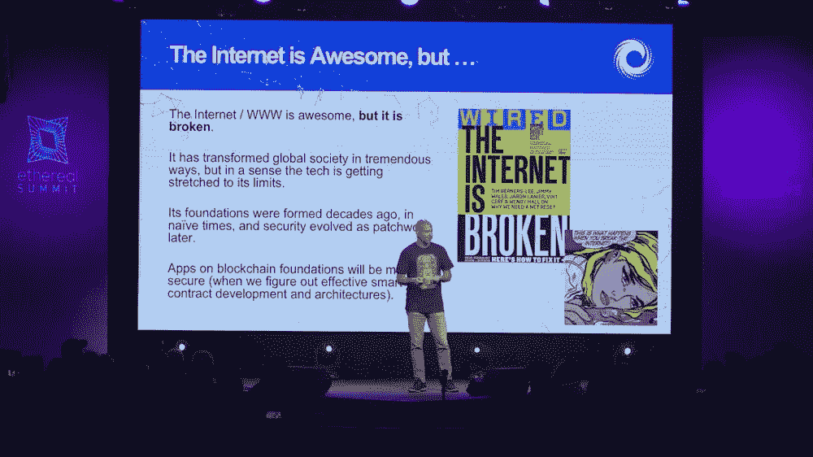
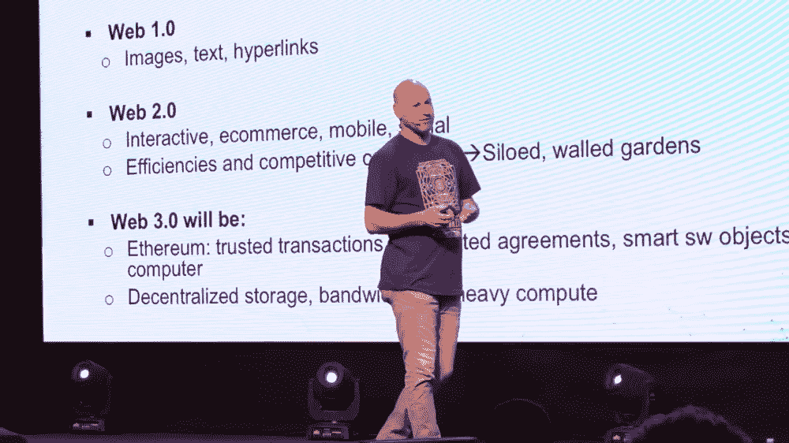

# 2019 年的技术状况

> 原文：<https://medium.com/hackernoon/the-state-of-tech-in-2019-23d3c8b7c5aa>

## 六大趋势值得关注，从人工智能和移动到数字外交和区块链。

到目前为止，1 月份已经有许多关于技术和 2019 年预期的文章和分析。

例如，我惊喜地看到数字外交是微软总裁兼首席法律官 Brad Smith 在最近的一篇文章中提到的 2019 年 十大技术问题之一。事实上，数字外交一直是这家总部位于西雅图的公司的一个主要关注点——不是作为一种与受众沟通的方式，而是作为一种良好的技术工具，处于外交政策、技术和网络安全的交汇点。

“科技行业继续优先考虑网络安全创新和投资，”史密斯在与微软通信总监卡罗尔·安·布朗(Carol Ann Browne)合著的 LinkedIn 文章中写道。“今年最大的一步出现在 11 月，”他们说。由法国总统埃马纽埃尔·马克龙领导的“网络空间信任与安全巴黎呼吁”发起了一项重要的呼吁，旨在阻止不分青红皂白的网络攻击，保护选举进程。它基于多利益相关方的行动，获得了来自 50 多个政府、大约 400 家公司和民间社会团体的 450 多个签名。”

> 新的一年带来了一个新的机会让大家聚在一起。

# 1.数字外交

这就是为什么我认为数字外交将成为 2019 年科技界讨论的一个重要话题。

大多数人认为数字外交是公共外交的一个分支——社交媒体是这个等式中最明显的部分。然而，数字外交已经超越了社交媒体。有人称之为“技术外交”其他一些人称之为“网络外交”。

我从演员的角度来看。在过去几年中，微软、脸书和谷歌等科技公司已经成为重要的外交政策参与者。

2017 年启动的全球互联网反恐论坛(GIFCT)旨在在线解决极端主义和恐怖主义问题，并与政府和民间社会团体合作，这是向前迈出的关键一步——包括大型科技公司在联合国和七国集团的存在。

另一个重要步骤是去年在巴黎[爱丽舍宫](https://medium.com/u/b914d7d49bb1?source=post_page-----23d3c8b7c5aa--------------------------------)举行的 [*科技为善峰会*](https://www.gouvernement.fr/en/tech-for-good-summit-digital-stakeholders-make-concrete-commitments-for-the-common-good) ，60 多位科技领袖和首席执行官齐聚一堂，讨论科技如何为公共利益做出贡献，以及如何围绕教育、劳动力和多样性这三个主题利用科技。卢旺达总统保罗·卡加梅也在宾客之列，还有联合国教科文组织主任奥黛丽·阿祖莱、 [Mozilla](https://medium.com/u/95f4ec6ae6f6?source=post_page-----23d3c8b7c5aa--------------------------------) 基金会主席米切尔·贝克、[维基媒体](https://medium.com/u/97e02fd1c4ec?source=post_page-----23d3c8b7c5aa--------------------------------)基金会创始人吉米·多纳尔·威尔士。出席的还有[优步](https://medium.com/u/b97b1b381b5a?source=post_page-----23d3c8b7c5aa--------------------------------)首席执行官[达拉·科斯罗萨西](https://medium.com/u/8e77815ae44c?source=post_page-----23d3c8b7c5aa--------------------------------)，IBM 首席执行官吉妮·罗梅蒂，脸书创始人兼首席执行官马克·扎克伯格，[微软的塞特亚·纳德拉](https://medium.com/u/d989edf5a0ea?source=post_page-----23d3c8b7c5aa--------------------------------)，Salesforce 的亚历山大·戴恩，[Slack 的斯图尔特·巴特菲尔德](https://medium.com/u/bcb754b867d4?source=post_page-----23d3c8b7c5aa--------------------------------)，以及[Stripe](https://medium.com/u/8d059e64bae9?source=post_page-----23d3c8b7c5aa--------------------------------)[的联合创始人兼首席执行官约翰·科利森](https://medium.com/u/3ecae35d6d66?source=post_page-----23d3c8b7c5aa--------------------------------)。

在政府方面，丹麦的“科技外交”(techplomacy)平台是外交和科技互动的又一大进步。继 2017 年任命 Casper Klynge 为硅谷和全球科技行业的首位技术大使后，丹麦政府现已推出新的[外交和安全政策战略 2019-2020](http://um.dk/en/news/newsdisplaypage/?newsid=01fc577b-6bf2-4fd7-8572-5af0534cf599)。

# 2.人工智能与人工智能中的伦理

人工智能和机器学习代表了技术领域最令人兴奋的趋势之一:虚拟助手、自动驾驶汽车、自学习算法。这些是许多科技公司和初创公司在推动创新方面面临的挑战。但人工智能批评者的数量正在成倍增加，因为这些技术也有黑暗的一面。

2018 年是人工智能的关键一年，因为人们对人工智能对社会和人类活动的影响的担忧越来越多，甚至在大型科技公司内部也是如此。信任也是一个大问题，因为一些人认为，最近对人工智能的热潮可能表明，我们正在把理性的钥匙交给机器。

然而，像谷歌、微软和亚马逊这样的公司现在正在探索将人工智能用于社会公益和人道主义项目和援助的方法。

谷歌是最新一个进入这个被一些人称为永久人工智能的领域的公司。该公司于 11 月宣布了其*人工智能影响挑战*，将于 2019 年在全球范围内向寻求使用人工智能加快和发展努力的人道主义和环境项目拨款约 2500 万美元。

路透社指出，“专注于人道主义项目可以帮助谷歌招募人员，并通过展示其对机器学习的兴趣超出其核心业务和其他利润丰厚的领域，如军事工作，来安抚批评者。”

今年早些时候，在遭到员工的严厉和公开反对后，谷歌宣布不会续签一项在基于人工智能的程序中分析美国军用无人机镜头的协议。

谷歌人工智能首席运营官伊琳娜·考夫曼告诉路透社，新的人工智能公益项目不是对今年早些时候发生的事情的反应，而是指出，成千上万的员工渴望为“社会公益”项目工作，尽管这些项目通常不会直接产生收入。

另一方面，微软只是默默地宣布，它将向美国军方和情报机构出售他们需要的任何先进技术，“以建立强大的防御”，包括其机器学习和人工智能工具。

微软总裁布拉德·史密斯在博客中写道:“我们希望这个国家的人民，尤其是为这个国家服务的人们知道，我们微软是他们的后盾。”。“他们将获得我们创造的最佳技术。与此同时，我们意识到技术正在创造新的伦理和政策问题，这个国家需要以深思熟虑和明智的方式来解决这些问题。这就是为什么我们作为一家公司参与这些问题的公共对话非常重要。”

面对越来越多的批评，微软最近推出了一系列新的人工智能项目，总额为 1.15 亿美元，包括让人工智能为我们星球的未来服务的新项目 *AI for Earth* ，以及新的 4000 万美元的五年期项目 *AI for Humanitarian Action* ，该项目利用人工智能的力量专注于四个优先事项——帮助世界从灾难中恢复，解决儿童的需求，保护难民和流离失所者，以及促进对人权的尊重。

# 3.区块链

互联网“在很多方面都很壮观”， [Joseph Lubin](https://medium.com/u/6a370863659c?source=post_page-----23d3c8b7c5aa--------------------------------) ，创业公司 [ConsenSys](https://medium.com/u/6c7078bf7b01?source=post_page-----23d3c8b7c5aa--------------------------------) 的创始人和[以太坊](https://medium.com/u/d626b3859bc9?source=post_page-----23d3c8b7c5aa--------------------------------)的联合创始人，在五月份的 Ethereal 峰会上发表主题演讲时说[。“它改变了全球社会，但它已经崩溃了。”](https://hackernoon.com/the-internet-is-broken-blockchain-can-fix-it-8142f8277c50)

在他的主题演讲中，Lubin 指出了互联网和万维网背后的技术是如何“达到极限”的，安全是主要问题之一。

“它的(互联网)基础形成于几十年前，在天真的时代，”Lubin 在他的一张幻灯片中强调。"安全性后来演变成一种拼凑."

> 区块链将是 IT 安全领域的一场革命，因为针对基础设施的每一笔交易都经过了强有力的加密认证和精确授权。

Joseph Lubin on stage at ConsenSys’ Ethereal Summit 2018.

“你有一种普遍去中介化的力量”,使内容创建者、资源提供者、服务提供者能够直接接触消费者，而很少或没有中介提取价值，没有增加任何相称的价值。

ConsenSys 已经在探索这些方法，比如针对音乐的 [Ujo](https://medium.com/u/1c6cd0b77cb7?source=post_page-----23d3c8b7c5aa--------------------------------) 、针对新闻的[Civil:Self-sustain Journalism](https://medium.com/u/af0892caae93?source=post_page-----23d3c8b7c5aa--------------------------------)以及针对多种形式的合作、粉丝众包和粉丝策划的故事的 Cellarius。而且在服务和资源领域，将他们与消费者直接联系起来，像[假人项目](https://medium.com/u/8b0d088e8160?source=post_page-----23d3c8b7c5aa--------------------------------)、 [SONM](https://medium.com/u/e3aa487333b3?source=post_page-----23d3c8b7c5aa--------------------------------) 、[考利团队](https://medium.com/u/f32dd25840e?source=post_page-----23d3c8b7c5aa--------------------------------)、 [Swarm](https://medium.com/u/1c28b7c1f579?source=post_page-----23d3c8b7c5aa--------------------------------) 、 [Storj Labs](https://medium.com/u/31bb19d6e641?source=post_page-----23d3c8b7c5aa--------------------------------) 、[盘古](https://medium.com/u/7d9a5f7f05c0?source=post_page-----23d3c8b7c5aa--------------------------------)等许多其他项目。最近，就连云也成为了区块链发展的一部分，从万花筒和亚马逊网络服务(AWS)的合作到 W3BCLOUD 的推出，w3b cloud 是一个总部位于区块链的云计算基础设施，是与半导体制造商 AMD 合作开发的。

这构成了 ConsenSys 及其项目网的 Web 3.0，具有可信交易、自动化协议和以太坊上的智能软件对象、单一世界计算机、单一执行空间；以及其他协议，如分散存储、分散带宽和繁重计算。

> 所有这些都将使我们作为人和公司能够更加流畅地进行互操作。

在某种程度上，Web 3.0 将互联网作为一种去中心化的架构带回了起点。

“但是效率和对财富的追求导致了封闭的围墙花园，”Lubin 在幻灯片中强调。"这是由于缺乏共享开放平台所有权的机制."

> Web 3.0 是我们刚刚处于的风口浪尖。Web 4.0 将会非常有趣。

Lubin 提到 Web 4.0 是“我们刚刚开始考虑的东西”在这个系统中，人工智能代理通过区块链和令牌被赋予价值。“机器经济的互联网将会非常有趣，肯定会在你附近的区块链出现，”他说。

> 从本质上讲，在 1-2-3 年内，我认为人们会觉得区块链无处不在。现在还不是真的。

# 4.微型移动和电动滑板车

就连美国在线的联合创始人、现任[革命团队](https://medium.com/u/4f174bfa3e5c?source=post_page-----23d3c8b7c5aa--------------------------------)董事长&首席执行官[史蒂夫·凯斯](https://medium.com/u/d966b91de7c0?source=post_page-----23d3c8b7c5aa--------------------------------)也在他的 2018 年 n [媒体](https://medium.com/u/504c7870fdb6?source=post_page-----23d3c8b7c5aa--------------------------------)报道中提到了电动滑板车，他将其命名为 [*我们可以从 2018 年*](https://blog.revolution.com/what-we-can-learn-from-the-biggest-tech-policy-mistakes-of-2018-364d0984fc7a) *最大的技术政策错误中学到什么。*

“滑板车今年风靡一时，出现在全国各地的城市和人行道上，”他写道。“在没有协调或通知城市官员的情况下，一些人感到措手不及，并通过扣押踏板车做出反应。随着公共和私营实体寻找创新解决方案来应对交通、污染、步行能力等挑战，围绕交通和智能城市的问题将继续变得重要。”

这似乎是一个非常两极分化的行业…要么你喜欢滑板车，要么你讨厌它们。

“我们在美国有这种根深蒂固的汽车文化，我们必须以多种方式挑战它的核心，”Lyft 自行车、滑板车和行人政策对快速公司说。

Lyft 是众多探索电动滑板车业务的公司之一，包括[优步](https://medium.com/u/b97b1b381b5a?source=post_page-----23d3c8b7c5aa--------------------------------)；Lime，原名[lime bike](https://medium.com/u/881e39a1e63a?source=post_page-----23d3c8b7c5aa--------------------------------)；鸟； [Spin](https://medium.com/u/fa970d2a0255?source=post_page-----23d3c8b7c5aa--------------------------------) ，最近被[福特汽车公司](https://medium.com/u/db92c082f24a?source=post_page-----23d3c8b7c5aa--------------------------------)收购；跳过；以及美国以外的许多其他公司，如荷兰的 dott，由 Ofo 前欧洲、中东和非洲负责人 Maxim ROMAIN 共同创立；墨西哥城的 Grin 柏林的 Tier 和圣保罗的黄色。

所有人都在投资微移动的未来——或者，正如多特的风险投资合伙人[EQT Ventures](https://medium.com/u/3c4a23f41b93?source=post_page-----23d3c8b7c5aa--------------------------------)的 Lars Jr now 所说的那样:短程城市交通即服务*(shuta as)。*

*这是该领域的公司可以成为重要的技术换好玩家的另一个领域。例如，创业公司和城市应该与城市规划和绿化领域的智库合作。像 [C40 城市](https://medium.com/u/8d25db73f468?source=post_page-----23d3c8b7c5aa--------------------------------)、[气候市长](https://medium.com/u/583fa7fb0a4b?source=post_page-----23d3c8b7c5aa--------------------------------)和[气候市长全球契约&能源](https://medium.com/u/2037197e454d?source=post_page-----23d3c8b7c5aa--------------------------------)这样的组织都非常愿意与城市和公司合作，动员和支持雄心勃勃的、可衡量的、有计划的气候和能源行动。对我们所有人来说，更好、更环保的移动战略是一个好主意！*

# *5.自动驾驶汽车和自动驾驶汽车*

*在最近的一篇关于 Medium 的博客文章中，rideOS 的首席执行官兼联合创始人 Justin Ho 提到了 2019 年值得关注的[五大趋势，包括完全自动驾驶的打车服务，以及自动驾驶公司的整合。](/rideos/5-things-to-watch-for-in-2019-3bbc551327a2)*

*何还预测，“在世界其他地区继续努力应对监管障碍的同时，中国各地将出现数百辆、数千辆全自动驾驶汽车。”*

*“由于不利的政策和过时的基础设施造成的更高的技术壁垒，美国的自动驾驶技术将更难规模化，”他解释道。“为了最大限度地减少损失，世界各地的其他政府需要更快地采取像中国这样的政策，围绕自动驾驶汽车的法规和基础设施的发展。”*

# *6.选举、假新闻和科技*

*在技术和社交媒体在 2016 年美国总统选举和 2018 年美国中期选举中的作用受到大量关注后，今年的焦点是欧洲、印度和加拿大的关键选举。*

******

*这场辩论不仅包括透明度和数据隐私，还包括脸书、谷歌和 Twitter 等社交媒体公司将如何反击错误信息——或大多数人提到的假新闻。*

*2019 年，在选举、技术和假新闻的交汇点上会发生很多事情。不用多说…*