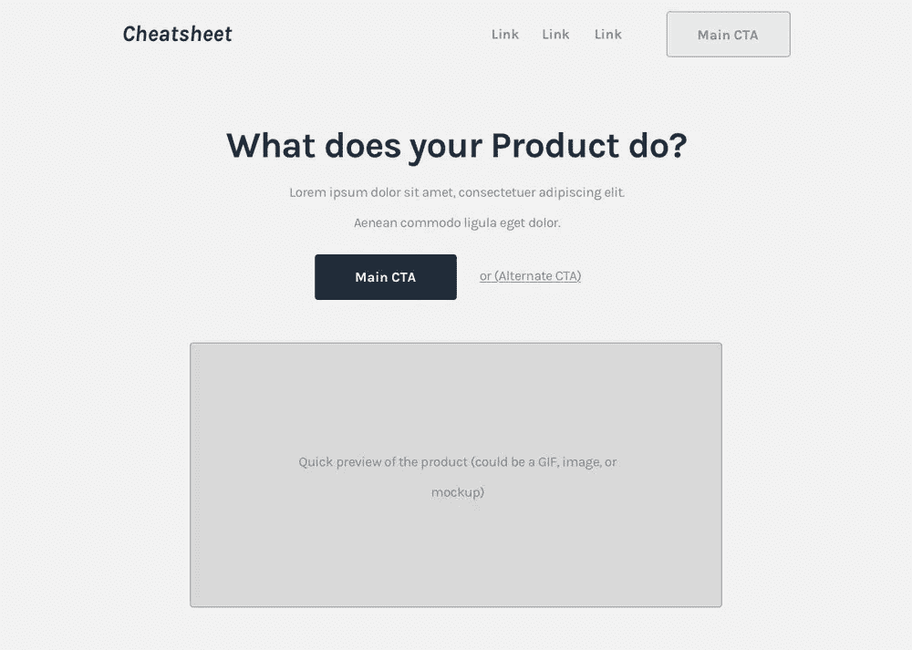
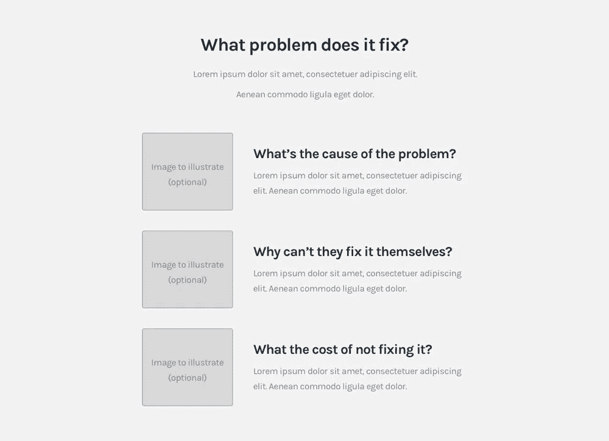
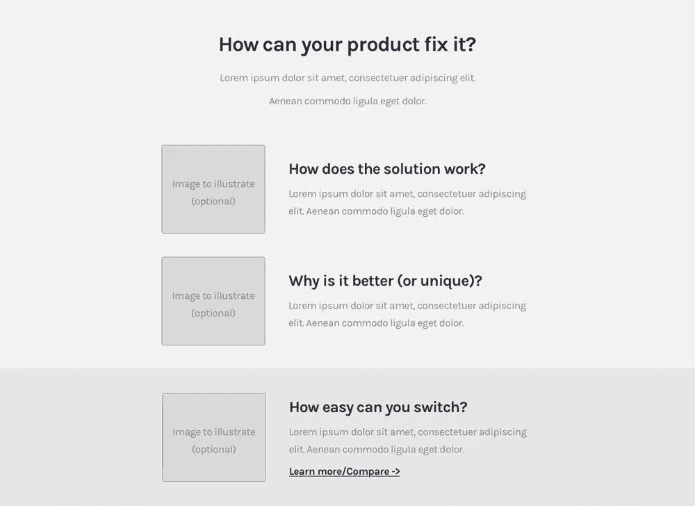
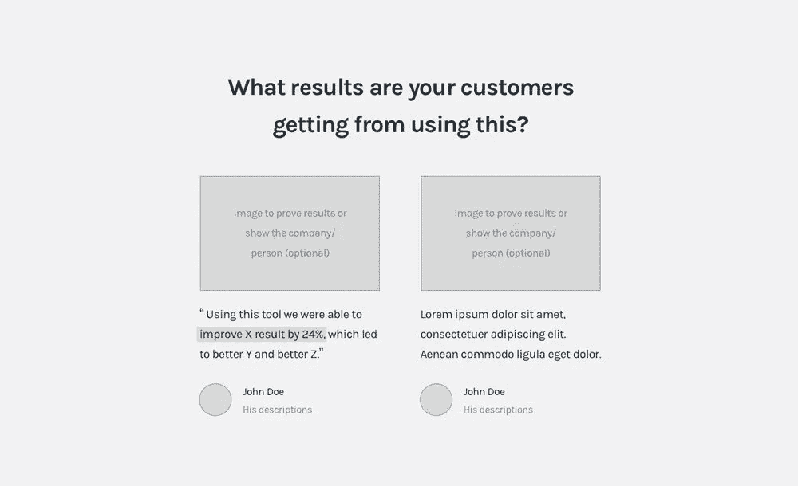
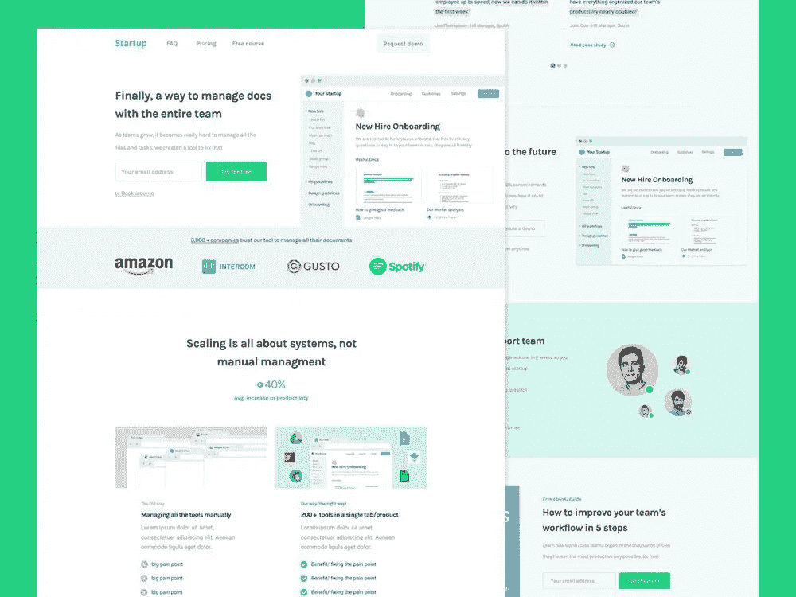
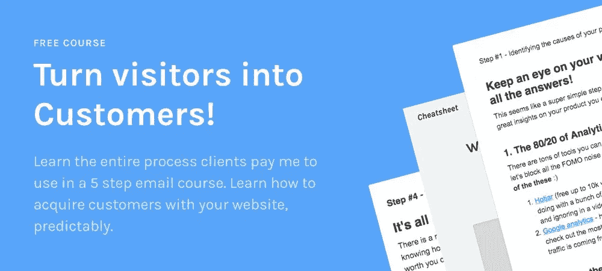

# 循序渐进的 SaaS 登陆页面公式[2019 版]

> 原文：<https://medium.com/hackernoon/the-step-by-step-saas-landing-page-formula-2019-edition-2170c81664d6>

You can also check the [cheatsheet here](http://www.cortes.design/cheatsheet) (with the full image)

在这篇文章中，我会给你一个循序渐进的公式为“完美” [SaaS](https://hackernoon.com/tagged/saas) [登陆页面](https://hackernoon.com/tagged/landing-page) …

你知道吗？**我要做出一个大胆的声明。**

如果你遵循这篇文章，你将能够想出一个伟大的 SaaS 登陆页面，应该相当好地转换出大门！(与[我的书](http://www.cortes.design/book)的声明相同)

没有营销技巧，没有设计技巧……就算你过去奋斗过！

**这怎么可能？**

你看，人们在设计这些页面时通常会不知所措，最终没有关注那些重要的东西……人们购买的原因。

**如果你不使用它们，你将无法转换(完全不能！)**，不管你的页面有多好看…

你没有犯错的余地。这个公式只关注简单的原则(正如你将在下面看到的)，所以你只关注产生结果的东西。

我花了几年时间来完善它，但是现在，一旦你使用它，你就可以马上得到结果(客户付给我$美元来使用它)。

获取文章中的公式(或获取。pdf 版本+免费讲解全流程的免费课程[此处](http://www.cortes.design/email-course))。

> ***免费课程:*** [*我的创建 SaaS 登陆页面的完整 5 步流程+ the。公式的 pdf 版本。*](http://www.cortes.design/email-course)

 [## SaaS 公司将访客转化为客户的 5 步流程-免费电子邮件课程

### 在这个 5 步免费电子邮件课程中，我将教你从概念/问题到转换驱动着陆的整个过程…

www.cortes.design](http://www.cortes.design/email-course) 

# 但首先，一些原则…

听着，我不会和你谈论按钮的颜色，文字上的细微变化和一些“神奇的”分割测试秘密…

那些根本不起作用！

就像你在我的[博客](http://www.cortes.design/blog)(或[书](http://www.cortes.design/book))上读到的任何东西一样，这将是高度可操作的和普遍的，所以你可以在读完之后马上使用它！

我的内容是基于从有史以来(甚至在互联网存在之前)最优秀的营销人员和文案人员那里学到的营销和心理学原理！

我只是把这些原则运用到 SaaS 公司(我的专长)中，到目前为止取得了巨大的成功！

总之……你在这里看到的公式是著名的 [PAS 公式](https://www.copyblogger.com/problem-agitate-solve/)(问题——鼓动——解决)的变体，由营销传奇人物丹·肯尼迪推广！

获得以下完整公式的概述(我的 SaaS 版本)👇

# 崩溃:“完美”的 SaaS 登陆页面

遵循图片和下面完整解释中的提示，尽可能获得最佳结果。

# 页眉

Header — [check the full image/cheatsheet here](http://www.cortes.design/cheatsheet)

也就是页面的顶部。简单地想出一个好的标题，一个简短的描述和一个清晰的 CTA 来介绍产品的功能。为此，请使用图像中的提示。

这一部分的全部目的是创造好奇心，这样人们就可以继续滚动，当他们滚动时，你就有更多的时间来解释你的产品。

如果你没有得到它的权利，你可能会失去高达 90%的流量在这里！

# 最初的社会证明

Initial Social proof — [check the full image/cheatsheet here](http://www.cortes.design/cheatsheet)

在下一节之前，简单地在你的产品中添加一些知名的标识来建立权威。

**提示:**只在你的利基市场使用众所周知的标志，否则看起来你似乎在努力使你的公司显得重要，或者你在一个不同的利基市场运作，而不是你实际上做的…否则，你的潜在客户将无法与这个社会证明联系起来！

或者，您可以使用一些关于您产品的统计数据，只要这些数据足够高并且与产品相关。

TransferWise using stats for social proof

这里有一个例子说明[如何利用数据证明他们是一家已经处理了大量转会的合法公司。他们以前有“我们每月转账 20 亿英镑”(或类似的数字)，这是我在这里提出的观点的一个更好的例子。](http://transferwise.com/)

# 问题简介

Problem intro — [check the full image/cheatsheet here](http://www.cortes.design/cheatsheet)

这是很难看到 SaaS 公司做对的事情…这可能是你页面上最重要的部分！

**为什么这很重要？**

让我们面对现实吧…人们购买 SaaS 产品是因为他们想解决自己的问题，所以先解释问题可以避免两大问题:

**1)不知道你的产品解决了哪个问题** - >他们会认为你的产品没有用，或者对此感到困惑。

**2)认为这不能解决他们的问题(或“大问题”)** - >如果他们认为这不能解决他们的问题或一个足够大的问题，那么他们就没有理由转变观念…

**建议:**确保你做了调查，找到人们想要解决的潜在问题，否则，他们可能不会重视这个问题，或者你可能会完全抛出错误的问题(这甚至更糟)。

# 工作原理/解决方案

How it works/Solution — [check the full image/cheatsheet here](http://www.cortes.design/cheatsheet)

在这里，您可以解释解决方案，并就该产品如何解决上述问题补充 3-5 点。

只需回复图片中的问题，就能明白这里需要做什么。

# 强化利益

Benefits — [check the full image/cheatsheet here](http://www.cortes.design/cheatsheet)

解释完该解决方案后，您可以强调其优势，比如说它使用起来有多快，它已经与他们使用的工具集成在一起，或者您拥有令人惊叹的支持(仅举几个例子)。

这是一个回答以下问题的好地方:为什么你的产品与众不同/更好？

在这个例子中，我用了“你切换起来有多容易？”也就是说，客户从他们正在使用的方法(竞争对手或正常流程)转换到使用你的产品有多容易？

# 更多的社会证明

More Social proof — [check the full image/cheatsheet here](http://www.cortes.design/cheatsheet)

只需添加证明，让你的潜在客户觉得其他人已经取得了良好的效果。

理想情况下，专注于结果驱动的评价，如“我们能够降低 24%的成本”，而不是“这是一个很棒的工具，我强烈推荐它！”(后者没有价值)。

这里的关键是提供人们可以联系到的证明，**例子与他们的情况越相似越好！**

# 最终 CTA

Final CTA — [check the full image/cheatsheet here](http://www.cortes.design/cheatsheet)

有一个清晰的 CTA，这样人们就有机会在离开前转换，你不希望他们在完成上述令人敬畏的推介后没有一个简单的转换方法就离开；)

一定要让承诺看起来低一些，比如:“前 14 天我们请客！”如果你使用免费试用作为你的主要 CTA。

# 替代 CTA

Alternate CTA — [check the full image/cheatsheet here](http://www.cortes.design/cheatsheet)

即使人们现在还没有做好转换的准备，也要想办法获取他们的联系信息。

替代 CTA 的示例:

*   民众
*   常见问题解答
*   铅磁体
*   聊天工具
*   退出弹出窗口
*   (以及更多)

所有这些都可能很棒，你只需要找到一个适合你的产品或你的目标市场期望的。

演示、聊天工具、常见问题解答、销售线索和退出弹出窗口都非常适合。

# 使用此公式的 SaaS 登录页面示例

使用相同的公式检查此页面的[分解](http://www.cortes.design/post/breaking-down)

这个公式可能看起来很难想象它完成后的样子，所以这里有一个例子，另一篇文章使用相同的公式分解了 SaaS 的登录页面:

> ***相关文章:*** [*分解转化驱动 SaaS 登陆页面*](http://www.cortes.design/post/breaking-down)

 [## 打破旨在获取更多线索的 SaaS 登录页面

### 在这篇文章中，我将向你展示我是如何设计一个概念页面来捕捉线索的，在这种情况下，它是…

www.cortes.design](http://www.cortes.design/post/breaking-down) 

# 常见问题/误解…

**“我为什么要使用公式？”这是获得尽可能多的可预测结果的唯一方法。除非你的过程被完全定义，否则你最终会关注错误的东西，得到低劣的结果，浪费大量的时间(这就是公司如何花几个月来重新设计他们的页面)…如果你想了解我的整个过程(这个公式之前和之后)[在这里获得我的免费电子邮件课程](http://www.cortes.design/email-course)。**

**“它也适用于我的公司吗？”**是的，它适用于所有公司。如果你注意到，这个公式只包括问题和解决方案…据我所知，没有一家公司(仍在运营)不提供问题的解决方案:P

**“这不是‘完美’的 SaaS 登陆页面！”有可能……这取决于你在沟通这些问题和解决方案方面有多擅长，以及你如何充分利用这个公式。是的，你可以调整这个来适应这个项目(我一直都这么做)，但是如果你没有经验，我不会建议你这么做！**

**“那图像呢？”**只需创建或找到说明文案内容的图像，这样图像就可以支持该信息。就我个人而言，我可以设计我自己的图像，所以这对我或者任何一个优秀的设计师来说都不是问题。您也可以选择只保留文本，这肯定不理想，但仍然可以很好地工作。

**“文案呢？”**一旦很好地定义了结构(就像在这个公式中一样),你只需要围绕所涵盖的内容写简单/简短/直接的标题，并用对标题内容的进一步解释来替换“lorem ipsum”。

# 【警告】这只是 20%的魔力！

[Get the free course here](http://www.cortes.design/email-course)

**这个公式不是设计转换驱动的 SaaS 登陆页面或整个漏斗过程**的第一步，也不是最后一步。

这是一个 5 步的过程…在我考虑页面的结构之前还有几个步骤！

**您将获得的结果取决于内容和使用公式之前所做的研究**，这就是成功的登录页面与根本无法转换的页面的区别！

放心吧！我也可以教你(而且是免费的)…从下面的链接中获取👇

[**获得我的 100%免费电子邮件课程的全部过程。**](http://www.cortes.design/email-course)

# 想改善你的 SaaS 网站/漏斗吗？

嘿，我是佩德罗！我帮助 SaaS 公司通过更好的信息传递将访客转化为客户。

**这涉及到:**

*   找出阻碍你获得大量客户的网站问题。
*   寻找可以让你获得更多客户的增长机会。
*   以客户能够很好理解并产生共鸣的方式解释产品(问题+好处)(这是他们转化的方式)。
*   重新设计整个网站或个人网页，以增加转化率和/或降低客户获取成本。

这是一个难题…我一年只和几个客户合作。

**想看看自己有没有资格？**只需在此安排一次[免费策略会议，看看是否合适。](http://www.cortes.design/consultation)

*最初发表于*[*www . cortes . design*](https://www.cortes.design/post/saas-landing-page-formula-examples)*。*