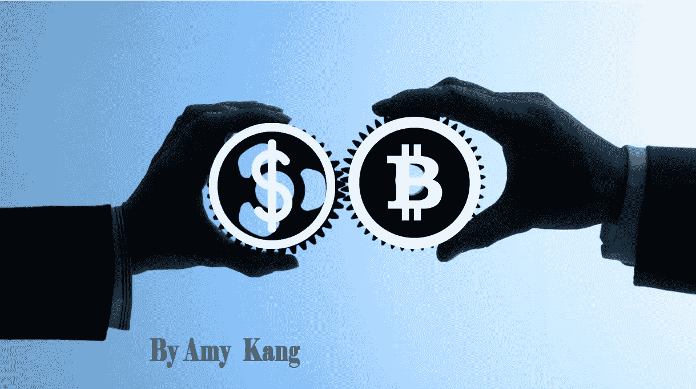
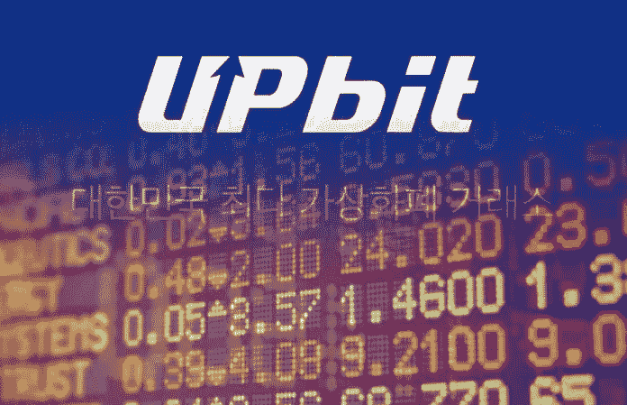
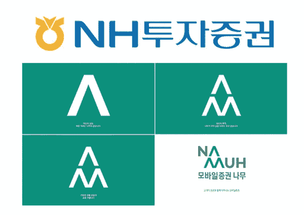
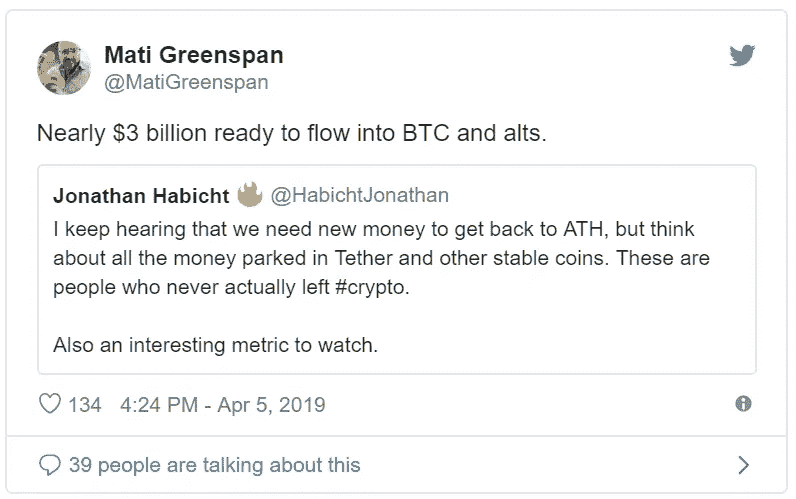
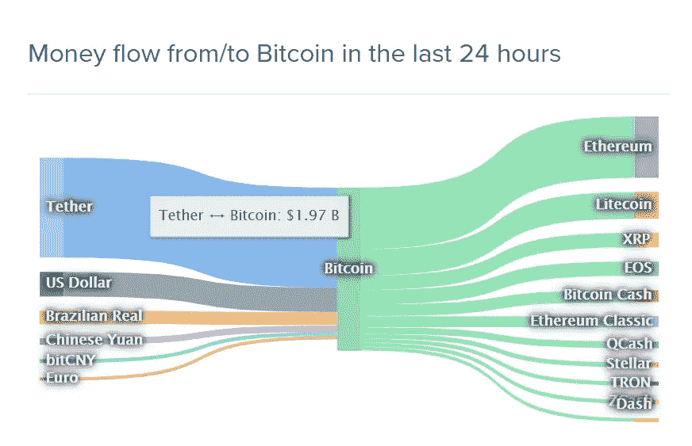

# 协同:传统金融机构的资本和密码

> 原文：<https://medium.com/hackernoon/the-synergy-traditional-financial-institutions-capital-and-crypto-5cf02d3b07cf>

韩国是世界上最大的加密市场，但与中国政府类似，韩国政府似乎无法改变对区块链、cryptos 和交易所的负面看法。可以说，到目前为止，韩国和中国的政府法规正朝着同一个方向发展。

幸运的是，韩国政府已经认识到区块链技术正在迅速发展，这种技术将成为未来的重要能源。

对政府来说，积极交易和使用加密货币的韩国人民的不断扩大和坚实的用户基础已经成为比从韩国主要交易所征税更重要的问题。

很明显，如果没有仅在一年内就获得超过 13750 亿韩元(约 12 亿美元)收入的交易所，韩国政府自己不可能做出如此有利可图的金融项目。我最近读到的一个令人震惊的事实是，主要的[韩国密码交易所(Upbit)正在印制相当于中小企业部帮助年轻人创业项目年度预算的现金。](http://www.sanhak.co.kr/news/articleView.html?idxno=166)

Google image

自从 ICO，以及随后，区块链项目的这种融资方式在韩国被禁止，几个项目和主要交易所，如 Bithumb 和 Upbit，正在接受检察官的调查，涉嫌操纵和欺诈。因此，要在 KYC 交易所注册并开始交易数字资产，需要遵守很多复杂的监管规定，比如实名制。

在政府密切关注加密交易所与金融机构之间关系的同时，主要银行之一的新韩银行和 NH 银行作为金融机构率先在区块链行业占据领先地位，[于 4 月 4 日与 Upbit 签署了一项协议，在 NH 投资&证券移动应用程序中开通了查看主要加密货币实时市场价格的服务。](http://www.cbci.co.kr/news/articleView.html?idxno=323780)

[http://www.cbci.co.kr/news/articleView.html?idxno=323780](http://www.cbci.co.kr/news/articleView.html?idxno=323780)

通过移动应用程序，用户可以将他们感兴趣的某些加密货币加入书签，由于该应用程序现在完全同步到 Upbit，用户可以更轻松地轻松访问加密交易。

正如你所看到的，这只是 NH 银行和证券公司与 Upbit 合作的一个小小的开始。然而，我们希望这将是未来许多活动的开始。

不可否认的是，一家传统的金融机构与世界上主要的加密交易所之一 Upbit 一起开始了区块链和加密相关的业务，这引起了许多观众的注意，这一合作消息增强了人们的希望，即我们可以看到这些顶级金融机构的巨额资本注入，这是整个加密市场长期以来一直渴望的。

NH Bank and Securities Co .是与 Bithumb、Upbit 和 Coin One 等许多大型韩国交易所关系密切的银行之一。2017 年 9 月，即使 ICO 被禁止，有许多复杂的法规出台，这家银行也以开放的心态醒来。

在不久的将来，通过这种合作关系，我估计 NH bank and Securities 的新账户数量(平均每天 1200 个)肯定会影响 Upbit 的交易量。

几天前，我们度过了一个非常长的“大麦驼峰”，并面临着期待已久的短期牛市的回归。

比特币打破了所有的预期，突破了 4000 美元和 4200 美元的线，达到了 5000 美元以上的水平，再次显示了比特币之前的力量，同时也提醒了我们一件事:金融机构的现金流是区块链和密码行业的核心能源。

4 月 6 日，eToro 的高级分析师马体·格林斯潘提到，超过 3 亿美元的资本将很快进入加密行业，再次注入比特币和 alt 币。

根据著名的区块链和加密数据提供商， [Coinlib 的图表，](https://coinlib.io/coin/BTC/Bitcoin)2 亿美元的资本现在被绑在一个众所周知的稳定硬币系绳(USDT)上。另外大约 1 亿美元来自中国的人民币(CNY)和巴西的雷亚尔(BRL)。这一数据至关重要，它向我们展示了 24 小时内流入 BTC 的资本。

[https://coinlib.io/coin/BTC/Bitcoin](https://coinlib.io/coin/BTC/Bitcoin)

[根据汤森路透 4 月 2 日的公告，在比特币基地、北海巨妖和 Bitstamp 三大交易所，总共有大约 2 万个 BTC 订单以相同的模式产生，并且证实这笔购买订单交易是在一个小时内产生的。](https://www.reuters.com/article/us-crypto-currencies/bitcoin-jumps-20-percent-mystery-order-seen-as-catalyst-idUSKCN1RE0JY)

这种大规模的资本流动被许多人认为是最近“泵”背后的催化剂，提高了对比特币的需求，暂时打破了漫长的“冬天”。

总计 7000 BTC，约 2.94 亿美元从某处流向交易所。这笔巨额资金来自个人投资者吗？

嗯，没人能确定这个首都到底是从哪里来的。然而，在我看来，很明显，这笔巨款来自企业，而非个人。

我们都知道，每当主要的金融机构和专家开始进入这个行业，他们的资本开始流入，整个密码行业将是一个巨大的繁荣。

传统金融市场与区块链和密码市场的协同效应刚刚开始“开花”。